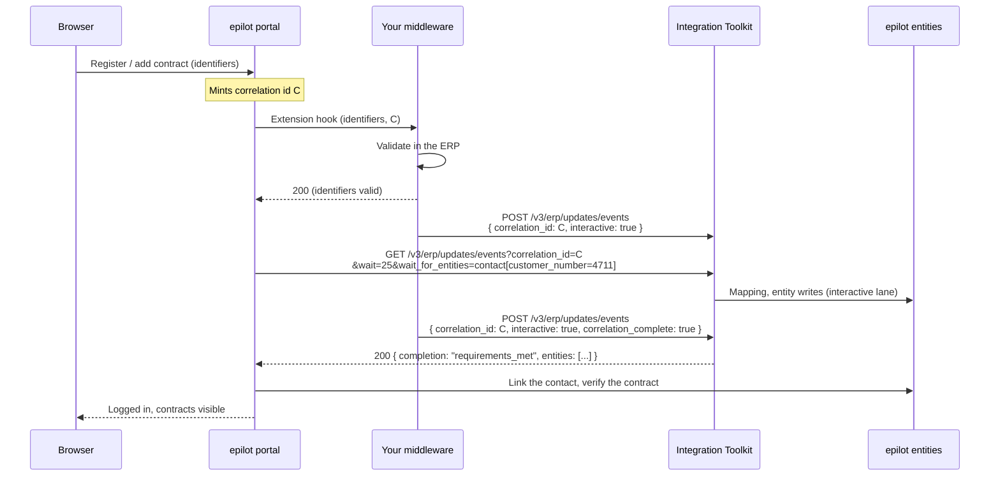

# Interactive Registration

Interactive registration is an opt-in mode of the [inbound API](./inbound/getting-started.md) for the
flows where a person is sitting in front of a screen waiting: self-registration in the
[End Customer Portal](/docs/portals/customer-portal), adding a contract or a customer account to an
existing login, and public journeys that identify a customer.

Your push stays asynchronous. What changes is that every push carries a **correlation id** the
portal handed you, that the correlation gets its own rate-limited processing lane, and that the
portal can **wait on that correlation** instead of guessing from entity search whether your data has
arrived yet.

:::info Availability
Interactive registration is rolling out (October 2026). If the request fields on this page are
rejected by your organization's integration, contact your epilot representative.
:::

## The problem it replaces

Until now, the contract between the portal and your middleware was implicit, and it was not a good
one.

The portal calls your [extension hook](/docs/apps/components/portal-extension) —
`registrationIdentifiersCheck` or `contractIdentification` — inside the end customer's own request.
You validate the identifiers in the ERP and answer. Unless your hook returns an epilot contact id,
which almost no middleware can, the portal then falls back to **polling entity search** every 500 ms
until shortly before its own timeout, looking for a contact and a contract that match what the user
typed.

That poll is blind in three ways:

- **It cannot tell "not yet" from "never".** An empty search result means the same thing whether your
  push is still in the queue, whether it was sent but carried no contract, or whether it was never
  sent at all. The portal has no choice but to answer `TIMEOUT`, and the end customer sees a generic
  error.
- **It is a race against a shared queue.** Your registration push is ordered behind whatever bulk
  traffic the platform is processing at that moment. The advice has effectively been "push while the
  portal is still polling, and hope". On a calm queue that works; on a busy one the same code path
  fails for reasons neither side can see.
- **It cannot be investigated afterwards.** When a registration times out, nobody — not you, not
  epilot support — can answer the only question that matters: *did the data land, and if so, what was
  missing?* Support tickets of this class exist because the answer is not recorded anywhere.

Interactive registration removes all three. The portal mints an id, you send it on your pushes, and the portal asks
epilot a precise question: *has the contact with customer number 4711 and a contract landed for
correlation `C`?* The answer is either the entities, or `complete` with what you did not send — which
is a message a support agent can act on.

## How it works



You may push everything in one request or in as many as the ERP produces. The portal is not waiting
for all of your events — it is waiting for the entities it named, and it stops waiting the moment the
first ones that match have landed. Your last request should carry `correlation_complete: true`: it is
the only way the portal can learn that nothing more is coming, which matters both when what it is
waiting for never comes and when more of the customer's data is still on its way. See
[Partial results](#partial-results-the-first-match-wins).

## What you have to do

The required ask is **two fields on the push**, and nothing in the hook response:

:::tip The minimum
On every push to `POST /v3/erp/updates/events` you make for that customer, send:

1. **`correlation_id`** — the id the portal passed to your hook.
2. **`interactive: true`**.

```json
{ "correlation_id": "<the id from the hook request>", "interactive": true, "events": [ "..." ] }
```
:::

Both are needed. epilot only records the processing of interactive events — that is what keeps the
bulk pipeline free of the bookkeeping — so a push that carries the correlation id but is not
interactive leaves nothing to wait on, and the portal answers `timeout` exactly as it would have
before.

Your hook response does not change. The portal minted the id, so it already knows it, and when your
response carries no `correlation_id` it waits on its own id.

**Optional: return the id from the hook.** You only need to do this if you push under an id of your
own rather than the portal's — for example because your middleware already has a transaction id it
threads through every push. Then answer the hook with that id as `correlation_id` in the JSON response
body, and the portal waits on yours instead of its own.

:::note When the use case is dedicated to registrations
If an inbound use case exists only to serve registrations, epilot can set it to
`interactive: "always"` (see [Enabling it on the use case](#enabling-it-on-the-use-case)). Every event
of that use case is then interactive whether the request says so or not, and your part shrinks to the
`correlation_id` alone. Sending `interactive: true` yourself is the default because one mapping
usually serves both the nightly batch and the registration push, and only the request knows which is
which.
:::

**Strongly recommended:** send `correlation_complete: true` on your **last** request for the
customer. It is never required — the wait works without it — but without it the portal can never
know whether you have finished. With it, a wait whose requirements cannot be met ends at once with the
gap named ("account data arrived, no contract") instead of running out its budget, and a caller that
needs everything can wait for the correlation to be complete rather than for the first match.

A request without `correlation_id` behaves exactly as it does today. Nothing breaks if you never adopt
any of this; the portal simply keeps polling entity search.

## When the ERP cannot deliver

The happy path is the easy part. What the end customer actually reads when something goes wrong is
made of how you handle the two failure cases, so get these right.

### The customer exists, but the bundle is incomplete

Push what exists and set `correlation_complete: true` **on that same request**. Then answer the hook
with success as usual, and name what is missing in your response for your own logs and support.

```bash title="Account found, no contract in the ERP yet — push and close in one request"
curl -X POST 'https://integration-toolkit.sls.epilot.io/v3/erp/updates/events' \
  -H 'Authorization: Bearer <your-token>' \
  -H 'Content-Type: application/json' \
  -d '{
    "integration_id": "a1b2c3d4-e5f6-7890-abcd-ef1234567890",
    "correlation_id": "018f8e9b-5a1b-7c4e-9b2a-4f0f6c1d7a21",
    "interactive": true,
    "correlation_complete": true,
    "events": [
      {
        "use_case_slug": "customer_account",
        "timestamp": "2026-10-09T09:05:28Z",
        "format": "json",
        "payload": {
          "customerNumber": "4711",
          "firstName": "Anna",
          "lastName": "Schmitz",
          "email": "anna.schmitz@example.de",
          "billingAccountNumber": "300571"
        },
        "deduplication_id": "reg-4711-20261009090528"
      }
    ]
  }'
```

The portal's wait ends `complete` as soon as that one event is processed, its contract requirement
unmet, and it can tell the end customer "we found your account, your contract is not in our system
yet" — in seconds. The wrong move is to push the partial bundle and leave the correlation open in the
hope that the rest turns up: the portal then waits out its whole budget and the end customer gets a
timeout instead of an explanation.

### The customer cannot be found

Answer the hook with an error status and push **nothing** — no events, and no correlation. An empty
open correlation is worse than an explicit failure: for as long as the portal's budget lasts, it looks
exactly like a partner that is still working.

If you have already pushed under the correlation id before you learn that you cannot deliver, close it
with a request that carries `correlation_complete: true` and an empty `events` array (see
[Closing a correlation](#closing-a-correlation)). The portal then learns at once that nothing is coming.

## Enabling it on the use case

Interactive processing is allowed per **inbound use case**, with the `interactive` option on the use
case `configuration`. The common case is one mapping serving both the nightly batch and the
registration push, so the use case grants permission and the request decides.

```json title="Inbound use case configuration"
{
  "entities": [ "..." ],
  "interactive": "on_request"
}
```

| Value | Effect on a request that asks for interactive |
|---|---|
| `disabled` (default) | The events are processed as bulk. Each result says `"interactive": false` with the message `use case does not allow interactive processing`, no processing record is written, and an `INTERACTIVE_NOT_ALLOWED` info event appears in monitoring. Nothing is rejected. |
| `on_request` | The request's `interactive: true` selects the interactive lane. This is the normal setting. |
| `always` | Every event of this use case is interactive, whether the request asks or not. Use it for a use case that exists only to serve registrations. The per-organization rate limit still applies. |

The option is also exposed in the Integration Hub on the inbound use case. See
[Use Case Configuration](./configuration.md#use-case-configuration) for the surrounding contract.

If anyone is going to wait on your data by use case rather than by entity, the way you model use cases
matters too — see [One use case per partner event type](#one-use-case-per-partner-event-type).

## Sending interactive events

Two new fields on `POST /v3/erp/updates/events`, both at request level. `interactive` may also be set
per event, and the event wins — the same precedence `correlation_id` and `group_id` already follow.

The examples on the rest of this page share one integration with two inbound use cases. Their entity
targets are keyed like this, and the keys matter later:

```json title="Entity targets of the example use cases (excerpt)"
// use case "customer_account"
"entities": [
  { "entity_schema": "contact",         "unique_ids": ["customer_number"],        "fields": [ "..." ] },
  { "entity_schema": "billing_account", "unique_ids": ["billing_account_number"], "fields": [ "..." ] }
]

// use case "contract"
"entities": [
  { "entity_schema": "contract",        "unique_ids": ["contract_number"],        "fields": [ "..." ] }
]
```

```bash title="First push — customer account"
curl -X POST 'https://integration-toolkit.sls.epilot.io/v3/erp/updates/events' \
  -H 'Authorization: Bearer <your-token>' \
  -H 'Content-Type: application/json' \
  -d '{
    "integration_id": "a1b2c3d4-e5f6-7890-abcd-ef1234567890",
    "correlation_id": "018f8e9b-5a1b-7c4e-9b2a-4f0f6c1d7a21",
    "interactive": true,
    "events": [
      {
        "use_case_slug": "customer_account",
        "timestamp": "2026-10-09T09:05:28Z",
        "format": "json",
        "payload": {
          "customerNumber": "4711",
          "firstName": "Anna",
          "lastName": "Schmitz",
          "email": "anna.schmitz@example.de",
          "billingAccountNumber": "300571"
        },
        "deduplication_id": "reg-4711-20261009090528"
      }
    ]
  }'
```

| Field | Type | Meaning |
|---|---|---|
| `correlation_id` | string | The id the portal handed to your hook. Already part of the API — what is new is that it is now the key the portal waits on, so it must be the portal's id, or the id you returned from the hook if you use one of your own. |
| `interactive` | boolean | Request the interactive lane for this request's events. |
| `correlation_complete` | boolean | No further events will follow for this request's `correlation_id`. Send it on your **last** request only. |

The response gains the correlation id and, per result, how the event was processed:

```json title="Response"
{
  "correlation_id": "018f8e9b-5a1b-7c4e-9b2a-4f0f6c1d7a21",
  "results": [
    {
      "event_id": "0199c3f2-8a41-7d0e-b6c7-2f1a9d3e4b55",
      "status": "success",
      "interactive": true,
      "lane": "interactive"
    }
  ]
}
```

`correlation_id` is echoed when you sent one and generated when you did not — so a partner that only
wants the lane, without a portal in the loop, still gets an id it can query later.

The two result fields answer different questions and are independent of each other:

- `interactive` means **processed as interactive**: a processing record was written and the wait works
  for this event. It is `false` only when the use case does not allow interactive processing.
- `lane` is the queue that actually carried the event — `interactive`, `priority`, `default` or
  `deferred`. Over the rate limit an event is still `"interactive": true` but runs on
  `"lane": "default"` (or the organization's other normal lane); see [Rate limits](#rate-limits).

### Closing a correlation

Your last request closes the correlation:

```bash title="Last push — contract, and close the correlation"
curl -X POST 'https://integration-toolkit.sls.epilot.io/v3/erp/updates/events' \
  -H 'Authorization: Bearer <your-token>' \
  -H 'Content-Type: application/json' \
  -d '{
    "integration_id": "a1b2c3d4-e5f6-7890-abcd-ef1234567890",
    "correlation_id": "018f8e9b-5a1b-7c4e-9b2a-4f0f6c1d7a21",
    "interactive": true,
    "correlation_complete": true,
    "events": [
      {
        "use_case_slug": "contract",
        "timestamp": "2026-10-09T09:05:31Z",
        "format": "json",
        "payload": {
          "contractNumber": "200184",
          "customerNumber": "4711",
          "billingAccountNumber": "300571",
          "startDate": "2026-11-01"
        },
        "deduplication_id": "reg-4711-contract-20261009090531"
      }
    ]
  }'
```

The rules:

- `correlation_complete` closes the **request-level** `correlation_id`, and only that one. epilot never
  infers the correlation from the ids on individual events, so a request that sets
  `correlation_complete: true` without a request-level `correlation_id` is rejected with **400** and
  raises `CORRELATION_ID_MISSING` in monitoring. Nothing is closed.
- The correlation closes after the request's own events are registered, so they count as part of it.
  Closing twice is a no-op.
- A request may carry **no events at all** when it sets `correlation_complete: true` — useful when the
  signal that the operation finished arrives on its own, with no data attached. This is the one case
  in which an empty `events` array is accepted; without the flag, an empty `events` array is still a
  400.
- A close for a correlation epilot has never seen **creates it closed** and returns 200. The portal's
  wait then answers `complete` with `events_received: 0` immediately — "the partner sent nothing and
  never will" — instead of waiting out its budget. Monitoring records it as `CORRELATION_CLOSED_EMPTY`.

An event that arrives **after** the correlation was closed is still processed normally. It is counted
as a late event and raises a `CORRELATION_LATE_EVENT` warning in monitoring, because by then the
portal has usually already answered the end customer.

## Checking what landed

Three read endpoints, all authorized with the same organization-scoped token you use for ingest. No
cross-organization read is possible: every lookup is partitioned by the token's organization.

### One event

`GET /v3/erp/updates/events/{event_id}` returns the processing record for a single event. It never
waits.

```json title="GET /v3/erp/updates/events/0199c3f2-8a41-7d0e-b6c7-2f1a9d3e4b55"
{
  "event_id": "0199c3f2-8a41-7d0e-b6c7-2f1a9d3e4b55",
  "correlation_id": "018f8e9b-5a1b-7c4e-9b2a-4f0f6c1d7a21",
  "integration_id": "a1b2c3d4-e5f6-7890-abcd-ef1234567890",
  "status": "done",
  "lane": "interactive",
  "use_case_id": "58cf8956-e737-4b4c-a683-3528be3eedb8",
  "use_case_slug": "customer_account",
  "ingested_at": "2026-10-09T09:05:28.412Z",
  "mapped_at": "2026-10-09T09:05:29.004Z",
  "done_at": "2026-10-09T09:05:30.277Z",
  "writes_total": 2,
  "writes_done": 2,
  "entities": [
    {
      "slug": "contact",
      "_id": "9acc9f54-5c0a-4b3e-8e6f-1d2c3b4a5968",
      "operation": "created",
      "unique_ids": { "customer_number": "4711" }
    },
    {
      "slug": "billing_account",
      "_id": "3f1b7e20-9c84-4a55-bd21-6e0d8a7c4f13",
      "operation": "created",
      "unique_ids": { "billing_account_number": "300571" }
    }
  ],
  "errors": []
}
```

`status` is `accepted`, `processing`, `done`, `partial` (a non-retryable failure after some writes
succeeded) or `error`. `writes_total` and `writes_done` count the entity writes the event fanned out
into, including follow-up writes such as stub creates, so `writes_done == writes_total` on a `done`
record means the whole tree is finished — not just the first write. A write that found the entity
already as described still counts, and appears in `entities` with `"operation": "unchanged"`.

The three timestamps follow your data: `ingested_at` when the event was accepted, `mapped_at` when the
mapping had produced its entity updates, `done_at` when the last of those writes finished.
`ingested_at` to `done_at` is the first end-to-end latency figure the inbound pipeline has ever
exposed. Use it when you want to know whether a slow registration was slow on your side or on ours.

Each item in `errors[]` is `{ "code", "message", "occurred_at" }`, where `code` is a
[monitoring code](./monitoring/codes.md).

### A correlation, with a wait

`GET /v3/erp/updates/events?correlation_id={id}` returns the summary across every event of one
correlation. With `wait` it long-polls, and with requirements it returns as soon as what the caller
needs has arrived.

| Parameter | Meaning |
|---|---|
| `correlation_id` | Required. The correlation to look at. |
| `wait` | Seconds to wait, `0` to `25`. Omit or `0` for an immediate answer. The ceiling is 25 s because the HTTP API cuts off at 30 s. A value outside the range is rejected with **400** naming the maximum, not silently clamped. |
| `wait_for_entities` | Entity requirements, each `slug` or `slug[key=value]`. Repeat the parameter for several, or separate them with commas. |
| `wait_for_use_cases` | Inbound **use case slugs**. Repeat the parameter or separate with commas. |

Both requirement sets are optional, and both are only valid together with `correlation_id` — sending
one without it returns 400. When both are given, **both** must be satisfied before the call answers
`requirements_met`.

```bash title="Wait for the customer's contact and a contract"
curl -G 'https://integration-toolkit.sls.epilot.io/v3/erp/updates/events' \
  -H 'Authorization: Bearer <your-token>' \
  --data-urlencode 'correlation_id=018f8e9b-5a1b-7c4e-9b2a-4f0f6c1d7a21' \
  --data-urlencode 'wait=25' \
  --data-urlencode 'wait_for_entities=contact[customer_number=4711]' \
  --data-urlencode 'wait_for_entities=contract' \
  --data-urlencode 'wait_for_use_cases=customer_account,contract'
```

```json title="Response"
{
  "correlation_id": "018f8e9b-5a1b-7c4e-9b2a-4f0f6c1d7a21",
  "integration_id": "a1b2c3d4-e5f6-7890-abcd-ef1234567890",
  "completion": "requirements_met",
  "closed": true,
  "closed_at": "2026-10-09T09:05:31.902Z",
  "events_received": 2,
  "events_done": 2,
  "late_events": 0,
  "first_ingested_at": "2026-10-09T09:05:28.412Z",
  "last_done_at": "2026-10-09T09:05:33.118Z",
  "use_cases": [
    { "use_case_slug": "customer_account", "received": 1, "done": 1, "error": 0 },
    { "use_case_slug": "contract", "received": 1, "done": 1, "error": 0 }
  ],
  "entities": [
    {
      "slug": "contact",
      "_id": "9acc9f54-5c0a-4b3e-8e6f-1d2c3b4a5968",
      "operation": "created",
      "unique_ids": { "customer_number": "4711" }
    },
    {
      "slug": "billing_account",
      "_id": "3f1b7e20-9c84-4a55-bd21-6e0d8a7c4f13",
      "operation": "created",
      "unique_ids": { "billing_account_number": "300571" }
    },
    {
      "slug": "contract",
      "_id": "c0d9a1b8-4e37-4f52-8a90-5b6c7d8e9f01",
      "operation": "created",
      "unique_ids": { "contract_number": "200184" }
    }
  ],
  "errors": []
}
```

`first_ingested_at` is when the first event of the correlation was accepted and `last_done_at` when
the most recent one finished, so the pair is the end-to-end time of the whole correlation. `use_cases`
has one item per use case the correlation's events were routed to, with how many were `received`, are
`done` and ended in `error`. Each item in `errors[]` is
`{ "code", "message", "event_id", "occurred_at" }` — the same shape as on the single event, plus the
`event_id` that failed.

#### What "arrived" means

A requirement is satisfied when the event that carries it reached **`done`** — the entity writes
finished — not when the event was received. Anything looser would be a lie: a caller told "your data
is ready" while the write is still queued would read an entity that does not exist yet, which is the
failure mode this whole page exists to remove.

An event that ends in a non-retryable error resolves its requirement too, into
`completion: "error"`. A wait never hangs on a failed event waiting for something that can no longer
come.

#### Entity requirements, with selectors on `unique_ids`

Every entity in the response carries `unique_ids`, and that map holds **exactly the `unique_ids`
configured for that entity target in the use case — and nothing else**. In the example above the
contact carries `customer_number` because that is its target's only unique id; its `email`,
`first_name` and every other attribute the mapping wrote are not in the response, however identifying
they look.

That decides what a selector can name:

:::caution A selector may only name a member of the target's `unique_ids`
`slug[key=value]` matches a processed entity of that slug whose `unique_ids` contain the pair. Since
`unique_ids` contains only the configured unique ids, **a selector on any other attribute can never
match**. It does not fail loudly: there is no 400 and no error in the response, just a requirement that
is never satisfied and a wait that runs to its budget and answers `timeout` — which looks exactly like
a partner that did not deliver. Check the selector against the use case's configured `unique_ids`
before you rely on it.
:::

In the example integration, the contact target is keyed on `customer_number`, so the end customer's
customer number makes an exact selector:

- `contact[customer_number=4711]` — satisfied only by a contact whose `unique_ids` contain
  `customer_number: "4711"`. A selector on `email` or `last_name` would never match, because neither is
  in that target's `unique_ids`.
- `contract[contract_number=200184]` — the same for the contract target, keyed on `contract_number`.
  Use it when the caller already knows the contract, as when adding a contract to an existing login.
- `contact` — satisfied by **any** processed contact under the correlation. Only safe when the
  correlation cannot contain more than one, and that is rarer than it looks: some ERPs write two
  contacts for one business partner, and other use cases — document metadata, for example — can write
  contacts under the same unique-id keys a registration push uses.

When the identifier the caller holds is not one of the configured unique ids, it either derives one
that is (a typed composite number whose parts include a unique id, for instance), or it stops selecting
that entity by attribute: wait on a requirement that is unambiguous — such as `contract` — and reach the
right contact through the delivered contract's `customer` relation, by `_id`. A contract is only
reported once its relations are set, so that relation is there when the wait returns.

**Selector syntax.** Inside `slug[key=value]` the key ends at the **first** `=`, and the value runs to
the final `]`, so a value may itself contain `=` and `]`. The value is percent-decoded once after that
split. To pass a value that contains a comma, either repeat the parameter — one requirement per
occurrence, which avoids the comma separator altogether — or percent-encode the comma. The
`curl -G --data-urlencode` form above encodes for you.

#### Use case requirements

`wait_for_use_cases` takes **inbound use case slugs** — the same `use_case_slug` you already send on
the ingest event. That is deliberate: the v3 events endpoint recommends `use_case_slug` over
`event_name` for routing precisely because slugs are portable across environments, and a use case
slug is unique within its integration and immutable once set. `event_name` is partner vocabulary and
a fallback; it is not a stable key for a requirement.

A requirement is met when **at least one event of that use case slug is done**. There are no
selectors on use case slugs in this version. The response's `use_cases` array gives the per-use-case
summary so a caller can see which side of the contract is still open.

#### One use case per partner event type

A use case requirement is exactly as fine-grained as the use case configuration behind it. Nothing
enforces one use case per kind of message, so two configuration rules decide whether waiting on use
cases works at all:

:::tip If you want to wait on use cases
1. **Model one inbound use case per partner event type.** If your ERP sends a customer message and a
   contract message, give each its own use case. A single use case `erp_customer_data` that maps
   both is satisfied by the customer message alone, so `wait_for_use_cases=erp_customer_data` cannot
   tell "the contract arrived" from "only the customer arrived" — and the caller has to fall back to
   entity requirements.
2. **Give every use case a slug.** A use case without a slug is still processed and counted, but it
   cannot be named in `wait_for_use_cases` at all: the only name it has is an id that differs between
   your sandbox and your production organization.
:::

The example integration on this page follows both rules: `customer_account` and `contract` are
separate use cases, each with a slug.

#### Partial results: the first match wins

**Every requirement is satisfied by the first matching event, not by all of them.** This is the one
thing to understand about the wait, and it holds for both requirement sets: a use case requirement is
met by the first event of that use case to reach `done`, and an entity requirement without a selector
by the first entity of that slug. Neither says anything about the rest, and a requirement never carries
a count.

A worked example. Anna Schmitz has three contracts, `200184`, `200185` and `200186`, and your ERP sends
one `contract` event for each, a second apart.

| The caller waits on | It returns `requirements_met` when |
|---|---|
| `wait_for_use_cases=contract` | the first of the three contract events is done. The other two are still on their way. |
| `wait_for_entities=contract` | the first contract entity is written. Same as above. |
| `wait_for_entities=contract[contract_number=200185]` | contract `200185` is written — that one and no other. |
| no requirements, waiting for `completion: "complete"` | you sent `correlation_complete: true` and all three contracts are done. |

The same holds for a relocation, which typically sends two contract events for one customer: the first
one meets a `contract` requirement.

What follows from that:

- **Naming several use cases covers a bundle that spans use cases** — `customer_account,contract` needs
  one done event of each, which is the common registration and contract-addition shape. It does not
  cover one use case firing several times.
- **When the caller knows the identifier, select on it.** Adding a contract to an existing login is the
  typical case: the end customer typed the contract number, so `contract[contract_number=…]` waits for
  exactly that contract. Registration cannot build such a selector for data it has never seen, and
  accepts the first match.
- **Without `correlation_complete`, `requirements_met` does not mean you have finished.** A correlation
  whose partner never sends `correlation_complete` can return `requirements_met` while more data for the
  same customer is still arriving; the portal shows what has landed, and the rest appears on the next
  page load. `correlation_complete` is the only signal that says nothing further is coming. That is why
  it is strongly recommended — and it is still never required.

#### Which requirement set to use

Use **entity requirements** when you need the entity itself: they express the user-visible goal — *the
customer's contact and a contract exist* — and the response hands you the ids to link and verify. This
is what the portal uses for registration and contract addition.

Use **use case requirements** when you need to know that the partner sent the kind of data it
promised, rather than that a specific entity appeared. They are the right key when:

- the **entity set varies per push** — one customer brings two contracts and a meter, the next brings
  one contract and nothing else, and no fixed list of slugs describes both;
- an expected use case **produces no entity at all** — a meter reading, a file, a relation on an
  existing entity, or an event the mapping filters out. An entity requirement could never be met
  there, so the wait would burn its whole budget and answer `timeout` on a correlation that in fact
  completed successfully. For meter readings, a use case requirement is the only requirement that can
  name them.

Combining them is normal: `wait_for_entities=contact[customer_number=4711]` says which entity the
portal needs to link, and `wait_for_use_cases=customer_account,contract` lets the failure message name
the kind of data that never came. Neither set can say that you have finished; only
`correlation_complete` can.

#### Values of `completion`

| Value | Meaning |
|---|---|
| `requirements_met` | Every requirement given — entity requirements, use case requirements, or both — is satisfied. The wait returns the moment this becomes true, **even if an unrelated event of the correlation failed**: a caller waiting for a contact and a contract has what it asked for. |
| `complete` | The correlation is closed and every event received for it is done. This is the hard stop for a caller that wants everything — and it also ends a requirement wait that can no longer be satisfied, which is how the portal learns that you sent an account but no contract. |
| `timeout` | The wait budget elapsed. The body still lists everything that landed so far; call again to continue waiting. |
| `error` | A requirement can no longer be satisfied, because an event it depends on failed non-retryably — or, when the caller named no requirements, the correlation closed with failures. |

`errors[]` lists every failure in the correlation whatever the verdict, so a `requirements_met` that
ignored an unrelated failure still tells you about it. If the contract event of the example had
arrived without a contract number, the wait for `contract` would end like this:

```json title="Response (excerpt) — a requirement that can no longer be met"
{
  "completion": "error",
  "use_cases": [
    { "use_case_slug": "customer_account", "received": 1, "done": 1, "error": 0 },
    { "use_case_slug": "contract", "received": 1, "done": 0, "error": 1 }
  ],
  "errors": [
    {
      "code": "MISSING_UNIQUE_IDENTIFIERS",
      "message": "contract: unique identifier contract_number is missing",
      "event_id": "0199c3f5-1b07-7a2e-8d44-9e3c6f0a2b18",
      "occurred_at": "2026-10-09T09:05:32.640Z"
    }
  ]
}
```

There is no quiet-window heuristic: with no requirements and no close, a wait runs to its budget and
then returns `timeout`.

A correlation id that epilot has never seen — or one that belongs to non-interactive traffic — comes
back as `events_received: 0, closed: false`. The caller cannot tell "not yet" from "never", which is
exactly the ambiguity `correlation_complete` exists to remove.

:::note Concurrent waits are capped
Long polls are limited per organization and globally. Past the cap the call answers **429** with a
`Retry-After` header instead of waiting, and raises `CORRELATION_WAIT_REJECTED` in monitoring; callers
fall back to a non-waiting call and retry. The portal already does this.
:::

### Recent correlations

`GET /v3/erp/updates/correlations` lists the organization's correlations, **newest first**. It is the
way to find a correlation that went wrong when you do not already have its id — a correlation that is
merely stuck has raised no monitoring code, so nothing else points at it.

| Parameter | Meaning |
|---|---|
| `integration_id` | Optional. Only correlations of this integration. |
| `limit` | Page size. Default 50; values above 100 are treated as 100. |
| `cursor` | Opaque. Pass the previous page's `next_cursor` to continue. |

```bash title="The latest correlations of one integration"
curl -G 'https://integration-toolkit.sls.epilot.io/v3/erp/updates/correlations' \
  -H 'Authorization: Bearer <your-token>' \
  --data-urlencode 'integration_id=a1b2c3d4-e5f6-7890-abcd-ef1234567890' \
  --data-urlencode 'limit=50'
```

```json title="Response (excerpt)"
{
  "results": [
    {
      "correlation_id": "018f8e9b-5a1b-7c4e-9b2a-4f0f6c1d7a21",
      "integration_id": "a1b2c3d4-e5f6-7890-abcd-ef1234567890",
      "closed": true,
      "closed_at": "2026-10-09T09:05:31.902Z",
      "events_received": 2,
      "events_done": 2,
      "late_events": 0,
      "first_ingested_at": "2026-10-09T09:05:28.412Z",
      "last_done_at": "2026-10-09T09:05:33.118Z",
      "use_cases": [
        { "use_case_slug": "customer_account", "received": 1, "done": 1, "error": 0 },
        { "use_case_slug": "contract", "received": 1, "done": 1, "error": 0 }
      ],
      "entities": [ "..." ],
      "errors": []
    }
  ],
  "next_cursor": "eyJzayI6IjIwMjYtMTAtMDlUMDk6MDU6MjguNDEyWiJ9",
  "horizon_days": 7
}
```

Each item in `results` is the same correlation summary the wait returns, without the long poll.
`next_cursor` is `null` on the last page.

`horizon_days` states how far back the listing reaches: **7 days**, which is how long correlation
records are kept. A correlation older than that is gone, not hidden, and the response says so rather
than returning less without comment. Single event records are kept for 24 hours.

## Rate limits

The interactive lane is only worth having if it stays fast, and it stays fast only if no single
organization can fill it. Every organization therefore has a token budget for interactive events,
charged one token per event at ingest. The default is a sustained **120 interactive events per 5
minutes with a burst of 40**, raised by agreement for organizations with higher registration volume.

When the budget is exhausted, nothing is rejected and nothing is lost:

- The events are accepted and processed on the organization's **normal lane**. The per-result `lane`
  field names it (`priority`, `default` or `deferred`), and `interactive` stays `true`.
- The **processing records are still written**, so `correlation_complete`, the wait and the status
  endpoints keep working exactly as before — the answer simply takes longer to arrive, and the
  portal's wait may run to `timeout` and retry.
- An `INTERACTIVE_RATE_LIMITED` **warning** appears in monitoring for that request.

A steady trickle of `INTERACTIVE_RATE_LIMITED` means interactive is being used for traffic that is
not interactive — a bulk sync that sets the flag on every request, usually. Bulk pushes should not
carry `interactive: true`; they are not slower for it, but they consume the budget that the
registrations of the same organization need.

## Event-stream partners

If your ERP backend publishes change events to Kafka or a comparable log rather than calling the
inbound API itself, the contract is the same. Only the carrier differs, and epilot's bridge sets the
inbound request fields for you.

:::tip The minimum
1. **Return an acknowledge id from the synchronous endpoint** the portal hook calls — the assignment
   or registration endpoint that already exists. That id is the correlation id.
2. **Echo it as a CloudEvents extension on every event the operation produces**, as the
   `ce_correlationid` header or `correlationId` in the event envelope's extensions.
:::

That is all the wait needs. The bridge maps the extension to `correlation_id` and sets
`interactive: true` on any batch that carries one, so the portal's requirements are satisfied the
moment the matching events finish processing — entity by entity, or use case by use case. The
[first match wins](#partial-results-the-first-match-wins) here exactly as it does over HTTP.

Two improvements on top:

- **Publish a terminal event last, on the same message key** as the data events — a name such as
  `AssignmentCompleted`, with no business payload. The bridge translates it into
  `correlation_complete: true` on the inbound request that carries it and does not forward it as
  data, so it needs no mapping and no use case. It is strongly recommended and not required. What it
  buys is the difference between missing and slow: without it, data you never send looks exactly like
  data that is still on its way until the budget expires; with it, the wait ends immediately as
  `complete` with the missing requirement named.
- **Emit the full set of events the operation produced.** An assignment that changes a business
  partner but publishes no contract or meter event still fails for the end customer. The difference
  is that it now fails in seconds with the missing requirement named, rather than as an unexplained
  timeout nobody can investigate.

:::caution Ordering
Per-key FIFO ordering is what makes a terminal event meaningful: it guarantees the data events for
that key were forwarded before it. If your stream splits one business operation across several keys —
contract on one, meter on another — the terminal event no longer orders behind them, and the bridge
has to hold the completion flag until the earlier offsets are through. Keep one operation on one key.
:::

## What not to do

**Do not try to make the ingest call synchronous.** `wait` on `POST /v3/erp/updates/events` is not
supported and returns **400**. Ingest validates, enqueues and answers; it never blocks on processing.
That is deliberate: the ordering, deduplication and backpressure guarantees of the inbound pipeline
all come from the fact that nothing waits inside the write path.

**Prefer not to call the wait from inside your hook.** A fully synchronous middleware *may* push its
events, then call the correlation wait itself, and only answer the portal hook once epilot confirms
the data landed. It works, and it is supported. It is also the worse design:

- It ties **your** HTTP timeout to epilot's processing time. The portal's hook timeout is typically
  20 s and the wait budget goes up to 25 s, so a slow correlation can burn your hook budget and the
  portal's at the same time, and the end customer sees a failed hook instead of a precise message.
- It gives up the retry loop. When the portal owns the wait, a `timeout` is just a round that
  continues in the browser. When your hook owns it, a timeout is a failed hook.
- It gains nothing. The portal links the entity it finds, not the one your response describes.

Answer the hook as soon as the ERP has validated the identifiers, push with the portal's correlation
id, and let the portal wait.

**Do not open a correlation for a customer you could not find.** Answer the hook with an error and
push nothing; see [When the ERP cannot deliver](#when-the-erp-cannot-deliver).

**Do not select on an attribute that is not a configured unique id.** It never matches and never says
so; see [Entity requirements](#entity-requirements-with-selectors-on-unique_ids).

## Monitoring

Interactive traffic raises its own codes in the
[Monitoring tab](./monitoring/overview.md) alongside the usual entity events. Every one of them carries
the `correlation_id`, so you can filter a single registration end to end:

| Code | Level | Emitted when |
|---|---|---|
| `INTERACTIVE_RATE_LIMITED` | warning | An interactive request exceeded the organization's budget and ran on the normal lane |
| `INTERACTIVE_NOT_ALLOWED` | info | `interactive: true` arrived for a use case configured `interactive: disabled` |
| `INTERACTIVE_CROSS_LANE_WRITE` | warning | An interactive write landed on an entity that another lane had written within the last 60 seconds — the same entity was in flight on two lanes at once, typically a bulk sync and a registration push for the same customer |
| `CORRELATION_COMPLETED` | info | A correlation reached `complete`, with its event and entity counts and the ingest-to-complete duration |
| `CORRELATION_CLOSED_EMPTY` | info | A correlation was closed without a single event — the partner said nothing is coming for this customer, including a close that created the correlation |
| `CORRELATION_LATE_EVENT` | warning | An event arrived after `correlation_complete` |
| `CORRELATION_ID_MISSING` | error | A request set `correlation_complete: true` without a request-level `correlation_id` and was rejected with 400; nothing was closed |
| `CORRELATION_REQUIREMENT_FAILED` | error | A wait ended `error` because an event a requirement depends on failed non-retryably; the details name the requirement and the failing event |
| `CORRELATION_WAIT_TIMEOUT` | warning | A wait with requirements ended by timeout, or by `complete` without them met. The details list what was not satisfied as `missing_entities` and `missing_use_cases` |
| `CORRELATION_WAIT_REJECTED` | warning | A wait was refused with 429 because the organization's or the global cap on concurrent waits was reached |

The two codes that end a correlation without data are ranked deliberately. `CORRELATION_WAIT_TIMEOUT`
is the warning: an end customer waited, and was shown nothing. `CORRELATION_CLOSED_EMPTY` is only
info: a partner that closes a correlation it has nothing for is doing exactly what this page asks, and
the portal got its answer at once.

## A runnable reference

The [erpilot-integration](https://github.com/epilot-dev/erpilot-integration) demo implements this
page end to end against a demo ERP: the hook handler that takes the portal's correlation id, the pushes
that carry it, the final request that closes the correlation, and both failure cases. Start there if you
would rather read working code than a contract.

## Next steps

- [Inbound Getting Started](./inbound/getting-started.md) — the inbound API this builds on
- [Unique Identifiers](./inbound/unique-identifiers.md) — how `unique_ids` are configured, and so what a
  selector can name
- [Use Cases](./use-cases.md) — the catalogue of standard inbound and outbound flows
- [Portal Extensions](/docs/apps/components/portal-extension) — the hooks the portal calls during
  registration and contract addition
- [Monitoring Codes](./monitoring/codes.md) — every code, what it means, and what to do about it
