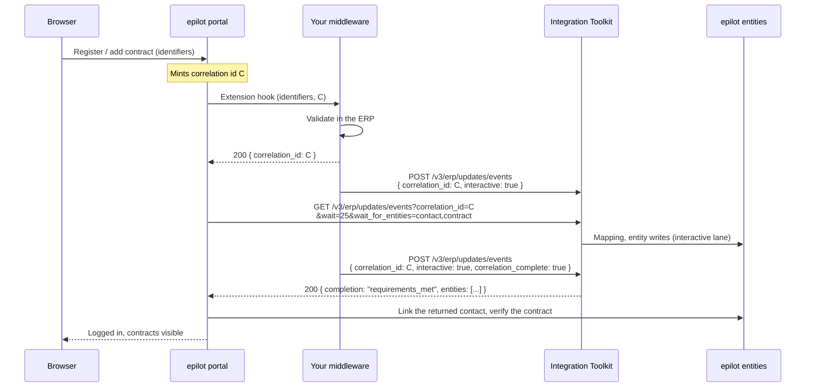

# Interactive Registration

Interactive registration is an opt-in mode of the [inbound API](./inbound/getting-started.md) for the
flows where a person is sitting in front of a screen waiting: self-registration in the
[End Customer Portal](/docs/portals/customer-portal), adding a contract or a customer account to an
existing login, and public journeys that identify a customer.

Your push stays asynchronous. What changes is that every push can carry a **correlation id** the
portal handed you, that the correlation gets its own rate-limited processing lane, and that the
portal can **wait on that correlation** instead of guessing from entity search whether your data has
arrived yet.

:::info Availability
Interactive registration is rolling out (October 2026). If the request fields on this page are
rejected by your organization's integration, contact your epilot representative.
:::

## The problem it replaces

Until now, the contract between the portal and your middleware was implicit, and it was not a good
one.

The portal calls your [extension hook](/docs/apps/components/portal-extension) —
`registrationIdentifiersCheck` or `contractIdentification` — inside the end customer's own request.
You validate the identifiers in the ERP and answer. Unless your hook returns an epilot contact id,
which almost no middleware can, the portal then falls back to **polling entity search** every 500 ms
until shortly before its own timeout, looking for a contact and a contract that match what the user
typed.

That poll is blind in three ways:

- **It cannot tell "not yet" from "never".** An empty search result means the same thing whether your
  push is still in the queue, whether it was sent but carried no contract, or whether it was never
  sent at all. The portal has no choice but to answer `TIMEOUT`, and the end customer sees a generic
  error.
- **It is a race against a shared queue.** Your registration push is ordered behind whatever bulk
  traffic the platform is processing at that moment. The advice has effectively been "push while the
  portal is still polling, and hope". On a calm queue that works; on a busy one the same code path
  fails for reasons neither side can see.
- **It cannot be investigated afterwards.** When a registration times out, nobody — not you, not
  epilot support — can answer the only question that matters: *did the data land, and if so, what was
  missing?* Support tickets of this class exist because the answer is not recorded anywhere.

Interactive registration removes all three. The portal mints an id, you echo it, and the portal asks
epilot a precise question: *has a contact and a contract landed for correlation `C`?* The answer is
either the entities, or `complete` with a list of what you did not send — which is a message a
support agent can act on.

## How it works



You may push everything in one request or in as many as the ERP produces. The portal is not waiting
for all of your events — it is waiting for a contact and a contract. The last request carries
`correlation_complete: true` so that, if what it is waiting for never comes, the portal learns that
immediately instead of at the end of its budget.

## What you have to do

The required ask is two lines of code in the flow you already have:

:::tip The minimum
1. **Pass the correlation id we give you** on every push you make for that customer, as
   `correlation_id` on the inbound request.
2. **Return it from the hook**, as `correlation_id` in the hook's JSON response body.
:::

That is enough for the portal to stop polling entity search and wait on your data instead. Everything
below improves the experience and is a second step:

| Optional | What it buys you |
|---|---|
| `interactive: true` on the request | Your registration pushes run on a dedicated lane, ahead of bulk traffic, instead of queueing behind the nightly import |
| `correlation_complete: true` on the last request | The portal fails fast and precisely ("account data arrived, no contract") instead of waiting out its budget |

Nothing breaks if you ignore any of it. A request without `correlation_id` behaves exactly as it does
today.

:::note Who turns interactive on
The correlation is only tracked for events that are interactive. That is a setting on the epilot
side, not a second thing to build: a use case set to `interactive: "always"` makes every one of its
events interactive without your middleware changing a line. Sending `interactive: true` yourself is
the better choice when the same use case also carries the nightly batch, because only the request
knows which is which — see [Enabling it on the use case](#enabling-it-on-the-use-case).
:::

## Enabling it on the use case

Interactive processing is allowed per **inbound use case**, with the `interactive` option on the use
case `configuration`. The common case is one mapping serving both the nightly batch and the
registration push, so the use case grants permission and the request decides.

```json title="Inbound use case configuration"
{
  "entities": [ "..." ],
  "interactive": "on_request"
}
```

| Value | Effect on a request that asks for interactive |
|---|---|
| `disabled` (default) | The events are processed as bulk. Each result says `"interactive": false` with the message `use case does not allow interactive processing`, and an `INTERACTIVE_NOT_ALLOWED` info event appears in monitoring. Nothing is rejected. |
| `on_request` | The request's `interactive: true` selects the interactive lane. This is the normal setting. |
| `always` | Every event of this use case is interactive, whether the request asks or not. Use it for a use case that exists only to serve registrations. The per-organization rate limit still applies. |

The option is also exposed in the Integration Hub on the inbound use case. See
[Use Case Configuration](./configuration.md#use-case-configuration) for the surrounding contract.

## Sending interactive events

Two new fields on `POST /v3/erp/updates/events`, both at request level. `interactive` may also be set
per event, and the event wins — the same precedence `correlation_id` and `group_id` already follow.

```bash title="First push — customer account"
curl -X POST 'https://integration-toolkit.sls.epilot.io/v3/erp/updates/events' \
  -H 'Authorization: Bearer <your-token>' \
  -H 'Content-Type: application/json' \
  -d '{
    "integration_id": "a1b2c3d4-e5f6-7890-abcd-ef1234567890",
    "correlation_id": "018f8e9b-5a1b-7c4e-9b2a-4f0f6c1d7a21",
    "interactive": true,
    "events": [
      {
        "use_case_slug": "customer_account",
        "timestamp": "2026-10-09T09:05:28Z",
        "format": "json",
        "payload": {
          "customerNumber": "4711",
          "firstName": "Anna",
          "lastName": "Schmitz",
          "email": "anna.schmitz@example.de",
          "accountNumber": "200184"
        },
        "deduplication_id": "reg-4711-20261009090528"
      }
    ]
  }'
```

| Field | Type | Meaning |
|---|---|---|
| `correlation_id` | string | The id the portal handed to your hook. Already part of the API — what is new is that it is now the key the portal waits on, so it must be the portal's id and not one you mint yourself. |
| `interactive` | boolean | Request the interactive lane for this request's events. |
| `correlation_complete` | boolean | No further events will follow for this correlation id. Send it on your **last** request only. |

The response gains the correlation id and, per result, which lane the event actually went to:

```json title="Response"
{
  "correlation_id": "018f8e9b-5a1b-7c4e-9b2a-4f0f6c1d7a21",
  "results": [
    {
      "event_id": "0199c3f2-8a41-7d0e-b6c7-2f1a9d3e4b55",
      "status": "success",
      "interactive": true,
      "lane": "interactive"
    }
  ]
}
```

`correlation_id` is echoed when you sent one and generated when you did not — so a partner that only
wants the lane, without a portal in the loop, still gets an id it can query later. `lane` is one of
`interactive`, `priority`, `default` or `deferred`, and it tells you what actually happened rather
than what you asked for; see [Rate limits](#rate-limits).

Your last request closes the correlation:

```bash title="Last push — contract, and close the correlation"
curl -X POST 'https://integration-toolkit.sls.epilot.io/v3/erp/updates/events' \
  -H 'Authorization: Bearer <your-token>' \
  -H 'Content-Type: application/json' \
  -d '{
    "integration_id": "a1b2c3d4-e5f6-7890-abcd-ef1234567890",
    "correlation_id": "018f8e9b-5a1b-7c4e-9b2a-4f0f6c1d7a21",
    "interactive": true,
    "correlation_complete": true,
    "events": [
      {
        "use_case_slug": "contract",
        "timestamp": "2026-10-09T09:05:31Z",
        "format": "json",
        "payload": {
          "contractNumber": "200184",
          "customerNumber": "4711",
          "startDate": "2026-11-01",
          "meterNumber": "1ESY1161000123"
        },
        "deduplication_id": "reg-4711-contract-20261009090531"
      }
    ]
  }'
```

Closing a correlation twice is a no-op.

You can also close a correlation you opened earlier with a request that carries **no events at all** —
useful when the signal that the operation finished arrives on its own, with no data attached. That is
the one case in which an empty `events` array is accepted: `correlation_complete: true` with an empty
`events` array closes an existing correlation, while an empty `events` array without the flag is
still rejected with 400.

An event that arrives **after** the correlation was closed is still processed normally. It is counted
as a late event and raises a `CORRELATION_LATE_EVENT` warning in monitoring, because by then the
portal has usually already answered the end customer.

## Checking what landed

Two read endpoints, both authorized with the same organization-scoped token you use for ingest. No
cross-organization read is possible: the lookup is partitioned by the token's organization.

### One event

`GET /v3/erp/updates/events/{event_id}` returns the processing record for a single event. It never
waits.

```json title="GET /v3/erp/updates/events/0199c3f2-8a41-7d0e-b6c7-2f1a9d3e4b55"
{
  "event_id": "0199c3f2-8a41-7d0e-b6c7-2f1a9d3e4b55",
  "correlation_id": "018f8e9b-5a1b-7c4e-9b2a-4f0f6c1d7a21",
  "status": "done",
  "lane": "interactive",
  "use_case_id": "58cf8956-e737-4b4c-a683-3528be3eedb8",
  "use_case_slug": "customer_account",
  "ingested_at": "2026-10-09T09:05:28.412Z",
  "stage1_at": "2026-10-09T09:05:29.004Z",
  "done_at": "2026-10-09T09:05:31.277Z",
  "children_total": 5,
  "children_done": 5,
  "entities": [
    { "slug": "contact", "_id": "9acc9f54-5c0a-4b3e-8e6f-1d2c3b4a5968", "operation": "created" },
    { "slug": "billing_account", "_id": "3f1b7e20-9c84-4a55-bd21-6e0d8a7c4f13", "operation": "created" }
  ],
  "errors": []
}
```

`status` is `accepted`, `processing`, `done`, `partial` or `error`. `children_total` and
`children_done` count the entity writes the event fanned out into, including follow-up writes such as
stub creates, so `children_done == children_total` on a `done` record means the whole tree is
finished — not just the first write.

The three timestamps are the three steps of the pipeline: `ingested_at` when the event was accepted,
`stage1_at` when the mapping had produced its entity updates, `done_at` when the last of those writes
finished.

`ingested_at` to `done_at` is the first end-to-end latency figure the inbound pipeline has ever
exposed. Use it when you want to know whether a slow registration was slow on your side or on ours.

### A correlation, with a wait

`GET /v3/erp/updates/events?correlation_id={id}` returns the summary across every event of one
correlation. With `wait` it long-polls, and with a requirement set it returns as soon as what the
caller needs has arrived.

| Parameter | Meaning |
|---|---|
| `correlation_id` | Required. The correlation to look at. |
| `wait` | Seconds to wait, `0` to `25`. Omit or `0` for an immediate answer. The ceiling is 25 s because the HTTP API cuts off at 30 s. |
| `wait_for_entities` | Comma-separated entity requirements, each `slug` or `slug[key=value]`. |
| `wait_for_use_cases` | Comma-separated inbound **use case slugs**. |

Both requirement sets are optional, and both are only valid together with `correlation_id` — sending
one without it returns 400. When both are given, **both** must be satisfied before the call answers
`requirements_met`.

```bash title="Wait for a contact and a contract"
curl -G 'https://integration-toolkit.sls.epilot.io/v3/erp/updates/events' \
  -H 'Authorization: Bearer <your-token>' \
  --data-urlencode 'correlation_id=018f8e9b-5a1b-7c4e-9b2a-4f0f6c1d7a21' \
  --data-urlencode 'wait=25' \
  --data-urlencode 'wait_for_entities=contact[customer_number=4711],contract' \
  --data-urlencode 'wait_for_use_cases=customer_account,contract'
```

```json title="Response"
{
  "correlation_id": "018f8e9b-5a1b-7c4e-9b2a-4f0f6c1d7a21",
  "completion": "requirements_met",
  "closed": true,
  "closed_at": "2026-10-09T09:05:31.902Z",
  "events_received": 7,
  "events_done": 7,
  "late_events": 0,
  "entities": [
    {
      "slug": "contact",
      "_id": "9acc9f54-5c0a-4b3e-8e6f-1d2c3b4a5968",
      "operation": "created",
      "unique_ids": {
        "customer_number": "4711",
        "identity_id": "9a9ce1d1-0f7b-4c6a-9d58-7b2e4a1c6f30"
      }
    },
    {
      "slug": "contract",
      "_id": "c0d9a1b8-4e37-4f52-8a90-5b6c7d8e9f01",
      "operation": "created",
      "unique_ids": {
        "external_id": "V4ey7pQ1",
        "contract_number": "200184"
      }
    }
  ],
  "use_cases": [
    { "use_case_slug": "customer_account", "received": 4, "done": 4, "error": 0 },
    { "use_case_slug": "contract", "received": 3, "done": 3, "error": 0 }
  ],
  "errors": []
}
```

#### What "arrived" means

A requirement is satisfied when the event that carries it reached **`done`** — the entity writes
finished — not when the event was received. Anything looser would be a lie: a caller told "your data
is ready" while the write is still queued would read an entity that does not exist yet, which is the
failure mode this whole page exists to remove.

An event that ends in a non-retryable error resolves its requirement too, into
`completion: "error"`. A wait never hangs on a failed event waiting for something that can no longer
come.

#### Entity requirements, with selectors on `unique_ids`

Every entity in the response carries the `unique_ids` the toolkit resolved for its lookup — the use
case's unique-id set, plus the identity id where the mapping writes one. That is what lets a caller
pick the right entity when a bundle contains several of a type, which is common: one ERP message can
produce a business-partner contact and a profile contact, or a customer contact and a separate
billing contact.

- `contact` — satisfied by **any** processed contact under the correlation. Only safe when the bundle
  cannot contain more than one.
- `contact[identity_id=9a9ce1d1-0f7b-4c6a-9d58-7b2e4a1c6f30]` — satisfied only by a contact whose
  `unique_ids` contain that pair.
- `contract[contract_number=200184]` — the same, keyed on the contract number the end customer typed.

Percent-encode the value if it can contain a comma, a bracket or an equals sign; the `curl -G
--data-urlencode` form above does that for you.

#### Use case requirements

`wait_for_use_cases` takes **inbound use case slugs** — the same `use_case_slug` you already send on
the ingest event. That is deliberate: the v3 events endpoint recommends `use_case_slug` over
`event_name` for routing precisely because slugs are portable across environments, and a use case
slug is unique within its integration and immutable once set. `event_name` is partner vocabulary and
a fallback; it is not a stable key for a requirement.

A requirement is met when **at least one event of that use case slug is done**. There are no
selectors on use case slugs in this version — several events of one use case within a correlation are
normal and all of them count towards the same requirement. The response's `use_cases` array gives the
per-use-case summary (`received`, `done`, `error`) so a caller can see which side of the contract is
still open.

#### Which requirement set to use

Use **entity requirements** when you need the entity itself: they express the user-visible goal — *a
contact and a contract exist* — and the response hands you the ids to link and verify. This is what
the portal uses for registration and contract addition.

Use **use case requirements** when you need to know that the partner sent the kind of data it
promised, rather than that a specific entity appeared. They are the right key when:

- the **entity set varies per push** — one customer brings two contracts and a meter, the next brings
  one contract and nothing else, and no fixed list of slugs describes both;
- an expected use case **legitimately produces no entity at all** — the push results in a file, a
  relation on an existing entity, or a no-op update. An entity requirement could never be met there,
  so the wait would burn its whole budget and answer `timeout` on a correlation that in fact
  completed successfully.

Combining them is normal: `wait_for_entities=contact,contract` says what the portal needs,
`wait_for_use_cases=customer_account,contract` says the partner finished sending it.

#### Values of `completion`

| Value | Meaning |
|---|---|
| `requirements_met` | Every requirement given — entity requirements, use case requirements, or both — is satisfied. The wait returns the moment this becomes true. |
| `complete` | The correlation is closed and every event received for it is done. This is the hard stop for a caller that wants everything — and it also ends a requirement wait that can no longer be satisfied, which is how the portal learns that you sent an account but no contract. |
| `timeout` | The wait budget elapsed. The body still lists everything that landed so far; call again to continue waiting. |
| `error` | At least one event of the correlation ended in a non-retryable error. `errors[]` carries the [monitoring codes](./monitoring/codes.md). |

There is no quiet-window heuristic: with no requirements and no close, a wait runs to its budget and
then returns `timeout`.

A correlation id that epilot has never seen — or one that belongs to non-interactive traffic — comes
back as `events_received: 0, closed: false`. The caller cannot tell "not yet" from "never", which is
exactly the ambiguity `correlation_complete` exists to remove.

:::note Concurrent waits are capped
Long polls are limited per organization and globally. Past the cap the call answers **429** with a
`Retry-After` header instead of waiting; callers fall back to a non-waiting call and retry. The
portal already does this.
:::

## Rate limits

The interactive lane is only worth having if it stays fast, and it stays fast only if no single
organization can fill it. Every organization therefore has a token budget for interactive events,
charged one token per event at ingest. The default is a sustained **120 interactive events per 5
minutes with a burst of 40**, raised by agreement for organizations with higher registration volume.

When the budget is exhausted, nothing is rejected and nothing is lost:

- The events are accepted and processed on the organization's **normal lane**. The per-result `lane`
  field names it (`priority`, `default` or `deferred`).
- The **processing records are still written**, so `correlation_complete`, the wait and the status
  endpoints keep working exactly as before — the answer simply takes longer to arrive, and the
  portal's wait may run to `timeout` and retry.
- An `INTERACTIVE_RATE_LIMITED` **warning** appears in monitoring for that request.

A steady trickle of `INTERACTIVE_RATE_LIMITED` means interactive is being used for traffic that is
not interactive — a bulk sync that sets the flag on every request, usually. Bulk pushes should not
carry `interactive: true`; they are not slower for it, but they consume the budget that the
registrations of the same organization need.

## Event-stream partners

If your ERP backend publishes change events to Kafka or a comparable log rather than calling the
inbound API itself, the contract is the same. Only the carrier differs, and epilot's bridge sets the
inbound request fields for you.

:::tip The minimum
1. **Return an acknowledge id from the synchronous endpoint** the portal hook calls — the assignment
   or registration endpoint that already exists. That id is the correlation id.
2. **Echo it as a CloudEvents extension on every event the operation produces**, as the
   `ce_correlationid` header or `correlationId` in the event envelope's extensions.
:::

That is all the wait needs. The bridge maps the extension to `correlation_id` and sets
`interactive: true` on any batch that carries one, so the portal's requirements are satisfied the
moment the matching events finish processing — entity by entity, or use case by use case.

Two improvements on top:

- **Publish a terminal event last, on the same message key** as the data events — a name such as
  `AssignmentCompleted`, with no business payload. The bridge translates it into
  `correlation_complete: true` on the inbound request that carries it and does not forward it as
  data, so it needs no mapping and no use case. It is not required for the wait to finish early; what
  it buys is the opposite case — when the operation produced less than the portal needs, the wait
  ends immediately as `complete` with the missing requirement named, instead of running out its
  budget and answering `timeout`.
- **Emit the full set of events the operation produced.** An assignment that changes a business
  partner but publishes no contract or meter event still fails for the end customer. The difference
  is that it now fails in seconds with the missing requirement named, rather than as an unexplained
  timeout nobody can investigate.

:::caution Ordering
Per-key FIFO ordering is what makes a terminal event meaningful: it guarantees the data events for
that key were forwarded before it. If your stream splits one business operation across several keys —
contract on one, meter on another — the terminal event no longer orders behind them, and the bridge
has to hold the completion flag until the earlier offsets are through. Keep one operation on one key.
:::

## What not to do

**Do not try to make the ingest call synchronous.** `wait` on `POST /v3/erp/updates/events` is not
supported and returns **400**. Ingest validates, enqueues and answers; it never blocks on processing.
That is deliberate: the ordering, deduplication and backpressure guarantees of the inbound pipeline
all come from the fact that nothing waits inside the write path.

**Prefer not to call the wait from inside your hook.** A fully synchronous middleware *may* push its
events, then call the correlation wait itself, and only answer the portal hook once epilot confirms
the data landed. It works, and it is supported. It is also the worse design:

- It ties **your** HTTP timeout to epilot's processing time. The portal's hook timeout is typically
  20 s and the wait budget goes up to 25 s, so a slow correlation can burn your hook budget and the
  portal's at the same time, and the end customer sees a failed hook instead of a precise message.
- It gives up the retry loop. When the portal owns the wait, a `timeout` is just a round that
  continues in the browser. When your hook owns it, a timeout is a failed hook.
- It gains nothing. The portal links the entity it finds, not the one your response describes.

Answer the hook as soon as the ERP has validated the identifiers, return the correlation id, and let
the portal wait.

## Monitoring

Interactive traffic raises its own codes in the
[Monitoring tab](./monitoring/overview.md) alongside the usual entity events, and every one of them
is filterable by correlation id:

| Code | Level | Emitted when |
|---|---|---|
| `INTERACTIVE_RATE_LIMITED` | warning | An interactive request exceeded the organization's budget and ran on the normal lane |
| `INTERACTIVE_NOT_ALLOWED` | info | `interactive: true` arrived for a use case configured `interactive: disabled` |
| `CORRELATION_COMPLETED` | info | A correlation reached `complete`, with its event and entity counts and the ingest-to-complete duration |
| `CORRELATION_LATE_EVENT` | warning | An event arrived after `correlation_complete` |
| `CORRELATION_WAIT_TIMEOUT` | info | A wait with requirements ended by timeout, or by `complete` without them met — the unsatisfied entity slugs and use case slugs are in the event details |

## A runnable reference

The [erpilot-integration](https://github.com/epilot-dev/erpilot-integration) demo implements this
page end to end against a demo ERP: the hook handler that returns the correlation id, the pushes that
carry it, and the final request that closes the correlation. Start there if you would rather read
working code than a contract.

## Next steps

- [Inbound Getting Started](./inbound/getting-started.md) — the inbound API this builds on
- [Use Cases](./use-cases.md) — the catalogue of standard inbound and outbound flows
- [Portal Extensions](/docs/apps/components/portal-extension) — the hooks the portal calls during
  registration and contract addition
- [Monitoring Codes](./monitoring/codes.md) — every code, what it means, and what to do about it
