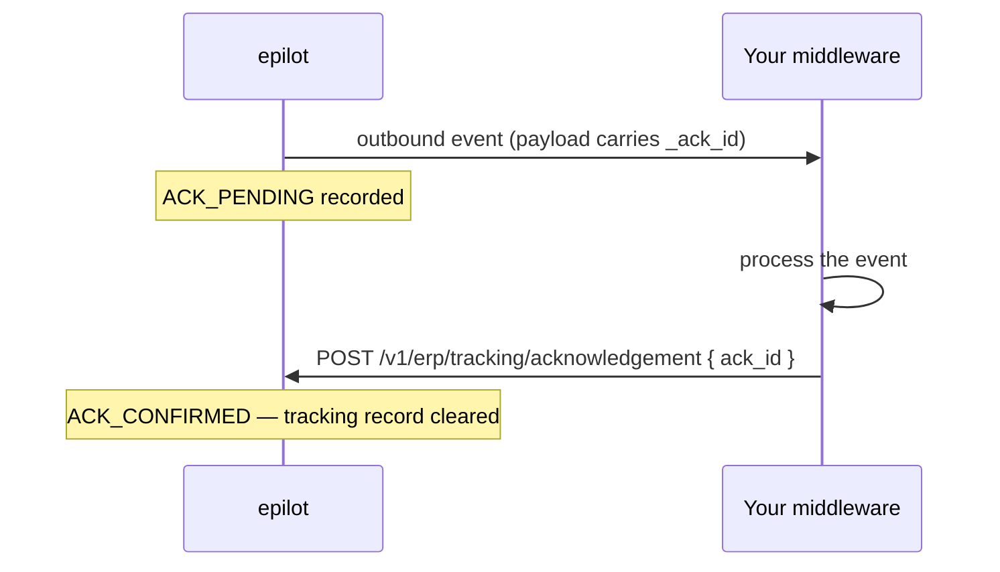

# ACK Tracking

epilot knows it *delivered* an outbound event — the webhook returned 2xx, or the
message was polled. It does not know the ERP actually **processed** it. An
acknowledgement closes that gap: your middleware confirms the work is done, and the
event's status in the Integration Hub becomes end-to-end rather than delivery-only.

## The flow



If the acknowledgement never arrives, the record goes stale and epilot records
`ACK_TIMEOUT` instead.

## Where `ack_id` comes from

It arrives **in the event payload**, as the `_ack_id` field, alongside the other
common metadata every core event carries (`_event_version`, `_event_source`, …). It is
not an HTTP header, and it is not something you construct.

```jsonc
{
  "_event_source": "epilot",
  "_ack_id": "ack_01HZY…",     // ← acknowledge with this
  "contract": { "...": "..." }
}
```

Each delivered event gets its own `_ack_id`. Acknowledge each one individually — an
id is consumed once, and acknowledging clears its tracking record.

:::note
A JSONata outbound mapping controls what your ERP receives. If your mapping builds a
brand-new object rather than extending the event, carry `_ack_id` through explicitly,
or your middleware will never see the id it needs to acknowledge with.
:::

## Sending the acknowledgement

```bash title="Send ACK"
curl -X POST 'https://integration-toolkit.sls.epilot.io/v1/erp/tracking/acknowledgement' \
  -H 'Content-Type: application/json' \
  -d '{ "ack_id": "ack_01HZY…" }'
```

`ack_id` is the **only** field. There is no status to report: sending the
acknowledgement *is* the signal that processing succeeded. A failure is simply an ACK
that never arrives, which the timeout below turns into a visible warning.

| Response | Meaning |
|---|---|
| `200` | Acknowledged; the tracking record is cleared |
| `400` | `ack_id` missing from the body |
| `404` | No tracking record — already acknowledged, already timed out, or an unknown id |

A `404` after a successful `200` is normal if you retry: the record is gone because
the first call consumed it. Treat it as success.

## The lifecycle and its codes

Three [monitoring codes](./codes.md) tell the whole story, and all three are
filterable in the Monitoring tab:

| Code | Level | When |
|---|---|---|
| `ACK_PENDING` | info | The event was delivered and epilot is waiting for the acknowledgement |
| `ACK_CONFIRMED` | info | Your acknowledgement arrived |
| `ACK_TIMEOUT` | warning | No acknowledgement within the timeout window |

`ACK_PENDING` and `ACK_CONFIRMED` are **info**-level: they are lifecycle markers, not
outcomes, so they are counted in total events but deliberately excluded from the
success rate. `ACK_TIMEOUT` is a **warning** — the delivery itself worked, so it is
not an error on epilot's side, but something on yours needs attention.

### The timeout window

A checker runs every **10 minutes** and times out any record older than **15
minutes**. In practice an unacknowledged event surfaces as `ACK_TIMEOUT` within about
25 minutes of delivery — so do not treat a missing ACK as final for roughly half an
hour.

`ACK_TIMEOUT` is also promoted to its own figure in the stats response,
`ack_timeout_count`, so you can chart "how often is the ERP failing to confirm" without
filtering the event stream by code:

```bash
curl -X POST 'https://integration-toolkit.sls.epilot.io/v2/integrations/{integrationId}/monitoring/stats' \
  -H 'Authorization: Bearer <token>' \
  -H 'Content-Type: application/json' \
  -d '{ "from_date": "2026-01-01T00:00:00Z", "use_case_type": "outbound" }'
```

## Turning tracking off

ACK tracking is per outbound use case, via `ack_tracking`:

| Value | Behaviour |
|---|---|
| `on` *(default)* | A tracking record is written, `ACK_PENDING` is recorded, and an unacknowledged event eventually raises `ACK_TIMEOUT` |
| `off` | No tracking record, no `ACK_PENDING`, and no `ACK_TIMEOUT` |

Set it to `off` for consumers that will never acknowledge, and for deliveries that
already keep their own durable per-item record — [Pollable
Outbound](../pollable-outbound.md) queues, for instance, track consumption through the
queue's own `MSG_ACKED` lifecycle, so ACK tracking on top of it produces timeouts that
mean nothing.

:::warning
Leaving `ack_tracking: on` for a consumer that never acknowledges generates a steady
stream of `ACK_TIMEOUT` warnings. That is noise on its own, and it will trip a
`warning_threshold` [alert rule](./alerting.md) if you enable one.
:::

## Related

- [Monitoring Codes](./codes.md) — the full code reference
- [Investigating events](./investigating.md) — traces and replay
- [Pollable Outbound](../pollable-outbound.md) — the queue's own delivery lifecycle
