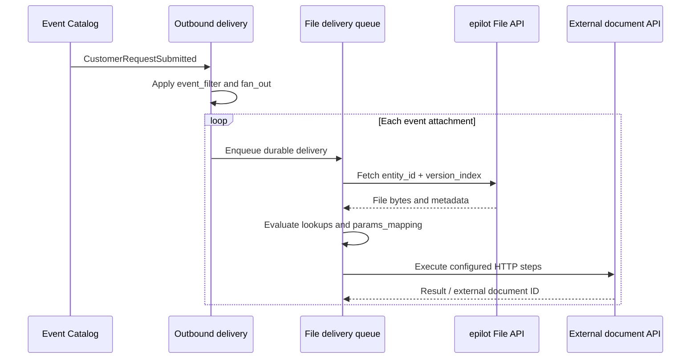

# Outbound File Delivery

Outbound file delivery sends files referenced by an epilot event to an external document API. The Integration Toolkit fetches each file from epilot, maps the event and file into the target API's format, and runs a declarative HTTP workflow.

`CustomerRequestSubmitted` is the main example: one submitted request can contain several `event_attachments`, and each attachment is delivered and monitored independently.

:::caution Attachment readiness

`CustomerRequestSubmitted` is emitted when the ticket is created. Its attachments are a snapshot of the ticket relations visible when Event Catalog processes that event; it does not wait for a later relation write. In the usual journey flow the files already exist and the relation is normally visible by then, but this timing is not guaranteed. An empty snapshot produces `FAN_OUT_EMPTY` and is not automatically replayed when the relation appears.

If the integration needs strict ordering after ticket creation, use a `FileUpdated` handoff after the workflow writes the ticket reference onto the file, or trigger a dedicated workflow event after all relations are complete.

:::

:::info Upload versus download
This page covers files moving **out of epilot**. To serve files from an external archive when a user opens them in epilot, use the [download File Proxy](./file-proxy.md).
:::

## How it works

The setup uses two use cases in the same integration:

| Use case | Decides | Configuration |
| --- | --- | --- |
| `outbound` | **When** to deliver | Event Catalog event, optional event filter, and a pointer to the upload recipe |
| `file_proxy` with `direction: "upload"` | **What and how** to deliver | Fan-out, file selection, mapping, authentication, HTTP steps, limits, and success criteria |



The outbound delivery is a pure pointer to the file-proxy use-case slug. The recipe is resolved at runtime, so you can create the two use cases in either order. A missing or disabled target is visible through monitoring and the outbound status endpoint.

## Before you start

You need:

- an Integration Toolkit integration;
- an Event Catalog event containing a file reference, such as [`CustomerRequestSubmitted`](/docs/integrations/core-events#customer);
- an external HTTP endpoint that accepts the file; and
- environment values for target URLs and credentials.

The examples use the Integration Toolkit API at `https://integration-toolkit.sls.epilot.io`.

## 1. Create the upload recipe

Create a `file_proxy` use case with `direction: "upload"`:

```bash
curl -X POST 'https://integration-toolkit.sls.epilot.io/v1/integrations/{integrationId}/use-cases' \
  -H 'Authorization: Bearer <token>' \
  -H 'Content-Type: application/json' \
  -d '{
    "name": "Customer request document upload",
    "slug": "customer-request-document-upload",
    "type": "file_proxy",
    "enabled": true,
    "configuration": {
      "direction": "upload",
      "fan_out": {
        "enabled": true,
        "split_expression": "event_attachments"
      },
      "lookups": {
        "documentType": {
          "source": "ticket._purpose[0]",
          "entries": {
            "termination": "CANCELLATION",
            "complaint": "COMPLAINT"
          },
          "default": "OTHER",
          "on_miss": "warn"
        }
      },
      "constants": {
        "sourceSystem": "epilot"
      },
      "params_mapping": "{ \"customerNumber\": contact.customer_number, \"filename\": $item.filename, \"mimeType\": $file.mime_type, \"fileData\": $file_base64, \"documentType\": $lookups.documentType, \"submittedAt\": $germanDate($now()) }",
      "required_params": ["customerNumber", "filename", "fileData"],
      "auth": {
        "type": "oauth2_client_credentials",
        "token_url": "\\{{env.DOCUMENT_TOKEN_URL}}",
        "client_id": "\\{{env.DOCUMENT_CLIENT_ID}}",
        "client_secret": "\\{{env.DOCUMENT_CLIENT_SECRET}}"
      },
      "steps": [
        {
          "method": "POST",
          "url": "\\{{env.DOCUMENT_API_URL}}/documents",
          "headers": {
            "Authorization": "Bearer {{auth_token}}",
            "Content-Type": "application/json",
            "Idempotency-Key": "{{custom_key}}"
          },
          "body": "{\"customerNumber\":{{json params.customerNumber}},\"filename\":{{json params.filename}},\"mimeType\":{{json params.mimeType}},\"fileData\":{{json params.fileData}},\"documentType\":{{json params.documentType}},\"sourceSystem\":{{json params.sourceSystem}}}",
          "response_type": "json"
        }
      ],
      "upload": {
        "max_file_bytes": 104857600,
        "max_delivery_attempts": 8,
        "success_when": "statusCode >= 200 and statusCode < 300",
        "external_id": "steps[-1].body.documentId"
      }
    }
  }'
```

### Upload configuration

| Field | Required | Description |
| --- | --- | --- |
| `direction` | Yes | Must be `upload`. Omitting it means the existing download behavior. |
| `steps` | Yes | One or more HTTP requests. Upload steps support `GET`, `POST`, `PUT`, and `PATCH`. |
| `upload` | Yes | File-size limit, retry limit, optional success predicate, and external ID expression. |
| `params_mapping` | Yes | JSONata expression returning the `params` object used by HTTP templates. |
| `fan_out` | No | Splits one event into independent deliveries. Required for one upload per attachment. |
| `file_source` | No | JSONata selecting the attachment-shaped file reference when the fan-out item is not itself an attachment. |
| `lookups` | No | Named code translations evaluated before `params_mapping`. |
| `constants` | No | Static values merged underneath the mapped parameters. |
| `required_params` | No | Parameters that must not be absent, `null`, or empty before any HTTP request is sent. |
| `auth` | No | OAuth2 client credentials or password authentication. |
| `secure_proxy` | No | Routes the steps through a `secure_proxy` use case in the same integration. |

Download-only fields such as `params`, `response`, `allowed_origins`, and `prevent_indirect_serving` are rejected for upload recipes.

## 2. Subscribe to the event

Create an outbound use case whose delivery points to the upload recipe's slug:

```bash
curl -X POST 'https://integration-toolkit.sls.epilot.io/v1/integrations/{integrationId}/use-cases' \
  -H 'Authorization: Bearer <token>' \
  -H 'Content-Type: application/json' \
  -d '{
    "name": "Deliver customer request documents",
    "slug": "deliver-customer-request-documents",
    "type": "outbound",
    "enabled": true,
    "configuration": {
      "event_catalog_event": "CustomerRequestSubmitted",
      "event_filter": "$count(event_attachments) > 0",
      "ack_tracking": "off",
      "mappings": [
        {
          "name": "External document archive",
          "enabled": true,
          "delivery": {
            "type": "file_proxy",
            "use_case_slug": "customer-request-document-upload"
          }
        }
      ]
    }
  }'
```

Do not add `jsonata_expression` to a `file_proxy` outbound mapping. The referenced recipe owns payload mapping, and the API rejects an expression that would otherwise be ignored. Mapping IDs and timestamps are generated when omitted.

Use `ack_tracking: "off"` for a file-only outbound use case: durable delivery state is tracked per file. If a webhook mapping in the same outbound use case requires acknowledgements, keep acknowledgement tracking enabled or separate the webhook and file deliveries.

Check target resolution with:

```http
GET /v1/integrations/{integrationId}/outbound-status
```

## Fan-out and file selection

`fan_out.split_expression` runs once when the event is enqueued and must return an array. Every item becomes an independent delivery with its own status, retries, and idempotency record.

For `CustomerRequestSubmitted`, use `event_attachments`. Each item already contains `entity_id` and `version_index`, so the worker recognizes it as a file reference without `file_source`.

```json
"fan_out": {
  "enabled": true,
  "split_expression": "event_attachments[$count(_tags[$ = 'customer-document']) > 0]"
}
```

Use `event_filter` to decide whether the event should be handled at all. Use `fan_out.split_expression` only to select the items delivered from a handled event.

- An empty, missing, or `null` result produces no deliveries and records `FAN_OUT_EMPTY`.
- A non-array result fails with `FAN_OUT_INVALID_RESULT`.
- With fan-out disabled, the event produces one delivery and `$item` is not bound.

If you split over something other than attachments, set `file_source` to an expression that returns the corresponding attachment:

```json
"file_source": "event_attachments[entity_id = $item.file_id][0]"
```

If no file resolves, the workflow can still send metadata. Include the mapped file value in `required_params` when bytes are mandatory.

## Mapping values

The JSONata root is the complete event. Event fields such as `contact.customer_number` and `ticket._purpose` are read directly. Per-delivery values are `$`-prefixed bindings:

| JSONata value | Contains |
| --- | --- |
| `$item` | Current fan-out item |
| `$file_base64` | File content encoded as base64 |
| `$file` | `filename`, `mime_type`, and `size_bytes` from the resolved file |
| `$constants` | Configured static values |
| `$lookups` | Resolved lookup results |
| `$ack_id` | Triggering event acknowledgement ID, when present |
| `$now()` | Current ISO timestamp |
| `$germanDate(iso)` | An ISO timestamp formatted as a German date |

:::warning JSONata bindings
Write `$item.filename` and `$file_base64`, including the `$`. `item.filename` reads a root event property named `item` and silently produces no value.
:::

Lookups support `on_miss: "default"`, `"warn"`, or `"fail"`. Warning mode continues with the configured default and records `LOOKUP_UNMAPPED`; fail mode stops that delivery.

## Building HTTP steps safely

HTTP steps use Handlebars after JSONata has produced `params`. The template context provides `params.*`, `item`, `event.id`, `event.name`, `custom_key`, earlier `steps.N.*`, and `auth_token`.

Always use the `json` helper for values inserted into JSON bodies:

```handlebars
{
  "filename": {{json params.filename}},
  "fileData": {{json params.fileData}}
  {{#if params.customerNumber}},
  "customerNumber": {{json params.customerNumber}}
  {{/if}}
}
```

Plain interpolation does not safely serialize quotes or control characters. `#if` is supported in JSON bodies; unsafe `#each` and `#with` blocks are rejected during validation.

Environment values are resolved after Handlebars. In the JSON sent to the API, write `"\\{{env.NAME}}"`. The leading backslash preserves the placeholder through Handlebars and is removed before environment resolution.

## Delivery behavior

- Delivery is **at least once**. Normal queue redelivery is deduplicated by a durable per-file record retained for 30 days.
- A failure after the target accepts a file but before epilot commits success can still repeat the request. Pass `{{custom_key}}` to the target and make it an idempotency key.
- The upload recipe is read again for queued retries, subject to a short cache. Correcting configuration affects later attempts without replaying the source event.
- `upload.max_delivery_attempts` defaults to 8 and supports 1–100 attempts with jittered backoff.
- `upload.max_file_bytes` defaults to the platform maximum of 100 MiB. Known size is checked before fetch; the limit is always enforced while buffering.
- `upload.success_when` can reject a nominally successful response, such as an HTTP 200 response containing an error envelope.
- `upload.external_id` records the target document ID without failing an otherwise successful delivery if extraction is unsuccessful.

## Monitoring

Every per-file monitoring event uses the source Event Catalog `_event_id` as both `event_id` and `correlation_id`. Details include the use case, mapping, attachment, item index, attempt, and external ID where available.

| Level | Code | Meaning |
| --- | --- | --- |
| Success | `FILE_PROXY_UPLOADED` | The target accepted the file workflow. |
| Info | `FILE_PROXY_UPLOAD_ENQUEUED` | A per-file delivery was queued. |
| Info | `FAN_OUT_EMPTY` | The event had no matching items. |
| Warning | `FILE_PROXY_UPLOAD_RETRYING` | The delivery failed and will be attempted again. |
| Warning / error | `LOOKUP_UNMAPPED` | A lookup missed; `warn` continues with a fallback, while `fail` stops the delivery. |
| Error | `FILE_PROXY_UPLOAD_FAILED` | Delivery failed terminally or exhausted attempts. |
| Error | `FILE_FETCH_FAILED` | File API did not return usable content. |
| Error | `FILE_TOO_LARGE` | The file exceeded the recipe or platform limit. |
| Error | `ATTACHMENT_NOT_FOUND` | The referenced file entity or version was not found. |
| Error | `REQUIRED_PARAM_MISSING` | A required mapped parameter was absent. |
| Error | `FAN_OUT_INVALID_RESULT` | The split expression returned a non-array value. |

General configuration and mapping codes, including `USE_CASE_NOT_FOUND`, `USE_CASE_DISABLED`, and `MAPPING_EXPRESSION_FAILED`, can also apply. These are epilot-produced monitoring codes; they are separate from the `EXTERNAL_*` codes described in [External Monitoring Events](./external-monitoring-events.md).

## Troubleshooting

| Symptom | Check |
| --- | --- |
| Target is unresolved | The delivery's `use_case_slug` must match an enabled upload-direction `file_proxy` use case in the same integration. |
| Mapped filename or bytes are empty | Per-item bindings require `$item` and `$file_base64`, including the `$`. |
| Target URL or credentials are empty | Persist environment placeholders with a leading backslash: `\\{{env.NAME}}` in JSON. |
| JSON body breaks for some filenames | Replace plain interpolation with `{{json params.filename}}`. |
| Event succeeds without uploading | Inspect `FAN_OUT_EMPTY`, the split expression, and `event_filter`. |
| File fetch fails | Verify `entity_id`, `version_index`, and the configured file-size limit. |

## Related documentation

- [Core Events](/docs/integrations/core-events)
- [Configuration](./configuration.md)
- [File Proxy downloads](./file-proxy.md)
- [External Monitoring Events](./external-monitoring-events.md)
- [Pollable Outbound](./pollable-outbound.md)
