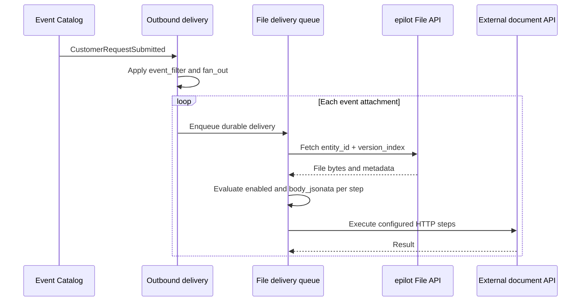

# Outbound File Delivery

Outbound file delivery sends files referenced by an epilot event to an external document API. The Integration Toolkit fetches each file from epilot, maps the event and the file into the target API's format, and runs a declarative HTTP workflow.

`CustomerRequestSubmitted` is the main example: one submitted request can contain several `event_attachments`, and each attachment is delivered and monitored independently.

:::caution Attachment readiness

`CustomerRequestSubmitted` is emitted when the ticket is created. In the standard Journey flow, the file entities already exist, but automation creates the ticket and copies its file relations in a second request. Event Catalog processes the ticket creation asynchronously and reads the current relation graph. The relation request usually finishes first, which is why the attachments are normally present, but this ordering is not guaranteed. The later relation write does not emit another `CustomerRequestSubmitted` or automatically replay an empty snapshot.

Without an attachment-count `event_filter`, an event with no attachments records `FAN_OUT_EMPTY`. With the example `$count(event_attachments) > 0` filter below, the use case is filtered out before fan-out, so no delivery is enqueued and no `FAN_OUT_EMPTY` is emitted for that mapping.

If the integration needs strict ordering after ticket creation, use a `FileUpdated` handoff after the workflow writes the ticket reference onto the file, or trigger a dedicated workflow event after all relations are complete.

:::

:::info Upload versus download
This page covers files moving **out of epilot**. To serve files from an external archive when a user opens them in epilot, use the [download File Proxy](./file-proxy.md).
:::

## How it works

The setup uses two use cases in the same integration:

| Use case | Decides | Configuration |
| --- | --- | --- |
| `outbound` | **When** to deliver | Event Catalog event, optional event filter, and a pointer to the upload recipe |
| `file_proxy` with `direction: "upload"` | **What and how** to deliver | Fan-out, mapping, authentication, HTTP steps, and limits |



The outbound delivery is a pure pointer to the file-proxy use-case slug. The recipe is resolved at runtime, so you can create the two use cases in either order. A missing or disabled target is visible through monitoring and the outbound status endpoint.

## Before you start

You need:

- an Integration Toolkit integration;
- an Event Catalog event that declares `event_attachments`, such as [`CustomerRequestSubmitted`](/docs/integrations/core-events#customer);
- an external HTTP endpoint that accepts the file; and
- environment values for target URLs and credentials.

The examples use the Integration Toolkit API at `https://integration-toolkit.sls.epilot.io`.

## 1. Create the upload recipe

Create a `file_proxy` use case with `direction: "upload"`:

```bash
curl -X POST 'https://integration-toolkit.sls.epilot.io/v1/integrations/{integrationId}/use-cases' \
  -H 'Authorization: Bearer <token>' \
  -H 'Content-Type: application/json' \
  -d '{
    "name": "Customer request document upload",
    "slug": "customer-request-document-upload",
    "type": "file_proxy",
    "enabled": true,
    "configuration": {
      "direction": "upload",
      "fan_out": {
        "enabled": true
      },
      "auth": {
        "type": "oauth2_client_credentials",
        "token_url": "{{env.DOCUMENT_TOKEN_URL}}",
        "client_id": "{{env.DOCUMENT_CLIENT_ID}}",
        "client_secret": "{{env.DOCUMENT_CLIENT_SECRET}}"
      },
      "steps": [
        {
          "method": "POST",
          "url": "{{env.DOCUMENT_API_URL}}/documents",
          "headers": {
            "Content-Type": "application/json",
            "Idempotency-Key": "{{file_data.0.entity_id}}"
          },
          "body_jsonata": "{ \"customerNumber\": contact.customer_number, \"filename\": $file_data[0].filename, \"mimeType\": $file_data[0].mime_type, \"fileData\": $file_data[0].base64, \"sourceSystem\": \"epilot\", \"submittedAt\": $germanDate($now()) }",
          "response_type": "json"
        }
      ],
      "upload": {
        "max_file_bytes": 26214400,
        "max_delivery_attempts": 8
      }
    }
  }'
```

### Upload configuration

| Field | Required | Description |
| --- | --- | --- |
| `direction` | Yes | Must be `upload`. Omitting it means the existing download behavior. |
| `steps` | Yes | One or more HTTP requests. Upload steps support `GET`, `POST`, `PUT`, and `PATCH`. |
| `upload` | Yes | Size ceilings and the retry limit. |
| `fan_out` | No | Whether one event produces one delivery per file or a single delivery carrying all of them. |
| `auth` | No | OAuth2 client credentials or password authentication. |
| `secure_proxy` | No | Routes the steps through a `secure_proxy` use case in the same integration. |

Each step is configured with:

| Field | Required | Description |
| --- | --- | --- |
| `url` | Yes | Handlebars template for the request URL. |
| `method` | Yes | `GET`, `POST`, `PUT`, or `PATCH`. |
| `response_type` | Yes | `json` or `binary`. |
| `headers` | No | Object whose values are Handlebars templates. |
| `body_jsonata` | No | JSONata producing the request body as data. Leave it out to send the delivery's files unchanged. |
| `enabled` | No | JSONata returning a boolean that decides whether this step runs. Absent means it runs. |

Download-only fields are rejected for upload recipes: `params`, `response`, `allowed_origins`, `prevent_indirect_serving`, and a Handlebars `body` on a step.

Fields that earlier versions of this feature carried are rejected as well, each naming its replacement: `params_mapping`, `required_params`, `constants`, `lookups`, `shared`, `file_source`, `fan_out.split_expression`, and a step's `required_keys`.

## 2. Subscribe to the event

Create an outbound use case whose delivery points to the upload recipe's slug:

```bash
curl -X POST 'https://integration-toolkit.sls.epilot.io/v1/integrations/{integrationId}/use-cases' \
  -H 'Authorization: Bearer <token>' \
  -H 'Content-Type: application/json' \
  -d '{
    "name": "Deliver customer request documents",
    "slug": "deliver-customer-request-documents",
    "type": "outbound",
    "enabled": true,
    "configuration": {
      "event_catalog_event": "CustomerRequestSubmitted",
      "event_filter": "$count(event_attachments) > 0",
      "ack_tracking": "off",
      "mappings": [
        {
          "name": "External document archive",
          "enabled": true,
          "delivery": {
            "type": "file_proxy",
            "use_case_slug": "customer-request-document-upload"
          }
        }
      ]
    }
  }'
```

The event must declare `event_attachments`. An outbound use case with a `file_proxy` mapping is rejected with `400` when its `event_catalog_event` carries no attachments — the message names the event and the offending mapping — because such a configuration would fan out to nothing on every event it ever sees and report no error anywhere. If the event catalog cannot be reached to check, the save fails with a retryable `503` rather than being let through.

Do not add `jsonata_expression` to a `file_proxy` outbound mapping. The referenced recipe owns payload mapping, and the API rejects an expression that would otherwise be ignored. Mapping IDs and timestamps are generated when omitted.

Use `ack_tracking: "off"` for a file-only outbound use case: durable delivery state is tracked per file. If a webhook mapping in the same outbound use case requires acknowledgements, keep acknowledgement tracking enabled or separate the webhook and file deliveries.

Check target resolution with:

```http
GET /v1/integrations/{integrationId}/outbound-status
```

## Fan-out

`fan_out.enabled` is the only decision. The split is always over the event's `event_attachments`, so there is no expression to write — an upload only ever runs on events that declare that field.

```json
"fan_out": {
  "enabled": true
}
```

- **`enabled: true`** — one delivery per attachment. Each is fully independent: its own idempotency record, its own retry schedule, its own monitoring events. A four-file event can therefore end up three-of-four delivered, which is the honest state to report.
- **`enabled: false`** (or omitted) — the event produces exactly one delivery carrying every attachment.

The split is evaluated once, when the event is enqueued, so item indices — and therefore idempotency keys — stay stable across retries.

An event carrying no attachments produces no deliveries and records `FAN_OUT_EMPTY` at info level, which is the normal outcome for a catch-all subscription seeing an event with nothing to send. Use `event_filter` to decide whether the event should be handled at all.

## Mapping the request body

A step's `body_jsonata` produces the request body as **data**; the result is serialized to JSON and sent. Use it for every JSON body: it cannot emit malformed JSON, and it omits a key whose value is undefined instead of sending it empty, which is what makes optional fields work without a conditional guard.

The evaluation root is the event, so `contact.customer_number`, `ticket._purpose` and `_event_id` are reachable directly, unprefixed. Everything else is a `$`-prefixed binding:

| JSONata value | Contains |
| --- | --- |
| `$file_data` | The files this delivery carries, always an array |
| `$steps` | Results of the steps already executed, each `{statusCode, headers, body}` |
| `$ack_id` | Triggering event acknowledgement ID, when present |
| `$env` | Organization environment variables |
| `$now()` | Current ISO timestamp, one value for the whole delivery |
| `$germanDate(iso)` | An ISO timestamp formatted as a German date |

`$file_data` is the single binding for files, in both fan-out modes: one entry when fanning out, every attachment when not. `$file_data[0].filename` therefore works either way. Each entry is the event's `event_attachments` object plus `base64`:

| Field | Contains |
| --- | --- |
| `entity_id` | File entity ID |
| `filename` | File name |
| `mime_type` | MIME type |
| `size_bytes` | Size in bytes |
| `base64` | File content, base64-encoded |
| `s3ref` | `bucket` and `key` of the stored file |
| `version_index` | Which file version the event referenced |
| `readable_size` | Human-readable size, such as `1.2 MB` |
| `_tags` | File entity tags |
| `relation_tags` | Tags on the relation that attached the file |
| `category` | File category |
| `file_date` | Document date |
| `_created_at` | When the file entity was created |

:::warning JSONata bindings
Write `$file_data[0].filename`, including the `$`. `file_data[0].filename` reads a field named `file_data` on the event, which does not exist, and silently produces no value. Every `$` binding is checked when the recipe is saved, so a mistyped binding is rejected rather than quietly producing a missing key.
:::

Only `undefined` omits a key. `null`, `""`, `false` and `0` are values and are all sent. Write the two-arm ternary with no else branch to omit a key when a test is false:

```
{ "pin": $exists(contact.customer_pin) ? $string(contact.customer_pin) }
```

Avoid `x ? $string(x)` as the test: JSONata reads `0` and `""` as false, so a meter number of `"0"` would silently vanish. And `: undefined` is not a literal — JSONata has no `undefined` keyword, so it is a path lookup that happens to find nothing.

### Sending the files unchanged

Leave `body_jsonata` out and the delivery sends its files exactly as they are: the single attachment object when fanning out, the whole array when not. No mapping is needed for the common case.

```json
"steps": [
  {
    "method": "POST",
    "url": "{{env.DOCUMENT_API_URL}}/documents",
    "headers": { "Content-Type": "application/json" },
    "response_type": "json"
  }
]
```

### Translating codes

Codes are translated with an inline map in the expression itself. A miss yields `undefined`, so the key is simply left out; bind the map with `:=` when you also want a fallback:

```
(
  $types := { "termination": "CANCELLATION", "complaint": "COMPLAINT" };
  {
    "documentType": [$lookup($types, ticket._purpose[0]), "OTHER"][0],
    "filename": $file_data[0].filename,
    "fileData": $file_data[0].base64
  }
)
```

Names the expression binds itself with `:=` are accepted alongside the built-in bindings. If the delivery must not go out at all when a code is unmapped, test for it in the step's `enabled` expression instead.

## Skipping a step

A step's optional `enabled` expression is JSONata returning a boolean that decides whether the step runs. Absent means it runs.

```json
{
  "enabled": "$file_data[0].mime_type = \"application/pdf\"",
  "method": "POST",
  "url": "{{env.DOCUMENT_API_URL}}/documents",
  "body_jsonata": "{ \"fileData\": $file_data[0].base64 }",
  "response_type": "json"
}
```

A false result is a **break**: this step is skipped and so is every step after it, and the delivery is recorded as `skipped` rather than delivered or failed. It is acknowledged and never retried, and a `STEP_DISABLED` monitoring event is emitted at info level — a disabled step is the configuration working, not a fault.

`enabled` reads the same bindings a body does, `$steps` included, so it can branch on what an earlier step returned. This is also how a single file is filtered out: with one delivery per attachment, a false result on the first step drops that file and leaves the others untouched.

```
$count($file_data[0].relation_tags[$ = "customer-document"]) > 0
```

Return a boolean. An expression that cannot evaluate fails the delivery terminally with `MAPPING_EXPRESSION_FAILED` naming the step — a broken predicate must not read as a deliberate skip.

## URLs, headers, and environment values

Two expression languages, split by what they produce. **JSONata produces data**: `body_jsonata` and `enabled`. **Handlebars composes strings**: a step's `url` and `headers`. An upload step rejects a Handlebars `body` outright.

Handlebars templates render exactly once, against a single context:

| Namespace | Contents |
| --- | --- |
| `env` | Organization environment variables and secrets |
| `file_data` | The same array `$file_data` holds, so `{{file_data.0.filename}}` reads the first file |
| `steps` | Previous step results, such as `{{steps.0.body.documentId}}` |
| `auth_token` | The acquired OAuth2 token, added automatically as a `Bearer` header unless a step sets its own `Authorization` |

Environment values are part of that one context, so write them plainly:

```json
"url": "{{env.DOCUMENT_API_URL}}/documents"
```

:::warning No backslash escape
Upload templates render in a single pass. Do not write the legacy `\{{env.NAME}}` escape used by the [download direction](./file-proxy.md#environment-variable-resolution) — it is not rewritten here and renders as the literal text `{{env.NAME}}`, which the delivery then rejects rather than shipping.
:::

Two guards run on every rendered upload template, because single-pass rendering fails quietly by default. Both are terminal, and each names what to fix:

- **A residual `{{` after rendering** — a configuration still carrying the `\{{` escape. Rewrite it without the backslash.
- **A referenced `env` key absent from the environment** — checked before the URL is parsed, because an empty value in host position turns `https://{{env.host}}/document/import` into `https:///document/import`, whose host then parses as `document`. Provision the variable. A key that exists and is legitimately empty is fine; only absence fails.

Store credentials and base URLs as organization environment variables using epilot's Environments & Secrets feature, following the [naming recommendations](./file-proxy.md#recommended-environment-variable-naming).

## Delivery behavior

Every delivery ends in one of three terminal outcomes, counted separately: **delivered**, **skipped**, or **failed**. A 2xx from the last step is the delivery — there is no separate predicate re-judging a response the transport already accepted.

- Delivery is **at least once**. Normal queue redelivery is deduplicated by a durable per-file record retained for 30 days.
- A failure after the target accepts a file but before epilot commits success can still repeat the request. If the target supports an idempotency key, send it a value that is stable across retries of the same delivery — `$file_data[0].entity_id & ":" & _event_id` in a body, or `{{file_data.0.entity_id}}` in a header.
- The upload recipe is read again for queued retries, subject to a short cache. Correcting configuration affects later attempts without replaying the source event.
- `upload.max_delivery_attempts` defaults to 8 and supports 1–100 attempts with jittered backoff. The default schedules at most 7 delays, totaling roughly 7 hours 40 minutes before jitter, so a normal ERP maintenance window does not immediately exhaust them.
- `upload.max_file_bytes` is the per-file ceiling. It defaults to, and is clamped by, the platform maximum of 100 MiB (`104857600`). Known size is checked before fetch; the limit is always enforced while buffering.
- `upload.max_total_bytes` is the ceiling for all of a delivery's files together, in bytes, and is capped by the same platform maximum — it may lower it but never raise it. It only has an effect with fan-out disabled, where one delivery carries every attachment and base64 inflates each by about a third.
- External HTTP `408`, `429`, and `5xx` responses are retried. Other `4xx` responses are terminal. Timeouts, OAuth refresh failures, and transient file-fetch failures are retried up to the configured attempt limit.
- Configuration and data errors that will not improve on retry — such as a missing file, an expression that cannot evaluate, a body expression that returns something other than an object or array, or an unresolvable step template — fail terminally. JSONata expressions, Handlebars syntax, and `$` bindings are also checked when the recipe is saved.
- Terminal and exhausted deliveries are recorded as failed and completed without deliberately filling the dead-letter queue with permanent errors.

## Monitoring

Every per-file monitoring event uses the source Event Catalog `_event_id` as both `event_id` and `correlation_id`. Details include the use case, mapping, attachment, item index, and attempt, plus the captured request and response of the exchange with the target, with credentials redacted.

| Level | Code | Meaning |
| --- | --- | --- |
| Success | `FILE_PROXY_UPLOADED` | The target accepted the file workflow. |
| Info | `FILE_PROXY_UPLOAD_ENQUEUED` | Per-file deliveries were queued for an event. |
| Info | `FAN_OUT_EMPTY` | The event carried no attachments to send. |
| Info | `STEP_DISABLED` | A step's `enabled` expression returned false, so the delivery was skipped. Includes `step_index`. |
| Warning | `FILE_PROXY_UPLOAD_RETRYING` | The delivery failed and will be attempted again. |
| Error | `FILE_PROXY_UPLOAD_FAILED` | Delivery failed terminally or exhausted attempts. |
| Error | `FILE_FETCH_FAILED` | File API did not return usable content. |
| Error | `FILE_TOO_LARGE` | The file exceeded the recipe or platform limit. |
| Error | `ATTACHMENT_NOT_FOUND` | The referenced file entity or version was not found. |
| Error | `MAPPING_EXPRESSION_FAILED` | A `body_jsonata` or `enabled` expression could not be evaluated, or produced an unusable result. |
| Error | `FAN_OUT_INVALID_RESULT` | The event's `event_attachments` was not an array. |

General configuration codes, including `USE_CASE_NOT_FOUND`, `USE_CASE_DISABLED`, `USE_CASE_INVALID_TYPE`, and `USE_CASE_MISSING_CONFIG`, can also apply. These are epilot-produced monitoring codes; they are separate from the `EXTERNAL_*` codes described in [External Monitoring Events](./external-monitoring-events.md).

## Troubleshooting

| Symptom | Check |
| --- | --- |
| The use case cannot be saved | A `file_proxy` mapping requires an event that declares `event_attachments`. The `400` message names the event. |
| Target is unresolved | The delivery's `use_case_slug` must match an enabled upload-direction `file_proxy` use case in the same integration. |
| Mapped filename or bytes are empty | File bindings require `$file_data`, including the `$`, and an index: `$file_data[0].base64`. |
| Target URL or credentials are empty | Write `{{env.NAME}}` without a leading backslash, and confirm the variable exists in the organization's environment. |
| An optional field is missing from the body | Only `undefined` omits a key. Check the test in the two-arm ternary — `0` and `""` are false in JSONata. |
| Everything reports skipped | An `enabled` expression is returning false. `STEP_DISABLED` names the `step_index`. |
| Event succeeds without uploading | Inspect `FAN_OUT_EMPTY` and `event_filter`; the event may carry no attachments. |
| File fetch fails | Verify `entity_id`, `version_index`, and the configured file-size limits. |
| Target `4xx` is not retried | This is expected except for `408` and `429`; correct the request mapping or target configuration. |

## Related documentation

- [Core Events](/docs/integrations/core-events)
- [Configuration](./configuration.md)
- [File Proxy downloads](./file-proxy.md)
- [External Monitoring Events](./external-monitoring-events.md)
- [Pollable Outbound](./pollable-outbound.md)
