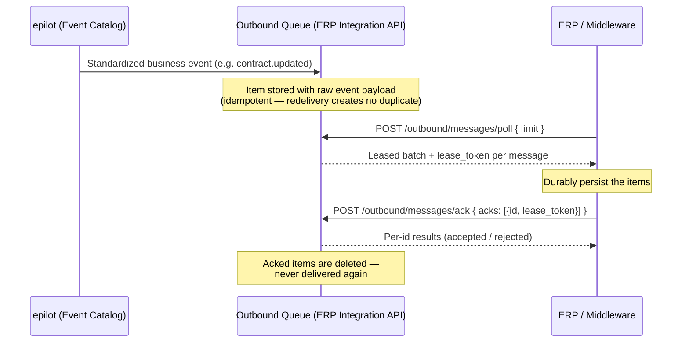

# Pollable Outbound

Pollable Outbound is an opt-in, **pull-based delivery mode** for outbound use cases. Instead of epilot pushing events to a webhook URL, your system polls an SQS-like queue inside the ERP Integration API and acknowledges items once it has durably consumed them. It is configured per outbound mapping via `delivery.type: "poll"` and coexists with the default `"webhook"` push — two delivery strategies over the same outbound event stream.

:::info Availability
Pollable Outbound is a new capability (June 2026) that is currently rolling out. If the endpoints on this page are not yet available for your organization, contact your epilot representative.
:::

:::tip When to use poll instead of webhook push
- Your ERP or middleware is **firewalled / on-prem**, with no inbound HTTP endpoint reachable from the public internet.
- Your integration is **batch-oriented**: runs are scheduled (nightly, hourly), so there is no listener at the moment epilot would push.
- Your network tunnel is **one-directional**: the ERP calls out to epilot, never the reverse.

For these systems the pull model uses the same access pattern you already use for inbound sync — your system calls epilot on its own schedule.
:::

## How It Works



Key properties:

- **Lease + ack/delete (at-least-once).** A poll leases a batch under a visibility timeout, hiding it from concurrent polls. Items you do not acknowledge in time reappear on a later poll — a consumer crash never loses data, but you must handle occasional redelivery (deduplicate by `id` or `event_id`).
- **One polling loop per integration.** A single poll returns the merged feed across **all** of the integration's poll-mode use cases. Each message carries `use_case_id` and `event_name` for routing on your side.
- **FIFO ordering, promised per entity.** Updates to the same entity are never delivered out of order — even across lease timeouts and retries. See [Ordering Guarantees](#ordering-guarantees).
- **Raw standardized events.** Poll messages carry the [Core Event](/docs/integrations/core-events) payload **as-is** — no JSONata mapping is applied in poll mode (see [Payload Contract](#payload-contract)).
- **Long, configurable retention.** Undelivered items are kept for `retention_days` (default 30, max 90) — designed for consumers that are legitimately offline for days.

## Configuration

A poll mapping is configured on a regular outbound use case — same endpoint, same envelope as webhook mappings, only the `delivery` object differs. See [Outbound Use Case Configuration](./configuration.md#outbound-use-case-configuration) for the full use-case contract.

```bash
curl -X POST 'https://erp-integration.sls.epilot.io/v1/integrations/{integrationId}/use-cases' \
  -H 'Authorization: Bearer <token>' \
  -H 'Content-Type: application/json' \
  -d '{
    "name": "Contract Sync (poll)",
    "type": "outbound",
    "enabled": true,
    "configuration": {
      "event_catalog_event": "contract.updated",
      "mappings": [
        {
          "id": "b8f1c9a0-58dd-4f7a-9a3e-000000000001",
          "name": "ERP Contract Sync",
          "enabled": true,
          "delivery": {
            "type": "poll",
            "retention_days": 30,
            "poison_policy": "dead_letter",
            "max_delivery_attempts": 5
          }
        }
      ]
    }
  }'
```

| Property | Type | Required | Default | Bounds | Description |
|----------|------|----------|---------|--------|-------------|
| `retention_days` | integer | No | `30` | min 1, max 90 | How long undelivered queue items are retained before expiry |
| `poison_policy` | string | No | `"dead_letter"` | `dead_letter` \| `block` | What happens when an item exhausts `max_delivery_attempts` — see [Poison Messages](#poison-messages-dead-letter-vs-block) |
| `max_delivery_attempts` | integer | No | `5` | min 1, max 100 | Delivery (lease) attempts before the `poison_policy` is applied |

Validation rules:

- At most **one** poll mapping per use case (regardless of `enabled`). Webhook mappings may coexist alongside it — push and poll for the same event is allowed.
- A `poll` delivery must not carry webhook fields (`webhook_id`, `webhook_name`), and a `webhook` delivery must not carry poll fields (`retention_days`, `poison_policy`, `max_delivery_attempts`).
- `jsonata_expression` is required for `webhook` mappings only; for `poll` mappings it is permitted but ignored.

When a poll use case is enabled, the event-catalog event is enabled as usual, but **no webhook configuration is created** — events route to the queue instead.

## Permissions

| Endpoints | Required grant |
|-----------|----------------|
| `poll`, `ack` | `integration:consume`, resource-scoped to the integration |
| `dlq`, `dlq/redrive`, `unblock` (operator) | `integration:manage` |

The [`integration:consume` grant](../../auth/grant-actions.md) enables least-privilege middleware tokens: a role granting only `integration:consume` on one integration can poll and acknowledge that feed and nothing else — no configuration reads, no other integrations, no entity access. Consumer tokens with only `integration:consume` receive `403` on the operator endpoints.

Data egress is authorized at **configuration time**: enabling a poll use case (which requires `integration:manage`) is the act that authorizes that event data to leave epilot — exactly as configuring a webhook authorizes push delivery. There is no per-entity permission masking on the feed; it contains exactly what the organization configured to flow out.

## Consuming the Queue

### Poll — lease a batch

```
POST /v1/integrations/{integrationId}/outbound/messages/poll
```

```json
{
  "limit": 10
}
```

| Field | Type | Required | Default | Bounds | Description |
|-------|------|----------|---------|--------|-------------|
| `limit` | integer | No | `10` | min 1, max 100 | Maximum messages to lease in this batch. The ~5.5&nbsp;MB response cap may truncate the batch earlier when payloads are large |

:::note Why POST?
Taking a lease mutates server state. A `GET` that consumes leases is an accident magnet — client libraries, proxies, and retry middleware re-issue GETs freely, silently burning leases. This matches SQS, where `ReceiveMessage` is an RPC action.
:::

Response — a leased batch spanning every enabled poll use case of the integration, in strict stream order:

```json
{
  "messages": [
    {
      "id": "msg_9f3c8a1b…",
      "lease_token": "lt_a1b2…",
      "use_case_id": "uc_contract_sync",
      "event_name": "contract.updated",
      "event_id": "evt_77…",
      "group": "0",
      "payload": { "...": "the standardized event-catalog event, as-is" },
      "enqueued_at": "2026-06-09T08:00:00Z"
    }
  ],
  "visibility_timeout_seconds": 300,
  "has_more": true
}
```

| Field | Description |
|-------|-------------|
| `id` | Opaque message id (`msg_…`) — stable per message across leases; use it for deduplication |
| `lease_token` | Opaque lease token (`lt_…`) — must be echoed back on ack; changes when a lapsed message is re-leased |
| `use_case_id` | The poll-mode use case that produced this message — route on this when consuming multiple use cases |
| `event_name` | Standardized event name (e.g. `contract.updated`) |
| `event_id` | Unique id of the originating event |
| `group` | Ordering group — messages sharing a group are strictly ordered, distinct groups are independent. Constant `"0"` in v1 |
| `payload` | The raw standardized event — always inlined, regardless of size |
| `visibility_timeout_seconds` | Effective visibility timeout for this lease (per-integration server-side setting, default `300`) |
| `has_more` | Whether more messages are waiting beyond this batch |

An **empty batch** (`messages: []`) is a normal response, not an error. It means the queue is drained — or another lease is currently in flight (see [Ordering Guarantees](#ordering-guarantees)).

### Ack — confirm consumed messages

Acknowledge messages **after** you have durably persisted them:

```
POST /v1/integrations/{integrationId}/outbound/messages/ack
```

```json
{
  "acks": [
    { "id": "msg_9f3c8a1b…", "lease_token": "lt_a1b2…" }
  ]
}
```

`acks` takes 1–100 entries. The response reports a per-id outcome:

```json
{
  "results": [
    { "id": "msg_9f3c8a1b…", "status": "accepted" },
    { "id": "msg_5d2e…", "status": "rejected", "reason": "out_of_order" }
  ]
}
```

| Rejection `reason` | Meaning |
|--------------------|---------|
| `stale_lease` | The lease expired and the message was (or can be) re-leased — a slow consumer cannot delete a message another lease now owns. Re-poll and process the message again |
| `out_of_order` | Acks must be **prefix-contiguous in stream order**: acknowledging message *n* requires all messages before it in the leased batch to be acknowledged too. Everything past the first gap is rejected |
| `not_found` | Unknown message id (already acknowledged, expired, or never existed) |

Accepted acks are committed as a cursor advance — acknowledged messages are never delivered again.

### A typical polling loop

```text
loop (every N seconds / on schedule):
  batch = POST …/outbound/messages/poll { limit: 100 }
  if batch.messages is empty: sleep / wait for next run
  for message in batch.messages (in order):
    persist message durably (dedupe on message.id)
  POST …/outbound/messages/ack { acks: all (id, lease_token) pairs }
  if batch.has_more: poll again immediately
```

Practical guidance:

- **Finish well inside the visibility timeout.** If processing a batch can exceed `visibility_timeout_seconds`, lower your `limit` — a lapsed lease means the whole batch is re-delivered and your acks come back `stale_lease`.
- **Ack in stream order**, ideally the whole batch at once. Partial acks are fine as long as they are contiguous from the head of the batch.
- **Deduplicate.** At-least-once delivery means a message can arrive twice (with a fresh `lease_token`). The `id` is stable across redeliveries.
- **Do not parallelize polls of one integration.** Only one batch can be in flight per stream; concurrent polls receive empty batches (this is by design, to preserve ordering).

## Ordering Guarantees

The ordering contract is **per entity**: messages affecting the same entity are delivered in order, and consumers must not rely on order *across* entities. Each message carries a `group` field — messages sharing a group are strictly ordered, distinct groups are independent.

In v1 the implementation delivers a stronger property in practice — a single ordered stream (one group, `"0"`) per integration — but only per-entity order is promised. This keeps a future server-side sharding lever non-breaking: if throughput ever requires it, the stream can be split into groups by entity hash without any contract change, and the `group` field is how a scaled-out consumer would route and serialize work.

Consequences of FIFO with a single stream:

- **Head-of-line leasing.** A poll returns the oldest available run of messages, and the stream is blocked beyond the leased run until those messages are acked or the lease lapses. A crashed or slow consumer cannot reorder the stream.
- **One in-flight batch per stream.** While a batch is leased, concurrent polls return an empty batch. Consumer-side parallelism does not increase throughput within a stream.
- **The stream spans all of an integration's poll use cases.** A blocking message from one use case also holds back the others' messages (relevant for `poison_policy: "block"`, below).

## Payload Contract

Poll messages carry the **raw standardized event-catalog payload** — no JSONata transform is applied in poll mode. The mapping's `jsonata_expression` is ignored for poll mappings (it is not even syntax-checked). Condition filtering (`filterConditions`) is likewise not available for poll mode: a poll use case enqueues **every** event of its configured type, and the consumer filters on its side if needed.

This is an intentional difference between the two delivery modes: JSONata mapping and condition filtering are push-pipeline features executed inside the webhook delivery infrastructure, which a poll use case bypasses entirely.

:::caution Switching delivery types changes the payload shape
A mapping switched from `webhook` to `poll` (or vice versa) changes what the consumer receives: webhook consumers get the **mapped** (JSONata-transformed) payload, poll consumers get the **raw** standardized event.
:::

Payloads are copied onto the queue item at enqueue time, so an item stays consumable for its full retention window even after the source event has aged out of the event catalog. Payloads are **always inlined** in the poll response regardless of size — the batch simply includes as many messages as fit within `limit` and the ~5.5&nbsp;MB response cap.

## Retention and Expiry

- Undelivered items expire after the mapping's `retention_days` (default 30, max 90), counted from enqueue time.
- Changing `retention_days` affects **new items only** — already-enqueued items keep the TTL computed at enqueue time.
- An expired item is never delivered: the poll API filters expired items even before the storage layer reaps them. Each expiry of an item that was **never consumed** emits an `MSG_EXPIRED_UNPOLLED` monitoring error, so silent data loss is always visible.
- Dead-lettered items get a **re-armed retention window** at dead-letter time — a full `retention_days` from that moment — giving operators the whole window to redrive instead of whatever sliver remained.

## Poison Messages: `dead_letter` vs `block`

Head-of-line FIFO means a message that repeatedly fails consumption would stall everything behind it. What happens when a message exhausts `max_delivery_attempts` is decided per use case by `poison_policy`:

| Policy | Behavior | Choose when |
|--------|----------|-------------|
| `dead_letter` (default) | The message moves to the dead-letter queue and the next message becomes the head — one bad record degrades only itself | Skipping a single update is acceptable; the DLQ keeps it redrivable |
| `block` | The stream halts intentionally and resumes only when the consumer eventually acks the message, or an operator explicitly skips it via [`unblock`](#unblock--skip-a-blocked-head) | Skipping an update is worse than stopping — e.g. strict state replication |

Notes:

- Delivery attempts only increment when a message is actually **leased** — an offline consumer never triggers poison handling by mere absence.
- With `block`, remember the blast radius: the stream spans all of the integration's poll use cases, so a blocking message from one use case also holds back the others. That is the deliberate trade-off of `block`.
- A blocked stream raises the `MSG_HEAD_BLOCKED` monitoring error and a `stream_blocked` conflict in [`outbound-status`](#queue-health-in-outbound-status).

## Dead-Letter Queue and Operator Actions

Three operator endpoints manage poisoned messages. All require the `integration:manage` grant.

### List the DLQ

```
GET /v1/integrations/{integrationId}/outbound/messages/dlq?limit=25&next_token=…
```

Returns dead-lettered messages oldest first, paginated via an opaque `next_token` (`limit` 1–100, default 25). Entries carry **delivery metadata only** — payloads are not included in listings:

```json
{
  "items": [
    {
      "id": "msg_5d2e…",
      "use_case_id": "uc_contract_sync",
      "event_name": "contract.updated",
      "event_id": "evt_81…",
      "enqueued_at": "2026-06-08T22:10:00Z",
      "dead_lettered_at": "2026-06-09T03:00:00Z",
      "delivery_attempts": 5,
      "reason": "max_delivery_attempts exhausted",
      "expires_at": "2026-07-09T03:00:00Z"
    }
  ],
  "next_token": "…"
}
```

### Redrive — re-enqueue dead-lettered messages

```
POST /v1/integrations/{integrationId}/outbound/messages/dlq/redrive
```

```json
{
  "ids": ["msg_5d2e…"]
}
```

Takes 1–100 message ids and reports a per-id outcome — `redriven`, or `not_found` for unknown ids and entries concurrently redriven or expired. The redriven copy is re-enqueued with **zero delivery attempts and a fresh retention window**; the original DLQ entry is removed.

:::caution Redrive ordering
A redriven message is re-enqueued at the **tail** with a new id and sequence — it is delivered out of its original per-entity order, because the stream has moved on. This is inherent to redrive and matches SQS DLQ semantics. If your consumer is order-sensitive, reconcile redriven messages explicitly (e.g. compare against current entity state).
:::

### Unblock — skip a blocked head

```
POST /v1/integrations/{integrationId}/outbound/messages/unblock
```

```json
{
  "reason": "Malformed reference data — skipping after manual fix"
}
```

For streams halted under `poison_policy: "block"`. **Skip equals dead-letter:** unblocking dead-letters the blocked head (recording the optional `reason`, max 500 characters) and emits `MSG_DEAD_LETTERED` — the message then becomes redrivable from the DLQ like any other dead-lettered item. The next message becomes the head and the stream resumes.

The response reports `unblocked: true` with the `dead_lettered_id` of the skipped head, or `unblocked: false` as a safe no-op when the stream is not currently blocked. A late acknowledgement from the consumer also unblocks the stream naturally — no operator action needed.

## Monitoring

### Lifecycle monitoring codes

Poll-queue message lifecycle events flow through the standard monitoring pipeline (Integration Hub dashboards, stats endpoint), mirroring the push-side `ACK_*` family:

| Code | Level | Emitted when |
|------|-------|--------------|
| `MSG_ENQUEUED` | info | A new queue item is enqueued for a poll-mode use case (duplicates emit nothing) |
| `MSG_ACKED` | success | A polled message is acknowledged (one event per accepted message id) |
| `MSG_EXPIRED_UNPOLLED` | error | An item's retention window elapsed without it ever being consumed — the offline-consumer loss signal |
| `MSG_DEAD_LETTERED` | error | A message exhausted `max_delivery_attempts` under the `dead_letter` policy, or an operator skipped a blocked head (includes `delivery_attempts` in the event detail) |
| `MSG_HEAD_BLOCKED` | error | The stream halted on a poisoned head under the `block` policy — emitted **once per blocked episode**, not on every poll (includes `delivery_attempts` in the event detail) |

Lease lapses (a message reappearing after a visibility timeout) are deliberately **not** a per-occurrence signal — they are normal at-least-once behavior and would be noisy. The attempt count is reported on `MSG_DEAD_LETTERED` / `MSG_HEAD_BLOCKED`, which are the actionable events.

### Queue health in `outbound-status`

For poll-mode use cases, `GET /v1/integrations/{integrationId}/outbound-status` reports a `poll` health object per use case (webhook-only use cases keep their existing status shape unchanged):

```json
{
  "useCaseId": "…",
  "name": "Contract Sync (poll)",
  "status": "ok",
  "poll": {
    "queue_depth": 12,
    "oldest_unconsumed_age_seconds": 4210,
    "last_poll_at": "2026-06-11T06:30:00Z",
    "last_ack_at": "2026-06-11T06:30:05Z",
    "blocked": false,
    "dlq_count": 0
  }
}
```

| Field | Description |
|-------|-------------|
| `queue_depth` | Unconsumed messages attributable to this use case (first-page approximation) |
| `oldest_unconsumed_age_seconds` | Age of the oldest unconsumed message — `null` when the queue is empty |
| `last_poll_at` / `last_ack_at` | Timestamps of the last successful poll lease / committed ack — `null` before the first |
| `blocked` | Whether the integration's outbound stream is halted by a blocked head. Stream-level flag — the same value appears on every poll use case of the integration, because the stream spans them |
| `dlq_count` | Dead-lettered messages of this use case awaiting redrive or expiry (first-page approximation) |

Two poll-specific conflict types can surface alongside: `stream_blocked` (the stream is halted awaiting operator action or consumer ack) and `dlq_items_present` (dead-lettered messages await redrive or expiry).

## SDK

The poll and ack endpoints are part of the ERP Integration API's OpenAPI spec and surface in the [`@epilot/erp-integration-client`](https://www.npmjs.com/package/@epilot/erp-integration-client) SDK as typed `pollOutboundMessages` / `ackOutboundMessages` operations — same client and auth you already use for the other ERP Integration API endpoints. The operations are included in SDK releases newer than `0.32.0`; until your SDK version includes them, call the endpoints directly as shown above.

## Current Limitations

- **No JSONata payload mapping** and **no condition filtering** for poll mappings — poll delivers raw standardized events; the consumer transforms and filters on its side (see [Payload Contract](#payload-contract)).
- **At most one poll mapping per use case.**
- **One in-flight batch per integration stream** — consumer-side parallelism does not increase throughput. The contract is shard-ready (per-entity ordering promise, per-message `group` field), but sharding is a server-side setting that is not yet enabled.
