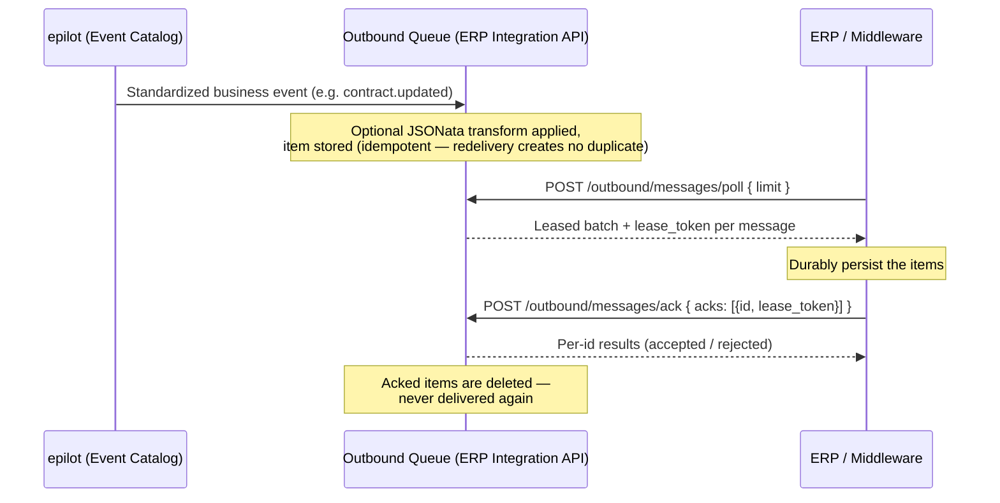

# Pollable Outbound

Pollable Outbound is an opt-in, **pull-based delivery mode** for outbound use cases. Instead of epilot pushing events to a webhook URL, your system polls an SQS-like queue inside the ERP Integration API and acknowledges items once it has durably consumed them. It is configured per outbound mapping via `delivery.type: "poll"` and coexists with the default `"webhook"` push — two delivery strategies over the same outbound event stream.

:::info Availability
Pollable Outbound is a new capability (June 2026) that is currently rolling out. If the endpoints on this page are not yet available for your organization, contact your epilot representative.
:::

:::tip When to use poll instead of webhook push
- Your ERP or middleware is **firewalled / on-prem**, with no inbound HTTP endpoint reachable from the public internet.
- Your integration is **batch-oriented**: runs are scheduled (nightly, hourly), so there is no listener at the moment epilot would push.
- Your network tunnel is **one-directional**: the ERP calls out to epilot, never the reverse.

For these systems the pull model uses the same access pattern you already use for inbound sync — your system calls epilot on its own schedule.
:::

## How It Works


```mermaid
sequenceDiagram
    participant EC as epilot (Event Catalog)
    participant Q as Outbound Queue (ERP Integration API)
    participant ERP as ERP / Middleware

    EC->>Q: Standardized business event (e.g. contract.updated)
    Note over Q: Optional JSONata transform applied,<br/>item stored (idempotent — redelivery creates no duplicate)
    ERP->>Q: POST /outbound/messages/poll { limit }
    Q-->>ERP: Leased batch + lease_token per message
    Note over ERP: Durably persist the items
    ERP->>Q: POST /outbound/messages/ack { acks: [{id, lease_token}] }
    Q-->>ERP: Per-id results (accepted / rejected)
    Note over Q: Acked items are deleted —<br/>never delivered again
```

Key properties:

- **Lease + ack/delete (at-least-once).** A poll leases a batch under a visibility timeout, hiding it from concurrent polls. Items you do not acknowledge in time reappear on a later poll — a consumer crash never loses data, but you must handle occasional redelivery (deduplicate on `use_case_id` + `event_id` — see [A typical polling loop](#a-typical-polling-loop)).
- **One polling loop per integration.** A single poll returns the merged feed across **all** of the integration's poll-mode use cases. Each message carries `use_case_id` and `event_name` for routing on your side.
- **FIFO ordering, promised per entity.** Updates to the same entity are never delivered out of order — even across lease timeouts and retries. The one exception is an event that reaches the queue late, which goes to the tail and is flagged in monitoring (see [Late arrivals](#late-arrivals)). See [Ordering Guarantees](#ordering-guarantees).
- **Raw or mapped payloads.** By default poll messages carry the [Core Event](/docs/integrations/core-events) payload **as-is**. An optional JSONata transform reshapes it at enqueue time, so a consumer can receive one consistent shape (see [Payload Mapping](#payload-mapping)).
- **Long, configurable retention.** Undelivered items are kept for `retention_days` (default 30, max 90) — designed for consumers that are legitimately offline for days.

## Configuration

A poll mapping is configured on a regular outbound use case — same endpoint, same envelope as webhook mappings, only the `delivery` object differs. See [Outbound Use Case Configuration](./configuration.md#outbound-use-case-configuration) for the full use-case contract.

```bash
curl -X POST 'https://integration-toolkit.sls.epilot.io/v1/integrations/{integrationId}/use-cases' \
  -H 'Authorization: Bearer <token>' \
  -H 'Content-Type: application/json' \
  -d '{
    "name": "Contract Sync (poll)",
    "type": "outbound",
    "enabled": true,
    "configuration": {
      "event_catalog_event": "contract.updated",
      "mappings": [
        {
          "id": "b8f1c9a0-58dd-4f7a-9a3e-000000000001",
          "name": "ERP Contract Sync",
          "enabled": true,
          "delivery": {
            "type": "poll",
            "retention_days": 30,
            "poison_policy": "dead_letter",
            "max_delivery_attempts": 5
          }
        }
      ]
    }
  }'
```

| Property | Type | Required | Default | Bounds | Description |
|----------|------|----------|---------|--------|-------------|
| `retention_days` | integer | No | `30` | min 1, max 90 | How long undelivered queue items are retained before expiry |
| `poison_policy` | string | No | `"dead_letter"` | `dead_letter` \| `block` | What happens when an item exhausts `max_delivery_attempts` — see [Poison Messages](#poison-messages-dead_letter-vs-block) |
| `max_delivery_attempts` | integer | No | `5` | min 1, max 100 | Delivery (lease) attempts before the `poison_policy` is applied |

Validation rules:

- At most **one** poll mapping per use case (regardless of `enabled`). Webhook mappings may coexist alongside it — push and poll for the same event is allowed.
- A `poll` delivery must not carry webhook fields (`webhook_id`, `webhook_name`), and a `webhook` delivery must not carry poll fields (`retention_days`, `poison_policy`, `max_delivery_attempts`).
- `jsonata_expression` is required for `webhook` mappings only. For `poll` mappings it is optional: when set, it transforms each payload at enqueue time (see [Payload Mapping](#payload-mapping)). It is validated on save — JSONata syntax, the 10,000-character limit, and only the bindings `$env`, `$mapValue` and `$mapKey`.

When a poll use case is enabled, the event-catalog event is enabled as usual, but **no webhook configuration is created** — events route to the queue instead.

## Permissions

| Endpoints | Required grant |
|-----------|----------------|
| `poll`, `ack` | `integration:consume`, resource-scoped to the integration |
| `dlq`, `dlq/redrive`, `unblock` (operator) | `integration:manage` |
| `outbound/mapping-simulation` ([preview](#preview-a-transform)) | `integration:view`, resource-scoped to the integration |

The [`integration:consume` grant](../../auth/grant-actions.md) enables least-privilege middleware tokens: a role granting only `integration:consume` on one integration can poll and acknowledge that feed and nothing else — no configuration reads, no other integrations, no entity access. Consumer tokens with only `integration:consume` receive `403` on the operator endpoints.

Data egress is authorized at **configuration time**: enabling a poll use case (which requires `integration:manage`) is the act that authorizes that event data to leave epilot — exactly as configuring a webhook authorizes push delivery. There is no per-entity permission masking on the feed; it contains exactly what the organization configured to flow out.

## Consuming the Queue

### Poll — lease a batch

```
POST /v1/integrations/{integrationId}/outbound/messages/poll
```

```json
{
  "limit": 10
}
```

| Field | Type | Required | Default | Bounds | Description |
|-------|------|----------|---------|--------|-------------|
| `limit` | integer | No | `10` | min 1, max 100 | Maximum messages to lease in this batch. The ~5.5&nbsp;MB response cap may truncate the batch earlier when payloads are large |

:::note Why POST?
Taking a lease mutates server state. A `GET` that consumes leases is an accident magnet — client libraries, proxies, and retry middleware re-issue GETs freely, silently burning leases. This matches SQS, where `ReceiveMessage` is an RPC action.
:::

Response — a leased batch spanning every enabled poll use case of the integration, in strict stream order:

```json
{
  "messages": [
    {
      "id": "msg_9f3c8a1b…",
      "lease_token": "lt_a1b2…",
      "org_id": "123456",
      "use_case_id": "uc_contract_sync",
      "event_name": "contract.updated",
      "event_id": "evt_77…",
      "group": "0",
      "payload": { "...": "the mapped output, or the standardized event as-is" },
      "mapping_version": "3f9a1c0b7d2e4a65",
      "enqueued_at": "2026-06-09T08:00:00Z"
    }
  ],
  "visibility_timeout_seconds": 300,
  "has_more": true
}
```

| Field | Description |
|-------|-------------|
| `id` | Opaque message id (`msg_…`) — stable per message across leases; use it for deduplication |
| `lease_token` | Opaque lease token (`lt_…`) — must be echoed back on ack; changes when a lapsed message is re-leased |
| `org_id` | The epilot organization the message belongs to — always populated. Useful for middleware that polls several organizations into one pipeline |
| `use_case_id` | The poll-mode use case that produced this message — route on this when consuming multiple use cases |
| `event_name` | Standardized event name (e.g. `contract.updated`) |
| `event_id` | Unique id of the originating event |
| `group` | Ordering group — messages sharing a group are strictly ordered, distinct groups are independent. Constant `"0"` in v1 |
| `payload` | The mapped output when the use case has a `jsonata_expression`, otherwise the raw standardized event — always inlined, regardless of size |
| `mapping_version` | Version of the transform that produced `payload` (see [Mapping version](#mapping-version)). Absent for raw payloads |
| `visibility_timeout_seconds` | Effective visibility timeout for this lease (per-integration server-side setting, default `300`) |
| `has_more` | Whether more messages are waiting beyond this batch |

An **empty batch** (`messages: []`) is a normal response, not an error. It means the queue is drained — or another lease is currently in flight (see [Ordering Guarantees](#ordering-guarantees)).

### Ack — confirm consumed messages

Acknowledge messages **after** you have durably persisted them:

```
POST /v1/integrations/{integrationId}/outbound/messages/ack
```

```json
{
  "acks": [
    { "id": "msg_9f3c8a1b…", "lease_token": "lt_a1b2…" }
  ]
}
```

`acks` takes 1–100 entries. The response reports a per-id outcome:

```json
{
  "results": [
    { "id": "msg_9f3c8a1b…", "status": "accepted" },
    { "id": "msg_5d2e…", "status": "rejected", "reason": "out_of_order" }
  ]
}
```

| Rejection `reason` | Meaning |
|--------------------|---------|
| `stale_lease` | The lease expired and the message was (or can be) re-leased — a slow consumer cannot delete a message another lease now owns. Re-poll and process the message again |
| `out_of_order` | Acks must be **prefix-contiguous in stream order**: acknowledging message *n* requires all messages before it in the leased batch to be acknowledged too. Everything past the first gap is rejected |
| `not_found` | Unknown message id (already acknowledged, expired, or never existed) |

Accepted acks are committed as a cursor advance — acknowledged messages are never delivered again.

### A typical polling loop

```text
loop (every N seconds / on schedule):
  batch = POST …/outbound/messages/poll { limit: 100 }
  if batch.messages is empty: sleep / wait for next run
  for message in batch.messages (in order):
    persist message durably (dedupe on use_case_id + event_id)
  POST …/outbound/messages/ack { acks: all (id, lease_token) pairs }
  if batch.has_more: poll again immediately
```

Practical guidance:

- **Finish well inside the visibility timeout.** If processing a batch can exceed `visibility_timeout_seconds`, lower your `limit` — a lapsed lease means the whole batch is re-delivered and your acks come back `stale_lease`.
- **Ack in stream order**, ideally the whole batch at once. Partial acks are fine as long as they are contiguous from the head of the batch.
- **Deduplicate on `use_case_id` + `event_id`.** At-least-once delivery means an event can arrive twice. A lease redelivery keeps the same `id` (with a fresh `lease_token`), but in a rare race the same event can also be delivered twice under **different** message ids — so `id` alone is not a sufficient deduplication key. The same `event_id` legitimately appears once per poll use case it matches, which is why the key includes `use_case_id`.
- **Do not parallelize polls of one integration.** Only one batch can be in flight per stream; concurrent polls receive empty batches (this is by design, to preserve ordering).

## Ordering Guarantees

The ordering contract is **per entity**: messages affecting the same entity are delivered in order, and consumers must not rely on order *across* entities. Each message carries a `group` field — messages sharing a group are strictly ordered, distinct groups are independent.

In v1 the implementation delivers a stronger property in practice — a single ordered stream (one group, `"0"`) per integration — but only per-entity order is promised. This keeps a future server-side sharding lever non-breaking: if throughput ever requires it, the stream can be split into groups by entity hash without any contract change, and the `group` field is how a scaled-out consumer would route and serialize work.

Consequences of FIFO with a single stream:

- **Head-of-line leasing.** A poll returns the oldest available run of messages, and the stream is blocked beyond the leased run until those messages are acked or the lease lapses. A crashed or slow consumer cannot reorder the stream.
- **One in-flight batch per stream.** While a batch is leased, concurrent polls return an empty batch. Consumer-side parallelism does not increase throughput within a stream.
- **The stream spans all of an integration's poll use cases.** A blocking message from one use case also holds back the others' messages (relevant for `poison_policy: "block"`, below).

### Late arrivals

The stream is ordered by event time. Occasionally an event reaches the queue after the stream has already moved past the position where it would sort — for example, when the event itself was delayed on the way in. "Moved past" covers everything already acknowledged and everything ever handed out in a lease — including leases that expired without an acknowledgement. Such an event is never inserted behind that position, where it would be skipped. Instead it is **re-keyed to the tail** of the stream and delivered after everything already enqueued, and the `MSG_LATE_ARRIVAL` monitoring warning is emitted with `message_id`, `event_name`, `original_sequence_time` and `rekeyed_sequence_time` in its detail.

Only the queue position changes. The payload is untouched — its `_event_time` still carries the original event time — and the poll message envelope has no late-arrival marker: `MSG_LATE_ARRIVAL` in monitoring is the only signal.

Order is promised **per entity** only. Because a late arrival goes to the tail, it is delivered after messages that were already in the stream — including, in the rare case, a newer event for the same entity. If your consumer applies state changes, compare the event's `_event_time` with the last one you applied for that entity rather than relying on delivery order alone.

## Payload Contract

Without a transform, poll messages carry the **raw standardized event-catalog payload**, exactly as the event catalog emitted it. With a `jsonata_expression` on the poll mapping, they carry the **mapped output** instead — see [Payload Mapping](#payload-mapping). The `mapping_version` envelope field tells the two apart: it is present on mapped payloads and absent on raw ones.

The internal keys `_downgrades` and `_automation_chain` are removed from poll payloads before the item is stored, and again on delivery. They are bookkeeping for epilot's own event pipeline and carry no business data. A [payload mapping](#payload-mapping) is evaluated against the stripped event, so expressions never see these keys either.

Webhook condition filtering (`filterConditions`) is not available for poll mode. To limit which events a poll use case enqueues, use the use case's [`event_filter`](./configuration.md#event-filter) — a JSONata predicate evaluated against the same standardized event before anything is enqueued. Events the filter rejects never reach the queue.

:::caution Switching delivery types changes the payload shape
A mapping switched from `webhook` to `poll` (or vice versa) changes what the consumer receives, even with the same `jsonata_expression`. See [Webhook and poll mode are not interchangeable](#webhook-and-poll-mode-are-not-interchangeable).
:::

Payloads are copied onto the queue item at enqueue time, so an item stays consumable for its full retention window even after the source event has aged out of the event catalog. Payloads are **always inlined** in the poll response regardless of size — the batch simply includes as many messages as fit within `limit` and the ~5.5&nbsp;MB response cap.

## Payload Mapping

A poll mapping can carry an optional `jsonata_expression` that reshapes each event before it is enqueued. The typical reason is a middleware that consumes many epilot organizations: each organization's configuration differs a little (status codes, reason labels, which attributes are filled), and a per-organization mapping evens those differences out so the middleware receives **one consistent shape**.

```json
{
  "id": "b8f1c9a0-58dd-4f7a-9a3e-000000000001",
  "name": "Meter readings to middleware",
  "enabled": true,
  "jsonata_expression": "{ \"meter_number\": meter_number, \"reason\": $mapValue($env.reading_reason, reason, \"OTHER\") }",
  "delivery": {
    "type": "poll",
    "poison_policy": "dead_letter"
  }
}
```

### How the transform is evaluated

- **When:** once, at **enqueue time**, right after the use case's `event_filter` has accepted the event. The mapped output is stored on the queue item, so every poll of that item returns the same payload — a lease lapse or a redelivery never re-evaluates the expression.
- **Input:** the standardized event-catalog event, hydrated in full — the same root that `event_filter` sees, minus the internal `_downgrades` and `_automation_chain` keys. Field paths start at the top level of the [Core Event](/docs/integrations/core-events) (`_event_id`, `_event_time`, `meter_number`, …).
- **Bindings:** `$env` (the organization's non-secret environment variables, including [Key/Value Maps](./key-value-maps.md)), `$mapValue` and `$mapKey`. No other bindings are available — in particular there is no `$now`, because the output must depend only on the event and the configuration. An expression that references any other `$`-binding is rejected on save.
- **Output:** must be a **JSON object**. An array, a scalar, `null`, or an undefined result is a mapping failure (`invalid_output`).
- **Empty means raw.** An absent, empty, or whitespace-only `jsonata_expression` applies no transform, and the raw standardized event is delivered — the behavior of every poll use case that has no expression.

The expression is validated on save: JSONata syntax, a maximum of 10,000 characters, and no bindings outside `$env`, `$mapValue` and `$mapKey`.

### Mapping version

Every mapped message carries a `mapping_version`: the first 16 hexadecimal characters of the SHA-256 hash of the trimmed `jsonata_expression`. Two messages with the same `mapping_version` were produced by the same expression. The field is absent on raw payloads.

Because the transform runs at enqueue time, **changing the expression affects new items only**. Items already on the queue keep the payload their original expression produced. While the queue drains after a change, a consumer can therefore see old and new shapes side by side (or raw and mapped ones, when an expression was added or removed). Use `mapping_version` to tell them apart, and roll out shape changes that your consumer can read in both versions until the old items are gone.

### Mapping failures

A failure to evaluate — a runtime error, a timeout, or an output that is not an object — does not drop the event. The item is still enqueued at its normal position in the stream, marked as failed, with the raw payload kept alongside it. At enqueue time epilot emits the `MAPPING_EXPRESSION_FAILED` monitoring error, with the use case, event id, event name, `mapping_version` and the error message in its context.

A failed item is **never delivered to the consumer**. When it reaches the head of the stream it is handled immediately — without waiting for `max_delivery_attempts`, because evaluating the same expression against the same event would fail the same way every time. What happens next follows the use case's `poison_policy`:

| Policy | What happens to a failed item at the head |
|--------|-------------------------------------------|
| `dead_letter` (default) | It moves straight to the [dead-letter queue](#dead-letter-queue-and-operator-actions) with `reason: "mapping_failed"`, and the stream moves on. `MSG_DEAD_LETTERED` is emitted with `reason`, `mapping_error` and `mapping_version` in its detail |
| `block` | The stream halts on it. `MSG_HEAD_BLOCKED` is emitted with `reason: "mapping_failed"` in its detail. Release it with [`unblock`](#unblock--skip-a-blocked-head), as for any other blocked head |

To recover, fix the expression (or the missing environment variable), then [redrive](#redrive--re-enqueue-dead-lettered-messages) the affected DLQ entries. A redrive always re-applies the **current** mapping to entries that failed mapping.

:::tip A missing map is a mapping failure
`$mapValue` and `$mapKey` fail when their first argument is not an object — for example when `$env.reading_reason` has not been created yet in an organization. Create the environment variables before enabling the use case, and use the [preview endpoint](#preview-a-transform) with a real `event_id` to confirm.
:::

### Preview a transform

```
POST /v1/integrations/{integrationId}/outbound/mapping-simulation
```

Evaluates an expression exactly as enqueue would, without enqueuing anything. Requires the `integration:view` grant on the integration.

```json
{
  "jsonata_expression": "{ \"meter_number\": meter_number, \"reason\": $mapValue($env.reading_reason, reason, \"OTHER\") }",
  "event_id": "01J9Z…",
  "event_catalog_event": "MeterReadingAdded"
}
```

| Field | Type | Required | Description |
|-------|------|----------|-------------|
| `jsonata_expression` | string | Yes | The expression to evaluate |
| `payload` | object | One of `payload` / `event_id` | An event to evaluate against, supplied inline |
| `event_id` | string | One of `payload` / `event_id` | A historical event. epilot loads it from the event catalog and hydrates it exactly as enqueue does, so the preview matches what the queue would store |
| `event_catalog_event` | string | No | The event-catalog event the `event_id` belongs to |

Supply exactly one of `payload` or `event_id`. `$env`, `$mapValue` and `$mapKey` resolve on the server from the organization's non-secret environment variables and key/value maps, the same way as at enqueue.

```json
{
  "valid": true,
  "output": { "meter_number": "A-1002", "reason": "PERIODIC" },
  "mapping_version": "3f9a1c0b7d2e4a65",
  "input": { "_event_id": "01J9Z…", "_event_name": "MeterReadingAdded", "...": "the hydrated event" }
}
```

| Field | Description |
|-------|-------------|
| `valid` | Whether the expression evaluated to a JSON object |
| `output` | The mapped output — present when `valid` is `true` |
| `error` | Present when `valid` is `false`: a `code`, a `message`, and for syntax errors the `position` in the expression |
| `mapping_version` | The version this expression would stamp on messages |
| `input` | The hydrated event the expression ran against — returned when the request used `event_id` |

| Error `code` | Meaning |
|--------------|---------|
| `syntax_error` | The expression is not valid JSONata |
| `unknown_binding` | The expression uses a `$`-binding other than `$env`, `$mapValue` or `$mapKey` |
| `evaluation_error` | The expression failed while running (for example, a missing key/value map) |
| `timeout` | The evaluation took too long |
| `invalid_output` | The result is not a JSON object |
| `expression_too_long` | The expression exceeds 10,000 characters |

A mapping error is a normal `200` response with `valid: false`. A `4xx` status means the request itself was malformed — for example, both or neither of `payload` and `event_id`.

### Webhook and poll mode are not interchangeable

The same `jsonata_expression` is **not guaranteed to produce the same output** in webhook and poll mode. The webhook service builds its own input for the expression and enriches the event differently; in poll mode the input is the standardized event-catalog event described above. Write and test a poll expression against poll input — the [preview endpoint](#preview-a-transform) with a real `event_id` is the reliable check — rather than copying a webhook expression across unchanged.

### Example: one shape for a multi-organization middleware

A middleware collects meter readings from several utilities, each its own epilot organization. The organizations label reading reasons differently — one uses English labels, another German ones — but the middleware wants a single set of reason codes.

Each organization declares the same [Key/Value Map](./key-value-maps.md) under the same environment key, `reading_reason`, with its own entries:

```json title="Organization A — reading_reason"
{ "Periodic reading": "PERIODIC", "Move-out": "MOVE_OUT", "Meter change": "METER_CHANGE" }
```

```json title="Organization B — reading_reason"
{ "Turnusablesung": "PERIODIC", "Auszug": "MOVE_OUT", "Zählerwechsel": "METER_CHANGE" }
```

Both organizations then use the **same** expression on their `MeterReadingAdded` poll use case. Because it references only `$env`, it contains nothing organization-specific and can ship unchanged in a blueprint:

```jsonata title="Poll mapping — MeterReadingAdded"
{
  "event_id": _event_id,
  "occurred_at": _event_time,
  "meter_number": meter_number,
  "contract_number": contract_number,
  "reason": $mapValue($env.reading_reason, reason, "OTHER"),
  "readings": [meter_readings.{
    "obis_number": obis_number,
    "value": value,
    "direction": direction,
    "read_at": reading_timestamp
  }]
}
```

Whichever organization a message comes from, the middleware receives the same object:

```json
{
  "event_id": "01J9Z…",
  "occurred_at": "2026-06-09T07:58:12.000Z",
  "meter_number": "A-1002",
  "contract_number": "C-20931",
  "reason": "PERIODIC",
  "readings": [
    { "obis_number": "1-0:1.8.0", "value": 18234, "direction": "feed-out", "read_at": "2026-06-09T07:55:00.000Z" }
  ]
}
```

A few details make this robust:

- The `[ … ]` around `meter_readings.{ … }` keeps `readings` an array even when an event carries a single reading.
- The `"OTHER"` default keeps an unmapped label from producing a missing field; the middleware sees an explicit code it can route for review.
- The message envelope's `org_id` tells the middleware which organization a message came from, so the payload does not need to repeat it.
- `occurred_at` carries the business event time, which stays correct even for [late arrivals](#late-arrivals).

## Retention and Expiry

- Undelivered items expire after the mapping's `retention_days` (default 30, max 90), counted from enqueue time.
- Changing `retention_days` affects **new items only** — already-enqueued items keep the TTL computed at enqueue time.
- An expired item is never delivered: the poll API filters expired items even before the storage layer reaps them. Each expiry of an item that was **never consumed** emits an `MSG_EXPIRED_UNPOLLED` monitoring error, so silent data loss is always visible.
- Dead-lettered items get a **re-armed retention window** at dead-letter time — a full `retention_days` from that moment — giving operators the whole window to redrive instead of whatever sliver remained.

## Poison Messages: `dead_letter` vs `block`

Head-of-line FIFO means a message that repeatedly fails consumption would stall everything behind it. What happens when a message exhausts `max_delivery_attempts` is decided per use case by `poison_policy`:

| Policy | Behavior | Choose when |
|--------|----------|-------------|
| `dead_letter` (default) | The message moves to the dead-letter queue and the next message becomes the head — one bad record degrades only itself | Skipping a single update is acceptable; the DLQ keeps it redrivable |
| `block` | The stream halts intentionally and resumes only when the consumer eventually acks the message, or an operator explicitly skips it via [`unblock`](#unblock--skip-a-blocked-head) | Skipping an update is worse than stopping — e.g. strict state replication |

Notes:

- Delivery attempts only increment when a message is actually **leased** — an offline consumer never triggers poison handling by mere absence.
- With `block`, remember the blast radius: the stream spans all of the integration's poll use cases, so a blocking message from one use case also holds back the others. That is the deliberate trade-off of `block`.
- A blocked stream raises the `MSG_HEAD_BLOCKED` monitoring error and a `stream_blocked` conflict in [`outbound-status`](#queue-health-in-outbound-status).
- An item whose [payload mapping failed](#mapping-failures) is poisoned from the start: the policy applies as soon as it reaches the head, without waiting for `max_delivery_attempts`. Because it is never delivered, a consumer acknowledgement cannot release it — under `block`, use [`unblock`](#unblock--skip-a-blocked-head).

## Dead-Letter Queue and Operator Actions

Three operator endpoints manage poisoned messages. All require the `integration:manage` grant.

### List the DLQ

```
GET /v1/integrations/{integrationId}/outbound/messages/dlq?limit=25&next_token=…
```

Returns dead-lettered messages oldest first, paginated via an opaque `next_token` (`limit` 1–100, default 25). Entries carry **delivery metadata only** — payloads are not included in listings:

```json
{
  "items": [
    {
      "id": "msg_5d2e…",
      "use_case_id": "uc_contract_sync",
      "event_name": "contract.updated",
      "event_id": "evt_81…",
      "enqueued_at": "2026-06-08T22:10:00Z",
      "dead_lettered_at": "2026-06-09T03:00:00Z",
      "delivery_attempts": 5,
      "reason": "max_delivery_attempts exhausted",
      "expires_at": "2026-07-09T03:00:00Z"
    },
    {
      "id": "msg_7a41…",
      "use_case_id": "uc_meter_readings",
      "event_name": "MeterReadingAdded",
      "event_id": "evt_93…",
      "enqueued_at": "2026-06-09T02:40:00Z",
      "dead_lettered_at": "2026-06-09T02:41:00Z",
      "delivery_attempts": 0,
      "reason": "mapping_failed",
      "mapping_error": "$mapValue: first argument must be an object",
      "mapping_version": "3f9a1c0b7d2e4a65",
      "expires_at": "2026-07-09T02:41:00Z"
    }
  ],
  "next_token": "…"
}
```

| Field | Description |
|-------|-------------|
| `reason` | Why the message was dead-lettered: the policy (`max_delivery_attempts` exhausted), the operator's `unblock` reason, or `mapping_failed` for a [payload mapping failure](#mapping-failures) |
| `mapping_error` | The mapping error message (truncated to 1,024 characters) — present when the payload mapping failed |
| `mapping_version` | Version of the expression that produced the stored payload, or that failed on it |

### Redrive — re-enqueue dead-lettered messages

```
POST /v1/integrations/{integrationId}/outbound/messages/dlq/redrive
```

```json
{
  "ids": ["msg_5d2e…", "msg_7a41…"],
  "reapply_mapping": true
}
```

| Field | Type | Required | Default | Description |
|-------|------|----------|---------|-------------|
| `ids` | string[] | Yes | — | 1–100 message ids to redrive |
| `reapply_mapping` | boolean | No | `false` | Re-apply the use case's **current** `jsonata_expression` to the raw payload instead of re-sending the stored payload |

The response reports a per-id outcome:

```json
{
  "results": [
    { "id": "msg_5d2e…", "status": "redriven" },
    { "id": "msg_7a41…", "status": "mapping_failed", "mapping_error": "$mapValue: first argument must be an object" }
  ]
}
```

| `status` | Meaning |
|----------|---------|
| `redriven` | Re-enqueued at the tail |
| `not_found` | Unknown id, or the entry was concurrently redriven or expired |
| `mapping_failed` | Re-applying the mapping failed again. The entry stays in the DLQ with its `mapping_error` and `mapping_version` updated; `mapping_error` is also returned in the result |

The redriven copy is re-enqueued with **zero delivery attempts and a fresh retention window**; the original DLQ entry is removed.

How the payload of the redriven copy is chosen:

- By default (`reapply_mapping: false`) the stored payload is re-sent unchanged — the behavior before payload mapping existed.
- With `reapply_mapping: true` the current expression is evaluated again against the kept raw payload. Use it after fixing an expression, so already dead-lettered messages go out in the corrected shape.
- An entry that was dead-lettered **because its mapping failed** (`reason: "mapping_failed"`) is always re-mapped with the current configuration, whatever `reapply_mapping` says — it has no usable mapped payload to re-send.
- When re-mapping and the use case no longer has an expression, the raw payload is delivered.

:::caution Redrive ordering
A redriven message is re-enqueued at the **tail** with a new id and sequence — it is delivered out of its original per-entity order, because the stream has moved on. This is inherent to redrive and matches SQS DLQ semantics. If your consumer is order-sensitive, reconcile redriven messages explicitly (e.g. compare against current entity state).
:::

### Unblock — skip a blocked head

```
POST /v1/integrations/{integrationId}/outbound/messages/unblock
```

```json
{
  "reason": "Malformed reference data — skipping after manual fix"
}
```

For streams halted under `poison_policy: "block"`. **Skip equals dead-letter:** unblocking dead-letters the blocked head (recording the optional `reason`, max 500 characters) and emits `MSG_DEAD_LETTERED` — the message then becomes redrivable from the DLQ like any other dead-lettered item. The next message becomes the head and the stream resumes.

The response reports `unblocked: true` with the `dead_lettered_id` of the skipped head, or `unblocked: false` as a safe no-op when the stream is not currently blocked. A late acknowledgement from the consumer also unblocks the stream naturally — no operator action needed.

## Monitoring

### Lifecycle monitoring codes

Poll-queue message lifecycle events flow through the standard monitoring pipeline (Integration Hub dashboards, stats endpoint), mirroring the push-side `ACK_*` family:

| Code | Level | Emitted when |
|------|-------|--------------|
| `MSG_ENQUEUED` | info | A new queue item is enqueued for a poll-mode use case (duplicates emit nothing) |
| `MSG_ACKED` | success | A polled message is acknowledged (one event per accepted message id) |
| `MSG_EXPIRED_UNPOLLED` | error | An item's retention window elapsed without it ever being consumed — the offline-consumer loss signal |
| `MSG_DEAD_LETTERED` | error | A message exhausted `max_delivery_attempts` under the `dead_letter` policy, or an operator skipped a blocked head (includes `delivery_attempts` in the event detail) |
| `MSG_HEAD_BLOCKED` | error | The stream halted on a poisoned head under the `block` policy — emitted **once per blocked episode**, not on every poll (includes `delivery_attempts` in the event detail) |
| `MSG_LATE_ARRIVAL` | warning | An event arrived after the consumer had moved past its position and was re-keyed to the tail of the stream (includes `original_sequence_time` and `rekeyed_sequence_time` in the event detail) — see [Late arrivals](#late-arrivals) |
| `MAPPING_EXPRESSION_FAILED` | error | The poll mapping's `jsonata_expression` failed at enqueue time (includes `use_case_id`, `event_id`, `event_name`, `mapping_version` and the error message) — see [Mapping failures](#mapping-failures) |

When a failed mapping reaches the head, `MSG_DEAD_LETTERED` or `MSG_HEAD_BLOCKED` carries `reason: "mapping_failed"` in its detail, so the mapping failure and its consequence for the stream can be told apart from ordinary poison messages.

Lease lapses (a message reappearing after a visibility timeout) are deliberately **not** a per-occurrence signal — they are normal at-least-once behavior and would be noisy. The attempt count is reported on `MSG_DEAD_LETTERED` / `MSG_HEAD_BLOCKED`, which are the actionable events.

### Queue health in `outbound-status`

For poll-mode use cases, `GET /v1/integrations/{integrationId}/outbound-status` reports a `poll` health object per use case (webhook-only use cases keep their existing status shape unchanged):

```json
{
  "useCaseId": "…",
  "name": "Contract Sync (poll)",
  "status": "ok",
  "poll": {
    "queue_depth": 12,
    "oldest_unconsumed_age_seconds": 4210,
    "last_poll_at": "2026-06-11T06:30:00Z",
    "last_ack_at": "2026-06-11T06:30:05Z",
    "blocked": false,
    "dlq_count": 0
  }
}
```

| Field | Description |
|-------|-------------|
| `queue_depth` | Unconsumed messages attributable to this use case (first-page approximation) |
| `oldest_unconsumed_age_seconds` | Age of the oldest unconsumed message — `null` when the queue is empty |
| `last_poll_at` / `last_ack_at` | Timestamps of the last successful poll lease / committed ack — `null` before the first |
| `blocked` | Whether the integration's outbound stream is halted by a blocked head. Stream-level flag — the same value appears on every poll use case of the integration, because the stream spans them |
| `dlq_count` | Dead-lettered messages of this use case awaiting redrive or expiry (first-page approximation) |

Two poll-specific conflict types can surface alongside: `stream_blocked` (the stream is halted awaiting operator action or consumer ack) and `dlq_items_present` (dead-lettered messages await redrive or expiry).

## SDK

The poll and ack endpoints are part of the ERP Integration API's OpenAPI spec and surface in the [`@epilot/erp-integration-client`](https://www.npmjs.com/package/@epilot/erp-integration-client) SDK as typed `pollOutboundMessages` / `ackOutboundMessages` operations — same client and auth you already use for the other ERP Integration API endpoints. The operations are included in SDK releases newer than `0.32.0`; until your SDK version includes them, call the endpoints directly as shown above.

## Current Limitations

- **No webhook condition filtering** (`filterConditions`) for poll mappings — use the use case's `event_filter` instead (see [Payload Contract](#payload-contract)).
- **Payload mapping bindings are limited** to `$env`, `$mapValue` and `$mapKey`, and the output must be a JSON object (see [Payload Mapping](#payload-mapping)).
- **At most one poll mapping per use case.**
- **One in-flight batch per integration stream** — consumer-side parallelism does not increase throughput. The contract is shard-ready (per-entity ordering promise, per-message `group` field), but sharding is a server-side setting that is not yet enabled.
