# Use Cases

This page describes the standard ERP integration use cases that the Integration Toolkit supports. Each use case is classified as **inbound** (ERP to epilot) or **outbound** (epilot to ERP) and documents what happens on each side, which [Core Entities](/docs/entities/core-entities) are involved, and which [Core Events](/docs/integrations/core-events) are emitted or consumed.

:::tip
Most integrations start with inbound use cases (syncing master data into epilot) and then add outbound use cases (self-service actions from portals and journeys).
:::

## Quick Reference

### Inbound (ERP to epilot)

| Use Case | Core Entities | Typical Trigger |
|----------|---------------|-----------------|
| [Keep Customer In Sync](#keep-customer-in-sync) | [`contact`](/docs/entities/core-entities#contact), [`account`](/docs/entities/core-entities#account), [`billing_account`](/docs/entities/core-entities#billing_account) | Customer record changed in ERP |
| [Keep Contract In Sync](#keep-contract-in-sync) | [`contract`](/docs/entities/core-entities#contract), [`contact`](/docs/entities/core-entities#contact), [`billing_account`](/docs/entities/core-entities#billing_account), [`meter`](/docs/entities/core-entities#meter) | Contract created/modified in ERP |
| [Keep Billing Account In Sync](#keep-billing-account-in-sync) | [`billing_account`](/docs/entities/core-entities#billing_account), [`contact`](/docs/entities/core-entities#contact) | Customer account / billing address / payment details changed in ERP |
| [Keep Meter In Sync](#keep-meter-in-sync) | [`meter`](/docs/entities/core-entities#meter), [`meter_counter`](/docs/entities/core-entities#meter_counter), [`contract`](/docs/entities/core-entities#contract) | Meter installed/replaced in ERP |
| [Sync Meter Readings](#sync-meter-readings) | [`meter`](/docs/entities/core-entities#meter), [`meter_counter`](/docs/entities/core-entities#meter_counter) | Readings recorded in ERP |
| [Sync Documents](#sync-documents) | [`file`](/docs/entities/core-entities#file), [`contact`](/docs/entities/core-entities#contact), [`contract`](/docs/entities/core-entities#contract), [`billing_account`](/docs/entities/core-entities#billing_account) | Documents generated in ERP/archive |
| [Sync Billing Events](#sync-billing-events) | [`billing_event`](/docs/entities/core-entities#billing_event), [`billing_account`](/docs/entities/core-entities#billing_account) | Invoices/payments posted in ERP |
| [Sync Installment Schedule](#sync-installment-schedule) | [`billing_event`](/docs/entities/core-entities#billing_event), [`billing_account`](/docs/entities/core-entities#billing_account) | Installment plan (Abschlagsplan) created/changed in ERP |
| [Sync Portal User](#sync-portal-user) | [`portal_user`](/docs/entities/core-entities#portal_user), [`contact`](/docs/entities/core-entities#contact) | Portal user registered or mapped |

### Outbound (epilot to ERP)

| Use Case | Core Event | Core Entities | Typical Trigger |
|----------|------------|---------------|-----------------|
| [Submit Meter Reading](#submit-meter-reading) | [`MeterReadingAdded`](/docs/integrations/core-events#MeterReadingAdded) | [`meter`](/docs/entities/core-entities#meter), [`meter_counter`](/docs/entities/core-entities#meter_counter) | Portal / Journey |
| [Submit Service Meter Reading](#submit-service-meter-reading) | [`ServiceMeterReadingAdded`](/docs/integrations/core-events#ServiceMeterReadingAdded) | [`ticket`](/docs/entities/core-entities#ticket), [`meter`](/docs/entities/core-entities#meter), [`meter_counter`](/docs/entities/core-entities#meter_counter) | 360 service agent |
| [Submit New Order](#submit-new-order) | [`OrderSubmission`](/docs/integrations/core-events#OrderSubmission) | [`order`](/docs/entities/core-entities#order), [`contact`](/docs/entities/core-entities#contact), [`product`](/docs/entities/core-entities#product) | Journey |
| [Switch Tariff](#switch-tariff) | [`TariffChange`](/docs/integrations/core-events#TariffChange) | [`order`](/docs/entities/core-entities#order), [`contract`](/docs/entities/core-entities#contract), [`product`](/docs/entities/core-entities#product) | Portal / Journey |
| [Change Installment](#change-installment-amount) | [`InstallmentUpdated`](/docs/integrations/core-events#InstallmentUpdated) | [`contract`](/docs/entities/core-entities#contract), [`billing_account`](/docs/entities/core-entities#billing_account) | Portal / 360 |
| [Change Payment Method](#change-payment-method-sepaiban) | [`PaymentMethodUpdated`](/docs/integrations/core-events#PaymentMethodUpdated) | [`billing_account`](/docs/entities/core-entities#billing_account), [`contact`](/docs/entities/core-entities#contact) | Portal / Journey / 360 |
| [Change Billing Address](#change-billing-address) | [`BillingAddressUpdated`](/docs/integrations/core-events#BillingAddressUpdated) | [`billing_account`](/docs/entities/core-entities#billing_account), [`contact`](/docs/entities/core-entities#contact) | Portal / 360 |
| [Remove Billing Account Connection](#remove-billing-account-connection) | [`BillingAccountConnectionRemoved`](/docs/integrations/core-events#BillingAccountConnectionRemoved) | [`billing_account`](/docs/entities/core-entities#billing_account), [`portal_user`](/docs/entities/core-entities#portal_user) | Portal |
| [Update Customer Details](#update-customer-details) | [`CustomerDetailsUpdated`](/docs/integrations/core-events#CustomerDetailsUpdated) | [`contact`](/docs/entities/core-entities#contact) | Portal / 360 |
| [Submit General Request](#submit-general-request) | [`GeneralRequestCreated`](/docs/integrations/core-events#GeneralRequestCreated) | [`ticket`](/docs/entities/core-entities#ticket), [`contact`](/docs/entities/core-entities#contact) | Portal / 360 |
| [Request Data Sync](#request-data-sync) | [`OnDemandSyncCustomerRequested`](/docs/integrations/core-events#OnDemandSyncCustomerRequested), [`OnDemandSyncContractRequested`](/docs/integrations/core-events#OnDemandSyncContractRequested) | varies | Portal login / 360 |
| [Contract Move](#contract-move-move-in--move-out) | [`LocationMoveRequested`](/docs/integrations/core-events#LocationMoveRequested) | [`ticket`](/docs/entities/core-entities#ticket), [`contact`](/docs/entities/core-entities#contact), [`contract`](/docs/entities/core-entities#contract), [`meter`](/docs/entities/core-entities#meter) | Portal / Journey |
| [Terminate Contract](#terminate-contract) | [`TerminateContractRequested`](/docs/integrations/core-events#TerminateContractRequested) | [`ticket`](/docs/entities/core-entities#ticket), [`contract`](/docs/entities/core-entities#contract), [`contact`](/docs/entities/core-entities#contact) | Portal / Journey |

---

## Inbound Use Cases (ERP to epilot)

Inbound use cases push data from your ERP system into epilot via the [Inbound API](./inbound/getting-started.md). Your middle layer or ERP sends events to the `/v3/erp/updates/events` endpoint, the Integration Toolkit applies [JSONata mappings](./inbound/mapping.md), and epilot entities are created or updated.

### Keep Customer In Sync

Synchronize customer master data (business partners) from your ERP into epilot contacts.

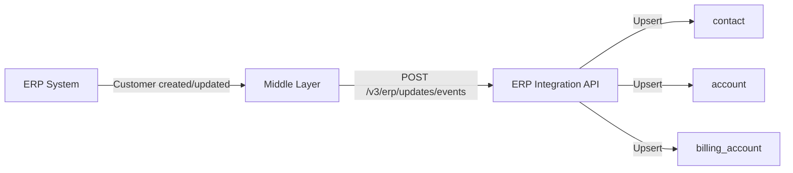

**What happens in the ERP:**
- Customer record is created or updated (name, address, email, phone, tax ID)
- ERP or middle layer detects the change (via delta sync, change events, or polling)
- Middle layer sends the customer payload to the Integration Toolkit inbound API

**What happens in epilot:**
- Integration Toolkit matches the incoming data to an existing [contact](/docs/entities/core-entities#contact) entity using a unique identifier (e.g., `customer_number`)
- Contact entity is created or updated with mapped fields (name, address, email, phone)
- Related entities (billing accounts, contracts) are linked if identifiers are present

**Core Entities:** [`contact`](/docs/entities/core-entities#contact), [`account`](/docs/entities/core-entities#account), [`billing_account`](/docs/entities/core-entities#billing_account)

**Typical unique identifier:** `customer_number` (ERP business partner ID)

**Typical fields mapped:** salutation, first name, last name, date of birth, email, phone, postal address, tax ID, company name, VAT ID

---

### Keep Contract In Sync

Synchronize contract data including tariff, start date, and billing details.

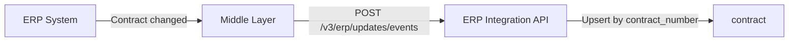

**What happens in the ERP:**
- Contract is created, renewed, or modified
- Middle layer sends contract payload with related customer and meter identifiers

**What happens in epilot:**
- Integration Toolkit matches to an existing [contract](/docs/entities/core-entities#contract) entity using the contract number
- Contract entity is created or updated
- Relations to contact, billing account, and meter entities are established based on identifiers in the payload

**Core Entities:** [`contract`](/docs/entities/core-entities#contract), [`contact`](/docs/entities/core-entities#contact), [`billing_account`](/docs/entities/core-entities#billing_account), [`meter`](/docs/entities/core-entities#meter)

**Typical unique identifier:** `contract_number`

**Typical fields mapped:** contract number, contract type (power, gas, district heating), start date, end date, tariff name, installment amount, market location ID

---

### Keep Billing Account In Sync

Synchronize billing account (Vertragskonto) data including the billing address, payment method and SEPA mandates. Most ERPs separate the **business partner** (the customer record, see [Keep Customer In Sync](#keep-customer-in-sync)) from the **contract account** that holds invoicing and payment data.

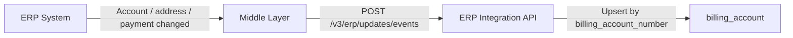

**What happens in the ERP:**
- Contract account is created, the billing address changes, or payment details (bank account, SEPA mandate) are updated
- Middle layer sends one or more events covering the changed sub-domain (account header, billing address, payment method)

**What happens in epilot:**
- Integration Toolkit matches the [billing_account](/docs/entities/core-entities#billing_account) by the billing account number
- The billing account entity is created or updated with the appropriate attributes
- Bank account details (IBAN, BIC, account holder, SEPA mandate, debit/credit usage) are stored on the `payment_method` attribute
- Relations to contact and contract entities are established

**Core Entities:** [`billing_account`](/docs/entities/core-entities#billing_account), [`contact`](/docs/entities/core-entities#contact)

**Typical unique identifier:** `billing_account_number` / `external_id` (ERP Vertragskonto / Rechnungseinheit ID)

**Typical fields mapped:** billing account number, identity ID, billing address, payment method type, IBAN (often masked at rest), BIC, account holder, bank name, SEPA mandate reference, debit/credit usage

:::tip[Split inbound use cases by sub-domain]
In production integrations the three concerns above are commonly modelled as **three separate use cases** that all target the `billing_account` schema:

- **Account changed** – upserts `external_id`, `billing_account_number`, `identity_id` and the `billing_contact` relation
- **Invoice address changed** – upserts only the `billing_address` attribute
- **Payment method changed** – upserts only the `payment_method` attribute (often with the IBAN masked, e.g. `XXXXXXXXXXXXXXXXXX` + last digits, plus `_tags` like `DEBIT` / `CREDIT`)

Splitting them keeps each mapping focused, lets the ERP send only the delta that changed, and makes monitoring per-sub-domain easier in the Integration Hub.
:::

:::info
Some ERPs support multiple bank accounts per billing account (e.g. one for receivables, one for credits). The mapping should handle arrays of bank accounts and use `_tags` (`DEBIT`, `CREDIT`) on each `payment_method` entry.
:::

---

### Keep Meter In Sync

Synchronize meter and meter counter (register) data.

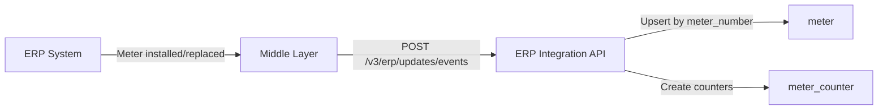

**What happens in the ERP:**
- Meter is installed, replaced, or its configuration changes
- Middle layer sends meter data with device numbers and counter registers

**What happens in epilot:**
- Integration Toolkit matches to an existing [meter](/docs/entities/core-entities#meter) entity using the meter number (device number)
- Meter entity is created or updated
- Meter counter entities are created for each register (e.g., HT/NT for dual-tariff meters)
- Relations to contract and contact entities are established

**Core Entities:** [`meter`](/docs/entities/core-entities#meter), [`meter_counter`](/docs/entities/core-entities#meter_counter), [`contract`](/docs/entities/core-entities#contract)

**Typical unique identifiers:** `meter_number` (device number), `obis_number` (counter register ID)

**Typical fields mapped:** meter number, metering point ID (market location), meter type, tariff type, unit (kWh, m3), installation date

---

### Sync Meter Readings

Synchronize meter reading history from ERP to epilot. See the dedicated [Meter Readings](./inbound/meter-readings.md) guide for configuration details.

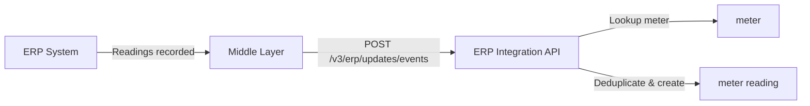

**What happens in the ERP:**
- Meter readings are recorded (regular, irregular, or system-estimated)
- Middle layer sends reading data as an array referencing meters by ID

**What happens in epilot:**
- Integration Toolkit looks up the meter entity by meter number
- Meter readings are created on the matched meter counter
- Deduplication prevents duplicate readings based on the configured matching strategy (`external_id` or `strict-date`)

**Core Entities:** [`meter`](/docs/entities/core-entities#meter), [`meter_counter`](/docs/entities/core-entities#meter_counter) (meter readings are stored on meter counters)

**Typical fields mapped:** reading date, reading value, reading type (regular/irregular), reading reason, unit

---

### Sync Documents

Synchronize documents from an ERP or external archive system (e.g., d.3, Doxis).

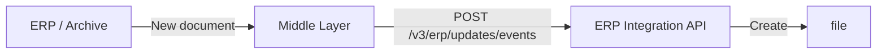

**What happens in the ERP:**
- New documents are generated (invoices, contract confirmations, letters)
- Documents are stored in the ERP or a connected archive system
- Middle layer sends document metadata and file content to epilot

**What happens in epilot:**
- File entities are created with either the document content or a `custom_download_url` pointing to the [File Proxy](./file-proxy.md)
- Files are linked to the relevant contact, contract or billing account entities using identifiers (e.g. contract number, customer number, billing account number)

**Core Entities:** [`file`](/docs/entities/core-entities#file), [`contact`](/docs/entities/core-entities#contact), [`contract`](/docs/entities/core-entities#contract), [`billing_account`](/docs/entities/core-entities#billing_account)

**Typical fields mapped:** file name, document type, MIME type, file date, language, `shared_with_end_customer` flag, `is_invoice` flag, file content (binary or `custom_download_url`)

:::tip[File Proxy Alternative]
When migrating a large document archive is impractical, use the **[File Proxy](./file-proxy.md)** instead. During inbound sync, only document metadata is synced — file entities are created with a `custom_download_url` pointing to the file proxy. The actual file content is fetched on demand when a user views the document. See the [File Proxy configuration guide](./file-proxy.md) for setup details.
:::

:::info
For portals, documents should be synced periodically (e.g., hourly) so that portal users receive notifications for new documents. Lazy loading on login is not sufficient because notifications require the documents to exist in epilot.
:::

---

### Sync Billing Events

Synchronize the ERP account statement (Kontoauszug): invoices, payments, credit notes, and the running account balance.

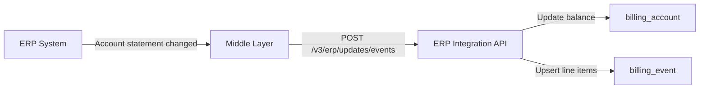

**What happens in the ERP:**
- Invoices are generated, payments are received, credits are issued, or the running balance changes
- Middle layer sends an account-statement payload containing the open balance (`sumItemsDue`) and an array of statement line items, each referencing the billing account

**What happens in epilot:**
- The [billing_account](/docs/entities/core-entities#billing_account) is updated with the new `balance`, `balance_decimal`, and `balance_currency`
- One [billing_event](/docs/entities/core-entities#billing_event) entity is upserted per line item, deduplicated by a deterministic `external_id` (commonly `<source>-<customerAccountId>-<date>`)
- Each event carries `direction` (`debit` for charges, `credit` for payments/credits), `booking_date`, `billing_amount` (in cents) and currency, and is linked back to the billing account

**Core Entities:** [`billing_event`](/docs/entities/core-entities#billing_event), [`billing_account`](/docs/entities/core-entities#billing_account)

**Typical fields mapped:** booking date, amount (cents and decimal), currency, direction (`debit`/`credit`), invoice/payment reference, contract relation, account balance

:::info
Stable, deterministic `external_id`s are critical here — the same statement may be re-sent multiple times and the toolkit relies on the `external_id` to deduplicate.
:::

---

### Sync Installment Schedule

Synchronize the upcoming installment plan (**Abschlagsplan**) — the schedule of planned debits the customer will be charged for budget billing.

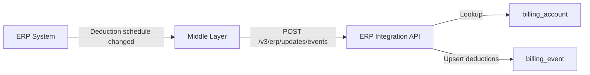

**What happens in the ERP:**
- The installment plan is created, recalculated (e.g. after a tariff or consumption change) or shifted in time
- Middle layer sends the full schedule as an array of `deductions` (date + amount + currency) referencing the billing account

**What happens in epilot:**
- Integration Toolkit looks up the [billing_account](/docs/entities/core-entities#billing_account) by external ID
- One [billing_event](/docs/entities/core-entities#billing_event) per scheduled deduction is upserted with `direction: "debit"`, a deterministic `external_id` (e.g. `DEDUCTION-<customerAccountId>-<date>`), `booking_date`, and `billing_amount`
- Subsequent recalculations re-upsert the same IDs so the schedule stays current

**Core Entities:** [`billing_event`](/docs/entities/core-entities#billing_event), [`billing_account`](/docs/entities/core-entities#billing_account)

**Typical fields mapped:** booking date, amount (cents and decimal), currency, `direction: "debit"`, billing account relation

:::tip
Treat the schedule as **declarative**: send the full forward-looking plan on every change rather than incremental diffs. Stable `external_id`s ensure superseded entries get overwritten in place.
:::

---

### Sync Portal User

Provision the [End Customer Portal](/docs/portals/customer-portal) login mapping when a portal user registers, signs in via SSO, or has their record changed.

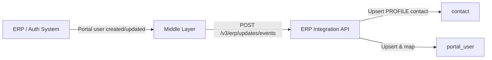

**What happens upstream:**
- A portal user is created on first registration, on SSO sign-in, or whenever the underlying user record (email, name) changes
- Middle layer sends a payload with the portal user's `identity_id`, email, name, and — when known — the linked business-partner / external contact ID

**What happens in epilot:**
- A `contact` tagged `PROFILE` is upserted from the payload (email, first/last name) keyed by `external_id`
- A [`portal_user`](/docs/entities/core-entities#portal_user) is upserted keyed by `external_id` (the `identity_id`) with `mapping_status: "Mapped"`, `registration_status: "Registered"`, `origin: "END_CUSTOMER_PORTAL"`, `source: "sso"`
- When an external contact ID is supplied, the `portal_user.mapped_contact` relation is set so the portal user resolves to the customer's business-partner contact

**Core Entities:** [`portal_user`](/docs/entities/core-entities#portal_user), [`contact`](/docs/entities/core-entities#contact)

**Typical unique identifier:** `identity_id` (the auth-system subject), persisted as `external_id` on the `portal_user`

**Typical fields mapped:** identity ID, email, first name, last name, mapping status, registration status, source, mapped-contact relation

:::info
This use case is typically combined with [Keep Customer In Sync](#keep-customer-in-sync) — that one creates the **business partner** contact, and this one creates the **profile** contact and the `portal_user` that links the two.
:::

---

## Outbound Use Cases (epilot to ERP)

Outbound use cases push epilot events to your ERP via [Webhooks](/docs/integrations/webhooks). When a user performs a self-service action in a portal, journey, or epilot 360, an automation triggers a [Core Event](/docs/integrations/core-events) which is delivered to your middle layer webhook endpoint. Your middle layer then processes the event and calls the appropriate ERP API.

### Submit Meter Reading

A portal user or service agent submits a new meter reading.

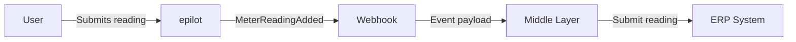

**What happens in epilot:**
- User submits a meter reading via the portal, a journey, or epilot 360
- Automation creates a `MeterReadingAdded` core event
- Webhook delivers the event payload to the middle layer, containing the meter identifier, reading value, and reading date

**What happens in the ERP:**
- Middle layer receives the webhook and extracts meter reading data
- Middle layer calls the ERP API to submit the reading (e.g., meter reading endpoint)
- Middle layer sends an [ACK](/docs/integrations/integration-toolkit/overview#monitoring-and-acks) back to epilot to confirm processing

**Core Event:** [`MeterReadingAdded`](/docs/integrations/core-events#MeterReadingAdded)

**Core Entities:** [`meter`](/docs/entities/core-entities#meter), [`meter_counter`](/docs/entities/core-entities#meter_counter)

**Typical payload fields:** identity ID, customer account ID, contract number, meter number, reading date, reason, counters (`number` + `value`)

---

### Submit Service Meter Reading

A service agent records a meter reading on behalf of a customer through a [ticket](/docs/entities/core-entities#ticket) (e.g. during a phone call or as part of a move-out workflow). Use this when the reading is captured against a service ticket rather than directly against a meter.

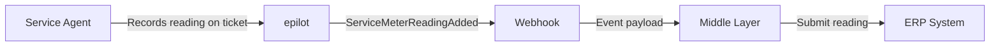

**What happens in epilot:**
- Service agent captures meter readings on a ticket entity (often via a workflow step)
- Automation creates a `ServiceMeterReadingAdded` core event with the ticket, contact, billing account, contract and meter context hydrated
- Webhook delivers the payload containing the meter number, reading date and counter values

**What happens in the ERP:**
- Middle layer receives the webhook, identifies the contract / meter via the context block (`identityId`, `customerAccountId`, `contractNumber`)
- Middle layer calls the ERP API to submit the reading with a service-agent reason code
- Middle layer sends an ACK back to epilot

**Core Event:** [`ServiceMeterReadingAdded`](/docs/integrations/core-events#ServiceMeterReadingAdded)

**Core Entities:** [`ticket`](/docs/entities/core-entities#ticket), [`meter`](/docs/entities/core-entities#meter), [`meter_counter`](/docs/entities/core-entities#meter_counter)

**Typical payload fields:** identity ID, customer account ID, contract number, meter number, reading date, reason / remark, counters

:::info
Most ERPs distinguish customer-self-reported readings from agent-captured readings via a "reason" code. The two events ([`MeterReadingAdded`](/docs/integrations/core-events#MeterReadingAdded) vs [`ServiceMeterReadingAdded`](/docs/integrations/core-events#ServiceMeterReadingAdded)) let your middle layer set the right code without parsing the source.
:::

---

### Submit New Order

A customer completes an acquisition journey (change-of-supplier, move-in, or rate change) and submits a new contract.

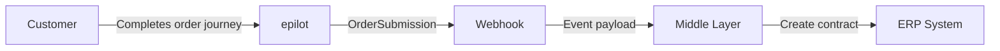

**What happens in epilot:**
- Customer completes a journey that yields an [order](/docs/entities/core-entities#order) entity with a chosen tariff [product](/docs/entities/core-entities#product), price, delivery and billing address, payment method and consents
- Automation creates an `OrderSubmission` core event hydrated with the order, contact, account and product
- Webhook delivers a normalised payload — including the supply-connection reason (`CHANGE_OF_SUPPLIER`, `MOVE_IN`, `RATE_CHANGE`), the target group (`PRIVATE_CUSTOMER` / `BUSINESS_CUSTOMER`) and the chosen payment method

**What happens in the ERP:**
- Middle layer receives the webhook and creates a new contract / sales order in the ERP
- Move-in or change-of-supplier specific data (move-in date, prior supplier, power-of-attorney, termination date) is forwarded as the ERP requires
- Middle layer sends an ACK back to epilot

**Core Event:** [`OrderSubmission`](/docs/integrations/core-events#OrderSubmission)

**Core Entities:** [`order`](/docs/entities/core-entities#order), [`contact`](/docs/entities/core-entities#contact), [`account`](/docs/entities/core-entities#account), [`product`](/docs/entities/core-entities#product), [`price`](/docs/entities/core-entities#price)

**Typical payload fields:** order number, order origin, product info (`productId`, `contractTermId`, `name`, sum), contract person (private/business), delivery address, payment method (cash or SEPA bank-account direct debit), supply-connection data (reason, meter number, malo ID, expected annual consumption, desired delivery date, move-in details), separate invoice address, approval flags

:::tip
The `reason` field carried in `supplyConnectionData` is the most important branching point in the receiving ERP — keep its mapping table close to the journey configuration (e.g. `Versorgerwechsel` → `CHANGE_OF_SUPPLIER`, `Umzug` → `MOVE_IN`, `Tarifwechsel` → `RATE_CHANGE`).
:::

---

### Switch Tariff

A customer requests a tariff or product switch on an existing contract from the portal, a service agent in 360, or a tariff-comparison journey.

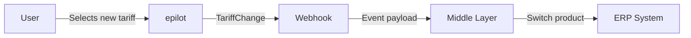

**What happens in epilot:**
- User selects a new tariff (a new [product](/docs/entities/core-entities#product) / [price](/docs/entities/core-entities#price)), producing an [order](/docs/entities/core-entities#order) linked to the existing contract
- Automation creates a `TariffChange` core event with the order, contract, billing account and contact context
- Webhook delivers the payload containing the new product and pricing summary

**What happens in the ERP:**
- Middle layer receives the webhook, locates the contract via `context.contractNumber` and `context.customerAccountId`
- Middle layer schedules the tariff switch in the ERP (often as a future-dated price/product change)
- Middle layer sends an ACK back to epilot

**Core Event:** [`TariffChange`](/docs/integrations/core-events#TariffChange)

**Core Entities:** [`order`](/docs/entities/core-entities#order), [`contract`](/docs/entities/core-entities#contract), [`product`](/docs/entities/core-entities#product), [`price`](/docs/entities/core-entities#price), [`billing_account`](/docs/entities/core-entities#billing_account)

**Typical payload fields:** identity ID, customer account ID, contract number, order number, product info (`productId`, `contractTermId`, `name`, gross/net/tax/currency/billing-period unit), approval flags

---

### Change Installment Amount

A portal user or service agent requests a change to the monthly installment (budget billing / Abschlag).

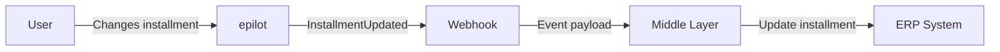

**What happens in epilot:**
- User requests an installment change via the portal or epilot 360
- Automation creates an `InstallmentUpdated` core event
- Webhook delivers the event payload containing the contract identifier and new installment amount

**What happens in the ERP:**
- Middle layer receives the webhook and extracts the installment change details
- Middle layer calls the ERP API to update the installment amount on the contract
- Middle layer sends an ACK back to epilot

**Core Event:** [`InstallmentUpdated`](/docs/integrations/core-events#InstallmentUpdated)

**Core Entities:** [`contract`](/docs/entities/core-entities#contract), [`billing_account`](/docs/entities/core-entities#billing_account)

**Typical payload fields:** identity ID, customer account ID, contract number, currency, new installment value (decimal), reason for the change

---

### Change Payment Method (SEPA/IBAN)

A portal user or service agent updates the bank account or SEPA mandate.

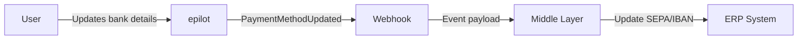

**What happens in epilot:**
- User submits new bank details via the portal, a journey, or epilot 360
- Automation creates a `PaymentMethodUpdated` core event
- Webhook delivers the event payload containing the billing account identifier and new bank details

**What happens in the ERP:**
- Middle layer receives the webhook and extracts bank account data
- Middle layer calls the ERP API to update the payment method
- Middle layer sends an ACK back to epilot

**Core Event:** [`PaymentMethodUpdated`](/docs/integrations/core-events#PaymentMethodUpdated)

**Core Entities:** [`billing_account`](/docs/entities/core-entities#billing_account), [`contact`](/docs/entities/core-entities#contact)

**Typical payload fields:** identity ID, customer account ID; on the hydrated billing account: payment method type (`payment_sepa` / `payment_invoice`), `_tags` (`DEBIT` / `CREDIT`), IBAN, BIC, account holder, bank name, SEPA mandate valid from, account valid from

:::tip
The outbound webhook only carries the context block (`identityId` + `customerAccountId`). The middle layer should re-fetch the billing account from epilot to read the new payment method — this avoids leaking unmasked IBANs through the webhook channel.
:::

:::info
Some ERPs distinguish between multiple bank account types: receivables (Forderung), credits (Guthaben), and combined. The `account_type` field identifies which bank account to update.
:::

---

### Change Billing Address

A portal user or service agent changes the billing address on a billing account.

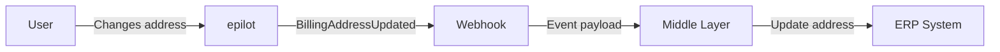

**What happens in epilot:**
- User submits a new billing address via the portal or epilot 360
- Automation creates a `BillingAddressUpdated` core event
- Webhook delivers the event payload containing the billing account identifier and new address

**What happens in the ERP:**
- Middle layer receives the webhook and extracts address data
- Middle layer calls the ERP API to update the billing address
- Middle layer sends an ACK back to epilot

**Core Event:** [`BillingAddressUpdated`](/docs/integrations/core-events#BillingAddressUpdated)

**Core Entities:** [`billing_account`](/docs/entities/core-entities#billing_account), [`contact`](/docs/entities/core-entities#contact)

**Typical payload fields:** identity ID, customer account ID, salutation, title, first/last name, name addition, address addition, company name, street, house number, ZIP, city, country, P.O. box

---

### Remove Billing Account Connection

A portal user removes the link between their portal login and a billing account (Vertragskonto) — for example after their access to that account has ended, or when they accidentally connected the wrong account.

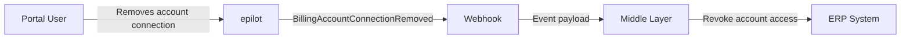

**What happens in epilot:**
- The portal user requests removal of a billing-account connection from their profile
- The [`portal_user`](/docs/entities/core-entities#portal_user) → billing-account link is removed in epilot
- Automation creates a `BillingAccountConnectionRemoved` core event with the billing-account context
- Webhook delivers the event payload containing the identity ID and customer account ID

**What happens in the ERP:**
- Middle layer receives the webhook and revokes the portal user's access to that contract account in the ERP / authorisation system
- Middle layer sends an ACK back to epilot

**Core Event:** [`BillingAccountConnectionRemoved`](/docs/integrations/core-events#BillingAccountConnectionRemoved)

**Core Entities:** [`billing_account`](/docs/entities/core-entities#billing_account), [`portal_user`](/docs/entities/core-entities#portal_user)

**Typical payload fields:** identity ID, customer account ID

:::info
The complementary "connect account" flow happens during portal onboarding (see [Sync Portal User](#sync-portal-user)) — this event covers the disconnect side only.
:::

---

### Update Customer Details

A portal user or service agent updates contact information (name, email, phone).

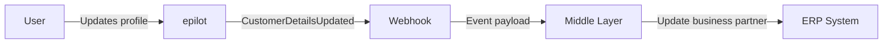

**What happens in epilot:**
- User updates their profile via the portal or a service agent edits the contact in epilot 360
- Automation creates a `CustomerDetailsUpdated` core event
- Webhook delivers the event payload containing the customer identifier and changed fields

**What happens in the ERP:**
- Middle layer receives the webhook and extracts the updated customer fields
- Middle layer calls the ERP API to update the business partner record
- Middle layer sends an ACK back to epilot

**Core Event:** [`CustomerDetailsUpdated`](/docs/integrations/core-events#CustomerDetailsUpdated)

**Core Entities:** [`contact`](/docs/entities/core-entities#contact)

**Typical payload fields:** identity ID, customer account ID, title, date of birth, phone, email

---

### Submit General Request

A customer or portal user submits a generic request through a contact form (e.g. "I want to report a name change", "I have a question about my invoice"). The request is captured as a [ticket](/docs/entities/core-entities#ticket) in epilot and forwarded to the ERP for processing.

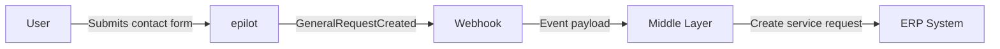

**What happens in epilot:**
- The user fills in a contact form on the portal or through a journey, producing a [ticket](/docs/entities/core-entities#ticket) entity
- Automation creates a `GeneralRequestCreated` core event hydrated with the ticket, contact and billing account context
- Webhook delivers the payload with the request type, free-text description, and identity context

**What happens in the ERP:**
- Middle layer receives the webhook and creates a corresponding service request / case in the ERP, routed by `requestTypeKey`
- Middle layer optionally sends a copy back to the customer (`sendAsCopy`) and includes the identity name for the agent
- Middle layer sends an ACK back to epilot

**Core Event:** [`GeneralRequestCreated`](/docs/integrations/core-events#GeneralRequestCreated)

**Core Entities:** [`ticket`](/docs/entities/core-entities#ticket), [`contact`](/docs/entities/core-entities#contact), [`billing_account`](/docs/entities/core-entities#billing_account)

**Typical payload fields:** identity ID, customer account ID, request type key, request text, send-as-copy flag, identity name

:::tip
Use a controlled vocabulary for `requestTypeKey` (e.g. `address-change`, `invoice-question`, `cancellation-question`) so the ERP can route requests to the right back-office team without parsing the free-text.
:::

---

### Request Data Sync

An epilot user or portal login triggers a request for the ERP to send fresh data to epilot. Use this for ERPs without event-driven sync, or to refresh stale data on demand.

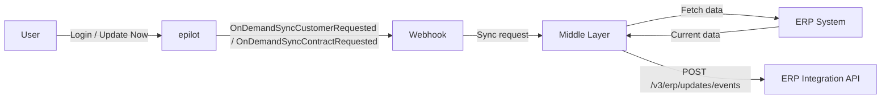

**What happens in epilot:**
- A service agent clicks "Update Now" in epilot 360, or a portal user logs in / opens a contract page
- Automation emits an `OnDemandSyncCustomerRequested` (whole-customer scope) or `OnDemandSyncContractRequested` (single-contract scope) core event
- Webhook delivers the event payload containing the customer / contract identifiers

**What happens in the ERP:**
- Middle layer receives the webhook and identifies what to sync
- Middle layer fetches current data from the ERP (contact details, contracts, meters, bank accounts, account statement)
- Middle layer sends the data back as inbound events to the Integration Toolkit `/v3/erp/updates/events` endpoint, reusing the existing inbound mappings

**Core Events:** [`OnDemandSyncCustomerRequested`](/docs/integrations/core-events#OnDemandSyncCustomerRequested), [`OnDemandSyncContractRequested`](/docs/integrations/core-events#OnDemandSyncContractRequested)

**Core Entities:** depends on the scope (typically [`contact`](/docs/entities/core-entities#contact), [`contract`](/docs/entities/core-entities#contract), [`billing_account`](/docs/entities/core-entities#billing_account), [`meter`](/docs/entities/core-entities#meter))

**Typical payload fields:** identity ID, customer number, billing account number, contract number (used by the middle layer to query the ERP)

:::tip
This pattern is the bridge for ERPs that do not push change events. The outbound on-demand event triggers the middle layer to pull from the ERP and push the result through the same inbound use cases as the event-driven flow — keeping mapping logic in one place.
:::

---

### Contract Move (Move-in / Move-out)

A customer submits a move request via a journey or portal.

```mermaid
flowchart LR
    U[User] -->|Submits move request| EP[epilot]
    EP -->|LocationMoveRequested| WH[Webhook]
    WH -->|Event payload| MW[Middle Layer]
    MW -->|Initiate move workflow| ERP[ERP System]
```

**What happens in epilot:**
- User completes a move-in/move-out journey
- Automation creates a `LocationMoveRequested` core event
- Webhook delivers the event payload containing customer details, old and new addresses, and meter information

**What happens in the ERP:**
- Middle layer receives the webhook and processes the move request
- Middle layer calls the ERP API to initiate the move workflow (terminate old contract, create new contract)
- Middle layer sends an ACK back to epilot

**Core Event:** [`LocationMoveRequested`](/docs/integrations/core-events#LocationMoveRequested)

**Core Entities:** [`ticket`](/docs/entities/core-entities#ticket), [`contact`](/docs/entities/core-entities#contact), [`contract`](/docs/entities/core-entities#contract), [`meter`](/docs/entities/core-entities#meter)

**Typical payload fields:** identity ID, customer account ID, point-of-consumption reference, move-out date, move-in date, new delivery address, closing meter readings (per meter, per counter), payment-data mode (`KEEP` / `NEW` + new bank account), invoice-address mode (`KEEP` / `NEW` + new address)

:::tip
Capture the move on a [ticket](/docs/entities/core-entities#ticket) entity in epilot so service agents can track it through workflow phases — the `LocationMoveRequested` event then carries the full ticket context (closing readings, new payment / invoice details) without extra round-trips.
:::

---

### Terminate Contract

A customer requests contract termination via a portal or journey.

```mermaid
flowchart LR
    U[User] -->|Requests cancellation| EP[epilot]
    EP -->|TerminateContractRequested| WH[Webhook]
    WH -->|Event payload| MW[Middle Layer]
    MW -->|Schedule termination| ERP[ERP System]
```

**What happens in epilot:**
- User submits a cancellation request
- Automation creates a `TerminateContractRequested` core event
- Webhook delivers the event payload containing the contract identifier and termination details

**What happens in the ERP:**
- Middle layer receives the webhook and processes the termination
- Middle layer calls the ERP API to schedule the contract termination
- Middle layer sends an ACK back to epilot

**Core Event:** [`TerminateContractRequested`](/docs/integrations/core-events#TerminateContractRequested)

**Core Entities:** [`ticket`](/docs/entities/core-entities#ticket), [`contract`](/docs/entities/core-entities#contract), [`contact`](/docs/entities/core-entities#contact)

**Typical payload fields:** identity ID, customer account ID, contract number, termination date, ordinary vs extraordinary flag, reason key, free-text reason for "other"

## ACK Tracking

All outbound use cases support [ACK tracking](/docs/integrations/integration-toolkit/overview#monitoring-and-acks). After processing a webhook, your middle layer should send an acknowledgment back to epilot:

```bash title="Send ACK"
curl -X POST 'https://erp-integration.sls.epilot.io/v1/erp/tracking/acknowledgement' \
  -H 'Content-Type: application/json' \
  -d '{
    "ack_id": "<ack-id-from-webhook-header>",
    "status": "processed"
  }'
```

This enables end-to-end monitoring in the Integration Hub: per-use-case status indicators show whether the ERP successfully processed each event.

## Next Steps

- [Inbound Getting Started](./inbound/getting-started.md) -- Set up your first inbound sync
- [Mapping Configuration](./inbound/mapping.md) -- Configure field mappings and JSONata transforms
- [Meter Readings](./inbound/meter-readings.md) -- Detailed guide for meter reading sync
- [Examples](./inbound/examples.md) -- Complete working examples
- [Mapping Examples](./mapping-examples.md) -- Open source example repo with TDD patterns
- [Core Entities](/docs/entities/core-entities) -- Entity schema reference
- [Core Events](/docs/integrations/core-events) -- Event schema reference
- [Webhooks](/docs/integrations/webhooks) -- Configure outbound event delivery
