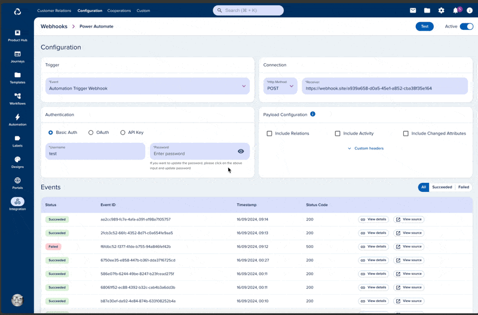

# Monitoring

[[API Docs](/api/webhooks#tag/event/operation/getEventById)]
[[SDK](https://www.npmjs.com/package/@epilot/webhooks-client)]

Every webhook request is logged as an **Event** with a success or failure status. View events in the **Webhook Events** section of each webhook configuration.

You can filter by status, inspect request details (payload, headers, response code), and replay any event. Replaying sends the same payload again and creates a new event record.

:::info
Events are retained for 4 weeks by default.
:::

This is useful for debugging — you can see the exact payload sent to your endpoint, the request origin, and the response status code without re-triggering the original event.

