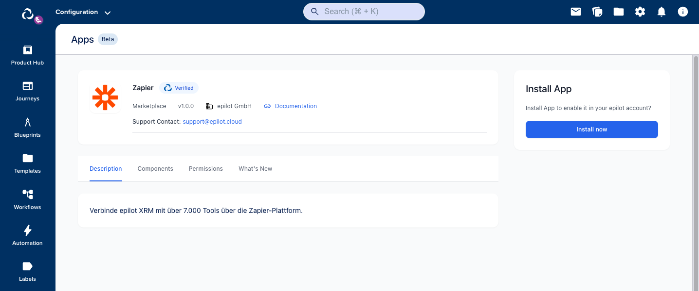
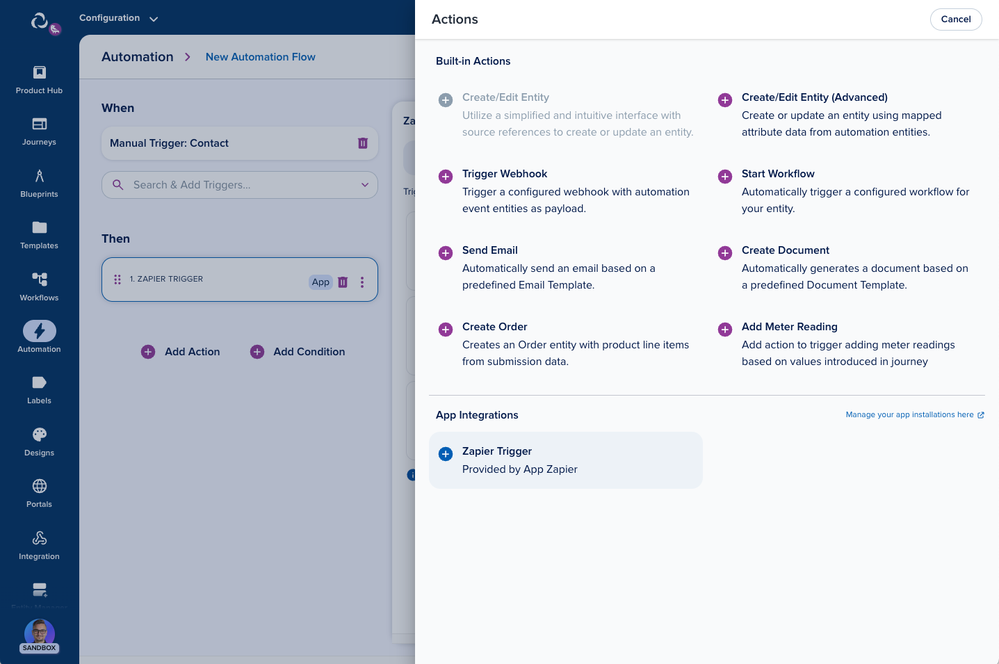
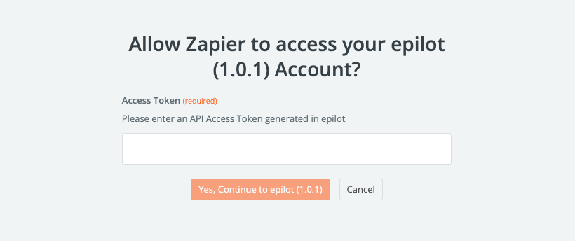
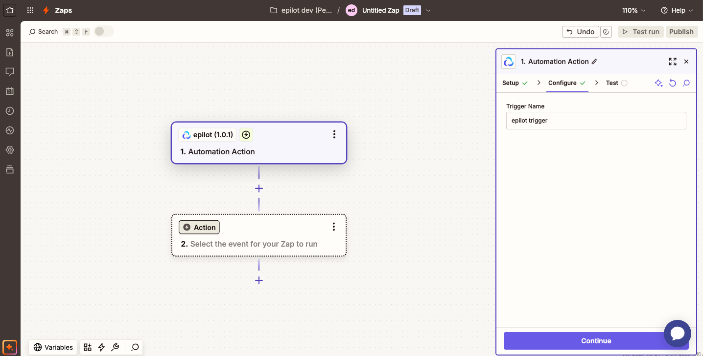
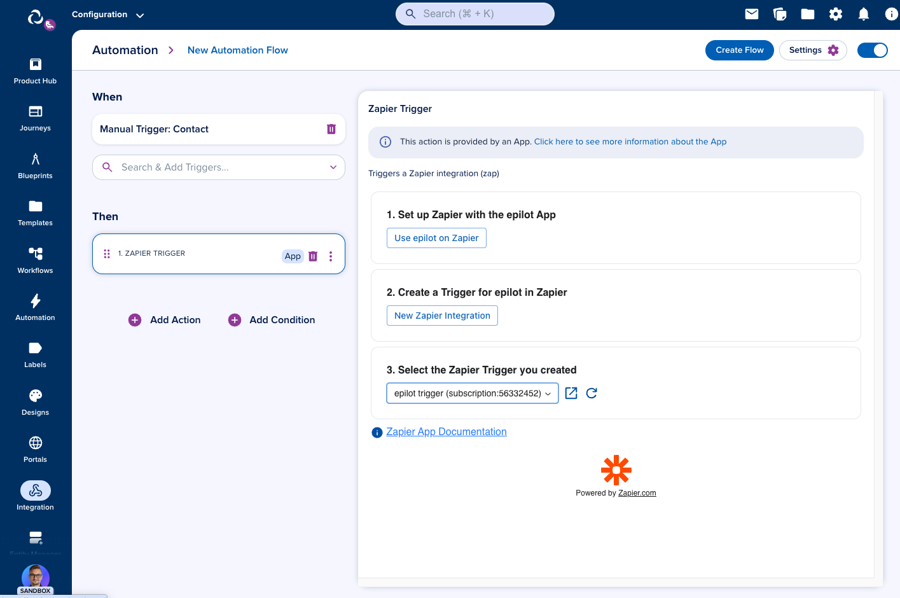
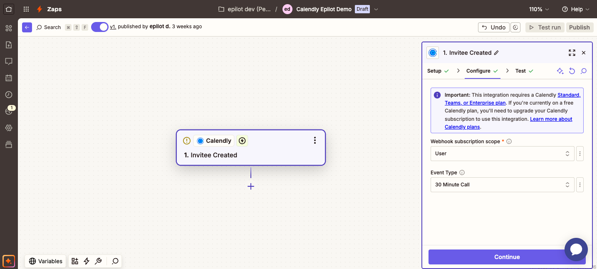
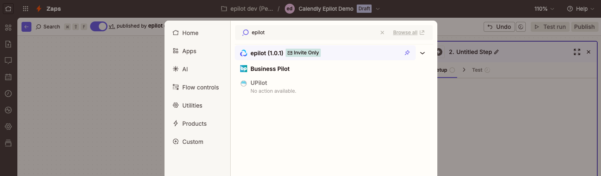
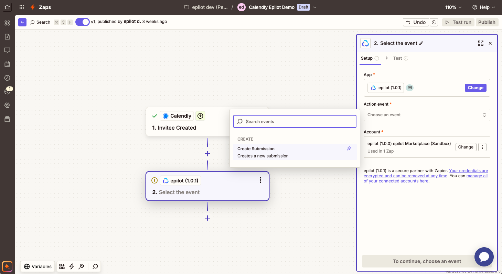
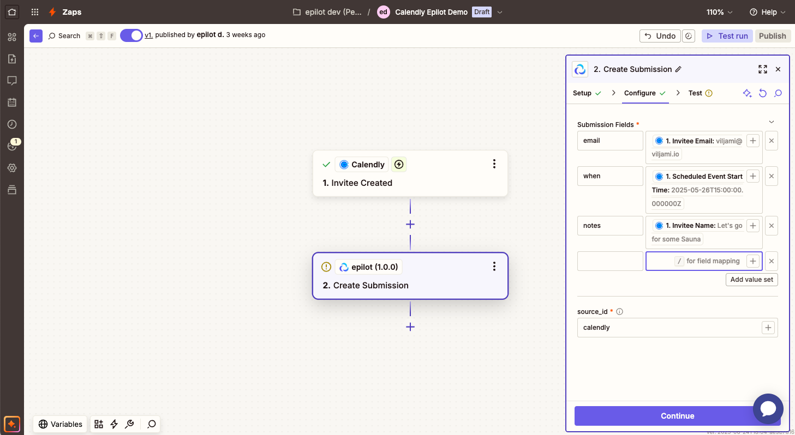
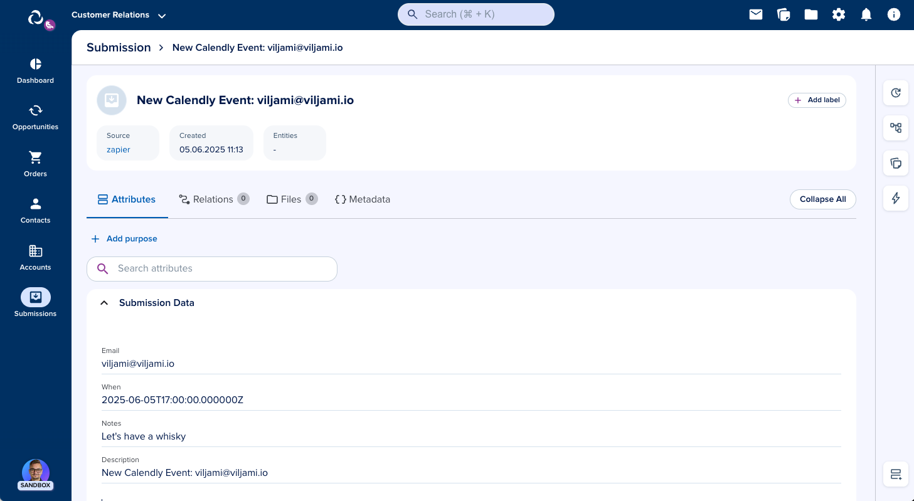

# Zapier Integration

:::info
Connect epilot to 7,000+ apps using [Zapier](https://zapier.com). Automate your workflows without writing code — send data into epilot or trigger external actions based on events inside epilot.
:::

:::note
To use the Zapier integration, you need:

- A [Zapier.com](https://zapier.com) account (free or paid)
- An [epilot Access Token](/docs/auth/access-tokens)

:::note

---

## Installing the Zapier App

### 1. Connect epilot to Zapier

Use [this invite link](https://zapier.com/developer/public-invite/224131/943ee60e5209137a26dfda91898237af/) to add the epilot app in your Zapier account. This only needs to be done once per Zapier account.

### 2. Install the Zapier App on epilot

To install the Zapier app on epilot, go to [Integrations > Apps](https://portal.epilot.cloud/app/apps) and search for "Zapier" on the Marketplace tab and click "Install now".

Follow the instructions on the [Zapier App Page](https://portal.epilot.cloud/app/apps/install/marketplace?appId=673a7330-7e2f-4b4b-835f-85a81b65b889) to install the app on your epilot organization. 

## Setting up an Automation to trigger Zapier (epilot → Zapier)

### 1. Create an Automation with the Zapier Action

To trigger Zapier integrations from epilot. Create a [new Automation](https://portal.epilot.cloud/app/automation-hub) and add a Zapier Trigger action to it.

### 2. Build Your First Zap

Create a new Zap in Zapier, choose the epilot app as your trigger. 

Hint: Use the [New Zapier Integration](https://zapier.com/webintent/create-zap?referrer=platform-visual-builder&steps%5B0%5D%5Btitle%5D=Test%20Zap%20for%20Automation%20Action%20Trigger%20from%20epilot%20Version%201.0.0&steps%5B0%5D%5Bapp%5D=App224131CLIAPI%401.0.0&steps%5B0%5D%5Btype%5D=read&steps%5B0%5D%5Baction%5D=automation_action) link on the automation configuration page to quickly set up a new Zap triggered by epilot.

### 3. Configure Trigger

In Zap editor, select the epilot trigger and choose *Select an account* to pick your epilot account or add a new one.

Paste your [epilot Access Token](https://portal.epilot.cloud/app/tokens) into the Access Token field and continue. This token will be used by Zapier to perform actions on epilot.

Name your trigger. Make sure to use a descriptive name that will help you identify your Zap in the Automation configuration.

### 4. Test the Trigger

Back in the Automation configuration, select the Zapier trigger you just created. Save the automation and test it by running it manually.

You can now continue on Zapier side to create your first Zap.

## Creating Submissions (Zapier → epilot)

### 1. Set up your Zap

Create a [new Zap](https://zapier.com/app/editor) triggered by one of the 7000+ available integrations in Zapier. 
This Zap will use the epilot Create Submission action.

For this example, we will use the [Zapier Calendly Integration](https://zapier.com/apps/calendly) to forward scheduled calls to epilot.

### 2. Add the epilot Create Submission Action

In the Zap editor, continue to add a new action. Search for "epilot" and choose the epilot app from the list.

Pick the "Create Submission" action event and continue.

### 3. Configure Submission Fields

Map fields from your Zap to Submission fields. These fields will be included in the epilot submission.

Define a `source_id` to track the origin of the submission. This will help you identify the origin of the submission in the epilot portal, and create further automations based on the `source_id`.

### 4. Test the Zap

Run your Zap or manually test the step. If the Zap is successful, you will see a new submission in the epilot portal with the source_id you defined.

