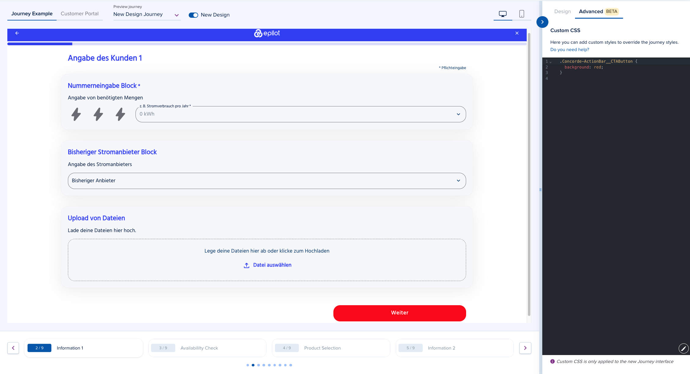

# Custom CSS

Custom CSS empowers you to personalize your journeys and branding beyond the standard Design Builder settings. Easily change the look and feel to match your brand and create engaging experiences for your end users. This guide will help you understand how to get started with the feature.



## Why use Custom CSS?

Custom CSS gives you the power to:

- **Enhance your journey's look to match your brand:** Customize buttons, inputs, links, cards, and more with your own CSS rules.
- **Apply detailed styling:** Make adjustments at a global theme level, journey level, step level, or even block level.
- **Stand out:** Create unique, visually appealing designs that resonate with your end customers.

**Note:** This feature is part of our new Concorde design migration. Custom CSS applies only to journeys (not the End Customer Portal). We’re continuously improving support for this feature, so refer to the latest release notes for newer updates.

**Pricing:** This feature is available exclusively from the Professional pricing plan.

## Styling Structure

### HTML Structure

The new journey design (Concorde Journey) consists of the following building blocks:

- **Layout:** Determines the journey structure. E.g., Stack, Two Columns, Grid (beta).
- **Steps:** Individual steps E.g., New Step, New Step 1, etc.
- **Blocks:** Journey blocks E.g., Text Input, Number Input, Products, etc.
- **Components:** Reusable components from our concorde component library - [concorde-elements](https://github.com/epilot-dev/concorde-elements) E.g., Autocomplete, Input, Switch, Radio, Checkbox, etc.

> **Technical Details:** The HTML classes and IDs used are prefixed with `Concorde` to ensure consistency. Refer to the [Concorde HTML Layout Overview](/docs/ui-design/concorde-html-structure) for a comprehensive list.

### Concorde Design Tokens

Customize your journey further using design tokens (CSS variables) that apply across all components:

> **Technical Details:** Supported design tokens can be modified to control various layouts, steps, blocks or components. See the [Concorde Design tokens](/docs/ui-design/concorde-design-tokens) guide for more information. This guide will be kept up to date to account for changes that could improve the usage of custom CSS.

## How Custom CSS Works

### CSS Structure Overview

When you add custom CSS using the Design Builder, a single stylesheet is generated and applied to your journey.

> **Technical Note:** Custom CSS is inserted as a `<style>` tag in your journey’s `<head>` with a unique ID, usually your journey ID (e.g., `custom-css-journey123`).

**Example of the CSS structure:**

```css
/* Custom CSS example */
:root {
  --concorde-primary-color: #005eb4;
  --concorde-secondary-color: #913997;
  /* ... other concorde design tokens ... */
}

/* Step CSS */
#Concorde-Step---123456789 {
  background-color: #f8f8f8;

  /* Block CSS */
  .Concorde-Image-Block {
    border-radius: 10px;
  }

  #Concorde-Block---123456789 {
    font-family: 'Helvetica, Arial, sans-serif';
  }
}
```

As seen above, there are some things to note:

- The use of **Concorde design tokens** is mentioned above. To view the full list: [Concorde Design tokens](/docs/ui-design/concorde-design-tokens).
- The use of maintained **HTML classes and IDs** is also mentioned above. To view the full list: [Concorde HTML Layout Overview](/docs/ui-design/concorde-html-structure).

## Unsupported Rules

To avoid modifying the core layout and overall security of the journey, support for certain CSS properties has been removed:

- **Certain position rules:** `position: relative;` and `position: absolute;`
- **Hiding elements completely:** `display: none;`

## How to Configure Custom CSS

1. **Open the Design Builder** Use the default journey or select your journey from the journey preview dropdown.
2. **Turn on the new design.** By default, this toggle is turned on. However, if you switch to a journey using the old design, you will need to turn it on to see the new design.
3. **Access the Advanced Configurator Panel.**
4. **Write or paste your CSS rules.** For example:

   ```css
   .Concorde-Button {
     background-color: red;
     color: #fff;
     border-radius: 4px;
   }
   ```

5. **Preview and Save:** Use the live preview to see changes as you type, then save your work.
6. **Test your live journey:** Open your journey in a new tab to confirm that the design looks as expected.

## Examples

### Increase Text Sizes

This snippet below will increase the font sizes of all elements on the journey using CSS variables (design tokens):

```css
:root {
  --concorde-text-3xl: 2.5rem;
  --concorde-text-2xl: 2rem;
  --concorde-text-xl: 1.875rem;
  --concorde-text-lg: 1.5rem;
  --concorde-text-base: 1.25rem;
  --concorde-text-sm: 1rem;
  --concorde-text-xs: 0.875rem;
}
```

### Change Header Logo alignment

This snippet below modifies the alignment of the logo in the header of a journey

```css
:root {
  --concorde-topbar-logo-alignment: flex-start; // Left alignment
  --concorde-topbar-logo-alignment: center; // Center alignment (default)
  --concorde-topbar-logo-alignment: flex-end; // Right alignment
}
```

### Make Header sticky

This snippet below makes the journey header stuck to the top of the page when scrolling

```css
.Concorde-Topbar {
  position: sticky;
  top: 0;
  z-index: 99999;
}
```

### Change All Buttons

This snippet below will affect all buttons on the journey using CSS variables (design tokens): IconButtons, Buttons

```css
:root {
  --concorde-button-label-color: red;
  --concorde-button-background-color: white;
  --concorde-button-hover-bg-color: gray;
}
```

### Change Primary Button Styles

This snippet below will only change the colors of Primary Buttons on the journey using the maintained class. E.g Next / Submit button / Product Promo button

```css
.Concorde-Button__Primary {
  color: red;
  background-color: white;

  &:hover {
    color: darkred;
    background-color: gray;
  }
}
```

### Change DatePicker Background


This snippet below will only change the background of the Datepicker on the journey using CSS variables

```css
:root {
  --concorde-datepicker-calendar-bg-color: gray;
}

/* OR */

.Concorde-DatePicker {
  .Concorde-DatePicker__Calendar {
    background-color: gray;
  }
}

/* OR */

/* Colored DatePicker */
.Concorde-DatePicker {
  --concorde-primary-color: white;
  .Concorde-DatePicker__Calendar {
    background-color: tomato;
  }
  .Concorde-DatePicker__Header-Button,
  .Concorde-DatePicker__Header-Icon-Button {
    color: white;
  }
}
```

### Change ZipCode Background in Availability Block


This snippet below will only change the background colors of the zip code dropdown in the Availability block on journeys

```css
.Concorde-AvailabilityCheck-Block {
  --concorde-menu-bg-color: rgb(230, 230, 230);
  --concorde-menu-item-hover-color: black;
  --concorde-menu-item-hover-bg-color: rgba(0, 0, 0, 0.3);
  --concorde-menu-item-selected-color: white;
  --concorde-menu-item-selected-bg-color: black;
}
```

### Change Text Color of Product Tile Features

The snippet will set the color of the text in all product tile features to the --concorde-secondary-text design token

```css
.Concorde-ProductTile__Features p {
  color: var(--concorde-secondary-text);
}
```

### Modify all Submit/Next Button or Back Buttons

```css
/* Submit/Next Button */
.Concorde-ActionBar__CTAButton {
  background: yellowgreen;
  &:hover {
    color: yellowgreen;
    background-color: gray;
  }
}

/* Back Button */
.Concorde-ActionBar__BackButton {
  color: yellowgreen;
  &:hover {
    color: white;
    background-color: gray;
  }
}
```

### Change the background of all Inputs


The snippet below will change the background of all inputs on the journey to white

```css
:root {
  --concorde-input-background-color: white;
}
```

### Change the background of Block Cards


The snippet will set the background color of journey blocks when placed on a card

```css
:root {
  --concorde-card-background-color: lightblue;
}

/* OR */

/* Remove the shadow of the card */
:root {
  --concorde-card-custom-shadow: none;
}
```

### Modify the Switch appearance (colors and border)

<div style={{display: 'flex', gap: '20px', marginBottom: '20px'}}>


</div>

The snippet below customizes the unchecked and checked state of a Concorde Switch used in the Binary Input block

```css
.Concorde-Switch {
  --concorde-switch-unchecked-color: gray;
  --concorde-switch-unchecked-background-color: rgba(56, 56, 56, 0.1);
  --concorde-switch-checked-color: red;
  --concorde-primary-color: red;

  .Concorde-Switch__Root {
    border: none;
  }
}
```

### Custom Input style


The snippet below changes the default state of the inputs on a journey to only have a bottom border and colored background

```css
.Concorde-Input {
  --concorde-input-border-radius: 0;

  fieldset {
    border-top: none;
    border-left: none;
    border-right: none;
    background-color: rgba(40, 40, 40, 0.05);
  }
}
```

### Custom Single Choice Button style


The snippet below ensures that the Single Choice buttons do not have background colors when hovered, and have no visible borders

```css
.Concorde-SingleChoice-Block {
  .Concorde-Button {
    --concorde-button-background-color: white;
    --concorde-button-label-color: black;
    --concorde-button-hover-bg-color: white;
    --concorde-button-active-bg-color: white;

    outline: none;
    border-color: transparent;

    &.Concorde-SingleChoice-Button__Selected {
      color: white;
      background: black;
    }
  }
}
```

### Custom Toggle Group style


The snippet below modifies the button group component used in the Personal Information / Contact / Account Blocks

```css
.Concorde-ToggleGroup {
  --concorde-button-label-color: black;
  --concorde-button-background-color: white;
  --concorde-button-hover-bg-color: white;
  --concorde-button-active-bg-color: white;

  .Concorde-ToggleGroupItem {
    border-width: 2px;
    --concorde-border-radius: 0;

    &[aria-checked='true'] {
      --concorde-button-label-color: white;
      --concorde-button-background-color: black;
      --concorde-button-hover-bg-color: black;
    }
  }
}
```

### Modify Headings style


The snippet below modifies the colors of the headings used on the journey

```css
/* Gradient titles */
.Concorde-Typography__Heading {
  background: linear-gradient(to left, blue 50%, red);
  -webkit-background-clip: text;
  color: transparent;
}

/* OR */

/* Change header colors */
:root {
  --concorde-accent-color: red;
}
```

### Fun journey background


The snippet below is an interesting example of what's possible with custom CSS. It creates a slanted background that fades into the journey content

```css
body {
  &::before {
    content: '';
    position: fixed;
    top: 0;
    left: 0;
    width: 100%;
    height: 100%;
    z-index: -1;

    background-color: oklch(from var(--concorde-primary-color) 0.7 0.15 h);

    clip-path: polygon(0 0, 100% 0, 160% calc(50% - 110px), 0px 430px);
  }
}
```

### Change Summary block background


The snippet below will change the background color of the Summary block on the journey

```css
:root {
  --concorde-summary-block-bg-color: rgba(240, 40, 40, 0.2);
}
```

### Modify the maximum width of the journey content


The snippet below will change the maximum width of the journey content to 600px

```css
:root {
  --concorde-custom-layout-max-width: 600px;
}
```

### Modify the ratio between the content and sidebar of Two Column Layout

The snippet below will change the ratio between the content and sidebar of Two Column Layout to 1:1.

```css
:root {
  --concorde-two-columns-content-width: 50%;
  --concorde-two-columns-sidebar-width: 50%;
}
```

### Use multiple fonts on a journey

To do this, you can either use a standard font (provided on the Design builder) or a custom font (that has been uploaded). To use a custom font, you can either upload it on the design builder or use a hosted font.

The former is visible only in the list of options in the Font selector, while the latter is visible in the Font selector and on the list of Fonts below the Fonts selector in the Design Builder.

The snippet below will use a standard and custom font (uploaded) on the Journey. Things to note:

- There is a difference between the two font urls below.
- The organization ID is used in the custom font URL. Replace `{ORGANIZATION_ID}` with your organization ID. Please contact support if you don't know your organization ID.

```css
/* Standard font */
@font-face {
  font-family: 'NotoSans-Regular';
  src: url('https://go.epilot.cloud/element-static/fonts/NotoSans-Regular.ttf');
  font-weight: normal;
  font-style: normal;
}

/* Custom font */
@font-face {
  font-family: 'TitilliumWeb-Bold';
  src: url('https://go.epilot.cloud/designs/{ORGANIZATION_ID}/font/TitilliumWeb-Bold.ttf');
  font-weight: normal;
  font-style: normal;
}

/* Examples of usages */
.Concorde-BlockHeading__Title {
  font-family: 'NotoSans-Regular', sans-serif;
}

.Concorde-BlockHeading__Title {
  font-family: 'TitilliumWeb-Bold', sans-serif;
}
```

## Guidelines and Best Practices

- Use Supported Classes: We provide a public list of supported class names for components, blocks, steps and layouts (e.g., `Concorde-Button`, `Concorde-Link`, `Concorde-Topbar`). Please use these classes to ensure long-term compatibility - [Concorde HTML Layout Overview](/docs/ui-design/concorde-html-structure). However, feel free to write any rules you need.
- Design Tokens (CSS Variables): Leverage our design tokens (CSS variables) to keep your custom styles consistent with your global theme. (e.g., `var(--concorde-primary-color)`). The comprehensive list of design tokens can be found in the [Concorde Design tokens](/docs/ui-design/concorde-design-tokens) and contain all tokens with adequate descriptions.
- Avoid Overriding Core Layouts: For stability, avoid using properties that could break the layout (e.g., `display`, `position`) or `!important`.
- Keep It Concise: This helps maintain performance and manageability.
- Test Your CSS: Always preview your changes to avoid conflicts. Errors will be highlighted so you can correct them before saving.

## FAQs

**Q: How does this differ from the current Custom theme editor?**  
**A:** The Custom theme editor is connected to the Material UI theme which we used to style the old journeys, while Custom CSS is purely CSS. Custom CSS overrides every theme setting and is only available for journeys using the new design.

**Q: What happens if my journey is using the old design with a custom theme?**  
**A:** Custom CSS isn’t applied to journeys using the old design. That’s because the old Custom Theme Editor isn’t compatible with the new design system (Concorde).

To ensure some level of backward compatibility, a few custom theme properties are still supported in the new design. However, not all customizations can be carried over. This is where Custom CSS comes in—to help bridge those gaps during migration.

We’ve started supporting this migration process and recommend moving your journeys to the new design. Use Custom CSS to style them going forward.
**Please note: support for the Custom Theme Editor will be phased out in the future.**

**Q: Will my custom CSS changes be maintained with future updates?**  
**A:** Custom CSS rules will remain effective as long as you adhere to the supported class and variable guidelines. We are committed to maintaining backward compatibility, but changes to the core design may require adjustments. We will communicate any necessary changes in advance.

**Q: (Advanced) What if I want to apply changes only to a specific journey?**  
**A:** It is currently possible to apply styles that apply to a specific step or block in a journey by using the HTML id selectors to target sections on a journey. Review the [Concorde HTML Layout Overview](/docs/ui-design/concorde-html-structure) to understand how to find these IDs. This ensures your styles won’t affect other journeys. We strongly recommend you use HTML id selectors as little as possible to avoid conflicts across multiple journeys.

```css
#Concorde-Step---123456789 {
  background-color: #f0f0f0;
}

#Concorde-Block---987654321 {
  border: 2px solid var(--concorde-secondary-color);
}
```

**Q: Can I get help if my CSS isn’t working as expected?**  
**A:** Yes! Our support team is available to help you.

## Conclusion

With the ability to apply global, journey, step, and block-level styles, you have the flexibility to fully control your design without compromising the integrity of the base system.

For further questions or feedback, please reach out to our support team.

Further reading:

- [Concorde Design tokens](/docs/ui-design/concorde-design-tokens)
- [Concorde HTML Layout Overview](/docs/ui-design/concorde-html-structure)
