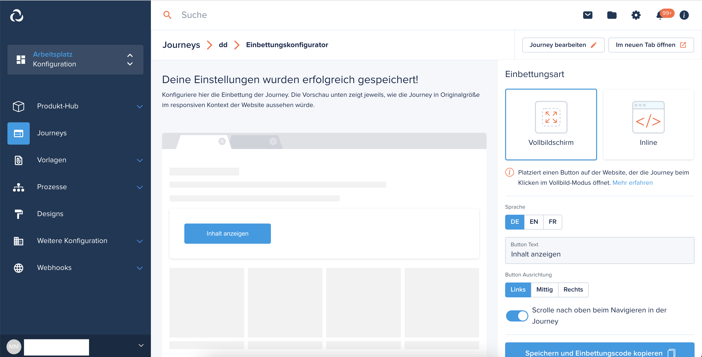
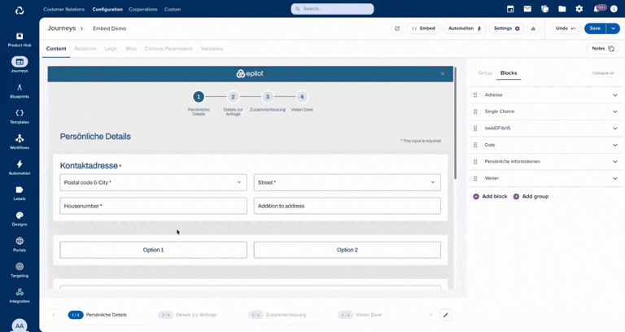
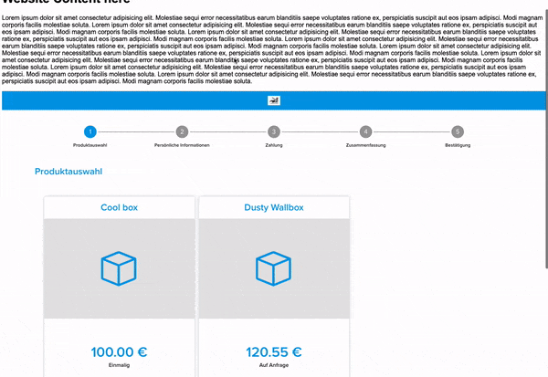

# Embedding Journeys

Embed any epilot journey on your website using a script tag. The embed script loads the journey by its ID and renders it in an iframe on your page.

This guide covers all available embedding options and the `__epilot` JavaScript API for advanced customization.

:::info Legacy embed flow

This page documents the original `__epilot` iframe script. All new integrations should use the [Journey Embed SDK](/docs/journeys/sdk), which rewrites the iframe engine and adds support for the [`<epilot-journey>`](/docs/journeys/web-components) Web Component behind a single API.

Existing embeds continue to work. For new projects, start with the SDK.

:::

## Embed Configurator

Configure and copy the embed script via the Journey Builder's Embed Configurator after saving your journey. Options include:

- **Display mode** — full-screen overlay or inline on your website (Default: Fullscreen)
- **Language** (Default: German DE)
- **Button label** — the text on the button that opens the journey (Default: Inhalt anzeigen)
- **Button alignment** — left, right, or center (Default: Left)
- **Scroll to top** — scrolls to the top of the journey when the user navigates to a new step (Default: ON)

Additional settings are available depending on the embedding type.



## Journey Data Injection

The embed script can modify the initial state of a journey. You can:

1. **Prefill data** — set initial values for journey blocks.
2. **Start from a specific step** — skip earlier steps (e.g., when product selection happens on an external website).
3. **Control field display** — disable specific fields.

The `DataInjectionOptions` type below defines all available options. See the [Embed Script examples](https://github.com/epilot-dev/epilot-journey-sdk/tree/main/examples/embed-script) for working code.

**Type Definition**

```typescript title="DataInjectionOptions"
export type DataInjectionOptions = {
  /** the stable id of the step to start the journey from. aka, where to start the journey from (recommended) */
  initialStepId?: string
  /**
   * the initial step index of the journey.
   * @deprecated legacy alternative to initialStepId; the 0-based index shifts when steps are reordered
   */
  initialStepIndex?: number
  /**
   * the initial state of the journey. aka, what data to prefill the journey with.
   * Read section below to understand how to populate this. Two forms are supported:
   * - recommended: an object keyed by the block's stable, journey-wide id -> block value
   * - deprecated (legacy): an array indexed by step position, each entry keyed by block name
   * */
  initialState?:
    | Record<string, Record<string, unknown>>
    | Record<string, unknown>[]
  /** the display options to be passed to the journey, for now it is used to disable some fields */
  blocksDisplaySettings?: BlockDisplaySetting[]
}

export type BlockDisplaySetting = {
  type: 'DISABLED'
  /** the stable, journey-wide id of the block to target (recommended) */
  blockId?: string
  /** @deprecated legacy alternative to blockId; the block name breaks silently when the block is renamed */
  blockName?: string
  /** @deprecated legacy alternative to blockId; the 0-based step index shifts when steps are reordered */
  stepIndex?: number
  blockFields?: string[]
}
```

The **recommended** form keys `initialState` by **block ID** — the block's stable, journey-wide identifier. Block IDs are unique across the whole journey and are unaffected by block renames or by reordering steps, so an embed keyed by block ID keeps working even after the journey is restructured. To find a block's ID, open the block configurator in the Journey builder.

A complete example combines all three: start the journey at a step by its stable `initialStepId`, prefill `initialState` keyed by block ID, and disable a block by `blockId`. Pass `dataInjectionOptions` alongside the rest of the options in `__epilot.init()`:

```typescript title="Init with data injection by block ID"
__epilot.init([
  {
    journeyId: '123',
    mode: 'full-screen',
    dataInjectionOptions: {
      initialStepId: 'f0e1d2c3-b4a5-6789-0abc-def012345678',
      initialState: {
        'b1f2c3d4-5e6f-7a8b-9c0d-1e2f3a4b5c6d': { city: 'Berlin' },
      },
      blocksDisplaySettings: [
        {
          type: 'DISABLED',
          blockId: 'b1f2c3d4-5e6f-7a8b-9c0d-1e2f3a4b5c6d',
          blockFields: ['city'],
        },
      ],
    },
  },
])
```

With the block-ID form you only list the blocks you actually want to prefill — there is no need to pad earlier steps with empty objects, and the mapping is unaffected by block renames or step reordering. To find a block's ID, open the block configurator in the Journey builder.

### Data Injection builder (preview)

You don't have to hand-write block IDs. The Journey Builder includes a **Data Injection (preview)** tool that lets you build the configuration visually: pick the blocks and fields to prefill, set their pre-fill values, mark blocks as read-only, choose the starting step, then copy the generated snippet straight into your `__epilot.init()` call.



:::note Legacy step-index form (deprecated)

The earlier array form of `initialState` (one entry per step indexed by **step position**, keyed by block **name**, with empty `{}` objects for steps you don't prefill) and the `blockName` + `stepIndex` form of `blocksDisplaySettings` are **deprecated but still supported** for backward compatibility. They break silently when blocks are renamed or steps are reordered, so prefer the block-ID form for new integrations.

```typescript title="Injecting data by step index + block name (deprecated)"
initialState: [
  {},
  {
    'Binary Input': false,
  },
  {
    'Personal Data Input': {
      salutation: 'Ms. / Mrs.',
      firstName: 'Test Name',
      _isValid: false,
    },
  },
]
```

Open your Journey in **debug mode** from the Journey Builder and inspect the state for each step. See below:


:::

## Configuration Possibilities

For more advanced configuration options, you can modify the embed script yourself, as it adds an interface to your website to interact with the journey: `__epilot`
Below are all available configuration options.

### init

**Description**  
Used to initialize one or more journeys given individual options. Multiple Journeys with different configurations can be passed

**Type Definition**

```typescript
type Init = (options?: OptionsInit[] | undefined, initOnLoad?: boolean) => void
type JourneyMode = 'inline' | 'full-screen'

type OptionsInit = {
  /** id of the journey to initialise (load configuration) */
  journeyId: string
  /** url to override iframe src */
  journeyUrl?: string
  /** mode the journey runs in -> inline | full-screen */
  mode: JourneyMode
  /** the minimum height the journey runs in when in inline mode */
  minHeight?: string
  /**
   * whether to show or hide the topBar
   * @default true
   */
  topBar?: boolean
  /**
   * whether to scroll to the top after step navigation
   * @default true
   */
  scrollToTop?: boolean
  /**
   * whether to show the closeButton if in inline mode
   * @default true
   */
  closeButton?: boolean
  /** additional data passed to the journey + submission */
  contextData?: Record<string, unknown>
  /** the language the journey should be initialised in */
  lang?: string
  /** the data injext options that will be passed to the journey */
  dataInjectionOptions?: DataInjectionOptions
  /**
   * Used as iframe name/title attribute if provided
   */
  name?: string
}
```

**Usage**

```typescript
__epilot.init([{ journeyId: '123', mode: 'full-screen', topBar: false }])
```

To prefill data, pass `dataInjectionOptions` keyed by block ID alongside the rest of the options. See [Journey Data Injection](#journey-data-injection) for the full example and option reference.

### update

**Description**  
Used to update an initialized journey by passed options.

**Type Definition**

```typescript
type Update = (journeyId: string, payload?: OptionsUpdate) => void
type OptionsUpdate = Omit<OptionsInit, 'journeyId'>
```

**Usage**

The update method updates a journey's embed configuration.  
Note: This does not update the initial state set by `dataInjectionOptions`.

```typescript
__epilot.update('123', { journeyId: '123', mode: 'full-screen', topBar: false })
```

### on

**Description**  
Sets up an event listener to execute custom logic based on journey events.

**Uses cases:**

- Execute logging, or tracking
- Adjust website CSS, e.g. if full screen exited

**Type Definition**

```typescript
type JourneyEvent =
  | 'init'
  | 'enterFullScreen'
  | 'exitFullScreen'
  | 'closeJourney'

type On = (
  eventName: JourneyEvent,
  cb: (payload: Record<string, unknown>, event: CustomEvent) => void
) => void
```

**Usage**

```typescript
__epilot.on('init', function ({ journeys }) {
  console.log('Journey Initialized')
})
```

### enterFullScreen

**Description**  
If a journey is initialized in full-screen mode, executes the command to open the journey.

**Type Definition**

```typescript
type EnterFullScreen = (
  journeyId: string,
  payload?: Record<string, unknown> | undefined
) => void
```

**Usage**

```typescript
__epilot.enterFullScreen('123')
```

### exitFullScreen

**Description**  
If a journey is in full-screen mode, executes the command to close the journey. It is also internally used at the Journeys “Close button”.

**Type Definition**

```typescript
type ExitFullScreen = (
  journeyId: string,
  payload?: Record<string, unknown> | undefined
) => void
```

**Usage**

```typescript
__epilot.exitFullScreen('123')
```

### isInitialized

**Description**  
Checks whether a journey is already initialized.

**Type Definition**

```typescript
type IsInitialized = (journeyId: string) => boolean
```

**Usage**

```typescript
if (__epilot.isInitialized('123') === true) {
  __epilot.enterFullScreen('123')
}
```

## Scenarios

### Full-Screen

The default embed method covers most of the use cases. A button will be placed on your website which opens the journey, covering the complete screen when clicked.

**Code Snippet**  
The below code snippet provides the configured embed script and a button opening the journey when clicked. Don’t forget to change the placeholder ids to your own journey ids!

```html title="Full-screen embed"
<!-- Clicking this button will open your Journey -->
<button onclick="__epilot.enterFullScreen('<your-journey-id>')">
  Open Journey
</button>

<!-- Embed script managing your Journey -->
<script
  data-ep-mode="full-screen"
  data-ep-journeyIds="<your-journey-id>"
  src="https://embed.journey.epilot.io/bundle.js"
></script>
```

**Attributes explained**  
`data-ep-mode` — sets the mode the journey runs in
`data-ep-journeyIds` — the journey to load by its ID

**Outcome**


### Inline

This method will place the journey into a provided container element, or, if not provided, at the end of the web page. The height of the journey will automatically be recalculated based on the current content. In order to provide a better user experience, navigating to a different step will cause the browser to move back to the top position of the journey. The close button of the top bar is hidden.

**Code Snippet**  
The below code snippet provides the configured embed script required to set up the inline mode and a container where the journey is being placed in. Don’t forget to change the placeholder ids to your own journey ids!

```html title="Inline embed"
<!-- Your Journey will go into this container -->
<div id="epilot-journey-<your-journey-id>"></div>

<!-- Embed script managing your Journey -->
<script
  data-ep-mode="inline"
  data-ep-journeyIds="<your-journey-id>"
  src="https://embed.journey.epilot.io/bundle.js"
></script>
```

**Attributes explained**  
`data-ep-mode` - sets the mode the journey runs in
`data-ep-journeyIds` — the journey to load by its ID

**Outcome**



### Multiple Journeys

The best way to embed multiple journeys is to use the `__epilot` interface described [here](#init). Simply pass multiple items to the `init` function

**Code Snippet**

```html title="Multiple journeys embed"
<button onclick="__epilot.enterFullScreen('<your-journey-id-1>')">
  Open Journey
</button>
<button onclick="__epilot.enterFullScreen('<your-journey-id-2>')">
  Open Journey
</button>
<script src="https://embed.journey.epilot.io/bundle.js"></script>
<script>
  __epilot.init([
    { journeyId: '<your-journey-id-1>', mode: 'full-screen' },
    { journeyId: '<your-journey-id-2>', mode: 'full-screen' },
  ])
</script>
```

**Attributes explained**  
In this example, no `data-ep-` attributes are needed because the `__epilot.init()` API handles configuration directly.

**Outcome**


## Recommended: Journey Embed SDK

For new integrations, use the [Journey Embed SDK](/docs/journeys/sdk). It replaces the legacy `__epilot` script documented on this page with a unified JavaScript API that covers both:

- A **rewritten iframe engine** — same embedding model, faster and cleaner than the legacy bundle.
- The [`<epilot-journey>` Web Component](/docs/journeys/web-components) — renders directly in your page using Shadow DOM for better performance, accessibility, and tighter host integration.

See the [SDK documentation](/docs/journeys/sdk) for setup, the full API reference, and a migration guide from `__epilot.init()`.

## Changelog

### 2026-06-11

- Data injection now documents stable **block IDs** as the recommended form: `initialState` keyed by block ID, `initialStepId` for the starting step, and `blocksDisplaySettings` targeting blocks by `blockId`. Block IDs are unique journey-wide and resilient to block renames and step reordering. The legacy step-index + block-name forms remain supported but are deprecated.
