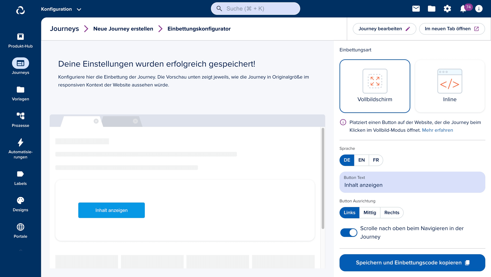

# Embedding Journeys

Journeys can easily be embedded on any website by placing an embed script tag provided by epilot on your website, and then optionally customizing it for advanced use.

## Embed Script

An embed script is a simple way to publish an epilot journey on your website. The script loads the journey using a Journey ID and a secure token to embed the journey securely on your website.

This page guides you through the different options available to embed a Journey into your web page. 

## Embed Configurator
Configure and copy the embed script via the Journey Builders' Embed Configurator after saving the Journey. You can choose whether the Journey should be shown in a full-screen overlay, or inline to your website.

Depending on the embedding type, you can change additional settings.



## Configuration Possibilities
For more advanced configuration options, you can modify the embed script yourself, as it adds an interface to your website to interact with the journey: `__epilot`
Below we explain all possibile configuration options

### init
**Description**  
Used to initialize one or more journeys given individual options. Multiple Journeys with different configurations can be passed

**Type Definition**
```typescript
type Init = (options?: OptionsInit[] | undefined, initOnLoad?: boolean) => void
type JourneyMode = 'inline' | 'full-screen'

type OptionsInit = {
  /** id of the journey to initialise (load configuration) */
  journeyId: string
  /** url to override iframe src */
  journeyUrl?: string
  /** mode the journey runs in -> inline | full-screen */
  mode: JourneyMode
  /** the minimum height the journey runs in when in inline mode */
  minHeight?: string
  /**
   * whether to show or hide the topBar
   * @default true
   */
  topBar?: boolean
  /**
   * whether to scroll to the top after step navigation
   * @default true
   */
  scrollToTop?: boolean
  /**
   * whether to show the closeButton if in inline mode
   * @default true
   */
  closeButton?: boolean
  /** additional data passed to the journey + submission */
  contextData?: Record<string, unknown>
  /** the language the journey should be initialised in */
  lang?: string
}
```

**Usage**
```typescript
__epilot.init([
  { journeyId: '123', mode: 'full-screen', topBar: false }
])
```

### update
**Description**  
Used to update an initialized journey by passed options.


**Type Definition**
```typescript
type Update = (journeyId: string, payload?: OptionsUpdate) => void
type OptionsUpdate = Omit<OptionsInit, 'journeyId'>
```

**Usage**
```typescript
__epilot.update("123", { journeyId: '123', mode: 'full-screen', topBar: false })
```


### on
**Description**  
Sets up an event listener to execute custom logic based on journey events.

**Uses cases:**
- Execute logging, or tracking
- Adjust website CSS, e.g. if full screen exited

**Type Definition**
```typescript
type JourneyEvent =
  | 'init'
  | 'enterFullScreen'
  | 'exitFullScreen'
  | 'closeJourney'
  | 'formChange'

type On = (eventName: JourneyEvent, cb: (payload: Record<string, unknown>, event: CustomEvent) => void) => void  
```

**Usage**
```typescript
__epilot.on('init', function({ journeys }) {
  console.log("Journey Initialized")  
})
```

### enterFullScreen
**Description**  
If a journey is initialized in full-screen mode, executes the command to open the journey.


**Type Definition**
```typescript
type EnterFullScreen = (journeyId: string, payload?: Record<string, unknown> | undefined) => void
```

**Usage**
```typescript
__epilot.enterFullScreen("123")
```


### exitFullScreen
**Description**  
If a journey is in full-screen mode, executes the command to close the journey. It is also internally used at the Journeys “Close button”. 

**Type Definition**
```typescript
type ExitFullScreen = (journeyId: string, payload?: Record<string, unknown> | undefined) => void
```

**Usage**
```typescript
__epilot.exitFullScreen("123")
```

### isInitialized
**Description**  
Checks whether a journey is initialized already initialized or not.

**Type Definition**
```typescript
type IsInitialized = (journeyId: string) => boolean
```

**Usage**
```typescript
if(__epilot.isInitialized('123') === true) {
   __epilot.enterFullScreen('123')
}
```
## Scenarios
### Full-Screen
The default embed method covers most of the use cases. A button will be placed on your website which opens the journey, covering the complete screen when clicked.

**Code Snippet**  
The below code snippet provides the configured embed script and a button opening the journey when clicked. Don’t forget to change the placeholder ids to your own journey ids!

```html
<!-- Clicking this button will open your Journey -->
<button onclick="__epilot.enterFullScreen('<your-journey-id>')">Open Journey</button>

<!-- Embed script managing your Journey -->
<script data-ep-mode="full-screen" data-ep-journeyIds="<your-journey-id>" src="https://embed.journey.epilot.io/bundle.js"></script>
```

**Attributes explained**  
`data-ep-mode` - sets the mode the journey runs in  
`data-ep-journeyIds` the journey to be created via it’s id

**Outcome**  


### Inline
This method will place the journey into a provided container element, or, if not provided, at the end of the web page. The height of the journey will automatically be recalculated based on the current content. In order to provide a better user experience, navigating to a different step will cause the browser to move back to the top position of the journey. The close button of the top bar is hidden.

**Code Snippet**  
The below code snippet provides the configured embed script required to set up the inline mode and a container where the journey is being placed in. Don’t forget to change the placeholder ids to your own journey ids!

```html
<!-- Your Journey will go into this container -->
<div id="epilot-journey-<your-journey-id>"></div>

<!-- Embed script managing your Journey -->
<script data-ep-mode="inline" data-journeyIds="<your-journey-id>" src="https://embed.journey.epilot.io/bundle.js"></script>
```

**Attributes explained**  
`data-ep-mode` - sets the mode the journey runs in
`data-ep-journeyIds` the journey to be created via it’s id

**Outcome**  


### Multiple Journeys
The best way to embed multiple journeys is to use the `__epilot` interface described [here](#init). Simply pass multiple items to the `init` function

**Code Snippet**  
```html
<button onclick="__epilot.enterFullScreen('<your-journey-id-1>')">Open Journey</button>
<button onclick="__epilot.enterFullScreen('<your-journey-id-2>')">Open Journey</button>
<script src="https://embed.journey.epilot.io/bundle.js"></script>
<script>
__epilot.init([
    {
         { journeyId: '<your-journey-id-1>', mode: 'full-screen' },
         { journeyId: '<your-journey-id-2>', mode: 'full-screen' },
    }
])
</script>
```

**Attributes explained**  
In this example, we dont need any `data-ep-` attributes, as we use the `__epilot` interface to initialize the Journeys

**Outcome**  


