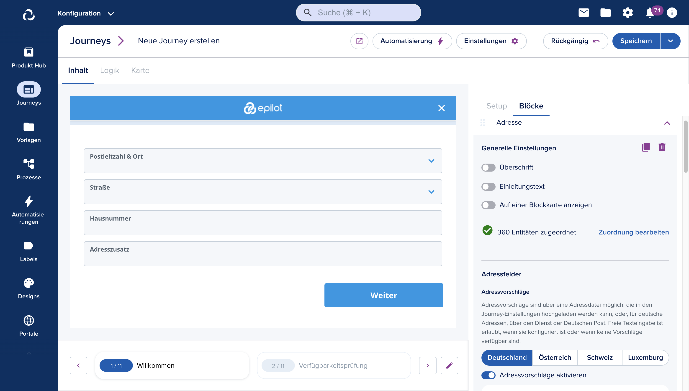

# Journey Builder

[[API Docs](/api/journey)]

The Journey Builder is a WYSIWYG editor for creating end-customer and partner journeys. Build and edit journeys using _Steps_ and _Blocks_.

## Embedding Journeys

Journeys can be shared within the epilot portal or embedded on third-party websites using a script snippet. Generate embed snippets directly from the Journey Builder:

## Journey Submissions

Completed journeys create [Submission entities](/docs/journeys/submissions) containing the collected data.

[Automation](/docs/automation/automation-flows) and [Entity Mapping](/docs/automation/entity-mapping) then process submissions into business entities like Contacts, Opportunities, and Orders. The Journey Builder includes templates and default configurations for common post-journey automations.
