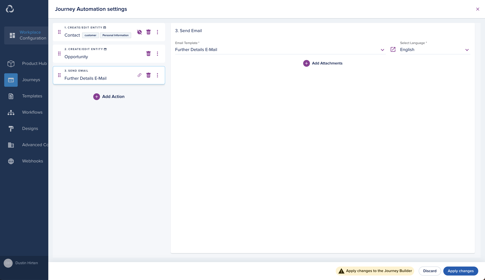
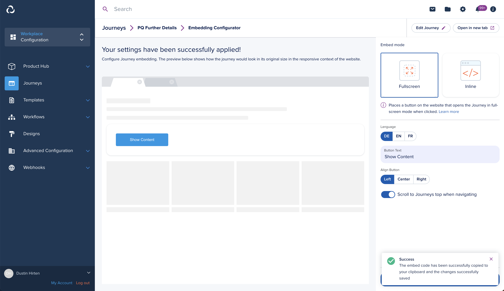
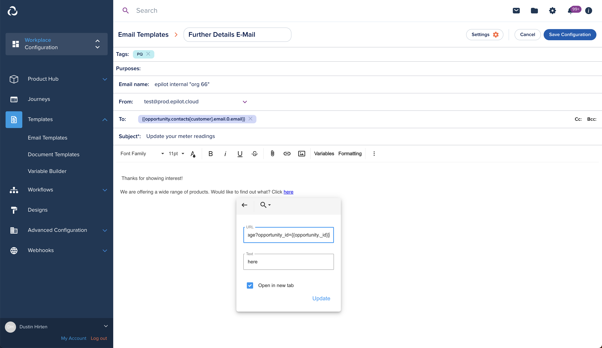

# Post Qualification Journey
## What is a post qualification journey?
A post qualification journey comes in combination with another journey. Journey 1 collects the lead - e.g. contact info & product interest. The second Journey collects additional information about lead - e.g. roof details. An email is sent to any Contact of Journey 1 via link in email as part of the Journeys Automation.

It works by passing and processing a query parameter `opportunity_id` to the the post qualification journey (2nd). Doing so, will update the opportunity created by Journey 1.

**Submission Behavior:**

Journey 1

- create Contact
- create Opportunity

Journey 2

- update Opportunity created by Journey 1

## Steps
The further sections describe the process of how to achieve the above mentioned submission behavior

### Configure Journey 1
Configure this journey meeting your companies requirements. It just needs to create an Opportunity. You can check that by looking into the respective Automation from the Journey-Builder.

The Journeys automation is already prepared to accept and process the previously described parameter `opportunity_id`

Additionally add a “Send E-Mail” action selecting a template, which later on contains the link to the 2nd Journey.



### Configure and embed Journey 2
Configure this journey meeting your companies requirements.

Embedding the post qualification journey differs slightly from the default embed options the Journey Builder provides. The embed code needs to be enriched to take the `opportunity_id` parameter from the website, and pass it to the journey.

To do so, first, save the Journey and configure the embedding.



In your clipboard you will have an embed code similar to this:

```html
<div style="width:100%;text-align:left"><button onclick="__epilot?.enterFullScreen('<your-journey-id>')" style="background:#0398E5FF;border:none;cursor:pointer;border-radius:4px;padding:14px 48px;color:#fff">Show Content</button></div>
<script data-ep-init="false" src="https://embed.journey.epilot.io/bundle.js"></script>
<script>
    __epilot.init([{journeyId: "<your-journey-id>", mode: "full-screen", scrollToTop: true, topBar: true, lang: "en"}])
</script>
```

**1. Get website parameters**

In order to take the parameter `opportunity_id` from the website we need to enrich the code to do that just before the \_\_epilot.init() call by adding:

```html
const epilotQueryString = window.location.search
const epilotUrlSearchParams = new URLSearchParams(epilotQueryString)
const epilotData = Object.fromEntries(epilotUrlSearchParams.entries())
```

**2. Add parameters to journey**

Then, we need to pass the epilotData variable to the journeys option key contextData like:

```html
__epilot.init([{journeyId: "<your-journey-id>", mode: "full-screen", scrollToTop: true, topBar: true, lang: "en", contextData: epilotData}])
```

**Full example code:**

```html
<div style="width:100%;text-align:left"><button onclick="__epilot?.enterFullScreen('<your-journey-id>')" style="background:#0398E5FF;border:none;cursor:pointer;border-radius:4px;padding:14px 48px;color:#fff">Show Content</button></div>
<script data-ep-init="false" src="https://embed.journey.epilot.io/bundle.js"></script>
<script>
    const epilotQueryString = window.location.search
    const epilotUrlSearchParams = new URLSearchParams(epilotQueryString)
    const epilotData = Object.fromEntries(epilotUrlSearchParams.entries())
    __epilot.init([{journeyId: "<your-journey-id>", mode: "full-screen", scrollToTop: true, topBar: true, lang: "en", contextData: epilotData}])
</script>
```

### Adjust E-Mail Template
The goal is to lead the Recipient to the post qualification journey embedded on your website, which updates the previously created opportunity. 

1. Change the “to” fields value to a variable referencing the contact found in the opportunity. If it’s the contact labeled as “customer” the variable would be:{{opportunity.contacts[customer].email.0.email}}
1. Define your content.
1. Define and add the link containing the URL to your website embedding the post qualification journey and enrich it by ?`opportunity_id`={{opportunity.\_id}}

**Example link:**

<https://example.com/your-sub-page?opportunity_id={{opportunity._id}>}


