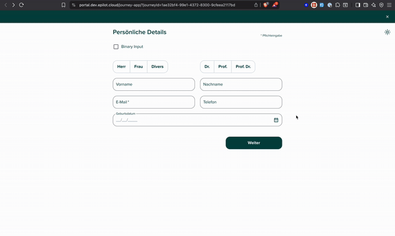

# Journey Embed SDK (Beta)

The Journey Embed SDK is a chainable JavaScript API for rendering epilot Journeys. One SDK, two backends:

- A **rewritten iframe engine** that replaces the legacy [`__epilot` script](./embedding) with a faster, cleaner host integration.
- The [`<epilot-journey>` Web Component](./web-components), a custom HTML element that renders in Shadow DOM.

:::info Beta

The SDK is in beta. Test it before rolling out to production. Existing embeds using the [legacy `__epilot` script](./embedding) continue to work.

:::

:::tip When to use the SDK

For iframe embedding, the SDK is the new default. It replaces the legacy `__epilot` script.

For web components, use the SDK or drop the [`<epilot-journey>`](./web-components) element directly into your HTML, whichever fits your integration.

:::

## Installation

You can install the SDK three ways. Pick the one that matches your setup.

### Option 1: Synchronous CDN

The simplest install. Add one script tag. `$epilot` is available immediately on `window`. When you call `.asWebComponent()`, the SDK loads the web component script automatically. No extra tags needed.

```html title="Synchronous CDN (add to <head>)"
<script src="https://embed.journey.epilot.io/sdk/bundle.js"></script>
```

### Option 2: Asynchronous CDN (with `onReady`)

Load the SDK asynchronously to avoid blocking your page. Drop this stub in your `<head>`. It places a tiny `$epilot.onReady()` queue on `window` and loads the real bundle in the background:

```html title="Async CDN (drop in <head>)"
<script>
  ;(function (h, o, u, n, d) {
    h = h[d] = h[d] || {
      q: [],
      onReady: function (c) {
        h.q.push(c)
      },
    }
    d = o.createElement(u)
    d.async = 1
    d.src = n
    n = o.getElementsByTagName(u)[0]
    n.parentNode.insertBefore(d, n)
  })(
    window,
    document,
    'script',
    'https://embed.journey.epilot.io/sdk/bundle.js',
    '$epilot'
  )
</script>
```

Then call `onReady` anywhere on the page. Your callback runs as soon as the SDK finishes loading:

```html title="Embed once the SDK is ready"
<div id="embed-target"></div>

<script>
  window.$epilot.onReady(function (epilot) {
    epilot
      .embed('<your-journey-id>')
      .asWebComponent()
      .mode('inline')
      .append('#embed-target')
  })
</script>
```

:::info How it works

Before the bundle loads, `onReady(cb)` pushes `cb` onto a queue. When the bundle finishes loading, it replaces the stub, drains the queue, and invokes each callback. Callbacks registered later run synchronously.

:::

### Option 3: npm package

For bundler-based apps (Next.js, Vite, Webpack, etc.), install the SDK from npm. You'll get full TypeScript types and autocomplete:

```bash
npm install @epilot/journey-embed-sdk
# or
yarn add @epilot/journey-embed-sdk
# or
pnpm add @epilot/journey-embed-sdk
```

```ts title="ESM usage"
import { Epilot } from '@epilot/journey-embed-sdk'

// Options are optional. Defaults to the production Journey app.
const epilot = new Epilot({
  // baseUrl: 'https://journey.staging.epilot.io',  // override per environment
})

epilot
  .embed('<your-journey-id>')
  .asWebComponent()
  .mode('inline')
  .append('#embed-target')
```

The npm package does **not** use `window.$epilot`. You create your own instance. Its only runtime dependency is `iframe-resizer`.

## Quick Start

With the SDK installed via any of the options above, call `$epilot.embed()` (or your own instance) and chain configuration options. End the chain with an injection method (`append`, `prepend`, `before`, or `after`):

```html title="Inline embed via SDK"
<div id="embed-target"></div>

<script>
  document.addEventListener('DOMContentLoaded', function () {
    $epilot
      .embed('<your-journey-id>')
      .asWebComponent()
      .mode('inline')
      .topBar(true)
      .scrollToTop(true)
      .append('#embed-target')
  })
</script>
```

The Journey is injected into `#embed-target`. Read on for the full API reference and advanced scenarios.

## Embed Targets

The SDK supports two rendering backends. Choose one by calling the corresponding method in your chain:

| Method              | Backend                           | Notes                                                                                                         |
| ------------------- | --------------------------------- | ------------------------------------------------------------------------------------------------------------- |
| `.asWebComponent()` | `<epilot-journey>` custom element | Recommended. Uses Shadow DOM for better performance and accessibility. The web component script is auto-loaded. |
| `.asIframe()`       | `<iframe>`                        | Uses the rewritten iframe engine. Choose this for stronger style isolation or multiple Journeys on one page.  |

Both backends accept the same configuration methods. For `.asIframe()`, the SDK delivers most options (`scrollToTop`, `closeButton`, `contextData`) via `postMessage` after the iframe signals readiness. `dataInjectionOptions` goes in the iframe URL.

The one behavioural difference is the [Inline to Full-Screen](#inline-to-full-screen-transition) pattern: web components need an explicit `.mode()` call alongside `.isFullScreenEntered()`. Iframes don't.

## API Reference

All configuration methods are chainable and return the `Embedding` instance. Call an [injection method](#injection-methods) at the end of the chain to render the Journey.

### Configuration methods

| Method                         | Type                          | Default    | Description                                                                                                                                                                            |
| ------------------------------ | ----------------------------- | ---------- | -------------------------------------------------------------------------------------------------------------------------------------------------------------------------------------- |
| `.mode(value)`                 | `"inline"` \| `"full-screen"` | `"inline"` | The display mode. `"inline"` renders within the page flow. `"full-screen"` renders as an overlay.                                                                                      |
| `.topBar(value)`               | `boolean`                     | `true`     | Whether to show the top navigation bar.                                                                                                                                                |
| `.scrollToTop(value)`          | `boolean`                     | `true`     | Whether to scroll to the top of the Journey on step navigation.                                                                                                                        |
| `.closeButton(value)`          | `boolean`                     | `true`     | Whether to show the close button in the top bar.                                                                                                                                       |
| `.lang(value)`                 | `"de"` \| `"en"` \| `"fr"`    | -          | **Deprecated. Will be removed in a future version.** Overrides the Journey UI language. Set the language in the Journey Builder instead.                                              |
| `.canary()`                    | -                             | -          | Uses the canary release channel for the web component script instead of stable. See [Release Channels](#release-channels).                                                             |
| `.contextData(value)`          | `Record<string, unknown>`     | -          | Additional key-value data passed to the Journey and included with the submission. See [Context Data](#context-data).                                                                   |
| `.dataInjectionOptions(value)` | `DataInjectionOptions`        | -          | Pre-fills Journey fields and controls the starting step. See [Data Injection](#data-injection).                                                                                        |
| `.name(value)`                 | `string`                      | -          | Accessible name for the embedded Journey. Sets the iframe's `name` and `title` attributes; sets `title` on the `<epilot-journey>` host element.                                        |
| `.isFullScreenEntered(value)`  | `boolean`                     | -          | Controls whether the Journey is visible in full-screen. Can be called before embedding (sets initial state) or after (updates the live element). See [Full-Screen](#full-screen-mode). |

### Injection methods

These methods insert the Journey into the DOM and return the `Embedding` instance. Call exactly one at the end of your chain.

| Method                          | Behavior                                                                      |
| ------------------------------- | ----------------------------------------------------------------------------- |
| `.append(selector \| element)`  | Inserts the Journey as the **last child** of the target element.              |
| `.prepend(selector \| element)` | Inserts the Journey as the **first child** of the target element.             |
| `.after(selector \| element)`   | Inserts the Journey immediately **after** the target element (as a sibling).  |
| `.before(selector \| element)`  | Inserts the Journey immediately **before** the target element (as a sibling). |

### Instance methods

These are called on the `Embedding` instance returned by an injection method, for dynamic updates after the Journey has already been rendered.

| Method                        | Description                                                                                                                                                                      |
| ----------------------------- | -------------------------------------------------------------------------------------------------------------------------------------------------------------------------------- |
| `.mode(value)`                | Updates the display mode on the live element. Used in the [Inline to Full-Screen](#inline-to-full-screen-transition) pattern to promote or demote a web component between modes. |
| `.isFullScreenEntered(value)` | Dynamically enters or exits full-screen on the already-rendered Journey.                                                                                                         |
| `.remove()`                   | Removes the Journey element from the DOM and cleans up all event listeners.                                                                                                      |
| `.el()`                       | Returns the raw `HTMLElement` (or `null` if not yet injected).                                                                                                                   |

### Root methods

Called on `$epilot` itself (or on a `new Epilot(options)` instance when using the npm package).

| Method         | Description                                                                                                                                                                                                                        |
| -------------- | ---------------------------------------------------------------------------------------------------------------------------------------------------------------------------------------------------------------------------------- |
| `.embed(id)`   | Returns a new `Embedding` builder for the given Journey id.                                                                                                                                                                        |
| `.init()`      | Returns a fresh `Epilot` instance. Optional. `new Epilot(options)` does the same thing.                                                                                                                                           |
| `.onReady(cb)` | Invokes `cb` with the SDK instance as soon as the SDK is ready. Safe to call before the bundle has loaded when using the [async CDN install](#option-2--asynchronous-cdn-with-onready); callbacks are queued and drained on load. |

## Scenarios

### Inline

Renders the Journey directly within the page at the position of `#embed-target`:

```html title="Inline"
<div id="embed-target"></div>

<script>
  document.addEventListener('DOMContentLoaded', function () {
    $epilot
      .embed('<your-journey-id>')
      .asWebComponent()
      .mode('inline')
      .topBar(true)
      .scrollToTop(true)
      .append('#embed-target')
  })
</script>
```

### Full-Screen Mode

In full-screen mode the Journey is hidden by default. Call `.isFullScreenEntered(true)` on the `Embedding` instance to open it, typically from a button click:

```html title="Full-screen with a button"
<button id="open-btn">Open Journey</button>
<div id="embed-target"></div>

<script>
  document.addEventListener('DOMContentLoaded', function () {
    var embedding = $epilot
      .embed('<your-journey-id>')
      .asWebComponent()
      .mode('full-screen')
      .topBar(true)
      .closeButton(true)
      .append('#embed-target')

    document.getElementById('open-btn').addEventListener('click', function () {
      embedding.isFullScreenEntered(true)
    })
  })
</script>
```

To close it programmatically (e.g. in response to an event):

```javascript
embedding.isFullScreenEntered(false)
```

### Multiple Journeys

Each `$epilot.embed()` call returns its own `Embedding` instance, so you can render several Journeys on one page, each with independent configuration and lifecycle.

Use `.asIframe()` for this pattern. See [Limitations](#limitations) for why the web component backend is limited to one instance per page.

```html title="Two Journeys on one page"
<div id="embed-a"></div>
<div id="embed-b"></div>

<script>
  document.addEventListener('DOMContentLoaded', function () {
    $epilot
      .embed('<your-journey-id-1>')
      .asIframe()
      .mode('inline')
      .append('#embed-a')

    $epilot
      .embed('<your-journey-id-2>')
      .asIframe()
      .mode('inline')
      .append('#embed-b')
  })
</script>
```

### Inline to Full-Screen Transition

A common pattern is to start a Journey inline and transition it to full-screen once the user moves past the first step. Listen for `EPILOT/USER_EVENT/PAGE_VIEW` messages on `window` and call `isFullScreenEntered()` accordingly.

:::note Web Component vs iframe

For **web components**, the full-screen overlay is gated on the element's `mode` attribute, so you must call `.mode()` alongside `isFullScreenEntered()` when entering and exiting:

- Enter: `.mode('full-screen').isFullScreenEntered(true)`
- Exit: `.isFullScreenEntered(false).mode('inline')`

For **iframes**, the overlay is applied directly via CSS. `.isFullScreenEntered()` alone is sufficient and no mode change is needed.

:::

```html title="Inline to full-screen transition (web component)"
<div id="embed-target"></div>

<script>
  document.addEventListener('DOMContentLoaded', function () {
    var journeyId = '<your-journey-id>'
    var firstStep = ''

    var embedding = $epilot
      .embed(journeyId)
      .asWebComponent()
      .mode('inline')
      .topBar(true)
      .scrollToTop(true)
      .append('#embed-target')

    window.addEventListener('message', function (event) {
      if (
        event.data?.type === 'EPILOT/USER_EVENT/PAGE_VIEW' &&
        event.data?.journeyId === journeyId
      ) {
        var path = event.data?.payload?.path

        if (!firstStep) {
          firstStep = path
        } else if (firstStep === path) {
          embedding.isFullScreenEntered(false).mode('inline')
        } else {
          embedding.mode('full-screen').isFullScreenEntered(true)
        }
      }
    })
  })
</script>
```

### Launcher Journeys

Launcher Journeys are a special type of inline Journey where the first step acts as a teaser. When the user navigates past the launcher step, the Journey automatically transitions to full-screen. When they close or navigate back, it returns to inline.

**With the SDK**, launcher transitions are handled automatically:

- **Web component**: The `<epilot-journey>` custom element handles `EPILOT/ENTER_FULLSCREEN` and `EPILOT/EXIT_FULLSCREEN` events internally. No extra code needed.
- **iframe**: The SDK listens for fullscreen events via `postMessage` and manages the CSS overlay automatically.

```html title="Launcher Journey (web component)"
<div id="embed-target"></div>

<script>
  document.addEventListener('DOMContentLoaded', function () {
    $epilot
      .embed('<your-launcher-journey-id>')
      .asWebComponent()
      .mode('inline')
      .topBar(true)
      .append('#embed-target')
  })
</script>
```

```html title="Launcher Journey (iframe)"
<div id="embed-target"></div>

<script>
  document.addEventListener('DOMContentLoaded', function () {
    $epilot
      .embed('<your-launcher-journey-id>')
      .asIframe()
      .mode('inline')
      .topBar(true)
      .append('#embed-target')
  })
</script>
```

No event listeners required. The SDK and web component handle the transition lifecycle.

## Context Data

`.contextData()` accepts a plain object of key-value pairs. The data is passed to the Journey and included with every submission. Only string and numeric values are supported. Other types are ignored.

```javascript
$epilot
  .embed('<your-journey-id>')
  .asWebComponent()
  .mode('inline')
  .contextData({ source: 'checkout', campaign: 'summer-2025', count: 3 })
  .append('#embed-target')
```

The Journey also automatically picks up URL search parameters from the host page. Values passed via `.contextData()` take precedence when keys overlap.

## Data Injection

Data injection allows you to pre-fill Journey fields with data and optionally start from a specific step. This is useful when your website has already collected some information (e.g. a product selection or address) and you want to carry it into the Journey.

1. **Prefill data**: set initial values for journey blocks.
2. **Start from a specific step**: skip earlier steps (e.g., when product selection happens on an external website).
3. **Control field display**: disable specific fields.

The `.dataInjectionOptions()` method accepts a `DataInjectionOptions` object with the following structure:

```typescript title="DataInjectionOptions"
type DataInjectionOptions = {
  /** The step index to start the Journey from (0-based) */
  initialStepIndex?: number
  /** Pre-fill data for each step */
  initialState?: Record<string, unknown>[]
  /** Control which blocks/fields are disabled */
  blocksDisplaySettings?: BlockDisplaySetting[]
}

type BlockDisplaySetting = {
  type: 'DISABLED'
  blockName: string
  stepIndex: number
  blockFields?: string[]
}
```

### Setting data injection options

Pass the object inline in your embed chain:

```html title="Pre-filling journey data"
<div id="embed-target"></div>

<script>
  document.addEventListener('DOMContentLoaded', function () {
    $epilot
      .embed('<your-journey-id>')
      .asWebComponent()
      .mode('inline')
      .dataInjectionOptions({
        initialState: [
          {
            Date: { startDate: '2026-02-19', endDate: null, _isValid: true },
            'Number Input': {
              numberInput: '3',
              numberUnit: '',
              _isValid: true,
            },
            'Binary Input': true,
          },
        ],
      })
      .append('#embed-target')
  })
</script>
```

You can combine all three features (a starting step, pre-filled state, and disabled fields) in a single call:

```javascript title="Setting data injection dynamically"
$epilot
  .embed('<your-journey-id>')
  .asWebComponent()
  .mode('inline')
  .dataInjectionOptions({
    initialStepIndex: 1,
    initialState: [
      {},
      {
        'Product Selection': {
          selectedProduct: 'solar-panel-basic',
          _isValid: true,
        },
      },
    ],
    blocksDisplaySettings: [
      {
        type: 'DISABLED',
        blockName: 'Product Selection',
        stepIndex: 1,
        blockFields: ['selectedProduct'],
      },
    ],
  })
  .append('#embed-target')
```

### Populating `initialState`

`initialState` is an array where each element corresponds to a Journey step (by index). Each step entry is an object keyed by block name, containing the field values for that block.

- Steps that should not be pre-filled must be empty objects `{}`.
- The array must be ordered sequentially to match step order.

To discover the correct block names and field structure, open your Journey in **debug mode** from the Journey Builder and inspect the state for each step. See below:



## Events

The SDK dispatches the same events as the Web Component, on the `window` object using `postMessage`. Listen for them with `window.addEventListener`:

| Event                         | Description                                    |
| ----------------------------- | ---------------------------------------------- |
| `EPILOT/JOURNEY_LOADED`       | The Journey finished loading.                  |
| `EPILOT/EXIT_FULLSCREEN`      | The Journey exited full-screen mode.           |
| `EPILOT/ENTER_FULLSCREEN`     | The Journey entered full-screen mode.          |
| `EPILOT/CLOSE_JOURNEY`        | The user closed the Journey.                   |
| `EPILOT/FORM_EVENT`           | A form-level event occurred (e.g. submission). |
| `EPILOT/USER_EVENT/PAGE_VIEW` | The user navigated to a new step.              |
| `EPILOT/USER_EVENT/PROGRESS`  | The user made progress in the Journey.         |

```javascript title="Listening for journey events"
window.addEventListener('message', function (event) {
  if (event.data?.type === 'EPILOT/JOURNEY_LOADED') {
    console.log('Journey loaded!')
  }

  if (event.data?.type === 'EPILOT/USER_EVENT/PAGE_VIEW') {
    console.log('Step viewed:', event.data?.payload?.path)
  }

  if (event.data?.type === 'EPILOT/CLOSE_JOURNEY') {
    console.log('Journey closed by user')
  }
})
```

:::tip Reacting to close in full-screen

When the user clicks the close button inside a full-screen Journey, the Journey dispatches `EPILOT/CLOSE_JOURNEY`. The SDK handles this automatically for pure full-screen embeds (mode set to `'full-screen'` from the start). For inline-to-fullscreen transitions you need to listen manually and also restore the mode:

```javascript
// Pure full-screen: SDK handles this automatically, no listener needed.

// Inline-to-fullscreen: restore mode manually on close:
window.addEventListener('message', function (event) {
  if (
    event.data?.type === 'EPILOT/CLOSE_JOURNEY' &&
    event.data?.journeyId === '<your-journey-id>'
  ) {
    embedding.isFullScreenEntered(false).mode('inline')
  }
})
```

:::

## Live Examples

Browse interactive, runnable examples for every SDK scenario:

- **[SDK Storybook](https://embed.journey.epilot.io/stories/?path=/docs/next-sdk--docs)**: inline, full-screen, inline-to-fullscreen, launcher, data injection, and more, with both iframe and web component backends.
- **[Web Component Storybook](https://embed.journey.epilot.io/stories/?path=/docs/next-web-component--docs)**: the same scenarios using raw `<epilot-journey>` attributes (no SDK).

Use the **Controls** panel in Storybook to switch between backends and change options in real time. These examples work with **public Journeys** only. Enter your own `journey-id` in the controls to see it in action.

## Release Channels

The SDK auto-loads the web component script from the **stable** channel by default. To use the **canary** channel (latest unreleased changes), call `.canary()` before `.asWebComponent()`:

```javascript
$epilot
  .embed('<your-journey-id>')
  .canary()
  .asWebComponent()
  .mode('inline')
  .append('#embed-target')
```

:::warning One channel per page

The browser only allows a custom element to be registered once. This means:

- Only one release channel (stable or canary) can be active per page.
- The first `.asWebComponent()` call determines the channel for all subsequent embeddings on that page.
- Mixing `.canary()` and non-canary embeddings on the same page is not supported.

:::

## Limitations

Known constraints and edge cases to plan around.

### Single web component per page

The browser only allows a custom element to be registered once per page. `.asWebComponent()` therefore supports exactly **one** `<epilot-journey>` instance at a time. To render multiple Journeys side-by-side, use `.asIframe()` for all of them.

### Partial live updates

After a Journey has been rendered, only **`.mode(value)`** and **`.isFullScreenEntered(value)`** propagate to the live element. Other configuration methods (`topBar`, `scrollToTop`, `contextData`, `dataInjectionOptions`, etc.) only take effect during the initial embed.

To change any other option after render, call `.remove()` on the instance and embed again with the new configuration:

```javascript
embedding.remove()

embedding = $epilot
  .embed('<your-journey-id>')
  .asWebComponent()
  .mode('inline')
  .contextData({ source: 'new-source' })
  .append('#embed-target')
```

An improved `.update()` will be released soon.

### Context data forwarded to the iframe URL

When you embed with `.asIframe()`, `.contextData()` values are forwarded to the iframe `src` query string **only for string and numeric values**. Complex types (objects, arrays) are not URL-forwarded. The Journey receives them via `postMessage` after the iframe signals readiness, so they're available to the Journey runtime but not to any early URL-based logic.

## Content-Security-Policy (CSP)

The SDK uses the same script origin as the Web Component embed. See the [Web Components CSP guide](./web-components#content-security-policy-csp) for the required policy directives.

## Migrating from the Legacy `__epilot` API

If you previously used the `__epilot.init()` / `__epilot.enterFullScreen()` API with the `bundle.js` script, the SDK replaces all of that with a single, consistent interface.

**Replace the script:**

```diff
- <script src="https://embed.journey.epilot.io/bundle.js"></script>
+ <script src="https://embed.journey.epilot.io/sdk/bundle.js"></script>
```

**Replace `__epilot.init()` with the SDK builder:**

```diff
- __epilot.init([{ journeyId: '<id>', mode: 'full-screen', topBar: false }])
+ var embedding = $epilot
+   .embed('<id>')
+   .asWebComponent()
+   .mode('full-screen')
+   .topBar(false)
+   .append(document.body)
```

**Replace `__epilot.enterFullScreen()` / `__epilot.exitFullScreen()`:**

```diff
- __epilot.enterFullScreen('<id>')
+ embedding.isFullScreenEntered(true)

- __epilot.exitFullScreen('<id>')
+ embedding.isFullScreenEntered(false)
```

**Replace `__epilot.on()` event listeners:**

The SDK no longer uses `__epilot.on()`. Listen for events directly on `window` using the same `EPILOT/*` event type strings. See [Events](#events) above.

**Replace `__epilot.update()`:**

The SDK doesn't expose a single `update()` call. See [Limitations](#limitations) for what can and can't be changed after embedding.

**Replace `__epilot.isInitialized()`:**

Check the instance's element instead of a global registry:

```diff
- if (__epilot.isInitialized('<id>')) {
+ if (embedding.el()) {
    // journey is rendered
  }
```

**Dropped options:**

Some `OptionsInit` fields from the legacy script have no SDK equivalent:

- `minHeight`: iframes now auto-size to their content. Remove it from your config.
- `journeyUrl`: not supported. The SDK derives the iframe URL from `baseUrl`; pass it via `new Epilot({ baseUrl })` if you need a non-default Journey app.

> The legacy `name` option **is** supported as `.name(value)`, which sets the iframe's `name` and `title`, or the web component's `title`.
