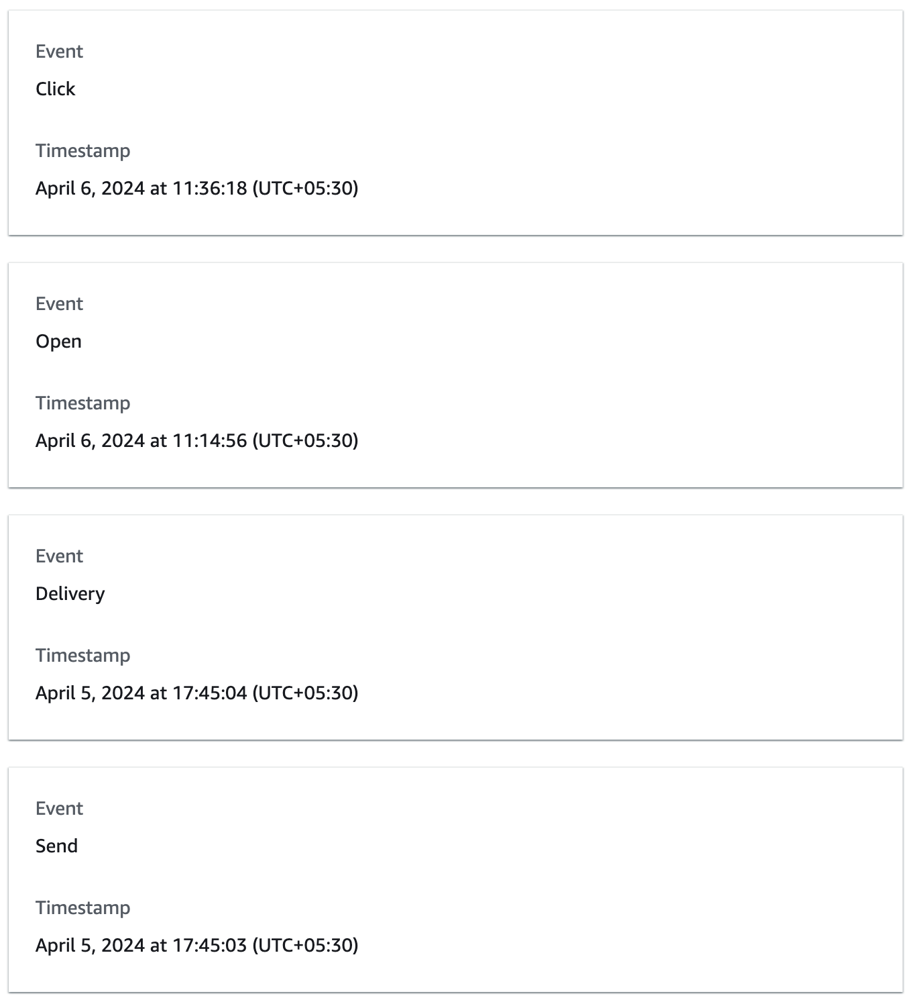

# Email Settings

## Custom Email Domain

[[API Docs](/api/email-settings#tag/Domains)]
[[SDK](https://www.npmjs.com/package/@epilot/email-settings-client)]
[[Setup Docs](https://help.epilot.cloud/hc/de/articles/5573710208412-E-Mail-Konfigurationsmen%C3%BC-im-Detail-epilot-360-#h_01GA1JYMPGHRE0XDCHW9N61G57)]

Epilot not only provides the capability to send emails using our domain but also allows customers to bring their own subdomains. This enables messages to be sent and received via epilot, acting on behalf of your own organization. It is highly recommended that an IT professional from your company, who is well-versed with DNS records, handle this integration.

### Subdomain Delegation:
While setting up the subdomain, a process known as 'subdomain delegation' is required. With this setup:

- The subdomain will be managed by epilot by giving complete control.
- Its primary role will be to enable the sending and receiving of emails.
- This subdomain can be further configured to serve as a dedicated portal for end customers or installers.
- More on the portal domain setup [here](https://help.epilot.cloud/hc/de/articles/4417739340050-Kundenportal-einrichten-epilot-360-#h_01GC9GHGN6788D2GDVE6H0BVVQ).

### Optional: Managing the subdomain yourself

Customers who choose not to provide Epilot with full domain access can request a DNS configuration from us. We will supply a file that includes 8 crucial DNS records necessary for activating email services on their subdomain. These include:
- 3 CNAME records for DKIM,
- 2 MX records for Mail Exchange,
- 3 TXT records (2 for SPF and 1 for DMARC).

Get in touch with [epilot support](mailto:support@epilot.cloud) for assistance in owning your own subdomain and obtaining the necessary DNS configuration to leverage the email functionality.

:::note
For customers managing their own subdomain, you may be asked to manually change DNS records from time to time to ensure epilot works correctly and securely. This is not needed when the subdomain is delegated to epilot.
:::

### SPF, DMARC, and DKIM Implementation:
- After the domain is delegated to us, we handle the creation of all the necessary MX & TXT records in our AWS hosted zone. This includes:
  - SPF (Sender Policy Framework) to specify the servers that are allowed to send email for your domain.
  - DMARC (Domain-based Message Authentication Reporting and Conformance) to enable reporting and set a policy for email authentication.
  - DKIM (DomainKeys Identified Mail) to sign emails cryptographically.
- These protocols assist in verifying the email sender’s identity, which significantly reduces the risk of phishing emails and spam.
- Further reference can be found in the [AWS documentation](https://docs.aws.amazon.com/ses/latest/dg/email-authentication-methods.html).

### Custom "Mail From" Domain Configuration:
- Per the [AWS SES guidelines](https://docs.aws.amazon.com/ses/latest/dg/mail-from.html), it is advised to use a different "Mail From" domain than the sender's email address that appears in the actual email.
- To align with this guidance, we configure the "Mail From" domain to adopt the format mail.${subdomain}.
- This distinct "Mail From" domain is a best practice that enhances email deliverability and aligns with various email authentication standards.

### Email Transmission Security:
- SES, by default, ensures the secure transmission of emails using TLS (Transport Layer Security) encryption.
- This ensures that the contents of the email are secure during transit and are protected from eavesdropping or tampering.

### Security on attachments:
- To safeguard email attachments, we utilize [AWS S3 VirusScan](https://github.com/widdix/aws-s3-virusscan), which leverages the ClamAV engine. This system actively scans and identifies malicious files, ensuring they are automatically deleted before reaching any recipient. 
- ClamAV is a robust, open-source antivirus solution recognized for its capability to detect a wide range of threats, including trojans, malware, and viruses. Its team and vast community consistently refresh the virus databases, enabling the tool to recognize and counteract the latest risks. 
- We've also configured our system for internal notifications on any detection events, ensuring that we're always informed of potential threats.

### Email Receiving
- We employ SES receipt rules to handle incoming emails. 
- These rules are configured to direct the emails to separate S3 buckets, organized by tenant. 
- Subsequently, these emails are processed and structured as message entities along with attachments, which are then organized under their respective parent threads.

### Email Tracking
- We leverage the engagement and deliverability metrics offered by AWS` SES to enhance the email visibility.
- To track open events, SES incorporates a transparent GIF image, measuring 1 pixel by 1 pixel, into each email dispatched. This invisible image allows to capture the opening event without altering the appearance of the email.
- To monitor click-through rates, SES modifies the hyperlinks within your emails to redirect through an SES-operated server. This process ensures seamless redirection to the intended URLs while capturing valuable click data.
  - The SES` hyperlinks looks like https://xxxxxxxx.r.eu-west-1.awstrack.me/xx/ACTUAL_LINK
- Our policy ensures that no additional data is retained beyond the click and open event information, along with the precise timestamps of when these events occur.

## Email Addresses

[[API Docs](/api/email-settings#tag/Settings)]
[[SDK](https://www.npmjs.com/package/@epilot/email-settings-client)]
[[Setup Docs](https://help.epilot.cloud/hc/de/articles/5573710208412-E-Mail-Konfigurationsmen%C3%BC-im-Detail-epilot-360-#h_01GA1JYT6TNQ64AJH612WN9J4V)]

With this setting, users have the flexibility to designate a specific email address within their subdomain for both sending and receiving messages.
