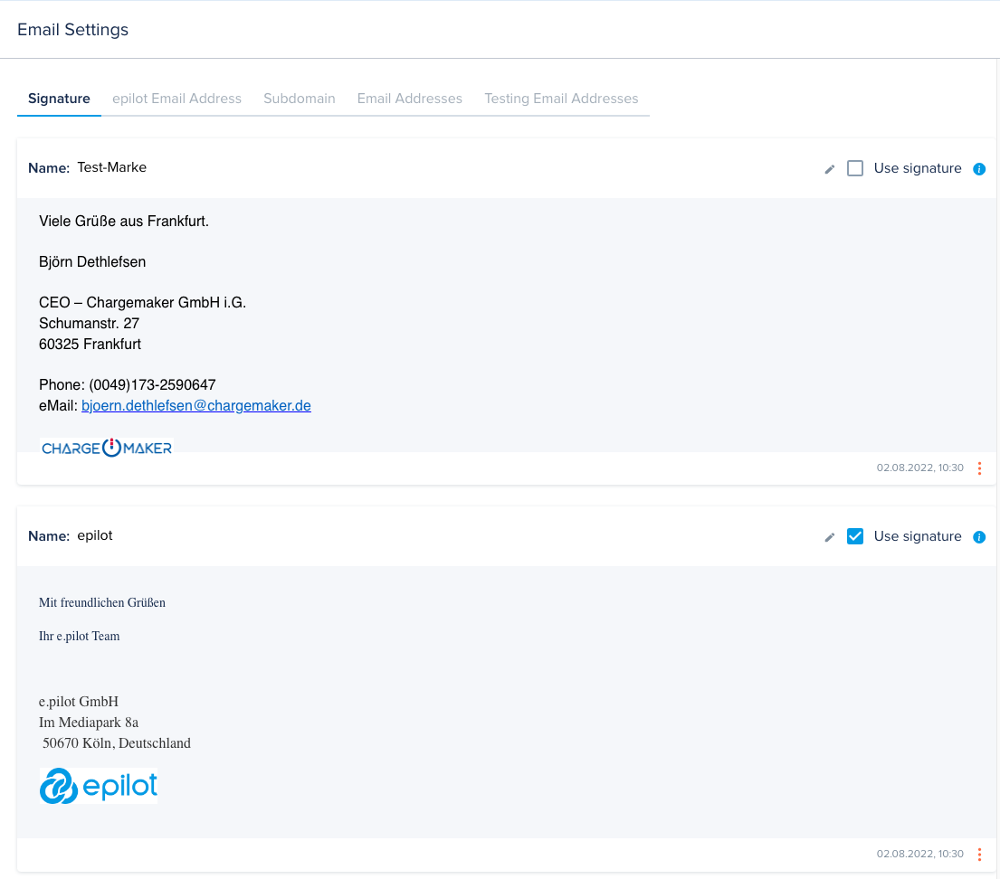
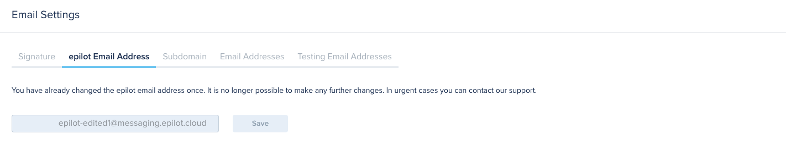
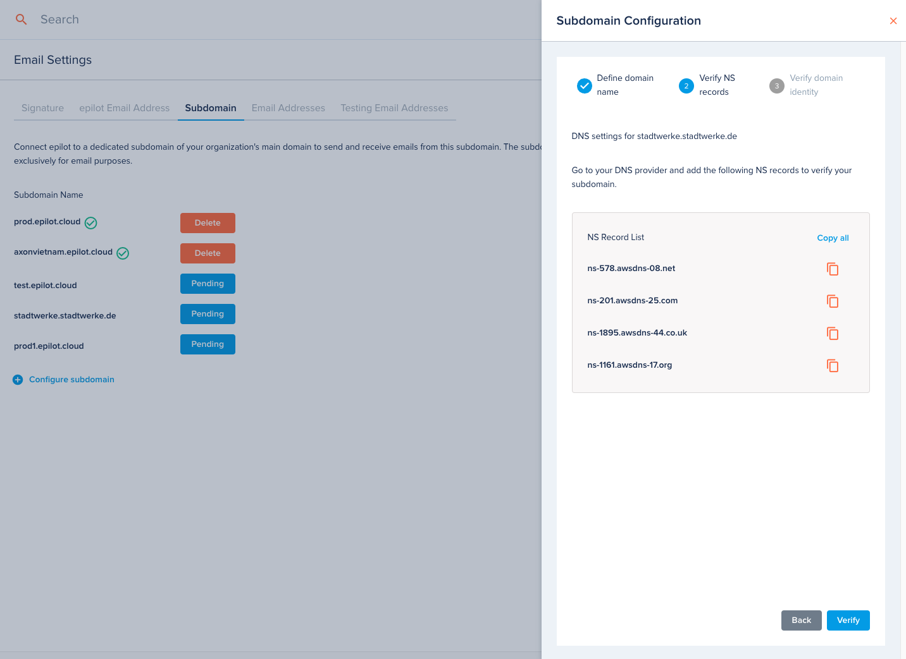
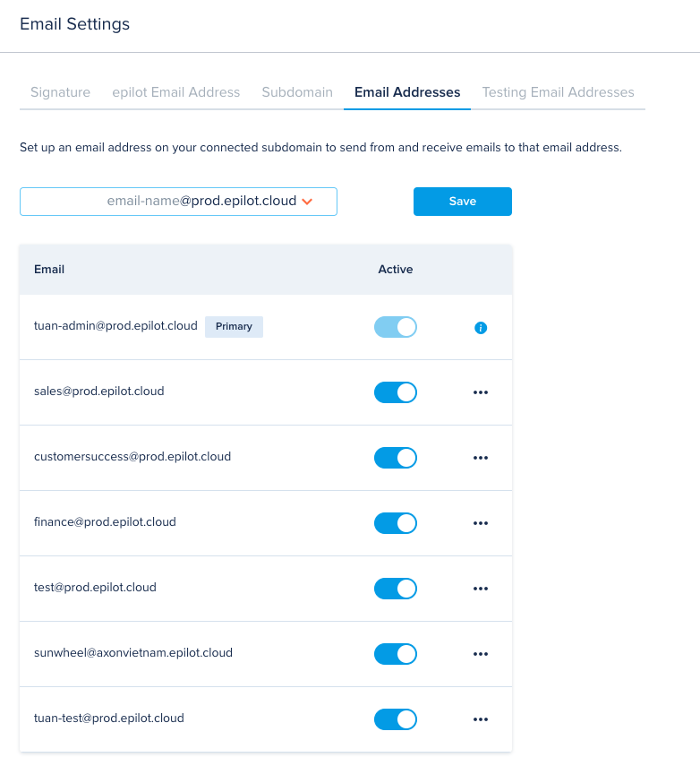
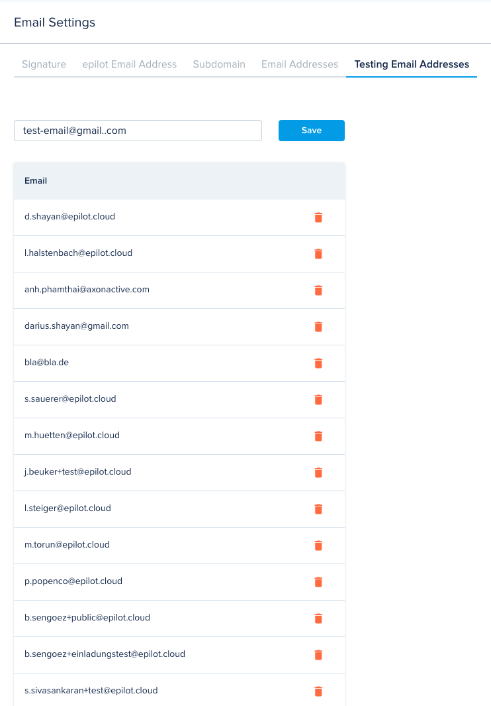

# Email Settings

[[API Docs](/api/email-settings)]
[[SDK](https://www.npmjs.com/package/@epilot/email-settings-client)]

Email Settings APIs is used to manage stuffs that serves for Message service:

- Signature
- epilot Email Address
- Subdomain & Custom Email Addresses
- Testing Email Addresses

## Signature

Organization is able to setup different signatures. Those signatures can be inserted to the email body when composing message by selecting the signature in the editor. The sigantures can be used as [template variable](template-variables) in [Email template](email-templates).

## epilot Email Address

epilot offers an email address with domain **messaging.epilot.cloud**. This email address will be used to send and receive messages. This email address is generated once organization is created. They can update to email name once a year.

## Subdomain

Beside the epilot Email Address, organization can set up their custom email domains.

Once the custom email domain is set up successfully, organization can add the custom email addresses for that domain. All custom email addresses can be used to send and receive messages like epilot email address.

## Testing Email Addresses

We have implemented a protection mechanism in our email service that does not allow sending multiple emails with the same content to the same email address.
However, since it is often necessary to send multiple emails with the same content to the same address for testing the different features in epilot, user can list email addresses here for which the protection mechanism should not apply. All internal user's email addresses are added to this list by default.

