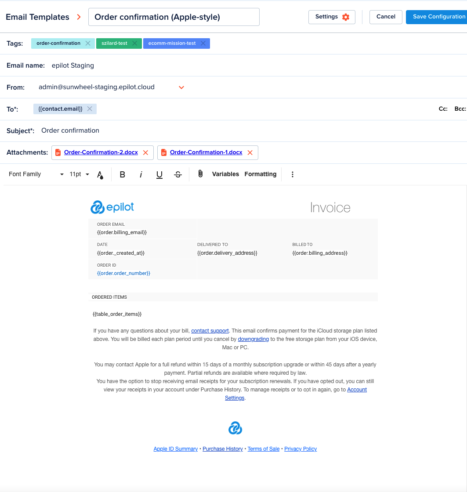

import Tabs from '@theme/Tabs'
import TabItem from '@theme/TabItem'
import {
  ReplaceEmailTemplateApi,
  ReplaceEmailTemplateSDK,
} from './code-samples.tsx'

# Email Template

[[API Docs](/api/email-templates)]
[[SDK](https://www.npmjs.com/package/@epilot/email-template-client)]

This service provides a WYSIWYG editor interface that allows you to build and edit your email template.

## Setup Email Template

Email template is built as an entity and supports to configure:

- **From**: Select 1 email address from organization emails including custom email addresses.

- **To**: Set up receivers by

  - Enter email addresses directly

  - Select customer's email addresses, internal user's email addresses from the dropdown

  - Use variables as placeholder (eg: **{{contact.email[Primary]}}**, **{{opportunity.email}}**).

- **Subject**: can build dynamic subject with variables.

- **Attachments**: support static files and document template. Attachments are being saved as [File Entity](/docs/files/file-entity).

- **Body**: Email template uses [Froala Editor](https://froala.com/wysiwyg-editor/) - a powerful tool with awesome features to build the template body. The email template editor supports embed images (CID attachments) to display as HTML email.

The variables can be entered directly or chosen from the [Variable Picker](template-variables#variable-picker).

## Usage

Email template are being used for:

- Compose message using email template

- Set up email template for automation email

- System templates for specificed services: Consent, ECP, Partner, Craftsmen portal,...

### [Replace email template API](/api/email-template#tag/Variables/operation/replaceVariables)

Basically, email template's data will be replaced by [Replace Template API](template-variables#replace-template). But for easier integration, Email Template provides an API would help to replace the whole email template with a simple call.

<Tabs lazy>
  <TabItem value="api" label="API" default>
    <ReplaceEmailTemplateApi />
  </TabItem>
  <TabItem value="sdk" label="SDK (Javascript)">
    <ReplaceEmailTemplateSDK />
  </TabItem>
</Tabs>
