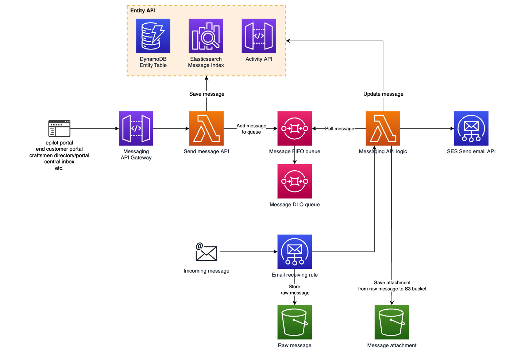
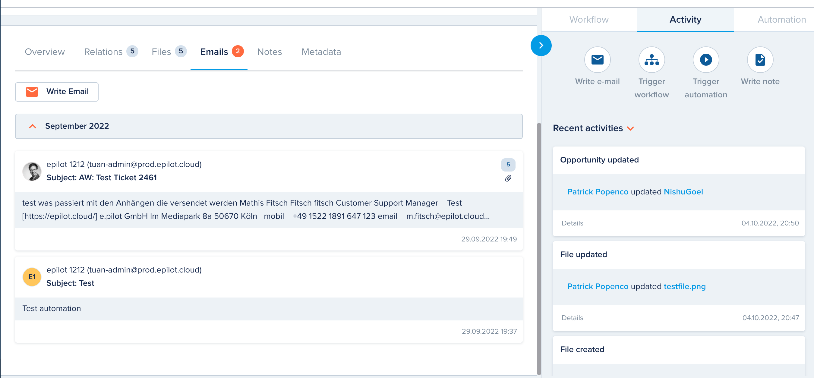
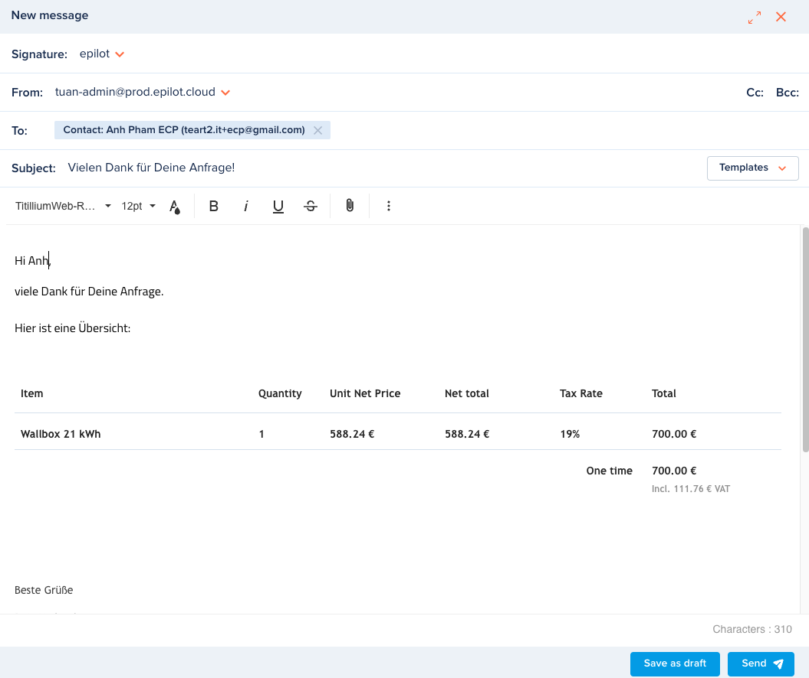
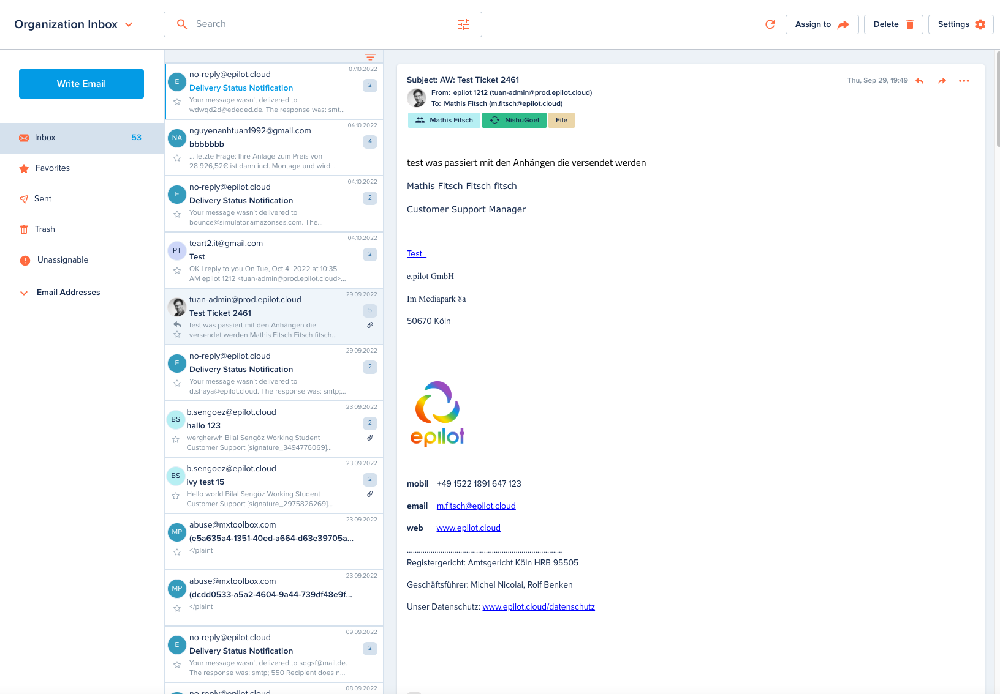

# Message

[[API Docs](/api/message)]
[[SDK](https://www.npmjs.com/package/@epilot/message-client)]

The Message API provides central email service for epilot which can:

- Support sending HTML and plaintext email to any email address or list of email addresses

- Support receiving email

- Support store all emails and search by general email information

## Architecture

- The messages are stored as entites

- Use FIFO queue to processing message

- Use AWS SES to send email

- The imcoming raw messages are stored in S3 bucket 



 

## Entities

Thread and message entity are stored as an entity. So they are handled by [entity operations](/api/entity).

### Thread

Thread contains many messages in a conversation. Messages with no replies yet are treated as threads with single message. Each thread must have the **topic** to identify the source.

### Message

Message entity stores data of an email: from/to/cc/bcc email addresses, subject, body, attachments,...

## Message Capability

Other entities can configure its schema defination to add Message capability:

- Message tab: List out all messages related to entity.

```json
{
   "name":"messages",
   "title":"Messages",
   "feature_flag":"ff_messaging_enabled",
   "ui_hooks":[
      {
         "hook":"EntityDetailsV2:Tab",
         "title":"Messages",
         "import":"@epilot360/messaging",
         "order":51,
         "requiredPermission":{
            "action":"message:view"
         }
      }
   ]
}
```

- Quick action: Add **Write e-mail** button to **Quick Action**. 

```json
{
   "name":"customer_messaging",
   "title":"Messages",
   "feature_flag":"ff_messaging_enabled",
   "ui_hooks":[
      {
         "hook":"ActivityPilot:QuickAction",
         "icon":"email",
         "route":"?drawer=messaging",
         "order":15,
         "requiredPermission":{
            "action":"message:send"
         }
      }
   ]
}
```



## Message Editor

Message uses [Froala Editor](https://froala.com/wysiwyg-editor/) as a tool to compose message. Users are able to generate message from an existing email template.



## Central Inbox

Central Inbox is likely a mail client that help users manage their messages. Users can switch between **Agent Inbox** and **Organization Inbox** in order to manage either messages related directly to them or all organization's messages.



Like some popular mail clients, with Central Inbox, users are able to:

- Compose new message from Central Inbox

- Reply, forward message

- Move a message to trash

- Delete message permanently

- Create draft message

- Filter messages

- Star a message

- Assign contexts to message

Messages are grouped in categories:

- Inbox: incoming messages

- Favorites: starred messages

- Sent: sent messages

- Drafts: only available for **Agent Inbox**

- Trash: deleted messages will be moved to trash

- Unassignable: all messages without context will be marked as unassignable. Users can assign the context manually to avoid losing messages. This category is only available for **Organization Inbox**