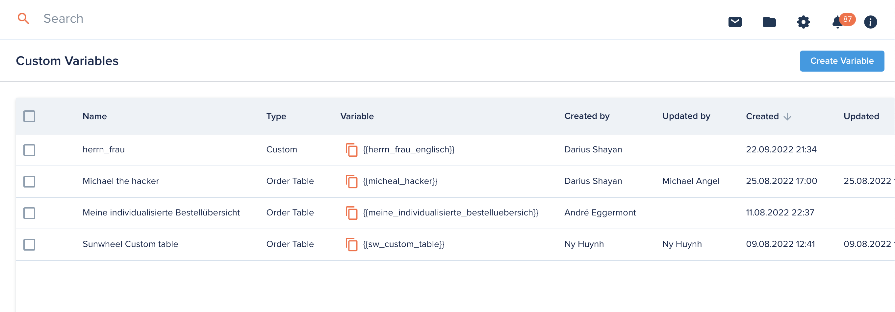
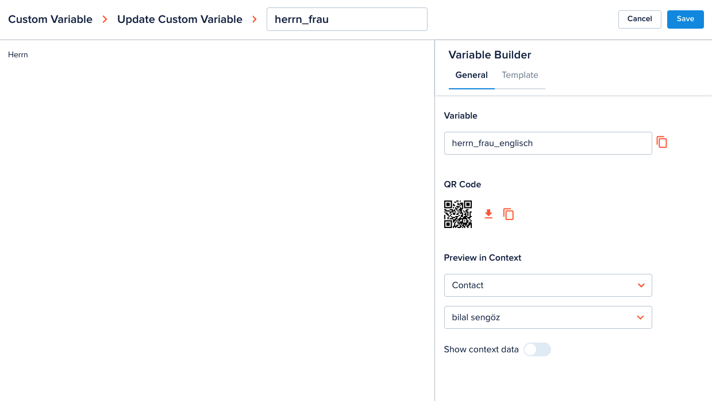
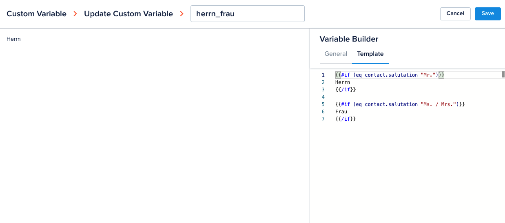
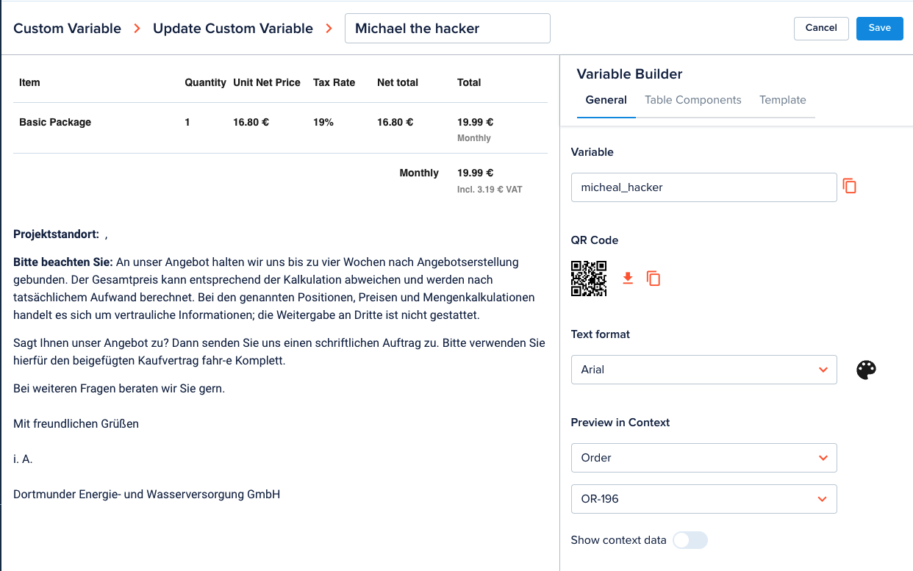
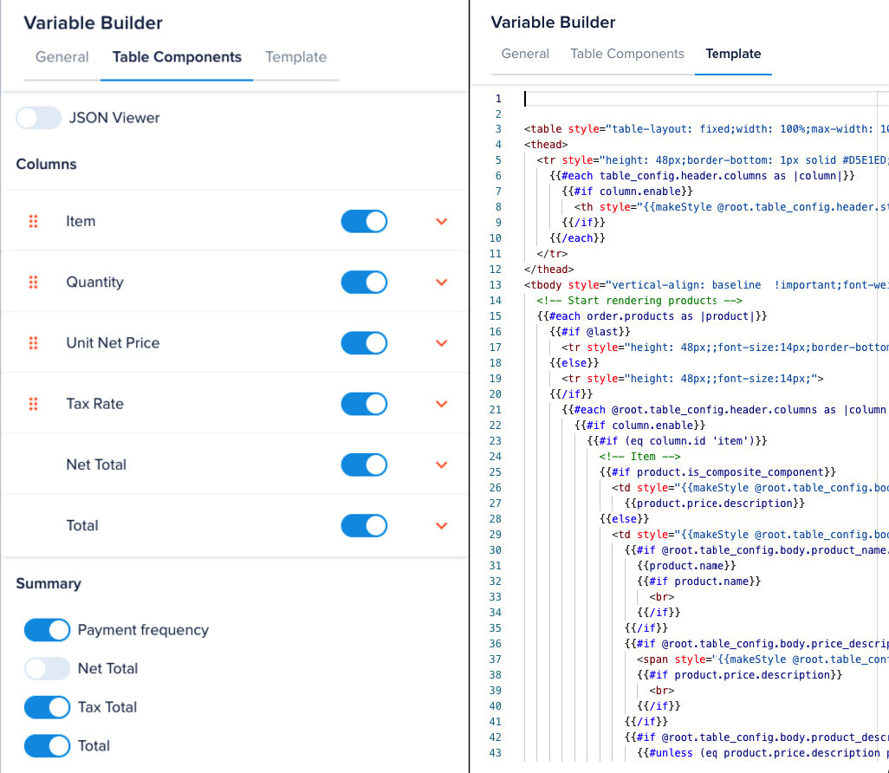

import Tabs from '@theme/Tabs'
import TabItem from '@theme/TabItem'
import {
  GetVariableContextApi,
  GetVariableContextSDK,
  ReplaceVariablesApi,
  ReplaceVariablesSDK,
} from './code-samples.tsx'

# Template Variables

[[API Docs](/api/template-variables)]
[[SDK](https://www.npmjs.com/package/@epilot/template-variables-client)]

The Template Variables API provides variable discovery and substitution email and document templates using [Handlebars](https://handlebarsjs.com/).

## Template Variables API

This API is called to both discover available variables as well as execute the variable substitution using handlebars.

Each time an email or document template is used, the Template Variable API is called with the appropriate standardised parameters.

The Template Variable API uses the Entity API and others to fetch the correct values for each variable when compiling the template.

### [Get Variable Context](/api/template-variables#tag/variables/operation/getVariableContext)

Get the full context information. The context data has 2 level nested relations and is already standardised.

<Tabs lazy>
  <TabItem value="api" label="API" default>
    <GetVariableContextApi />
  </TabItem>
  <TabItem value="sdk" label="SDK (Javascript)">
    <GetVariableContextSDK />
  </TabItem>
</Tabs>

### [Replace template](/api/template-variables#tag/variables/operation/replaceTemplates) {#replace-template}

Replace template by providing context information.

<Tabs lazy>
  <TabItem value="api" label="API" default>
    <ReplaceVariablesApi />
  </TabItem>
  <TabItem value="sdk" label="SDK (Javascript)">
    <ReplaceVariablesSDK />
  </TabItem>
</Tabs>

## Variable Picker {#variable-picker}

We provide a picker UI for users to search and explore available variables. This picker uses [Get variable categories API](/api/template-variables#tag/variables/operation/getCategories) and [Search variables API](/api/template-variables#tag/variables/operation/searchVariables) as data source.

## Variable Buider

[[API Docs](/api/template-variables#tag/Custom-variables)]

We provide a feature for users to build their own custom variables. Users are able to build their logic based on the context data for their usecases.

There are 2 types of custom variable:

- **Custom**: build a completely new variable from scratch with Handlebars syntax

  
  

- **Order table**: build a variable from table order items template

  
  
