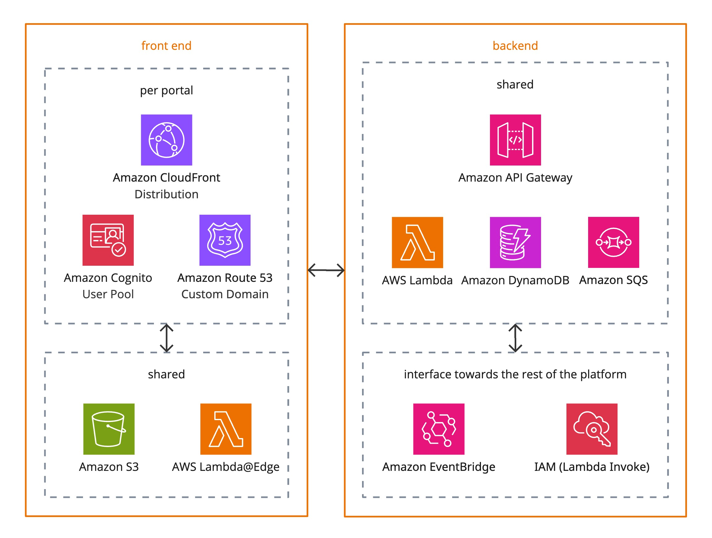

# Architecture

[[API Docs](/api/customer-portal)]
[[SDK](https://www.npmjs.com/package/@epilot/customer-portal-client)]

The **multi-tenant, white-label Portals solution** provides customers with per-portal **domain and authentication**, while sharing a **scalable, serverless backend** built on AWS primitives.

---

## Front End

Portals use React with Radix UI (accessible, themeable components) and TanStack Query (data fetching).
The content below focuses on the infrastructure.

### Per Portal

While Portals can utilize an epilot-branded subdomain like `some-portal.ecp.epilot.io`, production Portals typically use a custom domain. For example, customers owning `customer.de` often choose to use a subdomain like `some-portal.customer.de`. Therefore, each Portal involves high-level the following components:

- **Amazon CloudFront Distribution**  
  Provides performant content delivery and caching for each portal.

- **Amazon Cognito User Pool**  
  Handles authentication and user management per portal.

- **Amazon Route 53 (Custom Domain)**  
  Enables each portal to be accessed via its own custom domain.

Custom domain set up involves pointing CNAME records to AWS for domain ownership verification (Route 53) and actual reverse proxying (CloudFront).

### Shared

For easier maintenance and scalability, the rest of the architecture is shared.

- **Amazon S3**  
  Stores static assets of the Single Page Application (HTML, CSS, JS, images) delivered via CloudFront.

- **AWS Lambda@Edge**  
  Works with CloudFront for request/response manipulation (primarily URL rewrites).

---

## Backend

Portals backend follows the same principles as any other part of epilot's [serverless](/docs/architecture/serverless), [API-first](/docs/architecture/api-first) [architecture](/docs/architecture/overview).

### Shared
- **Amazon API Gateway**  
  Managed API layer for communication with the backend services.

- **AWS Lambda**  
  Executes backend business logic serverlessly.

- **Amazon DynamoDB**  
  Provides a serverless NoSQL database for portal configuration.

- **Amazon SQS**  
  Enables decoupling and asynchronous processing of events between backend components.

### Interface Towards the Rest of the Platform
- **Amazon EventBridge**  
  Supports event-driven integration with the wider platform and other AWS services.

- **IAM (Lambda Invoke)**  
  Grants controlled access for Lambda functions to invoke securely other Lambda functions.

---

## Flow & Separation

- Each portal has its own **CloudFront distribution, Cognito pool, and Route 53 custom domain**, allowing full branding and identity isolation.
- Shared front end resources (**S3 and Lambda@Edge**) support all portals collectively.
- Backend services are centralized (**API Gateway, Lambda, DynamoDB, SQS**) to ensure scalability and easier maintenance.
- Portals communicate with the rest of the [platform](/docs/architecture/overview) via **EventBridge** and direct **Lambda Invoke** (using **IAM**) for secure integration with the broader ecosystem.

---

## Security & Compliance

We meet the highest standards in terms of data protection and information security and store data exclusively in Germany.
Feel free to check our [overall approach to IT security](https://www.epilot.cloud/en/ressourcen/it-security).

### Identity & Access Management
- **Amazon Cognito** provides per-portal authentication and identity isolation with customizable password policy or MFA requirements.
- **AWS IAM** policies enforce least privilege for Lambda functions.
- **Lambda Authorizers** enable secure access to protected backend endpoints.

### Data Security
- **Encryption at rest** using AWS-managed keys and Secrets Manager.
- **Encryption in transit** via HTTPS (TLS 1.2+).
- **Cognito** secures user credentials and tokens according to AWS security best practices.

### Network Security
- **CloudFront + Lambda@Edge** applies Web Application Firewall (AWS WAF) rules for, e.g., DDoS protection, rate limiting, and bot control.
- **CloudFront** includes rules for geoblocking.

### Monitoring & Logging
- **Amazon CloudWatch** for centralized metrics, logs, and alarms (e.g. API calls, Lambda executions, SQS message flows).
- **AWS CloudTrail** for auditing API calls and changes in infrastructure.
- **Datadog** for wider platform observability to monitor and alert, debug, secure, and optimize.

### Compliance Alignment

Portals are aligned with major compliance frameworks:
- **GDPR** – data minimization, user consent, and right-to-be-forgotten.
- **ISO 27001** – centralized logging, access controls, and encryption.
