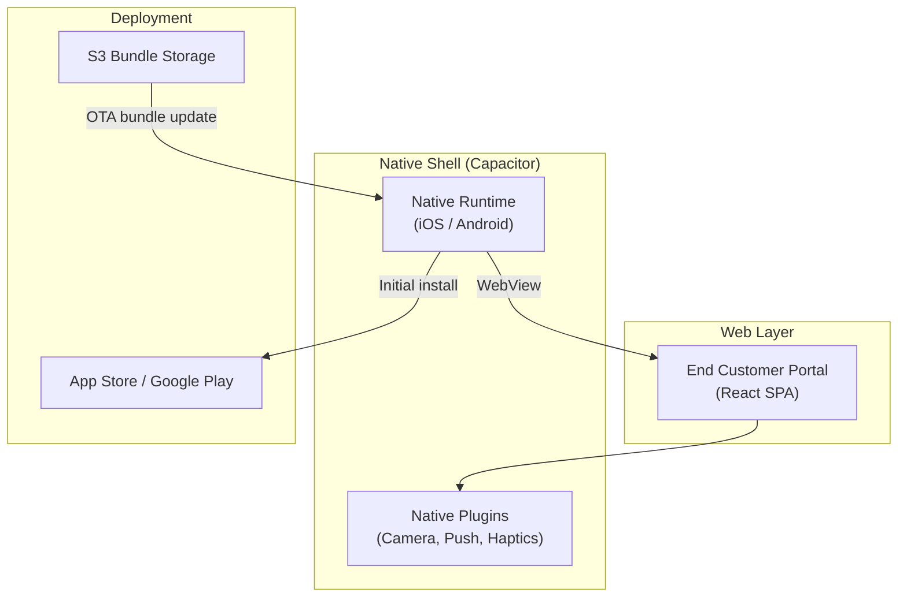
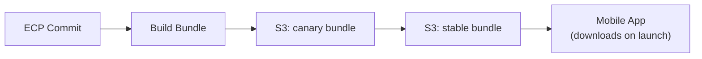

# Mobile App

epilot portals can be distributed as native iOS and Android apps through the App Store and Google Play. The mobile app uses a **hybrid shell architecture** -- a minimal native wrapper that loads the portal web application, combining native distribution with web-speed iteration.

## Architecture



### Shell Approach

The architecture separates the app into two independently deployable layers:

| Layer | Contents | Update path |
|---|---|---|
| **Native shell** | Capacitor runtime, native plugins, app icons, splash screens | App store submission (infrequent) |
| **Web bundle** | Portal UI (React), business logic, theming | Over-the-air from S3 (continuous) |

On launch, the shell checks for a newer web bundle from S3. If a compatible update is available, it downloads and applies it before rendering -- no app store review required. This allows portal features and fixes to ship to mobile users as fast as to web users.

### Core Technology

The native shell is built with [Capacitor](https://capacitorjs.com/) (v7), an open-source native runtime by Ionic. Capacitor renders the portal inside a native WebView and exposes a bridge to native device APIs.

| Component | Technology |
|---|---|
| Native runtime | Capacitor 7 |
| Web framework | React (shared with web portal) |
| Build automation | Fastlane (iOS + Android) |
| Bundle tooling | Vite |
| CI | Bitrise |

## Native Capabilities

The mobile app extends the web portal with native device features:

| Capability | Plugin | Use case |
|---|---|---|
| Camera | `@capacitor/camera` | Photo uploads, meter reading capture |
| Push notifications | Capacitor Push | Real-time alerts for portal events |
| Haptic feedback | `@capacitor/haptics` | Tactile response on interactions |
| Network detection | `@capacitor/network` | Offline state handling |
| In-app browser | `@capacitor/browser` | Opening external links |
| Apple Sign-In | `@capacitor-community/apple-sign-in` | Native SSO on iOS |
| Status bar | `@capacitor/status-bar` | Themed status bar matching portal branding |

## Per-Customer Branding

Each customer portal gets its own app store listing with fully custom branding:

- **App name and ID** (e.g., `de.twl.kundenportal`)
- **App icon and splash screen** (light and dark variants)
- **Custom domain** association for deep linking
- **Publisher account** -- customers can publish under their own Apple/Google developer account

The build process ("charging the shell") takes a portal domain as input and produces a branded native app:

```bash
PORTAL_DOMAIN=kundenportal.twl.de npm run charge
```

This injects the portal-specific configuration, assets, and web bundle into the native project, then builds platform binaries via Fastlane.

## Bundle Update Lifecycle

Web bundles follow the same release channels as the web portal:



A version manifest tracks bundle compatibility with native shell versions. The app only downloads bundles compatible with its installed native version, preventing breaking changes from reaching users on older shell releases.

## Relationship to Web Portal

The mobile app runs the same End Customer Portal (ECP) codebase as the web version. The portal detects the mobile shell at runtime and adapts:

- Uses native camera APIs instead of browser file pickers
- Adjusts navigation for mobile form factors
- Enables offline caching for portal configuration and entity data
- Integrates with native app lifecycle events (background, resume)

This means 100% feature parity between web and mobile -- any feature available in the web portal is automatically available in the mobile app.
