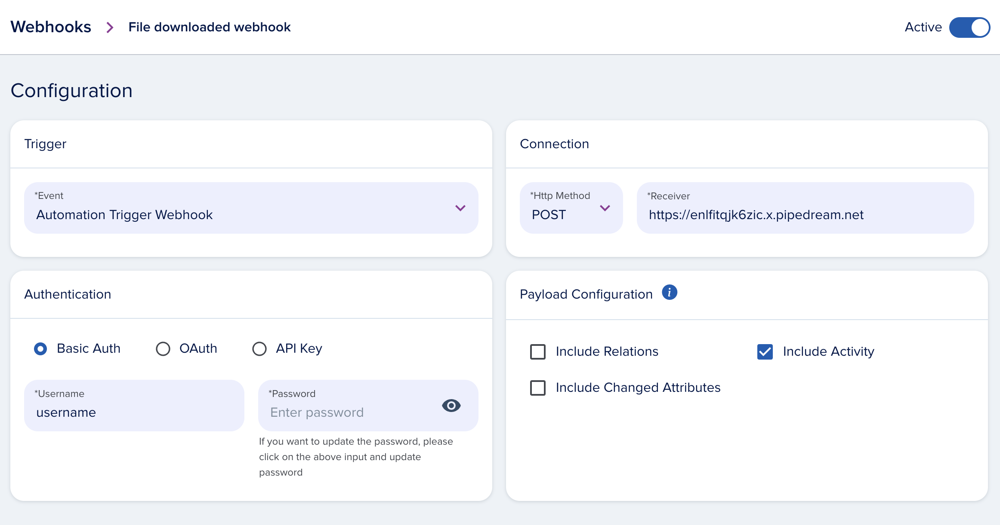
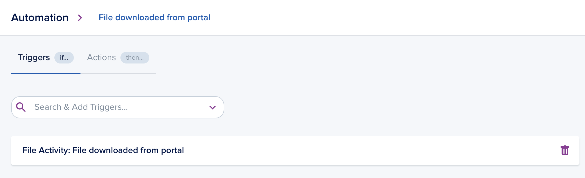
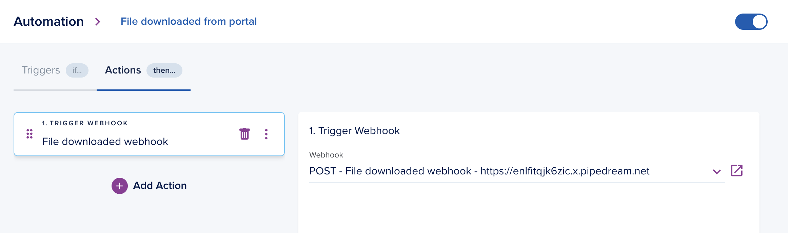

# Portal Webhooks 

Customer and installer portals specific webbhooks allow to integrate applications with the activities emitted within portal.

In the epilot portal you can configure a webhook which includes the activity:



After that go to "Automations" and create a new automation with on of the portal specific triggers. E.g. "File Activity: File Downloaded from portal":



Then add an action to the automation and select the webhook you crated before:



## Webhook Payload

The webhook message contains the whole `entity` that was part of the acitity. The `activity` part of the webhook contains the `type` of the acitivyt and `caller` information of the user who triggered the activity.

Example of the webhook message for the activity "DocDownloadedFromPortal":

```json
{
    "metadata": {
        "webhook_id": "17DwnAQo8zZaJWCQ5HaZhC",
        "organization_id": "739224"
    },
    "entity": {
        "_schema": "file",
        "_id": "78794089-343c-4bcd-97a1-9b307c3ac040",
        "_org": "739224",
        ...other entity attribures
    },
    "activity": {
        "type": "DocDownloadedFromPortal",
        "title": "Portal user downloaded the file",
        "message": "Portal user {{entity payload.caller.portalUserId}} has downloaded the file {{entity payload.entity._id}}.",
        "payload": {
            "caller": {
                "portal_user_id": "bed23253-b00b-4a09-8815-2bc87c69ae97",
                "contact_entity_id": "78794089-343c-4bcd-97a1-9b307c3ac040",
                "email": "portal.user@example.com",
                "portal_origin": "END_CUSTOMER_PORTAL"
            },
            "entity": {
                "_id": "78794089-343c-4bcd-97a1-9b307c3ac040",
                "_schema": "file",
                "_org": "739224"
            },
            "orgId": "739224"
        },
        "_org": "739224",
        "_id": "01HCYQ73MPPQDR5ZHV1GQ25CZY",
        "timestamp": "2023-10-17T11:44:25.238Z",
        "operations": [
            null
        ]
    }
}
```

## Activity Types
- `DocDownloadedFromPortal` - Automation trigger "File Activity: File Downloaded from portal"
