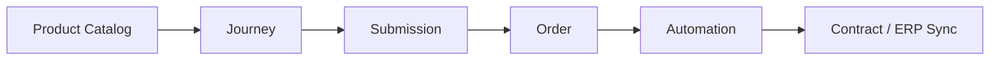

# Online Sales

epilot provides a complete online sales workflow -- from product catalog to checkout -- without requiring a separate e-commerce platform.

## Sales Flow

The online sales pipeline connects several platform capabilities into an end-to-end checkout experience:



1. **[Product Catalog](/docs/pricing/catalog)** -- Define and organize products with flexible pricing models
2. **[Journeys](/docs/journeys/journey-builder)** -- Build multi-step customer-facing flows for product selection, configuration, and checkout
3. **[Submissions](/docs/journeys/submissions)** -- Collect customer data and purchasing decisions
4. **[Orders](/docs/pricing/orders)** -- Automatically create orders with computed totals from journey submissions
5. **[Automations](/docs/automation/intro)** -- Trigger downstream processes (contract creation, notifications, ERP sync) based on order events

## Key Capabilities

- **Multi-step journeys** for selling complex products (e.g., energy tariffs with variable consumption, solar installations with multiple components)
- **Automatic order creation** from journey submissions via automation flows
- **Promo code validation** during the checkout flow
- **Product availability checks** to filter catalog items by location or eligibility
- **Customizable branding** via the [Design Builder](/docs/journeys/design-builder) and [Custom CSS](/docs/journeys/custom-css)
- **Embeddable journeys** for integration into external websites and marketing campaigns. See [Embedding](/docs/journeys/embedding).

## Checkout API

For headless or custom checkout implementations, the Pricing API provides a public cart checkout endpoint:

```
POST /v1/public/cart:checkout
```

This endpoint converts a shopping cart into an order or quote, computing all totals, taxes, and applied coupons. It is designed for use with [Publishable Tokens](/docs/auth/token-types) in client-side applications.
