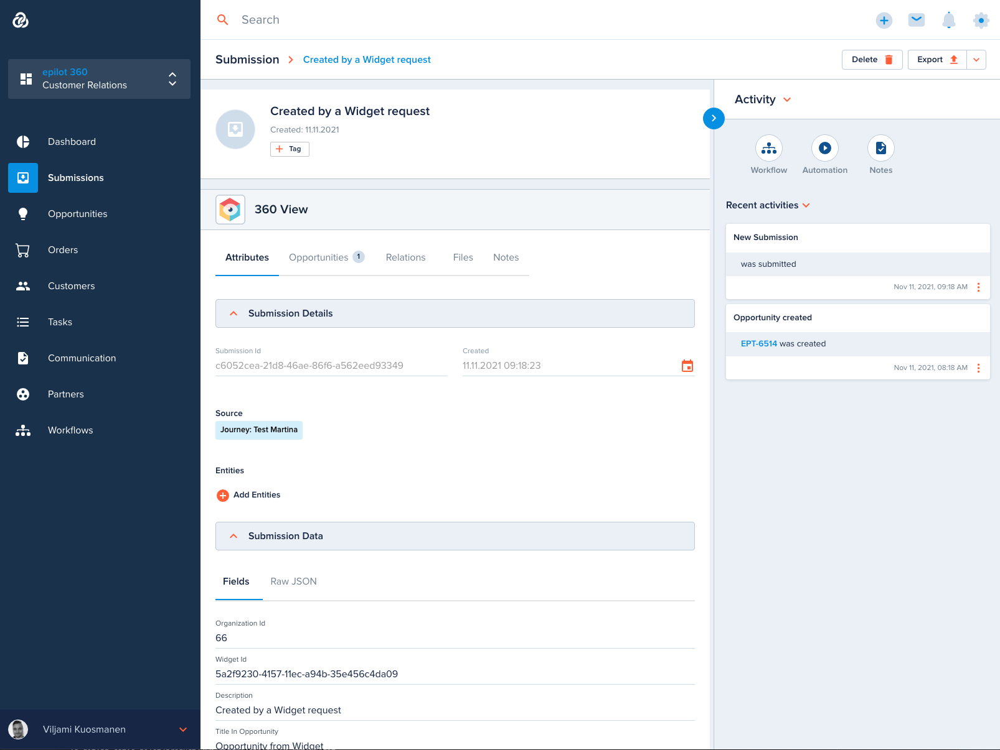

# Submissions

[[API Docs](/api/submission)]
[[SDK](https://www.npmjs.com/package/@epilot/submission-client)]

Submissions are entities that store raw data collected from Journeys or other outside data sources into epilot.

Submissions are created via the public [Submission API](/api/submission).

## Submission Entity

A Submission entity does not have a fixed schema for all its data like other business entities, but rather is designed to collect the raw JSON payload to be further processed in other entities.

A typical use of submissions is to map the incoming submission payload into further business entities like Contacts, Opportunities and Orders using [Automation](/docs/automation/automation-flows).



## Submission API

The Submission API can be used by external journeys to create Submission entities.

See [[Submission API Docs](/api/submission)] for examples.

## Passing Files

Submission API can be used together with [File API](https://docs.epilot.io/api/file) to pass file uploads to submissions using the following flow:

Use the `uploadFile` or `uploadFilePublic` operation of File API to generate a temporary upload URL and receive an s3ref:

```
POST https://file.sls.epilot.io/v1/files/public/upload
```

Request Body:
```json
// application/json
{
  "filename": "document.pdf",
  "mime_type": "application/pdf"
}
```

Response (200):
```json
// application/json
{
  "s3ref": {
    "bucket": "epilot-user-content",
    "key": "temp/123/4d689aeb-1497-4410-a9fe-b36ca9ac4389/document.pdf"
  },
  "upload_url": "https://epilot-files-prod.s3.eu-central-1.amazonaws.com/123/temp/4d689aeb-1497-4410-a9fe-b36ca9ac4389/document.pdf?AWSParams=123"
}
```

Then, upload a file with a `PUT` operation to the generated upload_url. (Hint: make sure you pass the correct Content-Type header and encoding!)

```
PUT https://epilot-files-prod.s3.eu-central-1.amazonaws.com/123/temp/4d689aeb-1497-4410-a9fe-b36ca9ac4389/document.pdf?AWSParams=123
```

Request Body:
```
(binary data)
```

After the file has uploaded, pass the `s3ref` in the `entities.*.files` attribute in your Submission API payload:

```
POST https://submission.sls.epilot.io/v1/submission/submissions
```

Request Body:
```json
// application/json
{ 
  "organization_id": "123",
  "source_type": "api",
  "source_id": "example",
  "entities": [
    { 
      "_schema": "submission",
      "description": "Submission with files",
      "files": [
        {   
          "s3ref": {
            "bucket": "epilot-user-content",
            "key": "temp/123/4d689aeb-1497-4410-a9fe-b36ca9ac4389/document.pdf"
          } 
        }   
      ]   
    }
  ]
}

```

