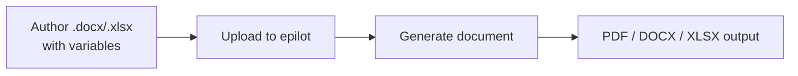

# Document Templates

[[Document Generation API](/docs/files/document-generation)]
[[API Docs](/api/document)]
[[SDK](https://www.npmjs.com/package/@epilot/document-client)]

Document templates let you generate PDF, DOCX, and XLSX documents populated with dynamic data from epilot entities. You author templates in familiar tools (Microsoft Word or Excel), embed Handlebars variables, upload them to epilot, and generate documents on demand or automatically via automations.

## Supported Formats

| Input Format | Output Formats |
|---|---|
| `.docx` | `.pdf`, `.docx` |
| `.doc` | `.pdf`, `.docx` |
| `.xlsx` | `.pdf`, `.xlsx` |
| `.xls` | `.pdf`, `.xlsx` |
| `.xlsm` | `.pdf`, `.xlsx` |

## Template Creation Workflow

1. **Author a template** -- Create a `.docx` or `.xlsx` file in Microsoft Word or Excel. Insert Handlebars variables (e.g. `{{customer.first_name}}`) wherever you want dynamic data.

2. **Upload the template** -- Upload the template file to epilot under **Configuration > Templates**. The system extracts metadata including page margins and discovered variables.

3. **Preview and test** -- Generate a test document against a sample entity to verify variable resolution and formatting.

4. **Generate documents** -- Trigger generation manually from an entity, or automatically through an automation flow.



## Template Variable Syntax

Templates use [Handlebars](https://handlebarsjs.com/) syntax with double curly braces for variable substitution:

```handlebars
Dear {{customer.first_name}} {{customer.last_name}},

Your order {{order._title}} has been confirmed.
Contract start date: {{formatDate contract.start_date "dd.MM.yyyy"}}
```

Variables resolve from multiple sources in this precedence order:

1. **Variable payload** -- explicitly provided overrides
2. **Context data** -- additional context passed at generation time
3. **Entity attributes** -- data from the context entity
4. **User preferences** -- language settings from the generating user

For the full variable reference including custom variables, order tables, Handlebars helpers, and Excel-like formulas, see [Template Variables](/docs/templates/template-variables).

## Generation Modes

### Full Generation (Automatic)

Generates the final document in a single step. Variables are resolved automatically from entity data and any provided payload. This is the default mode and is used by automation-triggered generation.

### Partial Generation (Manual)

Provides an intermediate step where users can review and edit resolved variable values before the final document is produced. This is useful when:

- You need to verify variable values before generating a customer-facing document
- Some fields require manual input or correction
- You want to preview how variables resolved before committing to a final output

Set `mode=partial_generation` on the generate endpoint to use this flow. See the [Document Generation API](/docs/files/document-generation) for request details.

## Template Settings

Control document layout through template settings:

| Setting | Description |
|---|---|
| `top_margin` | Top page margin (in twips, 1440 = 1 inch) |
| `bottom_margin` | Bottom page margin |
| `left_margin` | Left page margin |
| `right_margin` | Right page margin |
| `show_guidelines` | Show alignment guidelines in output |
| `enable_headers` | Include template headers in generated document |
| `enable_footers` | Include template footers in generated document |

:::tip
Design headers and footers directly in your Word template. Enable them via template settings so they carry through to the generated PDF.
:::

## Excel Templates

Excel templates support variable substitution in cells and image embedding. Place variables in cells just like in Word templates:

```
A1: {{customer_name}}
B1: {{formatDate order_date "yyyy-MM-dd"}}
C1: {{% product_image }}
```

:::note
Order Table variables are not supported in Excel templates. Excel formulas are preserved but not recalculated during generation.
:::

## Integration with Automations

Document templates integrate with epilot's automation system to generate documents automatically when entity events occur. Common use cases:

- **Order confirmation** -- Generate a PDF contract when an opportunity moves to "won"
- **Invoice creation** -- Produce an invoice document when an order is created
- **Welcome packets** -- Generate onboarding documents when a new customer entity is created

Configure document generation as an automation action by selecting the template, target entity, and output format. Generated documents are automatically attached to the entity as file relations.

For automation configuration details, see your epilot 360 automation settings.

## Best Practices

- **Keep templates simple** -- Avoid overly complex layouts. Simple, clean templates produce more reliable output across formats.
- **Test with real data** -- Always preview generated documents against actual entity data before deploying templates to production workflows.
- **Use the Variable Picker** -- When authoring templates, use the Variable Picker UI to discover available variables rather than guessing attribute paths.
- **Prefer PDF for final output** -- PDF output provides the most consistent rendering. Use DOCX output when recipients need to edit the document.
- **Avoid margin corrections in loops** -- Templates using `{{~order_table mt=2 mb=2}}` margin corrections are incompatible with image loops. Adjust margins in Word's built-in page layout settings instead.
- **Handle missing variables gracefully** -- Missing variables resolve to empty strings. Design your template layout to accommodate optional fields without breaking formatting.
