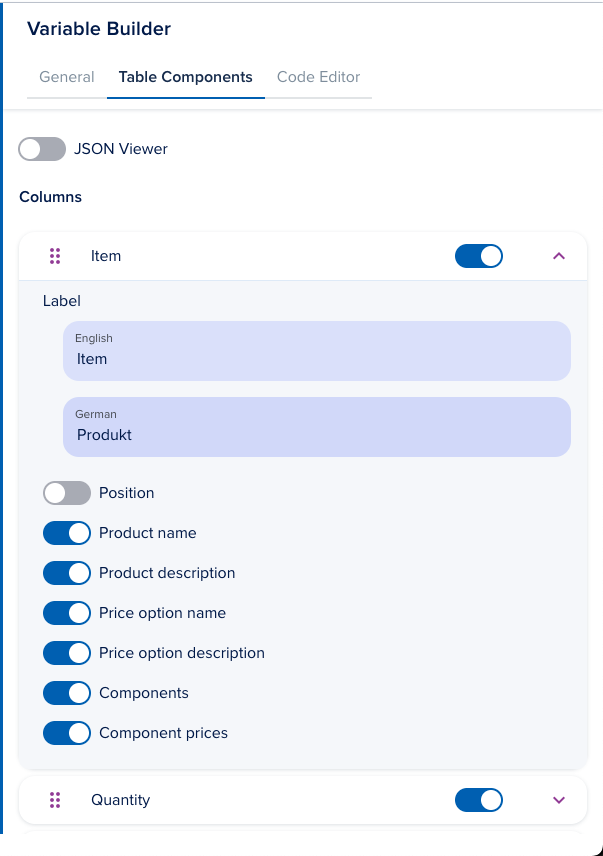

# Template Variables

[[API Docs](/api/template-variables)]
[[SDK](https://www.npmjs.com/package/@epilot/template-variables-client)]

:::note
This article is missing content (TODO)
:::

The Template Variables API provides variable discovery and substitution email and document templates using [Handlebars](https://handlebarsjs.com/).

## Template Variables API

This API is called to both discover available variables as well as execute the variable substitution using handlebars.

Each time an email or document template is used, the Template Variable API is called with the appropriate standardised parameters.

The Template Variable API uses the Entity API and others to fetch the correct values for each variable when compiling the template.

## Computed metadata fields

Some entity fields store identifiers (e.g. slugs or UUIDs). The Template Variables API expands selected metadata into computed fields using the `:<field>` suffix.

### Tags

Entities store tag slugs in `_tags`. To access the resolved tag names:

```handlebars
{{<entity_slug>._tags:name}}
```

Other examples:

```handlebars
{{opportunity._tags:name}}
{{_tags:name}}
```

### Purpose

Entities store purpose IDs (UUIDs) in `_purpose` (multi-select). To access the resolved purpose names:

```handlebars
{{<entity_slug>._purpose:name}}
```

Other examples:

```handlebars
{{opportunity._purpose:name}}
{{_purpose:name}}
```

If a purpose ID cannot be resolved, the raw ID is returned as a fallback.

## Variable Picker

We provide a picker UI for users to search and explore available variables.


## Variable Builder

Custom variables can be created using the Variable Builder under Configuration > Templates > Variable Builder, or by going directly to [https://portal.epilot.cloud/app/variable-builder](https://portal.epilot.cloud/app/variable-builder)


You can create the following types of variables:

### Custom Variables


Custom variables can be composed of any text, and, make use of any of the [Handlebars Helpers](#custom-handlebars-helpers).

To use a custom variable on your document template, use this syntax:

```handlebars
{{custom_variable_name}}
```

**Note:** The handlebars helpers can be directly used on document templates. Custom variables are helpful to contain and reuse complex logics or data.

### Order Table Variable


Order tables are used to display a table of items of a given [Order](https://docs.epilot.io/docs/pricing/orders).

They are extremely customizable and can also make use of [Custom Variables](#custom-variables) or [Handlebars Helpers](#custom-handlebars-helpers).




For example, customizing it's columns order, style, removing or adding columns, etc.


Or even completely changing how the table should be rendered, adding a custom header, footer, etc.

To use a custom order table variable on your document template, use this syntax:

```handlebars
{{~~custom_table_key}}
```

## Custom Handlebars Helpers

These are handlebars helpers you can use to further customize your templates.

### Standard Handlebars Helpers

Registers utility helpers from the `handlebars-helpers` library for categories like `math`, `number`, `date`, `comparison`, `match`, `array`, `regex`, `collection`, `object`, `string`, `html`, `markdown`, `url`, and `moment`. Examples include arithmetic operations (`{{add 1 2}}` → `3`), number formatting (`{{formatNumber 1000}}`), date manipulation, conditional logic (`{{ifEq a b}}`), array operations (`{{first arr}}`), and string manipulation (`{{uppercase str}}`).

```handlebars
{{add 1 2}}
```

### formatAddress

This helper formats an address object into a string using `buildFullAddress`. Returns an empty string if the input is not a valid address object.

```handlebars
{{formatAddress 'billing_address.0'}}
```

### calculateColspan

Calculates the colspan for table cells based on the table configuration. Starts with the total number of columns minus 3, adjusts for disabled columns, the presence of an `amount_tax` column, and whether `net_total` is enabled in the footer. Ensures the result is non-negative. Used on [Order Table Variables](#order-table-variable).

```handlebars
{{calculateColspan table_config}}
```

### calculatePeriodColspan

Determines the colspan for period-related table columns. Returns 2 if there are more than 3 enabled columns, 1 if exactly 3 enabled columns and `net_total` is enabled in the footer, or 1 for fewer than 3 enabled columns. Used on [Order Table Variables](#order-table-variable).

```handlebars
{{calculatePeriodColspan table_config}}
```

### calculateSummaryColspan

Calculates the colspan for summary sections by counting the number of enabled and draggable columns in the table header. Returns 0 if no columns are defined. Used on [Order Table Variables](#order-table-variable).

```handlebars
{{calculateSummaryColspan table_config}}
```

### isColumnEnabled

Checks if a specific column is enabled in the table configuration by matching the column ID. Returns `true` if the column exists and is enabled, `false` otherwise. Used on [Order Table Variables](#order-table-variable).

```handlebars
{{isColumnEnabled table_config 'price'}}
```

### shouldDisplayDetails

Determines if detailed information for a specific column should be displayed based on the `showDetails` property of the column in the table configuration. Returns `false` if the column is not found or `showDetails` is not set. Used on [Order Table Variables](#order-table-variable).

```handlebars
{{shouldDisplayDetails table_config 'description'}}
```

### isSummaryVisible

Checks if the summary section is visible by determining if there is at least one enabled column that is not draggable in the table configuration. Used on [Order Table Variables](#order-table-variable).

```handlebars
{{isSummaryVisible table_config}}
```

### isExternalFeesMetadataVisible

Determines if external fees metadata is visible based on the `enable` property of `external_fees_metadata` in the table footer configuration. Used on [Order Table Variables](#order-table-variable).

```handlebars
{{isExternalFeesMetadataVisible table_config}}
```

### gt

Compares two numbers and returns `true` if the first is greater than the second.

```handlebars
{{gt 5 3}}
```

### lt

Compares two numbers and returns `true` if the first is less than the second.

```handlebars
{{lt 3 5}}
```

### eq

Compares two numbers and returns `true` if they are equal.

```handlebars
{{eq 5 5}}
```

### blockHelperMissing

Returns an empty string when a block helper is missing, ensuring no output is rendered.

```handlebars
{{#missingBlock}}content{{/missingBlock}}
```

### helperMissing

Returns an empty string when a helper is not found, preventing errors in the template.

### makeStyle

Converts a table configuration object into a CSS style string by mapping non-object properties to `key: value` pairs, joined with semicolons. Ignores object values and falsy values. Used on [Order Table Variables](#order-table-variable).

```handlebars
{{makeStyle table_config.style}}
```

### ```<schema>.<property>```

Dynamically registered based on schema attributes (e.g., `main.email`, `contact.name`). Retrieves a specific property value from the context data, prioritizing items tagged as "primary" or the first item in an array. If the property is an address identifier (e.g., `street`, `city`), it formats it as a full address using `buildFullAddress`. Supports nested attributes for repeatable or relational schemas.

```handlebars
{{main.email}}
```

### email

Retrieves email data from the context, prioritizing `email` or `billing_email` identifiers. If the data is an array, it takes the first element. Returns the matched value or an empty string if not found.

```handlebars
{{email "contact"}}
```

### billing_email

Retrieves billing email data from the context, prioritizing `billing_email` or `email` identifiers. If the data is an array, it takes the first element. Returns the matched value or an empty string if not found.

```handlebars
{{billing_email "contact"}}
```

### phone

Retrieves phone data from the context, prioritizing `phone` or `billing_phone` identifiers. If the data is an array, it takes the first element. Returns the matched value or an empty string if not found.

```handlebars
{{phone "contact"}}
```

### billing_phone

Retrieves billing phone data from the context, prioritizing `billing_phone` or `phone` identifiers. If the data is an array, it takes the first element. Returns the matched value or an empty string if not found.

```handlebars
{{billing_phone "contact"}}
```

### address

Formats an address from the context data (e.g., `this`, `this.order`, `this.contact`) by searching for addresses with `billing` or `primary` tags. Uses `buildFullAddress` to format the address. Falls back to the first address if no tagged address is found.

```handlebars
{{address}}
```

### billing_address

Formats an address from the context data by searching for addresses with `billing`, `shipping`, or `primary` tags. Uses `buildFullAddress` to format the address. Falls back to the first address if no tagged address is found.

```handlebars
{{billing_address}}
```

### shipping_address

Formats an address from the context data by searching for addresses with `shipping`, `billing`, or `primary` tags. Uses `buildFullAddress` to format the address. Falls back to the first address if no tagged address is found.

```handlebars
{{shipping_address}}
```

### delivery_address

Formats an address from the context data by searching for addresses with `delivery` or `primary` tags. Uses `buildFullAddress` to format the address. Falls back to the first delivery address if no tagged address is found.

```handlebars
{{delivery_address}}
```

### additional_address

Formats an address from the context data by searching for addresses with `primary` tags. Uses `buildFullAddress` to format the address.

```handlebars
{{additional_address}}
```

### withTag

Retrieves a value from an array of items based on a specified tag (defaults to `primary`) and optional attribute. Uses `getValueByTag` to find the matching item and return the attribute value or a formatted address.

```handlebars
{{withTag items tag="primary" attribute="email"}}
```

### yn

Converts a boolean-like value (using the `yn` library) to a translated "Yes" or "No" string (via `i18n.t`). Optionally returns custom `success` or `failure` values if provided.

```handlebars
{{yn true}}
```

### xif

Returns an "x" if the input evaluates to true (via `yn`), otherwise an empty string.

```handlebars
{{xif true}}
```

### customOrderTableVariable

Renders a [Order Table Variable](#order-table-variable).

```handlebars
{{~~custom_table_key}}
```

### formatDateTime

Formats a date/time string using `formatDateTimeIfPossible` with a specified pattern (defaults to `JODA_SHORT_DATE_TIME_FORMAT`).

```handlebars
{{formatDateTime "2025-05-13" "yyyy-MM-dd HH:mm"}}
```

### formatDate

Formats a date string using `formatDateTimeIfPossible` with a specified pattern (defaults to `JODA_DATE_FORMAT`).

```handlebars
{{formatDate "2025-05-13" "yyyy-MM-dd"}}
```

### dateMath

Performs date arithmetic (e.g., adding/subtracting days) using `calculateDate`. Accepts parameters like `inputDate`, `expression`, `inputFormat`, and `format`. Logs errors if processing fails.

```handlebars
{{dateMath "2025-05-13" "+1d"}}
```

### padStart

Pads a string to a target length with a specified pad string (defaults to space) using `padStartHelper`.

```handlebars
{{padStart "5" 3 "0"}}
```

### generateJourneyLink

Generates a journey link based on provided options using `generateJourneyLink`. Logs errors if processing fails.

The helper accepts space separated key-value pairs as arguments (example: param1=value1), which end up in options.hash

It requires journey_id to be passed as a parameter and can have the following manually parsed parameters:

- custom_url: Custom domain to be used in the URL
- expires_in: Expiration time of the token ([ms](https://github.com/vercel/ms))
- nonce: Boolean to add a nonce to the payload

The helper will add the initial_submission_id to the payload if it's available in the context

```handlebars
{{generateJourneyLink hash.journeyId="123"}}
```

### asCurrency

Uses [@epilot/pricing](https://github.com/epilot-dev/pricing) to format the amount using `formatAmount` or `formatAmountFromString`. Accepts `currency` (defaults to `DEFAULT_CURRENCY`), `locale` (defaults to `de`), and `displayZeroAmount` (defaults to `false`). Returns an empty string for invalid or zero amounts unless `displayZeroAmount` is true.

```handlebars
{{asCurrency 100.50 "EUR"}}
```

## Excel-like Formulas

You can also use Excel-like formulas in your templates with the `calc` helper.

Examples:

```handlebars
Price: {{price}}
Qty: {{qty}}

Total (rounded 2): {{ calc "ROUND(price * qty, 2)" }}
Discounted: {{ calc "ROUND((price * qty) * (1 - discount), 2)" }}

Caps with IF: {{ calc "IF(qty > 10, 10, qty)" }}

Using named args override:
{{ calc "ROUND(a + b, 0)" a=fee b=shipping }}

Min/Max:
{{ calc "MAX(price1, price2, price3)" }}
```

## Available formulas

### Arithmetic operators

- `+` - Addition
- `-` - Subtraction
- `*` - Multiplication
- `/` - Division
- `^` - Exponentiation
- `%` - Modulus (remainder of division)
- `()` - Parentheses for grouping expressions
- `-number` - Negation (unary minus)

### Formula functions

- `ABS(number)` - Returns the absolute value of a number.
- `AND(condition1, condition2, ...)` - Returns `true` if all conditions are truthy.
- `AVERAGE(number1, number2, ...)` - Returns the average of a set of numbers.
- `CEIL(number)` - Rounds a number up to the nearest integer.
- `FLOOR(number)` - Rounds a number down to the nearest integer.
- `IF(condition, value_if_true, value_if_false)` - Returns one value if condition is truthy and another value if it's falsey.
- `MAX(number1, number2, ...)` - Returns the largest number in a set of numbers.
- `MIN(number1, number2, ...)` - Returns the smallest number in a set of numbers.
- `NOT(condition)` - Reverses the value of its argument. Returns `true` if its argument is truthy and `false` if its argument is falsey.
- `OR(condition1, condition2, ...)` - Returns `true` if any condition is truthy.
- `ROUND(number, [places])` - Rounds a number to a specified number of decimal places. If places is omitted, it defaults to 0.
- `SUM(number1, number2, ...)` - Returns the sum of a set of numbers.
- `RAND()` - Returns a random number between 0 (inclusive) and 1 (exclusive).

### Date functions

All date functions work with ISO 8601 date strings (e.g., "2025-09-26" or "2025-09-26T12:00:00Z") and use UTC by default with optional timezone support.

#### Current time
- `NOW([timezone])` - Returns the current date and time in ISO format (e.g., "2025-09-26T12:00:00.000Z")
- `TODAY([timezone])` - Returns the current date in ISO format (e.g., "2025-09-26")

#### Date arithmetic
- `DATEADD(date, value, unit, [timezone])` - Adds/subtracts time from a date
  - Units: "years", "quarters", "months", "weeks", "days", "hours", "minutes", "seconds"
- `DATEDIFF(start_date, end_date, unit, [timezone])` - Calculates difference between dates
  - Returns floor of the difference (e.g., 1.9 months = 1)

#### Date components
- `YEAR(date, [timezone])` - Extract year (e.g., 2025)
- `MONTH(date, [timezone])` - Extract month (1-12)
- `DAY(date, [timezone])` - Extract day of month (1-31)
- `HOUR(date, [timezone])` - Extract hour (0-23)
- `MINUTE(date, [timezone])` - Extract minute (0-59)
- `SECOND(date, [timezone])` - Extract second (0-59)
- `WEEKDAY(date, [type], [timezone])` - Get day of week
  - `type=1`: Sunday=1, Saturday=7 (Excel default)
  - `type=2` or omitted: Monday=1, Sunday=7 (ISO)
  - `type=3`: Monday=0, Sunday=6

#### Week calculations
- `WEEKNUM(date, [type], [timezone])` - Get ISO week number of the year

#### Examples

```handlebars
<!-- Add 14 days to order date -->
Delivery date: {{ calc "DATEADD(order.date, 14, \"days\")" }}

<!-- Calculate age -->
Age: {{ calc "DATEDIFF(birthDate, TODAY(), \"years\")" }} years old

<!-- Extract components -->
Year: {{ calc "YEAR(invoice.date)" }}
Month: {{ calc "MONTH(invoice.date)" }}

<!-- Business logic -->
Due date: {{ calc "DATEADD(invoice.date, payment.terms, \"days\")" }}
Overdue: {{ calc "DATEDIFF(invoice.dueDate, TODAY(), \"days\") < 0" }}

<!-- Timezone handling -->
Local date: {{ calc "TODAY(\"Europe/Helsinki\")" }}
```
