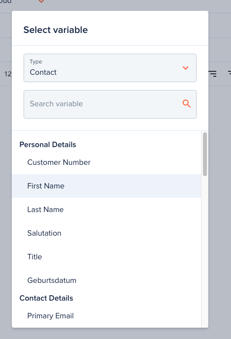
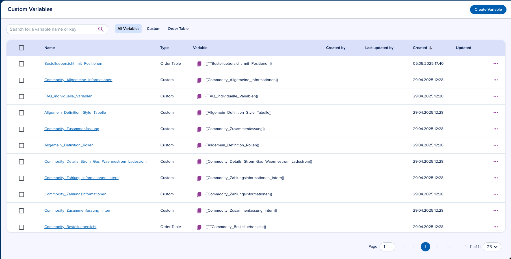
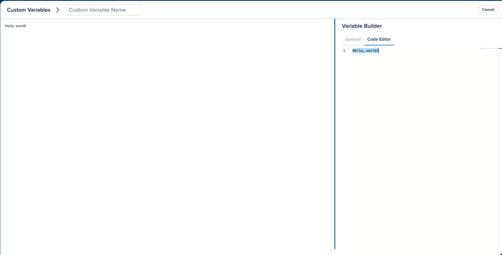
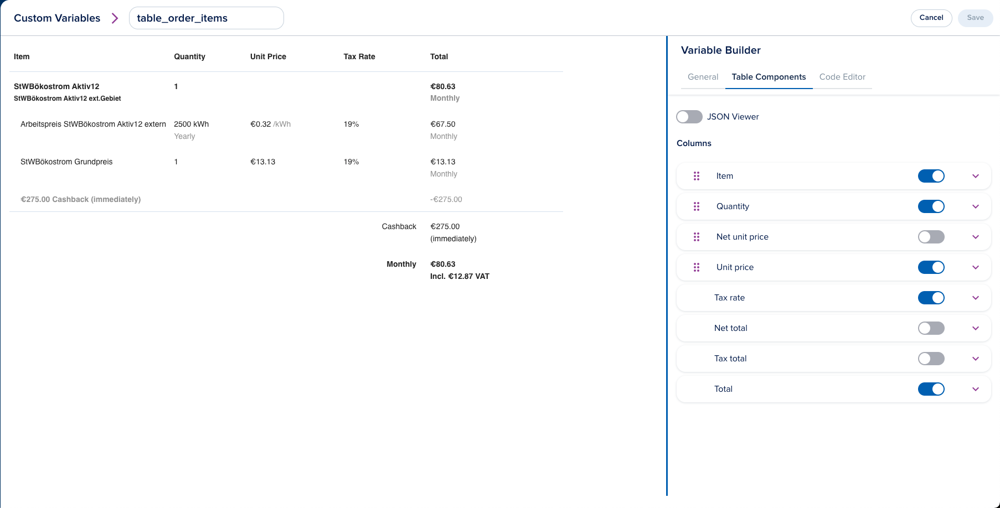
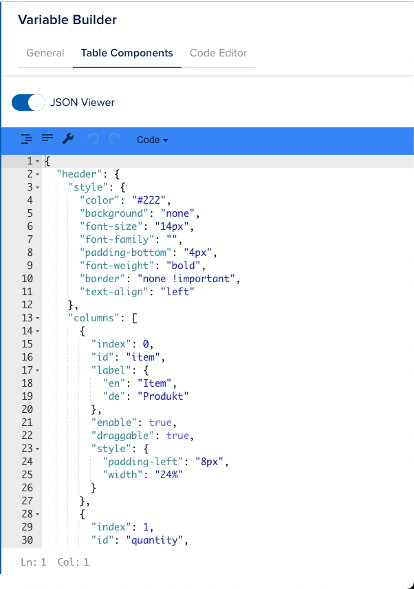
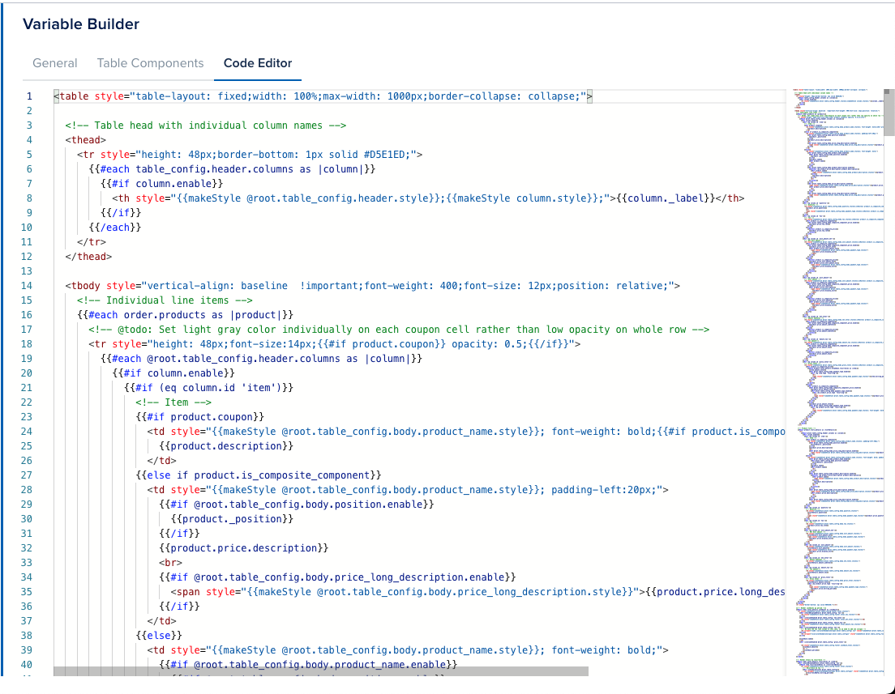

# Template Variables

[[API Docs](/api/template-variables)]
[[SDK](https://www.npmjs.com/package/@epilot/template-variables-client)]

The Template Variables API handles variable discovery and substitution for email and document templates using [Handlebars](https://handlebarsjs.com/).

## Template Variables API

The API discovers available variables and executes substitution. When a template renders, the API fetches entity data and other context to resolve each variable.

## Computed metadata fields

Some entity fields store identifiers (slugs or UUIDs). The API expands these into human-readable values using the `:<field>` suffix.

### Tags

Access resolved tag names from the `_tags` slug array:

```handlebars
{{<entity_slug>._tags:name}}
{{opportunity._tags:name}}
{{_tags:name}}
```

### Purpose

Access resolved purpose names from the `_purpose` UUID array:

```handlebars
{{<entity_slug>._purpose:name}}
{{opportunity._purpose:name}}
{{_purpose:name}}
```

If a purpose ID cannot be resolved, the raw ID is returned.

## Variable Picker

The variable picker UI lets users search and explore available variables.



## Variable Builder

Create custom variables in **Configuration > Templates > Variable Builder** ([direct link](https://portal.epilot.cloud/app/variable-builder)).



### Custom Variables



Custom variables combine free text with any [Handlebars helper](#custom-handlebars-helpers). Reference them in templates with:

```handlebars
{{custom_variable_name}}
```

:::tip
You can use Handlebars helpers directly in templates. Custom variables are useful for encapsulating reusable logic.
:::

### Order Table Variable



Order tables display line items from an [Order](/docs/pricing/orders). They support [Custom Variables](#custom-variables) and [Handlebars Helpers](#custom-handlebars-helpers).




Customize column order, styling, visibility, headers, and footers.



Reference an order table variable in templates with:

```handlebars
{{~~custom_table_key}}
```

## Custom Handlebars Helpers

### Standard Handlebars Helpers

All helpers from the [`handlebars-helpers`](https://github.com/helpers/handlebars-helpers) library are available: `math`, `number`, `date`, `comparison`, `array`, `string`, `object`, `url`, and more.

```handlebars
{{add 1 2}}
```

### formatAddress

Formats an address object into a single-line string. Returns empty string for invalid input.

```handlebars
{{formatAddress 'billing_address.0'}}
```

### calculateColspan

Calculates the colspan for table cells based on the table configuration. Used with [Order Table Variables](#order-table-variable).

```handlebars
{{calculateColspan table_config}}
```

### calculatePeriodColspan

Calculates the colspan for period-related table columns. Used with [Order Table Variables](#order-table-variable).

```handlebars
{{calculatePeriodColspan table_config}}
```

### calculateSummaryColspan

Calculates the colspan for summary sections based on enabled columns. Used with [Order Table Variables](#order-table-variable).

```handlebars
{{calculateSummaryColspan table_config}}
```

### isColumnEnabled

Returns `true` if the specified column ID is enabled in the table configuration. Used with [Order Table Variables](#order-table-variable).

```handlebars
{{isColumnEnabled table_config 'price'}}
```

### shouldDisplayDetails

Returns `true` if the column's `showDetails` property is set. Used with [Order Table Variables](#order-table-variable).

```handlebars
{{shouldDisplayDetails table_config 'description'}}
```

### isSummaryVisible

Returns `true` if at least one non-draggable column is enabled. Used with [Order Table Variables](#order-table-variable).

```handlebars
{{isSummaryVisible table_config}}
```

### isExternalFeesMetadataVisible

Returns `true` if `external_fees_metadata` is enabled in the table footer. Used with [Order Table Variables](#order-table-variable).

```handlebars
{{isExternalFeesMetadataVisible table_config}}
```

### gt

Compares two numbers and returns `true` if the first is greater than the second.

```handlebars
{{gt 5 3}}
```

### lt

Compares two numbers and returns `true` if the first is less than the second.

```handlebars
{{lt 3 5}}
```

### eq

Compares two numbers and returns `true` if they are equal.

```handlebars
{{eq 5 5}}
```

### blockHelperMissing

Returns an empty string when a block helper is missing.

```handlebars
{{#missingBlock}}content{{/missingBlock}}
```

### helperMissing

Returns an empty string when a helper is not found.

### makeStyle

Converts a table configuration object into a CSS style string. Used with [Order Table Variables](#order-table-variable).

```handlebars
{{makeStyle table_config.style}}
```

### ```<schema>.<property>```

Dynamically registered from schema attributes (e.g., `main.email`, `contact.name`). Retrieves a property value from context data, prioritizing items tagged as "primary" or the first array element. Address properties are automatically formatted as full addresses.

```handlebars
{{main.email}}
```

### email

Retrieves the email from context, prioritizing `email` then `billing_email`. Returns the first element if the value is an array.

```handlebars
{{email "contact"}}
```

### billing_email

Retrieves the billing email from context, prioritizing `billing_email` then `email`. Returns the first element if the value is an array.

```handlebars
{{billing_email "contact"}}
```

### phone

Retrieves the phone number from context, prioritizing `phone` then `billing_phone`. Returns the first element if the value is an array.

```handlebars
{{phone "contact"}}
```

### billing_phone

Retrieves the billing phone from context, prioritizing `billing_phone` then `phone`. Returns the first element if the value is an array.

```handlebars
{{billing_phone "contact"}}
```

### address

Formats an address from context, searching for addresses tagged `billing` or `primary`. Falls back to the first address.

```handlebars
{{address}}
```

### billing_address

Formats an address from context, searching for addresses tagged `billing`, `shipping`, or `primary`. Falls back to the first address.

```handlebars
{{billing_address}}
```

### shipping_address

Formats an address from context, searching for addresses tagged `shipping`, `billing`, or `primary`. Falls back to the first address.

```handlebars
{{shipping_address}}
```

### delivery_address

Formats an address from context, searching for addresses tagged `delivery` or `primary`. Falls back to the first delivery address.

```handlebars
{{delivery_address}}
```

### additional_address

Formats an address from context, searching for addresses tagged `primary`.

```handlebars
{{additional_address}}
```

### withTag

Retrieves a value from an array by tag (defaults to `primary`) and optional attribute.

```handlebars
{{withTag items tag="primary" attribute="email"}}
```

### yn

Converts a boolean-like value to a localized "Yes" or "No" string. Accepts optional custom `success`/`failure` values.

```handlebars
{{yn true}}
```

### xif

Returns `"x"` if the input is truthy, otherwise an empty string.

```handlebars
{{xif true}}
```

### customOrderTableVariable

Renders an [Order Table Variable](#order-table-variable).

```handlebars
{{~~custom_table_key}}
```

### formatDateTime

Formats a date/time string with a specified pattern. Defaults to short date-time format.

```handlebars
{{formatDateTime "2025-05-13" "yyyy-MM-dd HH:mm"}}
```

### formatDate

Formats a date string with a specified pattern. Defaults to date-only format.

```handlebars
{{formatDate "2025-05-13" "yyyy-MM-dd"}}
```

### dateMath

Performs date arithmetic (add/subtract days, months, etc.). Accepts `inputDate`, `expression`, `inputFormat`, and `format` parameters.

```handlebars
{{dateMath "2025-05-13" "+1d"}}
```

### padStart

Pads a string to a target length with a specified character (defaults to space).

```handlebars
{{padStart "5" 3 "0"}}
```

### generateJourneyLink

Generates a signed journey link. Pass parameters as space-separated key-value pairs.

**Required**: `journey_id`

**Optional**:
- `custom_url` -- custom domain for the URL
- `expires_in` -- token expiration ([ms format](https://github.com/vercel/ms))
- `nonce` -- add a nonce to the payload (boolean)

Automatically includes `initial_submission_id` from context when available.

```handlebars
{{generateJourneyLink hash.journeyId="123"}}
```

### asCurrency

Formats a number as a currency string using [@epilot/pricing](https://github.com/epilot-dev/pricing). Accepts `currency` (default: `EUR`), `locale` (default: `de`), and `displayZeroAmount` (default: `false`).

```handlebars
{{asCurrency 100.50 "EUR"}}
```

## Excel-like Formulas

Use the `calc` helper for Excel-like formulas in templates.

```handlebars
Price: {{price}}
Qty: {{qty}}

Total (rounded 2): {{ calc "ROUND(price * qty, 2)" }}
Discounted: {{ calc "ROUND((price * qty) * (1 - discount), 2)" }}

Caps with IF: {{ calc "IF(qty > 10, 10, qty)" }}

Using named args override:
{{ calc "ROUND(a + b, 0)" a=fee b=shipping }}

Min/Max:
{{ calc "MAX(price1, price2, price3)" }}
```

## Available formulas

### Arithmetic operators

- `+` - Addition
- `-` - Subtraction
- `*` - Multiplication
- `/` - Division
- `^` - Exponentiation
- `%` - Modulus (remainder of division)
- `()` - Parentheses for grouping expressions
- `-number` - Negation (unary minus)

### Formula functions

- `ABS(number)` - Returns the absolute value of a number.
- `AND(condition1, condition2, ...)` - Returns `true` if all conditions are truthy.
- `AVERAGE(number1, number2, ...)` - Returns the average of a set of numbers.
- `CEIL(number)` - Rounds a number up to the nearest integer.
- `FLOOR(number)` - Rounds a number down to the nearest integer.
- `IF(condition, value_if_true, value_if_false)` - Returns one value if condition is truthy and another value if it's falsey.
- `MAX(number1, number2, ...)` - Returns the largest number in a set of numbers.
- `MIN(number1, number2, ...)` - Returns the smallest number in a set of numbers.
- `NOT(condition)` - Reverses the value of its argument. Returns `true` if its argument is truthy and `false` if its argument is falsey.
- `OR(condition1, condition2, ...)` - Returns `true` if any condition is truthy.
- `ROUND(number, [places])` - Rounds a number to a specified number of decimal places. If places is omitted, it defaults to 0.
- `SUM(number1, number2, ...)` - Returns the sum of a set of numbers.
- `RAND()` - Returns a random number between 0 (inclusive) and 1 (exclusive).

### Date functions

All date functions work with ISO 8601 date strings (e.g., "2025-09-26" or "2025-09-26T12:00:00Z") and use UTC by default with optional timezone support.

#### Current time
- `NOW([timezone])` - Returns the current date and time in ISO format (e.g., "2025-09-26T12:00:00.000Z")
- `TODAY([timezone])` - Returns the current date in ISO format (e.g., "2025-09-26")

#### Date arithmetic
- `DATEADD(date, value, unit, [timezone])` - Adds/subtracts time from a date
  - Units: "years", "quarters", "months", "weeks", "days", "hours", "minutes", "seconds"
- `DATEDIFF(start_date, end_date, unit, [timezone])` - Calculates difference between dates
  - Returns floor of the difference (e.g., 1.9 months = 1)

#### Date components
- `YEAR(date, [timezone])` - Extract year (e.g., 2025)
- `MONTH(date, [timezone])` - Extract month (1-12)
- `DAY(date, [timezone])` - Extract day of month (1-31)
- `HOUR(date, [timezone])` - Extract hour (0-23)
- `MINUTE(date, [timezone])` - Extract minute (0-59)
- `SECOND(date, [timezone])` - Extract second (0-59)
- `WEEKDAY(date, [type], [timezone])` - Get day of week
  - `type=1`: Sunday=1, Saturday=7 (Excel default)
  - `type=2` or omitted: Monday=1, Sunday=7 (ISO)
  - `type=3`: Monday=0, Sunday=6

#### Week calculations
- `WEEKNUM(date, [type], [timezone])` - Get ISO week number of the year

#### Examples

```handlebars
<!-- Add 14 days to order date -->
Delivery date: {{ calc "DATEADD(order.date, 14, \"days\")" }}

<!-- Calculate age -->
Age: {{ calc "DATEDIFF(birthDate, TODAY(), \"years\")" }} years old

<!-- Extract components -->
Year: {{ calc "YEAR(invoice.date)" }}
Month: {{ calc "MONTH(invoice.date)" }}

<!-- Business logic -->
Due date: {{ calc "DATEADD(invoice.date, payment.terms, \"days\")" }}
Overdue: {{ calc "DATEDIFF(invoice.dueDate, TODAY(), \"days\") < 0" }}

<!-- Timezone handling -->
Local date: {{ calc "TODAY(\"Europe/Helsinki\")" }}
```
