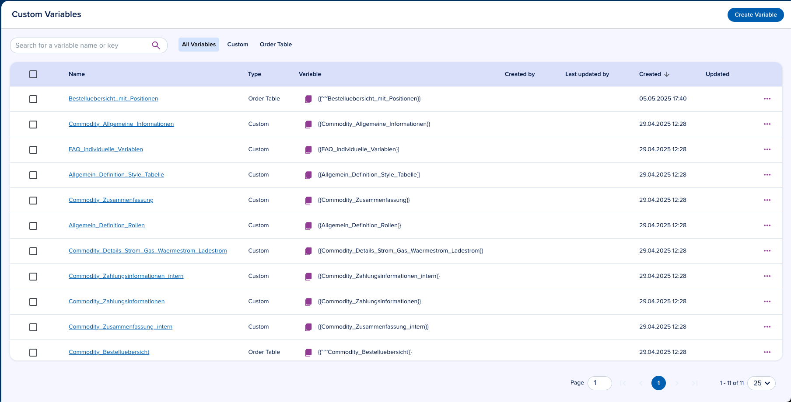
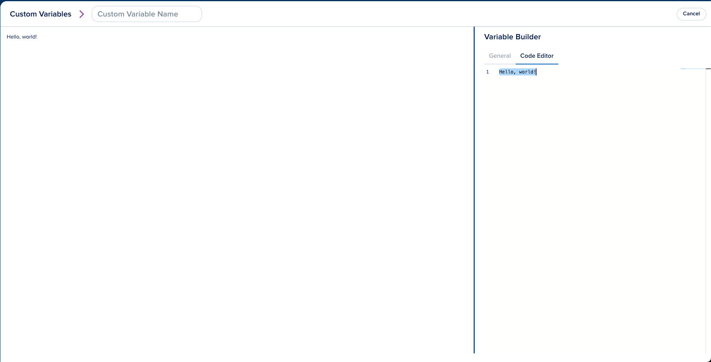
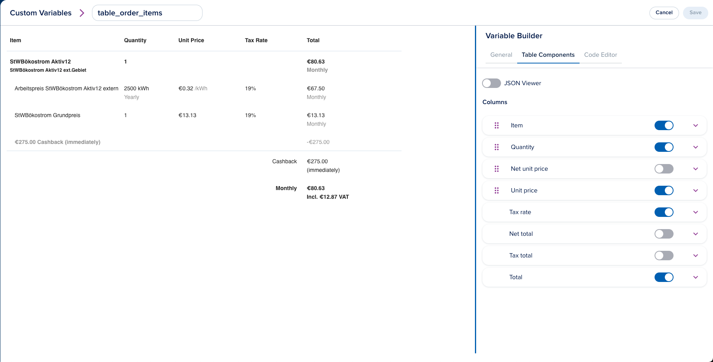

# Template Variables

[[API Docs](/api/template-variables)]
[[SDK](https://www.npmjs.com/package/@epilot/sdk)]

The Template Variables API handles variable discovery and substitution for email and document templates using [Handlebars](https://handlebarsjs.com/).

## Overview

Template variables allow you to insert dynamic content into your templates. When a template renders, the API fetches entity data and resolves each variable to its actual value.

```handlebars
Hello {{contact.first_name}},

Your order {{order._title}} has been confirmed.
Total: {{asCurrency order.total "EUR"}}
```

For a complete list of available variables and helpers, see the [Variable Reference](/docs/templates/variable-reference).

## Quick Start

### Basic Entity Variables

Access entity attributes using the entity slug as a prefix:

```handlebars
{{contact.first_name}}
{{contact.last_name}}
{{order._title}}
{{opportunity.billing_address}}
```

### System Variables

```handlebars
{{system.date}}    <!-- Current date -->
{{system.time}}    <!-- Current time -->
```

### Environment Variables

Reference organization-level configuration. See [Environments & Secrets](/docs/environments/environments-secrets).

```handlebars
{{env.portal.domain}}
{{env.erp_api.base_url}}
```

## Variable Picker

The variable picker UI in the template editor lets users search and explore available variables. Use it to discover entity attributes, helpers, and custom variables.



## Custom Variables

Create reusable template logic in **Configuration > Templates > Variable Builder** ([direct link](https://portal.epilot.cloud/app/variable-builder)).



Custom variables combine free text with Handlebars helpers. Reference them in templates with:

```handlebars
{{custom_variable_name}}
```

For details, see [Custom Variables](/docs/templates/custom-variables).

### Order Table Variables

Order table variables display line items from an [Order](/docs/pricing/orders) with configurable columns, styling, and footers.



Reference order tables with the `~~` prefix:

```handlebars
{{~~custom_table_key}}
```

## Computed Metadata Fields

Some entity fields store identifiers (slugs or UUIDs). The API expands these into human-readable values using the `:<field>` suffix.

### Tags

Access resolved tag names from the `_tags` slug array:

```handlebars
{{opportunity._tags:name}}
{{_tags:name}}
```

### Purpose

Access resolved purpose names from the `_purpose` UUID array:

```handlebars
{{opportunity._purpose:name}}
{{_purpose:name}}
```

## Handlebars Helpers

epilot provides a rich set of Handlebars helpers for formatting, calculations, and logic. Here are the most commonly used:

### Date Formatting

```handlebars
{{formatDate "2025-05-13" "dd.MM.yyyy"}}
{{formatDateTime order.created_at}}
{{dateMath order.date "+14d"}}
```

### Currency Formatting

```handlebars
{{asCurrency 1000 "EUR"}}
{{asCurrency order.total "EUR" "de"}}
```

### Address Formatting

```handlebars
{{formatAddress 'billing_address.0'}}
{{billing_address}}
{{shipping_address}}
```

### Boolean Formatting

```handlebars
{{yn is_active}}              <!-- Yes/No -->
{{yn is_active "On" "Off"}}   <!-- Custom labels -->
```

### Tag-Based Filtering

```handlebars
{{withTag contacts tag="billing" attribute="email"}}
```

For the complete helper reference, see [Variable Reference - Handlebars Helpers](/docs/templates/variable-reference#handlebars-helpers).

## Excel-like Formulas

Use the `calc` helper for Excel-like formulas:

```handlebars
{{calc "ROUND(price * quantity, 2)"}}
{{calc "IF(qty > 10, 10, qty)"}}
{{calc "SUM(price1, price2, price3)"}}
{{calc "DATEADD(order.date, 14, \"days\")"}}
```

### Available Functions

| Category | Functions |
|----------|-----------|
| **Math** | `ABS`, `CEIL`, `FLOOR`, `ROUND`, `SUM`, `AVERAGE`, `MIN`, `MAX`, `RAND` |
| **Logic** | `IF`, `AND`, `OR`, `NOT` |
| **Date** | `NOW`, `TODAY`, `DATEADD`, `DATEDIFF`, `YEAR`, `MONTH`, `DAY`, `HOUR`, `MINUTE`, `SECOND`, `WEEKDAY`, `WEEKNUM` |

For detailed formula documentation, see [Variable Reference - Excel-like Formulas](/docs/templates/variable-reference#excel-like-formulas).

## Where Variables Are Supported

Template variables are supported across epilot:

| Feature | Description |
|---------|-------------|
| **Email templates** | Subject lines and body content |
| **Document templates** | Word documents (.docx) with variable placeholders |
| **Webhooks** | URL, headers, and payload content |
| **Automation actions** | Action parameters and payloads |
| **Entity mapping** | Transformation rules |
| **Customer Portal** | Dynamic content and links |
| **ERP integrations** | Configuration and data transformation |

## Related Documentation

- [Variable Reference](/docs/templates/variable-reference) - Complete list of variables and helpers
- [Custom Variables](/docs/templates/custom-variables) - Create reusable template logic
- [Email Templates](/docs/templates/email-templates) - Email template configuration
- [Document Templates](/docs/templates/document-templates) - Document generation
- [Environments & Secrets](/docs/environments/environments-secrets) - Organization-level variables
