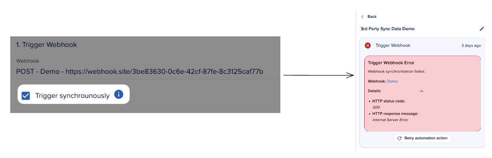
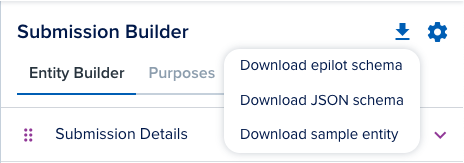

# Webhooks

[[API Docs](/api/webhooks)]
[[SDK](https://www.npmjs.com/package/@epilot/webhooks-client)]

The epilot [Webhooks API](/api/webhooks) provides the possibility to subscribe to epilot public events. This will allow you to receive notifications with payload to your configured webhook URL every time events happen in your account.

This document describes the steps how to configure hooks, subscribe to events and how to manage those configurations. Service is reachable using https connection to ensure encryption between client and service.

Webhooks can be comfortably configured and managed by admin users in epilot portal.

[Webhooks API Documentation](/api/webhooks)

# Synchronous invocation
To get immediate feedback on the success of a webhook request, the webhook can be configured to be invoked synchronously. This will cause the webhook to wait for the response of the request before proceeding. If the request fails, the webhook will be flagged as unsuccessful. This feature has to be enabled in the webhook action of the automation configuration.


### Limitations
Sync webhooks are limited to a maximum duration of 30 seconds. If the request exceeds this time limit, it will be automatically aborted, prompting the webhook to retry the request up to 2 times. If, after these retries, the request continues to fail, the webhook will be flagged as unsuccessful.

# Customization

### Payload configuration

Customizing the payload of an incoming webhook request is entirely feasible. The standard structure for this customization typically follows this general format:

```json
{
   metadata: {
    organization_id: '',
    ...
   }, // always present
   entity: {} // always present,
   relations: {} // optional,
   activity: {} // optional,
   changed_attributes: {
      added: {},
      deleted: {},
      updated: {}
   } // optional
}
```
- Include Changed Attributes
  - shows the ***changed*** added|deleted|updated attributes ***after*** the event
  - important note: this will only be included if the event is a change event e.g. an `Entity update: Opportunity` automation trigger. Manual trigger will not fill changed attribures.
- Include Activity
- Include Relations
  - **hydrated** relations to other entities
  - important note: including this can increase the payload size significantly


### Entity schemas

You can use the Entity API to get a full [JSON schema](http://localhost:3000/api/entity#tag/Schemas/operation/getJsonSchema) and a [JSON example](/api/entity#tag/Schemas/operation/getSchemaExample) of an entity part of your webhook. Alternatively, you can download these from the 360 Portal for each of your entities from the entity builder UI.



### Custom oauth parameter

Custom OAuth parameters can be seamlessly integrated into the webhook configuration process. These parameters can be included as part of the OAuth request, appended as body, query, or header parameters. This feature empowers users to augment the OAuth request with supplementary information as needed, enhancing the flexibility and customization options within the authentication flow.


# Limitations

## Timeout
As previously mentioned, the webhook request times out after 30 seconds for synchronous webhooks. For asynchronous webhooks, the request will not time out, but the webhook will be flagged as unsuccessful if the request takes longer than 2 minutes to complete. This is to prevent the webhook from being stuck in a pending state indefinitely. Contact support if you need to increase this timeout. Keep in mind that for long running requests, it is recommend to handle them asynchronously on the 3rd party side and return a 202 Accepted response to the webhook request.