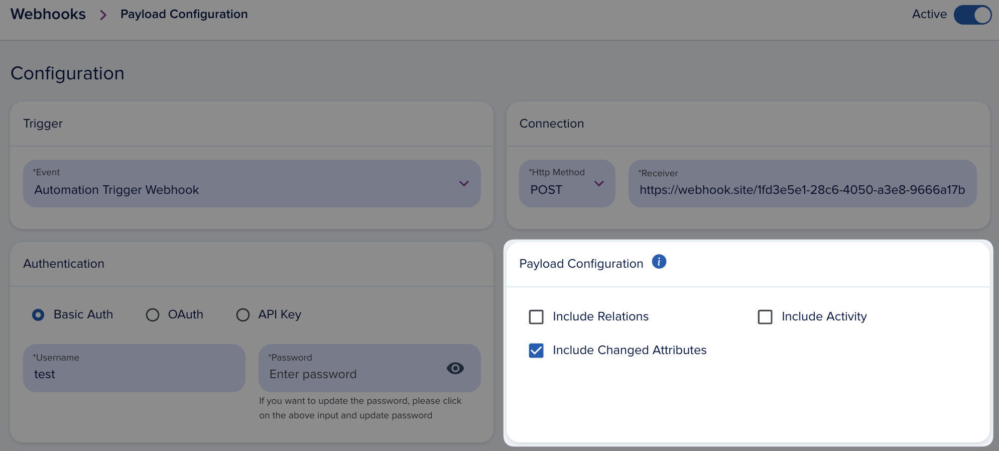
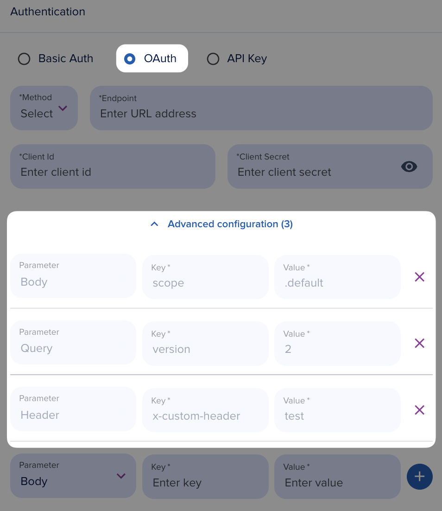

# Webhooks

[[API Docs](/api/webhooks)]
[[SDK](https://www.npmjs.com/package/@epilot/webhooks-client)]

The epilot [Webhooks API](/api/webhooks) provides the possibility to subscribe to epilot public events. This will allow you to receive notifications with payload to your configured webhook URL every time events happen in your account.

This document describes the steps how to configure hooks, subscribe to events and how to manage those configurations. Service is reachable using https connection to ensure encryption between client and service.

Webhooks can be comfortably configured and managed by admin users in epilot portal.

[Webhooks API Documentation](/api/webhooks)


# Customization

### Payload configuration

Customizing the payload of an incoming webhook request is entirely feasible. The standard structure for this customization typically follows this general format:

```json
{
   metadata: {
    organization_id: '',
    ...
   }, // always present
   entity: {} // always present,
   relations: {} // optional,
   activity: {} // optional,
   changed_attributes: {
      added: {},
      deleted: {},
      updated: {}
   } // optional
}
```
- Include Changed Attributes
  - shows the ***changed*** added|deleted|updated attributes ***after*** the event
  - important note: this will only be included if the event is a change event e.g. an `Entity update: Opportunity` automation trigger. Manual trigger will not fill changed attribures.
- Include Activity
- Include Relations
  - **hydrated** relations to other entities
  - important note: including this can increase the payload size significantly



### Custom oauth parameter

Custom OAuth parameters can be seamlessly integrated into the webhook configuration process. These parameters can be included as part of the OAuth request, appended as body, query, or header parameters. This feature empowers users to augment the OAuth request with supplementary information as needed, enhancing the flexibility and customization options within the authentication flow.




# Limitations

## Timeout
The maximum allowable duration for a request is 5 seconds. Should the request exceed this time limit, it will be automatically aborted, prompting the webhook to retry the request up to 2 times. If, after these retries, the request continues to fail, the webhook will be flagged as unsuccessful.