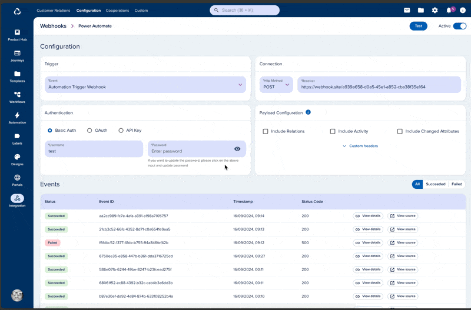

# Webhooks

[[API Docs](/api/webhooks)]
[[SDK](https://www.npmjs.com/package/@epilot/webhooks-client)]

The epilot [Webhooks API](/api/webhooks) provides the possibility to subscribe to epilot public events. This will allow you to receive notifications with payload to your configured webhook URL every time events happen in your account.

This document describes the steps how to configure hooks, subscribe to events and how to manage those configurations. Service is reachable using https connection to ensure encryption between client and service.

Webhooks can be comfortably configured and managed by admin users in epilot portal.

[Webhooks API Documentation](/api/webhooks)

## Data Transmission
Webhooks do use the `Transfer-Encoding: chunked` mechanism when sending HTTP requests. This applies to webhook payloads triggered by various events in the system, ensuring that data is efficiently transmitted to your server.

### What is Transfer-Encoding: chunked?
The Transfer-Encoding: chunked header is used in HTTP/1.1 to send data in small, manageable chunks rather than all at once. With this method, the total size of the content doesn’t need to be known in advance, and data can be sent progressively.

### Why is This Important?
When receiving webhook events from our system:

- Chunked Data Transfer: The HTTP request body will arrive in parts (or "chunks"), each sent with its own size indicator. This means your server will need to handle and process the data as it arrives.
- Streaming Efficiency: This method allows us to stream data efficiently, especially for large payloads, ensuring that your server gets the data without needing to wait for the entire payload to be generated.
- Completion Signal: The transfer is complete when a zero-length chunk is sent, signaling the end of the payload.
How to Handle Chunked Webhook Requests
To ensure proper handling of our webhook payloads, your server must:

- Support chunked transfer encoding: Most modern web servers handle this automatically, but ensure your environment does not reject or misinterpret chunked data.
- Process Data in Chunks: If necessary, ensure your application processes the incoming data incrementally as it arrives.
- End-of-Transfer Detection: Be aware that the payload transmission is complete when a final, empty chunk is received.

### Limitations
The chunked transfer encoding mechanism is not supported by all servers. If your server does not support this feature, please contact our support team for assistance.

Already known services which do not support chunked transfer encoding are:
- [Microsoft Power Automate](https://www.microsoft.com/de-de/power-platform/products/power-automate?market=de)

## Webhook Payload Structure

Webhooks have different payload structures depending on its trigger type. The most common event is the `Automation Trigger Webhook` event. Once this event is selected, you are able to trigger a webhook request within an automation.
The other use case is the `Portal Access Entity Access` event, which is triggered when a user accesses an entity in the portal. This event is used to track user access to entities and can be used to trigger webhooks based on user actions.
The following section describes the payload structure for both event types.

Both events always have a `metadata` object, which contains the organization ID and other metadata about the event. The `entity` object contains the entity data, while the `relations` and `activity` objects are optional and can be included based on the webhook configuration. See more about the [customization options](#customization) below.

```json
{
   "metadata": {
      "organization_id": "org_1234567890",
      "event_type": "automation_trigger_webhook",
      "timestamp": "2023-10-01T12:00:00Z"
   },
   "entity": {
      "_id": "123456",
      "_schema_": "opportunity",
      "name": "New Opportunity",
      "status": "open"
   },
   "relations": [
      // optional relations to other entities
   ],
   "activity": {
      // optional activity data
   },
   "changed_attributes": {
      "added": {},
      "deleted": {},
      "updated": {}
   }
}
```

### Automation Triggers
Once the `Automation Trigger Webhook` event is selected, you can configure the webhook to be triggered by specific automation triggers. The payload structure for this event will include the `metadata`, `entity`, and optional `relations` and `activity` objects, as shown above.

:::info
The structure of the `entity` attribute will depend on the automation trigger source. For example, if the trigger is an `Manual trigger: Contact`, the `entity` object will contain the contact entity data. If the trigger is an `Entity update: Opportunity`, the `entity` object will contain the opportunity entity data.

Generally speaking, the `entity` attribute of the webhook payload is always the entity the automation was started on.
:::

#### Manual Trigger
If you select this trigger e.g. `Manual Trigger: Contact` then the entity consist of the contact entity the automation was triggered on. You can see the exact JSON schema of a given entity by opening the detail view of an entity e.g. a contact detail view and export the schema as a JSON file. This will give you a full overview of the entity structure and its attributes.

You can use the Entity API to get a full [JSON schema](/api/entity#tag/Schemas/operation/getJsonSchema) and a [JSON example](/api/entity#tag/Schemas/operation/getSchemaExample) of an entity part of your webhook. Alternatively, you can download these from the epilot portal for each of your entities from the entity builder UI.


#### Journey Submissions
The payload for journey submissions is always calculated dynamically depending on which blocks and setup you use in your journey. Journeys produce unstructured data in form of submissions. This raw submission is then mapped to schemas i.e. a contact, an opportunity or whatever schema you configured. 

Typically speaking the submission contains an attribute called `mapped_entities`. This array consists of entities being created during an automation execution. The other important attribute `line_items` is an array of orders configured in your journey.


## Testing Webhook Configurations
The webhook configuration can be tested by sending a test request to the configured URL. This feature allows users to verify the webhook configuration and ensure that the request is being sent to the correct endpoint. The test request will include a sample payload, allowing users to verify that the webhook is functioning as expected. This sample payload can be either customized or a entity schema can be used.

## Customization

### Get full control over the webhook payload by using JSONata
[JSONata](https://jsonata.org/) is a lightweight query and transformation language for JSON data. It allows you to extract, transform, and manipulate JSON data in a flexible way. In the context of webhooks, JSONata can be used to customize the payload of the webhook request by defining a transformation expression that specifies how the data should be structured.

To use JSONata in your webhook configuration, you can define a transformation expression that specifies how the data should be structured. This expression can include filters, transformations, and other operations to customize the payload according to your needs.
For example, you can use JSONata to extract specific fields from the entity data, transform the data into a different format, or filter out unnecessary fields. This allows you to create a payload that is tailored to your specific requirements and reduces the amount of data that needs to be transmitted over the network.


:::info
By using JSONata, we give you full control over the webhook payload. You can customize the payload structure, include or exclude specific fields, and transform the data as needed. This flexibility allows you to create a payload that is optimized for your use case and reduces the amount of data that needs to be transmitted. Use the testing feature to verify that your JSONata expression produces the desired payload structure.

You can use the [JSONata online editor](https://try.jsonata.org/) to test your expressions and see the results in real-time. This can help you quickly iterate on your payload structure and ensure that it meets your requirements before deploying it in production.
:::

### How to Use JSONata
To use JSONata in your webhook configuration, follow these steps:
1. **Open the Webhook Configuration**: Navigate to the webhook configuration page in the epilot portal.
2. **Select the JSONata Option**: In the webhook configuration, select the option to use JSONata for customizing the payload.
3. **Define the Transformation Expression**: Enter the JSONata expression that defines how the data should be transformed. You can use the provided example as a starting point and modify it according to your needs.
4. **Test the Configuration**: Use the test feature to verify that the JSONata expression produces the desired payload structure. You can adjust the expression as needed based on the test results.
### Example JSONata Expression

Imagine the following webhook payload structure for an opportunity. Most of the time we are only interested in a sub-set of this data structure. By using JSONata we can simplify the payload and even use its utilities to parse and transform data to your needs.

```json
{
  "metadata": {
    "webhook_id": "kT5iDYx373p6v6hWGJVn9j",
    "organization_id": "739224",
    "webhook_name": "Wewbhook",
    "automation_name": "FLOW#wfjV8L8-fD#TASK#25bdd4ec-4335-434b-938e-9afd91cdc9d5",
    "organization_name": "Epilot Dev",
    "correlation_id": "d7fc4288-381c-41cc-ba74-535e3ae84a0b",
    "creation_timestamp": "2025-07-09T11:50:25.933Z",
    "execution_id": "5cc9432c-a2ae-4649-93e5-ec528eb4e1e4",
    "action_id": "64ec83d2-fa59-44ab-9d27-8dbcbdfde2a9"
  },
  "entity": {
    "status": "open",
    "source": {
      "title": "manual",
      "href": null
    },
    "source_type": "manual",
    "_schema": "opportunity",
    "_id": "21e2c48f-ec99-4cd3-8552-b776c0c0aec5",
    "_org": "739224",
    "_owners": [
      {
        "org_id": "739224",
        "user_id": "10010729"
      }
    ],
    "_created_at": "2025-07-03T06:15:39.776Z",
    "_updated_at": "2025-07-08T13:43:11.069Z",
    "opportunity_number": "OP-6376",
    "_title": "OP-6376",
    "_acl": {
      "view": [
        "org_739224"
      ],
      "edit": [
        "org_739224"
      ],
      "delete": [
        "org_739224"
      ]
    }
  },
  "relations": []
  }
}
```

by using this JSONata query:

```jsonata
{
    "org_id": metadata.organization_id,
    "user_id": $number(entity._owners.user_id),
    "lead_nr": entity.opportunity_number,
    "status": entity.status
}
```

This will result in the following payload:

```json
{
    "org_id": "739224",
    "user_id": 10010729,
    "lead_nr": "OP-6376",
    "status": "open"
}
```
This example demonstrates how to extract specific fields from the webhook payload and transform them into a simplified structure. You can adjust the JSONata expression to include or exclude fields, apply transformations, or filter data as needed.


### Get Additional Attributes

Customizing the payload of an incoming webhook request is entirely feasible. The standard structure for this customization typically follows this general format:

```json
{
   metadata: {
    organization_id: '',
    ...
   }, // always present
   entity: {} // always present,
   relations: {} // optional,
   activity: {} // optional,
   changed_attributes: {
      added: {},
      deleted: {},
      updated: {}
   } // optional
}
```
- Include Changed Attributes
  - shows the ***changed*** added|deleted|updated attributes ***after*** the event
  - important note: this will only be included if the event is a change event e.g. an `Entity update: Opportunity` automation trigger. Manual trigger will not fill changed attribures.
- Include Activity
- Include Relations
  - **hydrated** relations to other entities
  - important note: including this can increase the payload size significantly


### Custom header

Custom headers can be added to the webhook request to provide additional information or authentication. This feature allows users to include custom headers in the webhook request, enhancing the security and customization options available for webhook configurations.


The following headers are forbidden and will be removed from the request:
```
    'x-epilot-org-id',
    'x-ivy-org-id',
    'Authorization',
    'A-IM',
    'Accept-Charset',
    'Accept-Datetime',
    'Accept-Encoding',
    'Cache-Control',
    'Connection',
    'Content-Length',
    'Content-Encoding',
    'Transfer-Encoding',
    'Host',
    'Content-Type',
    'Content-Range',
    'Content-MD5',
    'Range',
    'User-Agent',
    'Date',
    'Expect',
    'Forwarded',
    'From',
    'Host',
    'HTTP2-Settings',
    'If-Match',
    'If-Modified-Since',
    'If-None-Match',
    'If-Range',
    'If-Unmodified-Since',
    'Max-Forwards',
    'Origin',
    'Pragma',
    'Proxy-Authorization',
    'Referer',
    'Server',
    'TE',
    'Trailer',
    'Transfer-Encoding',
    'Upgrade',
    'Via',
    'Warning',
    'x-forwarded-*',
    'x-amz-*',
    'x-amzn-*'
```

### Custom oauth parameter

Custom OAuth parameters can be seamlessly integrated into the webhook configuration process. These parameters can be included as part of the OAuth request, appended as body, query, or header parameters. This feature empowers users to augment the OAuth request with supplementary information as needed, enhancing the flexibility and customization options within the authentication flow.


## Webhook Events
You can view and filter failed and succesful events and its details. Every event can be replayed. The replay will send the same payload and creates a new event afterwards. By default, all events are persisted for 4 weeks. 



## Static IPs
Enterprise customers have the option to configure their webhook integrations to send requests from a predefined list of static IP addresses. This feature enables organizations to introduce stricter network-level security controls, such as firewall rules or IP whitelisting, to ensure that only trusted requests are allowed to access internal systems.

This can be particularly valuable for customers operating in secure environments or requiring compliance with internal or regulatory data protection standards.

:::info
This feature is only available upon request for enterprise plans. Please contact support to enable static IPs for your webhook configuration.
:::

## Limitations

### Timeout
As previously mentioned, the webhook request times out after 30 seconds for synchronous webhooks. For asynchronous webhooks, the request will not time out, but the webhook will be flagged as unsuccessful if the request takes longer than 2 minutes to complete. This is to prevent the webhook from being stuck in a pending state indefinitely. Contact support if you need to increase this timeout. Keep in mind that for long running requests, it is recommend to handle them asynchronously on the 3rd party side and return a 202 Accepted response to the webhook request.
