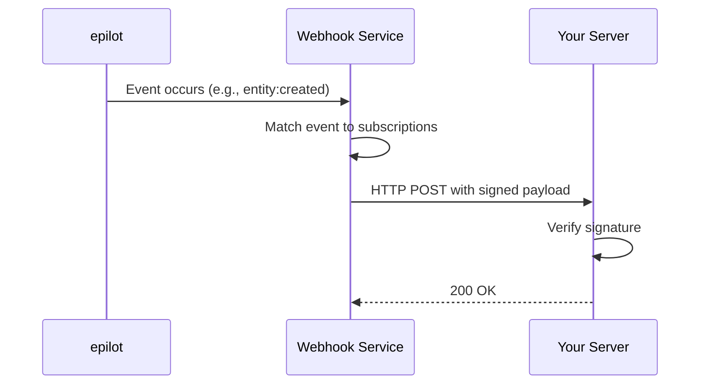

# Webhooks

[[API Docs](/api/webhooks)]
[[SDK](https://www.npmjs.com/package/@epilot/webhooks-client)]

The epilot [Webhooks API](/api/webhooks) lets you subscribe to events in your epilot account. When an event occurs, epilot sends an HTTP POST request to your configured webhook URL. Use webhooks to integrate epilot with external systems, trigger actions based on events, or monitor activity.

## Data Transmission

epilot sends webhook payloads using `Transfer-Encoding: chunked`. The HTTP request body arrives in parts rather than as a single response, so the total content size does not need to be known in advance.

### Handling Chunked Requests

Your server must:

- **Support chunked transfer encoding** — Most modern web servers handle this automatically. Verify your environment does not reject or misinterpret chunked data.
- **Process data incrementally** — Read the request body as chunks arrive rather than waiting for the full payload.
- **Detect transfer completion** — The transfer ends when a zero-length chunk is received.

### Known Limitations

Some services do not support chunked transfer encoding. Contact epilot support if your server cannot handle chunked requests — workarounds are available.

Known incompatible services:

- [Microsoft Power Automate](https://www.microsoft.com/de-de/power-platform/products/power-automate?market=de)
