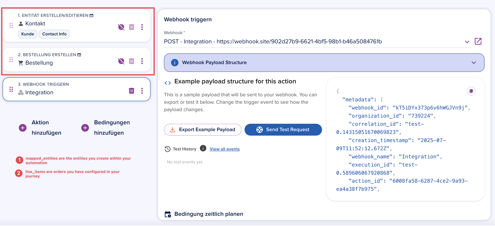

# Automation Trigger Webhook

Once the `Automation Trigger Webhook` event is selected, you can configure the webhook to be triggered by specific automation triggers. The payload structure for this event will include the `metadata`, `entity`, and optional `relations` and `activity` objects, as shown above.

:::info
The structure of the `entity` attribute will depend on the automation trigger source. For example, if the trigger is an `Manual trigger: Contact`, the `entity` object will contain the contact entity data. If the trigger is an `Entity update: Opportunity`, the `entity` object will contain the opportunity entity data.

Generally speaking, the `entity` attribute of the webhook payload is always the entity the automation was started on.
:::

Select different automation trigger to watch how the payload structure changes. The `entity` object will always contain the entity data related to the trigger, and the `metadata` object will provide information about the organization and event type.

:::info
The example payload playground in the automation action view is just a rough example of the payload structure. It tries to create a payload structure that is similar to the one your endpoint receives by using the [[getSchemaExample](/api/entity#tag/Schemas/operation/getSchemaExample)] endpoint. 

This is accurate on manual triggers, but can be less accurate on journey submissions, as the payload structure of a journey submission is dynamic and depends on the blocks and setup you use in your journey.
:::

Currently there are 2 important trigger types for webhooks:

## 1. Manual Trigger / Entity Created|Updated
If you select this trigger e.g. `Manual Trigger: Contact` or `Entity Created: Contact` then the entity consist of the contact entity the automation was triggered on. You can see the exact JSON schema of a given entity by opening the detail view of an entity e.g. a contact detail view and export the schema as a JSON file. This will give you a full overview of the entity structure and its attributes.

You can use the Entity API to get a full [JSON schema](/api/entity#tag/Schemas/operation/getJsonSchema) and a [JSON example](/api/entity#tag/Schemas/operation/getSchemaExample) of an entity part of your webhook. Alternatively, you can download these from the epilot portal for each of your entities from the entity builder UI.

## 2. Journey Submissions
The payload for journey submissions is always calculated dynamically depending on which blocks and setup you use in your journey. Journeys produce unstructured data in form of submissions. This raw submission is then mapped to schemas i.e. a contact, an opportunity or whatever schema you configured. 

Typically speaking the submission contains an attribute called `mapped_entities`. This array consists of entities being created during an automation execution. The other important attribute `line_items` is an array of orders configured in your journey.

### Example Journey Submission