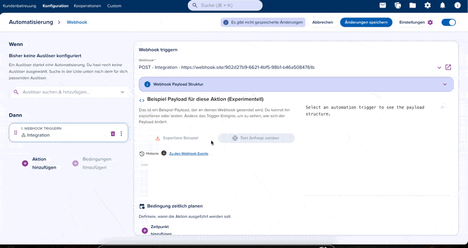

# Automation Trigger Webhook

When you select the `Automation Trigger Webhook` event, the webhook fires from within an automation flow. The payload includes `metadata`, `entity`, and optionally `relations` and `activity`.

:::info
The `entity` object always contains the entity the automation was triggered on. For a `Manual trigger: Contact`, this is the contact. For an `Entity update: Opportunity`, this is the opportunity.
:::

:::info
The example payload playground in the automation action view generates approximate payloads using the [getSchemaExample](/api/entity#tag/Schemas/operation/getSchemaExample) endpoint. This is accurate for manual triggers but may differ for journey submissions, where the payload structure depends on the journey's blocks and configuration.
:::

Currently there are 2 important trigger types for webhooks:

## 1. Manual Trigger / Entity Created | Updated

For triggers like `Manual Trigger: Contact` or `Entity Created: Contact`, the `entity` object contains the full contact entity data. To see the exact schema, export the JSON schema from the entity detail view in the epilot portal.

You can also use the Entity API to retrieve a [JSON schema](/api/entity#tag/Schemas/operation/getJsonSchema) or a [JSON example](/api/entity#tag/Schemas/operation/getSchemaExample) programmatically.

## 2. Journey Submissions

Journey submission payloads are generated dynamically based on the journey's block configuration. The raw submission data is mapped to entity schemas (contact, opportunity, etc.) during automation execution.

Key attributes in the submission payload:

- **`mapped_entities`** — Array of entities created during the automation execution
- **`line_items`** — Array of orders configured in the journey

### Example Journey Submission