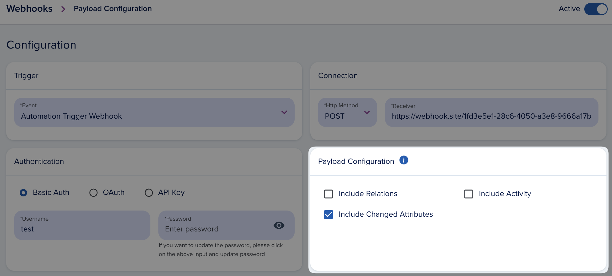
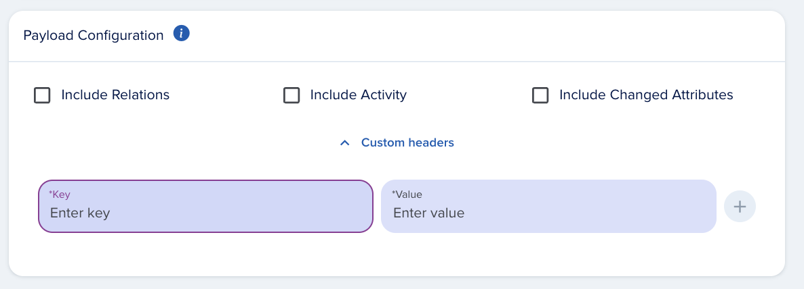

# Customization

[[API Docs](/api/webhooks)]
[[SDK](https://www.npmjs.com/package/@epilot/webhooks-client)]

## JSONata Payload Transformation

[JSONata](https://jsonata.org/) is a lightweight query and transformation language for JSON data. Use it to reshape, filter, or extract specific fields from the webhook payload before delivery.

:::tip
Test your JSONata expressions in the [JSONata online editor](https://try.jsonata.org/) before deploying to production. The webhook configuration UI also includes a built-in test feature.
:::

### How to Use JSONata

1. Open the webhook configuration in the epilot portal
2. Select the JSONata transformation option
3. Enter your JSONata expression
4. Use the built-in test feature to verify the output

### Example

Given this webhook payload for an opportunity:

```json
{
  "metadata": {
    "webhook_id": "kT5iDYx373p6v6hWGJVn9j",
    "organization_id": "739224",
    "webhook_name": "Webhook",
    "automation_name": "FLOW#wfjV8L8-fD#TASK#25bdd4ec-4335-434b-938e-9afd91cdc9d5",
    "organization_name": "Example Org",
    "correlation_id": "d7fc4288-381c-41cc-ba74-535e3ae84a0b",
    "creation_timestamp": "2025-07-09T11:50:25.933Z",
    "execution_id": "5cc9432c-a2ae-4649-93e5-ec528eb4e1e4",
    "action_id": "64ec83d2-fa59-44ab-9d27-8dbcbdfde2a9"
  },
  "entity": {
    "status": "open",
    "source": {
      "title": "manual",
      "href": null
    },
    "source_type": "manual",
    "_schema": "opportunity",
    "_id": "21e2c48f-ec99-4cd3-8552-b776c0c0aec5",
    "_org": "739224",
    "_owners": [
      {
        "org_id": "739224",
        "user_id": "10010729"
      }
    ],
    "_created_at": "2025-07-03T06:15:39.776Z",
    "_updated_at": "2025-07-08T13:43:11.069Z",
    "opportunity_number": "OP-6376",
    "_title": "OP-6376",
    "_acl": {
      "view": [
        "org_739224"
      ],
      "edit": [
        "org_739224"
      ],
      "delete": [
        "org_739224"
      ]
    }
  },
  "relations": []
  }
}
```

Apply this JSONata expression:

```json
{
    "org_id": metadata.organization_id,
    "user_id": $number(entity._owners.user_id),
    "lead_nr": entity.opportunity_number,
    "status": entity.status
}
```

The resulting payload:

```json
{
    "org_id": "739224",
    "user_id": 10010729,
    "lead_nr": "OP-6376",
    "status": "open"
}
```

## Additional Attributes

You can include optional data sections in the webhook payload. The base structure supports these optional sections:

```json
{
   metadata: {
    organization_id: '',
    ...
   }, // always present
   entity: {} // always present,
   relations: {} // optional,
   activity: {} // optional,
   changed_attributes: {
      added: {},
      deleted: {},
      updated: {}
   } // optional
}
```
- **Include Changed Attributes** — Shows added, deleted, and updated attributes after the event. Only populated for change events (e.g., `Entity update: Opportunity`). Manual triggers do not include changed attributes.
- **Include Activity** — Adds activity data to the payload.
- **Include Relations** — Adds hydrated relations to other entities. Note: this can significantly increase payload size.



## Custom Headers

Add custom headers to webhook requests for additional authentication or metadata.



The following headers are forbidden and will be removed from the request:
```
    'x-epilot-org-id',
    'Authorization',
    'A-IM',
    'Accept-Charset',
    'Accept-Datetime',
    'Accept-Encoding',
    'Cache-Control',
    'Connection',
    'Content-Length',
    'Content-Encoding',
    'Transfer-Encoding',
    'Host',
    'Content-Type',
    'Content-Range',
    'Content-MD5',
    'Range',
    'User-Agent',
    'Date',
    'Expect',
    'Forwarded',
    'From',
    'Host',
    'HTTP2-Settings',
    'If-Match',
    'If-Modified-Since',
    'If-None-Match',
    'If-Range',
    'If-Unmodified-Since',
    'Max-Forwards',
    'Origin',
    'Pragma',
    'Proxy-Authorization',
    'Referer',
    'Server',
    'TE',
    'Trailer',
    'Transfer-Encoding',
    'Upgrade',
    'Via',
    'Warning',
    'x-forwarded-*',
    'x-amz-*',
    'x-amzn-*'
```

## Custom OAuth Parameters

Add custom parameters to the OAuth token request as body, query, or header parameters. This is useful when your authorization server requires additional context beyond the standard OAuth fields.


