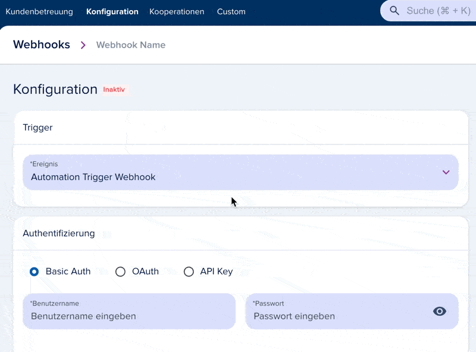
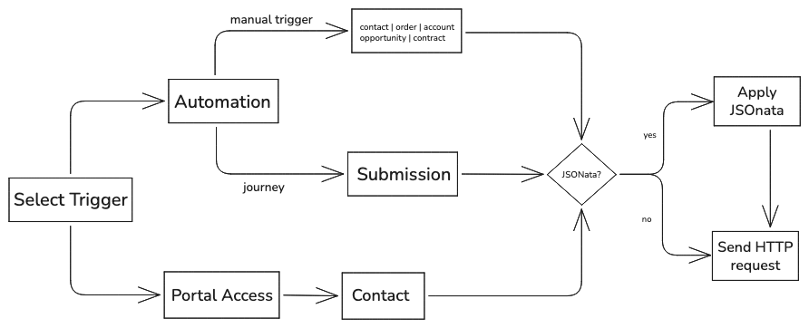

# Payload Structure

[[API Docs](/api/webhooks)]
[[SDK](https://www.npmjs.com/package/@epilot/webhooks-client)]

Webhook payloads vary by trigger type. The two trigger types are:

- **Automation Trigger Webhook** — Fires when an automation action sends a webhook request. This is the most common trigger.
- **Portal User Access** — Fires when a user accesses an entity in the portal.



Every payload contains a `metadata` object with the organization ID and event context. The `entity` object holds the primary entity data. The `relations` and `activity` objects are optional and depend on the webhook configuration.

```json
{
   "metadata": {
      "organization_id": "org_1234567890",
      "event_type": "automation_trigger_webhook",
      "timestamp": "2023-10-01T12:00:00Z"
   },
   "entity": {
      "_id": "123456",
      "_schema_": "opportunity",
      "name": "New Opportunity",
      "status": "open"
   },
   "relations": [
      // optional relations to other entities
   ],
   "activity": {
      // optional activity data
   },
   "changed_attributes": {
      "added": {},
      "deleted": {},
      "updated": {}
   }
}
```

The overall flow works as follows:

1. Configure a trigger for the webhook
2. **Portal Access** triggers fire on every portal user login
3. **Automation Trigger** triggers fire when connected to an automation action
4. Optionally configure a JSONata expression to transform the payload before delivery



## Main Entity

Every webhook payload includes a main entity in the `entity` object. The entity type depends on the trigger:

- **Portal User Access** — The `entity` object contains the contact entity of the user who accessed the portal.
- **Automation Trigger** — The `entity` object contains the entity that the automation was triggered on (e.g., a contact, opportunity, or order).


## Webhook Fields

The payload sent to the webhook URL contains the following fields (assuming no JSONata transformation is applied):

| Field                                        | Type       | Description                                           |
| -------------------------------------------- | ---------  | ----------------------------------------------------- |
| `metadata`                                   | object     | Contains metadata about the configured event          |
| `metadata.action`                            | string?    | Action that triggered the event                       |
| `metadata.origin`                            | string?    | Origin of the event                                   |
| `metadata.creation_timestamp`                | string     | Time of event creation                                |
| `metadata.webhook_id`                        | string     | The ID of the webhook configuration                   |
| `metadata.webhook_name`                      | string?    | The name of the webhook configuration                 |
| `metadata.automation_name`                   | string?    | The name of the automation that triggered the event   |
| `metadata.organization_id`                   | string     | The ID of the given organization                      |
| `metadata.user_id`                           | string?    | The ID of the user for manual triggered events        |
| `metadata.correlation_id`                    | string     | ID used to track the event                                   |
| `metadata.execution_id`                      | string?    | When triggered by an automation this is its execution id     |
| `metadata.action_id`                         | string?    | When triggered by an automation this is the id of the action |
| `entity`                                     | object     | The main entity data relevant to the event            |
| `relations`                                  | array?     | Optional relations to other entities                  |
| `activity`                                   | object?    | Optional activity data                                |
| `changed_attributes`                         | object?    | The attributes that were added, deleted, or updated   |
