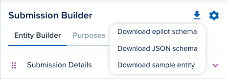

# Portal User Access

Once the `Portal User Access` event is selected, your specified webhook endpoint is called when the user does access an entity within your portal.

If you want to know the exact structure of your contact entity then head over to one of your contact detail views. Select the entity builder tab on the bottom right action bar. You will see the option to export the JSON schema at the top.

