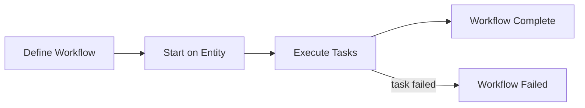
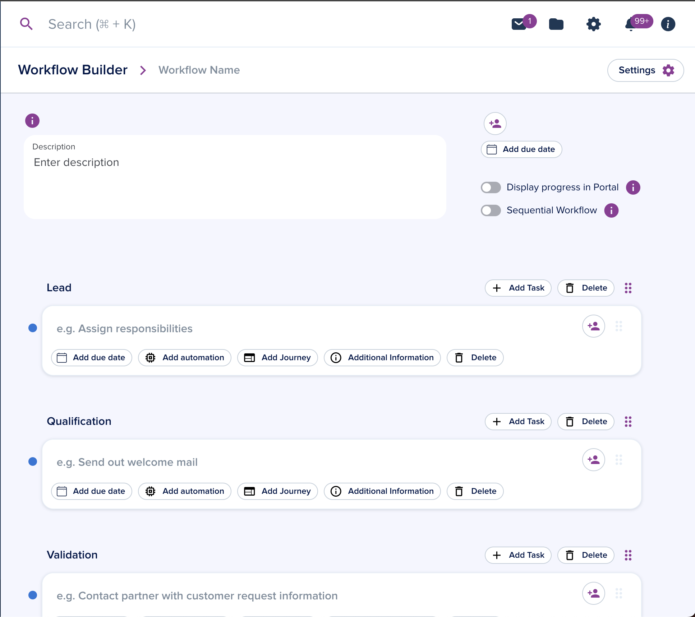
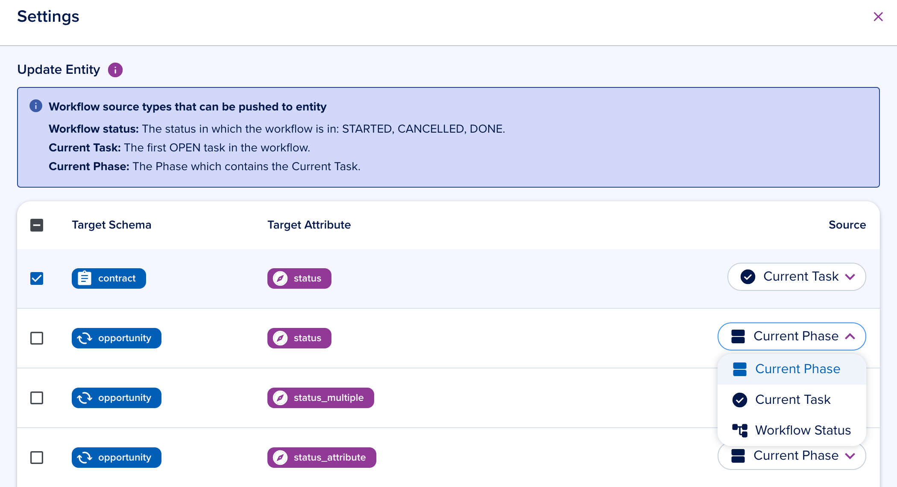
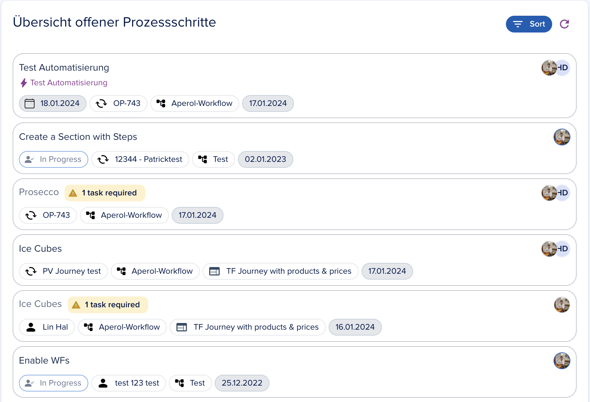

# Workflows

[[API Docs](/api/workflow-execution)]
[[SDK](https://www.npmjs.com/package/@epilot/workflow-client)]

Workflows are structured collections of tasks used to track progress and execute operations across a business process.

## Functionality

From a running workflow task, you can:

- Run automations
- Run journeys
- Add notes
- Add assignees
- Set a due date
- Mark the task as done or in progress
- Skip the task

## Building a Workflow

Define workflows in the builder under [Workflows > Workflow Builder](https://portal.epilot.cloud/app/workflows-hub).

You can create a workflow from scratch or start from a template.

### Task details

Each task supports the following configuration:

- Due date (static or dynamic)
- Automations to run from the task
- Journey to complete from the task
- Required predecessor tasks
- Task description
- Assignees

### Workflow details

From the settings button in the top bar, configure which entity attributes the workflow updates.

You can also configure closing reasons for the workflow.

## Starting a Workflow

A workflow can be started in two ways:

### With an Automation

Define a **Start Workflow** action in an [Automation Flow](/docs/automation/automation-flows).

### Manually

Open the sidebar on an entity, click **Trigger new Workflow**, and select from your defined workflows.

The sidebar displays all tasks with the following operations:

- Run automations
- Complete journeys
- Assign users or partners
- Add notes to tasks
- Mark tasks as done, skip, or in progress
- Set due dates
- Add manual tasks
- Perform bulk operations on multiple tasks

Some tasks have required predecessor tasks that must be completed or skipped first.

## Workflows Dashboard

The Workflows Dashboard tile shows tasks assigned to a specific user.

