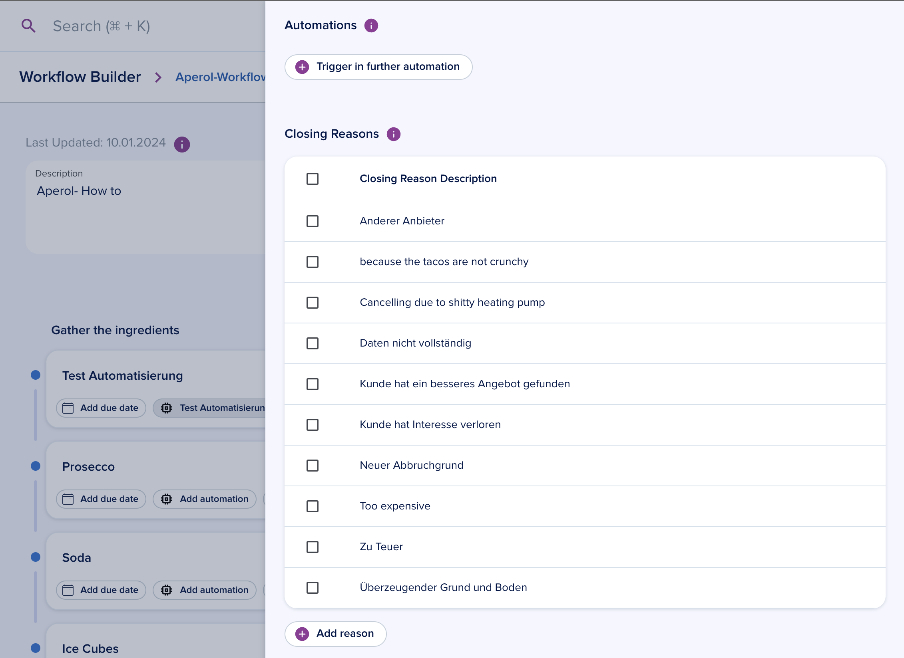

# Workflows

[[API Docs](/api/workflow-execution)]
[[SDK](https://www.npmjs.com/package/@epilot/workflow-client)]

Workflows are a collection of tasks that is used to track the progress and performing operations from the task itself.

## Functionality

You can do following operations from a task in the running workflow.

- Run Automations
- Run Journeys
- Add notes
- Add assignees
- Add due date
- Mark the task as done
- Mark the task as in progress
- Skip the task

## Building a Workflow

A Workflow can be defined in the builder under: [Workflows > Workflow Builder](https://portal.epilot.cloud/app/workflows-hub).

You can either create one from scratch or use a template.

### Task details

You can add several details to the tasks:

- Due date and dynamic due date
- Automations to run from the task
- Journey to complete from the task
- Required tasks to be completed before that task can be worked upon
- Task description
- Assignees

### Workflow details

From the settings button in the top bar, you can configure the entity attributes to update.

You can also configure closing reasons for the Workflow.

## Starting a workflow

A workflow can be started in 2 ways:

### With an Automation

You can manually define a workflow to be triggered in an [automation action](/docs/automation/automation-flows).

### Manually

You can open the sidebar on an entity and click on `Trigger new Workflow` and select the workflow from the list of all your defined workflows.

You will see the tasks you defined in the sidebar and perform the following tasks:

- Run automations
- Complete journeys
- Assign users, partners
- Add note to tasks
- Mark task as done, skip or in progress
- Add due date
- Add a manual task
- Multiple operations on several tasks at once.

You will often see some tasks have some required tasks before they can be completed or skipped.

## Workflows Dashboard
You can also see the workflows task assigned to specific person from the Workflow Dashboard tile as well.

