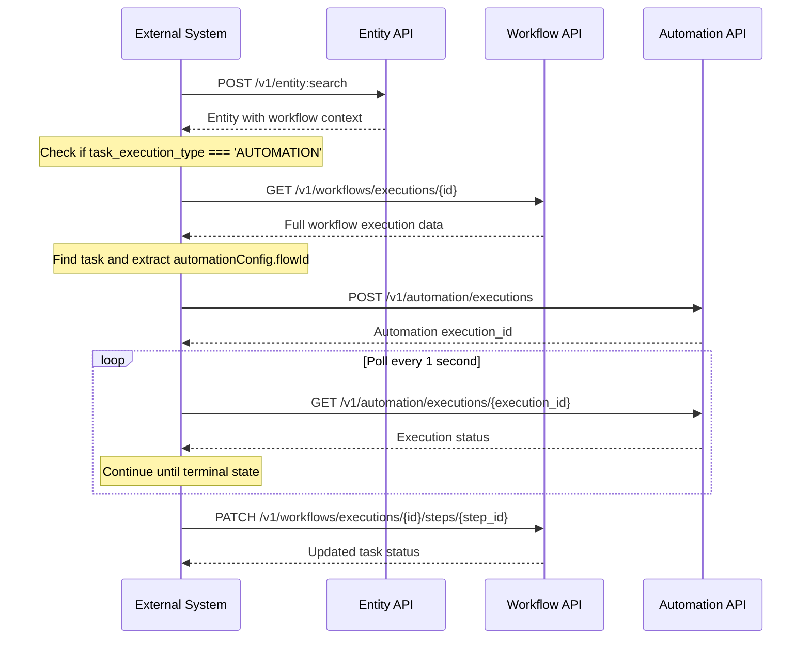

# Workflow Task Automations Integration Guide

This guide explains how to integrate external systems with the Workflows API to handle automated workflow tasks. Automated tasks are defined within a running workflow execution and trigger automation flows behind the scenes.

## Overview

Workflow task automations allow you to execute automation flows as part of a workflow execution. When a workflow reaches an automated task (`task_execution_type: "AUTOMATION"`), your system needs to:

1. Detect the automated task
2. Trigger the automation execution
3. Monitor the automation status
4. Update the workflow task with the result

## Integration Process

### Step 1: Search for Entities with Workflow Context

First, retrieve entities along with their workflow context using the Entity Search API.

**API Reference:** [Search Entities](/api/entity#tag/Entities/operation/searchEntities)

**Request:**
```http
POST /v1/entity:search
Content-Type: application/json

{
  "q": "...",
  "hydrate": true
}
```

**Response:**
```json
{
  "results": [
    {
      "_id": "11111111-1111-1111-1111-111111111111",
      "_schema": "opportunity",
      "_title": "Solar Installation Project",
      "workflows": {
        "rUqQv3Xd": [
          {
            "id": "85mk9wzyp98",
            "definition_id": "rUqQv3Xd",
            "name": "Solar Workflow",
            "status": "STARTED",
            "assignees": ["10014629", "10002602"],
            "duedate": "2023-01-01T10:00:00.000Z",
            "last_update_time": "2023-01-01T10:00:00.000Z",
            "task_id": "8tpx9mi4ryb",
            "task_name": "Clean Energy",
            "task_assignees": ["10014629", "10002602", "10016846"],
            "task_duedate": "2023-01-10T23:23:27.111Z",
            "task_execution_type": "AUTOMATION",
            "phase_id": "362pq2sy9ll",
            "phase_name": "Research"
          },
          {
            "id": "3ur6cry7r7x",
            "definition_id": "rUqQv3Xd",
            "name": "Solar Workflow",
            "status": "STARTED",
            "assignees": ["10014629", "10002602"],
            "duedate": "2023-01-01T10:00:00.000Z",
            "last_update_time": "2023-01-01T10:00:00.000Z",
            "task_id": "7olrwq658ne",
            "task_name": "Conclusions",
            "task_assignees": ["10014629"],
            "task_duedate": "2023-01-01T10:00:00.000Z",
            "task_execution_type": "MANUAL",
            "phase_id": "q2rivpohtla",
            "phase_name": "Closing"
          }
        ],
        "V_opYKRV": [
          {
            "id": "opse3yk2tit",
            "definition_id": "V_opYKRV",
            "name": "Wallbox Workflow",
            "status": "STARTED",
            "assignees": ["10014629", "10002602"],
            "last_update_time": "2023-01-01T10:00:00.000Z",
            "task_id": "rdaq2e48y00",
            "task_name": "Schedule & perform E-Check on site",
            "task_assignees": [],
            "task_execution_type": "MANUAL",
            "phase_id": "k0b4ht9i0vb",
            "phase_name": "Pre-Check",
            "task_duedate": "2023-01-01T10:00:00.000Z"
          }
        ],
        "primary": {
          "id": "85mk9wzyp98",
          "definition_id": "rUqQv3Xd",
          "name": "Solar Workflow",
          "status": "STARTED",
          "assignees": ["10014629", "10002602"],
          "duedate": "2023-01-01T10:00:00.000Z",
          "last_update_time": "2023-01-01T10:00:00.000Z",
          "task_id": "8tpx9mi4ryb",
          "task_name": "Clean Energy",
          "task_assignees": ["10014629", "10002602", "10016846"],
          "task_duedate": "2023-01-10T23:23:27.111Z",
          "task_execution_type": "AUTOMATION",
          "phase_id": "362pq2sy9ll",
          "phase_name": "Research"
        }
      }
    }
  ]
}
```

**Key Fields:**
- `id`: Workflow execution ID (e.g., `"85mk9wzyp98"`)
- `task_execution_type`: Type of task execution (`"AUTOMATION"` or `"MANUAL"`)
- `task_id`: The specific task/step ID within the workflow
- `_id`: Entity ID that the workflow is attached to

---

### Step 2: Check for Automation Tasks

Filter the workflow context to identify automated tasks:

```javascript
const automationTasks = workflows[definitionId].filter(
  workflow => workflow.task_execution_type === 'AUTOMATION'
)
```

If `task_execution_type === 'AUTOMATION'`, proceed to retrieve the full workflow execution data.

---

### Step 3: Retrieve Full Workflow Execution

Use the workflow execution `id` from Step 1 to fetch the complete workflow data.

**API Reference:** [Get Workflow Execution](/api/workflow-execution#tag/Workflow-Executions/operation/getExecution)

**Request:**
```http
GET /v1/workflows/executions/{id}
```

**Example:**
```http
GET /v1/workflows/executions/85mk9wzyp98
```

**Response:**
```json
{
  "id": "85mk9wzyp98",
  "definition_id": "rUqQv3Xd",
  "name": "Solar Workflow",
  "status": "STARTED",
  "entity_id": "11111111-1111-1111-1111-111111111111",
  "assignees": ["10014629", "10002602"],
  "flow": [
    {
      "id": "8tpx9mi4ryb",
      "name": "Clean Energy",
      "type": "TASK",
      "status": "STARTED",
      "execution_type": "AUTOMATION",
      "assignees": ["10014629", "10002602", "10016846"],
      "duedate": "2023-01-10T23:23:27.111Z",
      "automationConfig": {
        "flowId": "abc123-automation-flow-id",
        "execution_id": null,
        "execution_status": null
      },
      "phase_id": "362pq2sy9ll"
    },
    {
      "id": "7olrwq658ne",
      "name": "Conclusions",
      "type": "TASK",
      "status": "PENDING",
      "execution_type": "MANUAL",
      "assignees": ["10014629"],
      "duedate": "2023-01-01T10:00:00.000Z",
      "phase_id": "q2rivpohtla"
    }
  ],
  "created_at": "2023-01-01T09:00:00.000Z",
  "updated_at": "2023-01-01T10:00:00.000Z"
}
```

**Key Fields:**
- `flow`: Array of all tasks/steps in the workflow
- `automationConfig.flowId`: The automation flow ID to execute
- `execution_type`: Confirms this is an `"AUTOMATION"` task

---

### Step 4: Find the Target Task

Locate the specific task within the `flow` array using the `task_id` from Step 1. The flow can contain:
- **Top-level steps** (`type: "STEP"`)
- **Sections/Phases** (`type: "SECTION"`) which contain a `steps` array

```javascript
function findTask(flow, taskId) {
  for (const item of flow) {
    if (item.type === 'STEP' && item.id === taskId) {
      // Found top-level step
      return item
    }

    if (item.type === 'SECTION' && item.steps) {
      // Search within section/phase
      const step = item.steps.find(s => s.id === taskId)
      if (step) return step
    }
  }
  return null
}

const targetTask = findTask(workflowExecution.flow, '8tpx9mi4ryb')
const automationFlowId = targetTask.automationConfig.flowId
```

---

### Step 5: Trigger the Automation Execution

Use the `flowId` from the task's `automationConfig` to trigger the automation execution.

**API Reference:** [Start Automation Execution](/api/automation#tag/executions/operation/startExecution)

**Request:**
```http
POST /v1/automation/executions
Content-Type: application/json

{
  "entity_id": "11111111-1111-1111-1111-111111111111",
  "flow_id": "abc123-automation-flow-id",
  "activity_id": "01F130Q52Q6MWSNS8N2AVXV4JN"
}
```

:::important Language Context for Document Generation
When triggering automation executions that include document generation actions, ensure that `activity_id` is passed. The `activity_id` links to the activity context which includes user information needed for:
- **Language/locale resolution** for template variable translations (e.g., salutation/Anrede)
- **User preferences** lookup for formatting

Without proper language context, translated variables like `{{yn true}}` (Yes/No), salutations, and other i18n-dependent values may not render correctly.

Alternatively, if the automation includes a "Create Document" action, the action configuration should specify the `language` parameter explicitly (e.g., `"de"` or `"en"`).
:::

**Response:**
```json
{
  "id": "9baf184f-bc81-4128-bca3-d974c90a12c4",
  "execution_status": "pending",
  "entity_id": "e3d3ebac-baab-4395-abf4-50b5bf1f8b74",
  "org_id": "e3d3ebac-baab-4395-abf4-50b5bf1f8b74",
  "flow_id": "7791b04a-16d2-44a2-9af9-2d59c25c512f",
  "flow_name": "Handle contact form",
  "created_at": "2023-01-01T10:00:00.000Z",
  "updated_at": "2023-01-01T10:00:00.000Z",
  "current_action_id": "action-123",
  "actions": [
    {
      "id": "action-123",
      "name": "Send Email",
      "type": "send-email",
      "status": "pending"
    }
  ],
  "trigger_context": {
    "entity_id": "11111111-1111-1111-1111-111111111111"
  }
}
```

**Key Fields:**
- `id`: The automation execution ID (e.g., `"9baf184f-bc81-4128-bca3-d974c90a12c4"`)
- `execution_status`: Initial status, typically `"pending"`

---

### Step 6: Monitor Automation Execution Status

Implement long polling to track the automation execution status. Poll every **1 second** until the execution reaches a terminal state.

**API Reference:** [Get Automation Execution](/api/automation#tag/executions/operation/getExecution)

**Request:**
```http
GET /v1/automation/executions/{id}
```

**Example:**
```http
GET /v1/automation/executions/9baf184f-bc81-4128-bca3-d974c90a12c4
```

**Response (In Progress):**
```json
{
  "id": "9baf184f-bc81-4128-bca3-d974c90a12c4",
  "execution_status": "in_progress",
  "entity_id": "e3d3ebac-baab-4395-abf4-50b5bf1f8b74",
  "org_id": "e3d3ebac-baab-4395-abf4-50b5bf1f8b74",
  "flow_id": "7791b04a-16d2-44a2-9af9-2d59c25c512f",
  "flow_name": "Handle contact form",
  "created_at": "2023-01-01T10:00:00.000Z",
  "updated_at": "2023-01-01T10:00:05.000Z",
  "current_action_id": "action-123",
  "actions": [
    {
      "id": "action-123",
      "name": "Send Email",
      "type": "send-email",
      "status": "in_progress"
    }
  ],
  "trigger_context": {
    "entity_id": "11111111-1111-1111-1111-111111111111"
  }
}
```

**Response (Completed):**
```json
{
  "id": "9baf184f-bc81-4128-bca3-d974c90a12c4",
  "execution_status": "success",
  "entity_id": "e3d3ebac-baab-4395-abf4-50b5bf1f8b74",
  "org_id": "e3d3ebac-baab-4395-abf4-50b5bf1f8b74",
  "flow_id": "7791b04a-16d2-44a2-9af9-2d59c25c512f",
  "flow_name": "Handle contact form",
  "created_at": "2023-01-01T10:00:00.000Z",
  "updated_at": "2023-01-01T10:00:30.000Z",
  "current_action_id": "action-123",
  "actions": [
    {
      "id": "action-123",
      "name": "Send Email",
      "type": "send-email",
      "status": "success"
    }
  ],
  "trigger_context": {
    "entity_id": "11111111-1111-1111-1111-111111111111"
  }
}
```

**Terminal States:**
- `success` - Automation completed successfully
- `failed` - Automation encountered an error
- `cancelled` - Automation was cancelled
- `skipped` - Automation was skipped
- `hot` - Automation is in a hot/error state

**Polling Implementation:**
```javascript
async function pollAutomationStatus(executionId) {
  const terminalStates = ['success', 'failed', 'cancelled', 'skipped', 'hot']

  while (true) {
    const response = await fetch(`/v1/automation/executions/${executionId}`)
    const execution = await response.json()

    if (terminalStates.includes(execution.execution_status)) {
      return execution
    }

    // Wait 1 second before next poll
    await new Promise(resolve => setTimeout(resolve, 1000))
  }
}
```

---

### Step 7: Update the Workflow Task

Once the automation execution completes, update the workflow task with the final status.

**API Reference:** [Update Workflow Step](/api/workflow-execution#tag/Workflow-Steps/operation/updateStep)

**Request:**
```http
PATCH /v1/workflows/executions/{workflow_execution_id}/steps/{step_id}
Content-Type: application/json

{
  "status": "COMPLETED",
  "automationConfig": {
    "flowId": "abc123-automation-flow-id",
    "executionId": "9baf184f-bc81-4128-bca3-d974c90a12c4",
    "executionStatus": "success"
  }
}
```

**Example:**
```http
PATCH /v1/workflows/executions/85mk9wzyp98/steps/8tpx9mi4ryb
Content-Type: application/json

{
  "status": "COMPLETED",
  "automationConfig": {
    "flowId": "abc123-automation-flow-id",
    "executionId": "9baf184f-bc81-4128-bca3-d974c90a12c4",
    "executionStatus": "success"
  }
}
```

**Response:**
```json
{
  "id": "8tpx9mi4ryb",
  "name": "Clean Energy",
  "type": "STEP",
  "status": "COMPLETED",
  "execution_type": "AUTOMATION",
  "assignees": ["10014629", "10002602", "10016846"],
  "duedate": "2023-01-10T23:23:27.111Z",
  "automationConfig": {
    "flowId": "abc123-automation-flow-id",
    "executionId": "9baf184f-bc81-4128-bca3-d974c90a12c4",
    "executionStatus": "success"
  },
  "completed_at": "2023-01-01T10:00:30.000Z"
}
```

### Status Mapping

Map the automation execution status to the appropriate workflow task status:

| Automation Status | Workflow Task Status | Description |
|-------------------|---------------------|-------------|
| `success` | `COMPLETED` | Task completed successfully |
| `failed` | `FAILED` | Task failed due to automation error |
| `skipped` | `SKIPPED` | Task was skipped |
| `cancelled` | `SKIPPED` | Task was cancelled |
| `hot` | `FAILED` | Task failed with critical error |

---

## Complete Integration Flow



---

## Error Handling

### Automation Execution Fails

If the automation execution fails (`execution_status: "failed"`), update the workflow task accordingly:

```http
PATCH /v1/workflows/executions/85mk9wzyp98/steps/8tpx9mi4ryb
Content-Type: application/json

{
  "status": "FAILED",
  "automationConfig": {
    "flowId": "abc123-automation-flow-id",
    "executionId": "9baf184f-bc81-4128-bca3-d974c90a12c4",
    "executionStatus": "failed"
  },
  "error": {
    "message": "Automation failed to complete",
    "code": "AUTOMATION_FAILED"
  }
}
```

### Timeout Handling

Implement a maximum timeout for polling (e.g., 5 minutes):

```javascript
async function pollAutomationStatusWithTimeout(executionId, timeoutMs = 300000) {
  const terminalStates = ['success', 'failed', 'cancelled', 'skipped', 'hot']
  const startTime = Date.now()

  while (Date.now() - startTime < timeoutMs) {
    const response = await fetch(`/v1/automation/executions/${executionId}`)
    const execution = await response.json()

    if (terminalStates.includes(execution.execution_status)) {
      return execution
    }

    await new Promise(resolve => setTimeout(resolve, 1000))
  }

  throw new Error('Automation execution timeout')
}
```

---

## Best Practices

1. **Always check `task_execution_type`** before attempting to trigger automation
2. **Store the automation `id`** (execution ID) for tracking and debugging purposes
3. **Implement proper timeout handling** to avoid infinite polling
4. **Log all API calls** for troubleshooting
5. **Handle network errors** gracefully with retry logic
6. **Update workflow tasks promptly** after automation completion
7. **Monitor long-running automations** and alert on timeouts
8. **Handle both top-level steps and sections** when searching for tasks in the flow
9. **Use correct field names**: `executionId` and `executionStatus` when updating workflow tasks

---

## API Reference Summary

| Endpoint | Method | Purpose |
|----------|--------|---------|
| `/v1/entity:search` | POST | Search entities with workflow context |
| `/v1/workflows/executions/{id}` | GET | Retrieve full workflow execution |
| `/v1/automation/executions` | POST | Trigger automation execution |
| `/v1/automation/executions/{execution_id}` | GET | Check automation execution status |
| `/v1/workflows/executions/{id}/steps/{step_id}` | PATCH | Update workflow task status |

---

## Related Documentation

- [Workflows API Reference](/api/workflow-execution))
- [Automation API Reference](/api/automation)
- [Entity API Reference](/api/entity)
