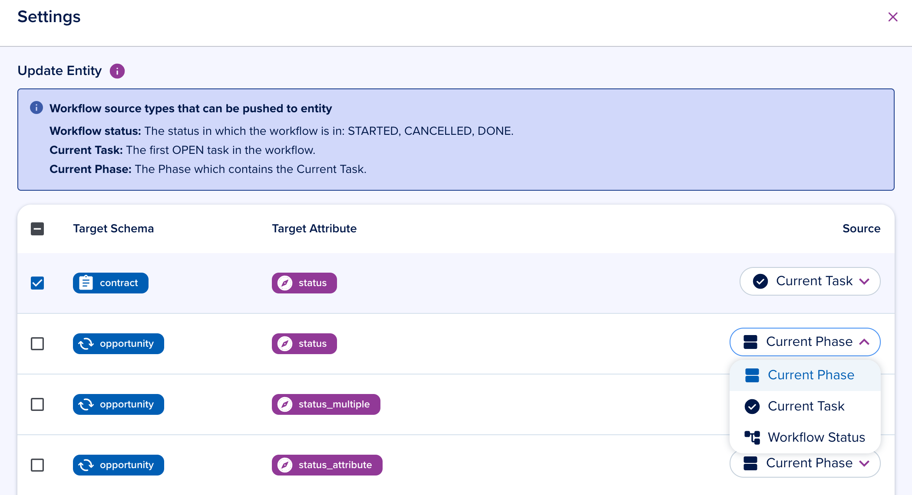

# Workflow in progress

[[API Docs](/api/workflow-execution)]
[[SDK](https://www.npmjs.com/package/@epilot/workflow-client)]

Workflows consist of two primary components, and their progression depends on the status of each.

Workflow components:
- **Task** -- an individual unit of work
- **Phase** -- a group of related tasks

## Tasks

A task represents an individual unit of work within a workflow.

## Phases

A phase groups related tasks together into a logical stage of the workflow.

## Progression Tracking

Workflow progression is determined by the combined statuses of tasks, phases, and the workflow itself.

## Status

| Component | Possible Statuses |
|-----------|-------------------|
| Workflow | `STARTED`, `DONE`, `CLOSED` |
| Task | `PENDING`, `IN_PROGRESS`, `COMPLETED`, `SKIPPED` |
| Phase | `OPEN`, `IN_PROGRESS`, `COMPLETED` |

### Phase status logic

- **`OPEN`** -- contains at least one open task with no `IN_PROGRESS`/`COMPLETED`/`SKIPPED` tasks
- **`IN_PROGRESS`** -- the phase is active when any of these are true:
  - It is the first phase of a started workflow
  - It contains at least one `IN_PROGRESS` task
  - Some tasks are `COMPLETED`/`SKIPPED` but not all (work has started)
  - In linear workflows, it follows a `COMPLETED` phase and contains the next open task
- **`COMPLETED`** -- all tasks are `COMPLETED` or `SKIPPED`

:::info
Phase statuses drive entity attribute updates and dashboard displays. A common way to monitor workflow progress is to count phases in the `IN_PROGRESS` state.
:::

---

## Current Workflow Position
Another way to monitor progression is through the **current task** and **current phase**.

### Current task

In a sequential workflow, the current task is the first task (top to bottom) in a `PENDING` or `IN_PROGRESS` state, regardless of whether it is at the root level or inside a phase.

The current task is indicated by a blue border in the workflow UI.

### Current phase

The current phase is the phase that contains the current task. In the image below, the "Review" phase is the current phase.

:::info
The current task and phase positions are used when updating entity attributes. Workflow configurations can update entity attributes directly from the Workflow Builder:
:::

