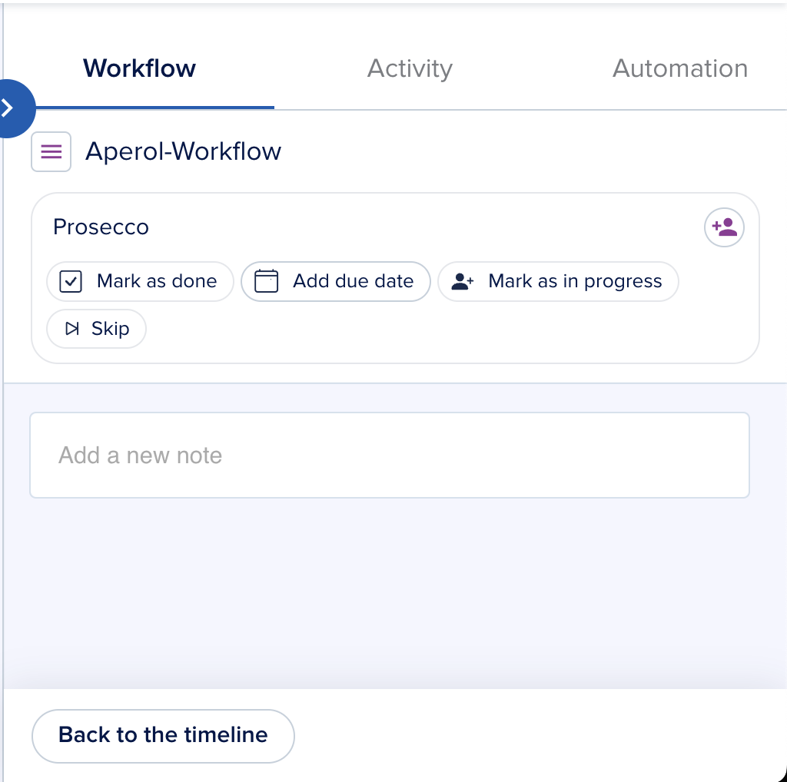

# Workflow Notes

[[API Docs](/api/workflow-execution)]
[[SDK](https://www.npmjs.com/package/@epilot/workflow-client)]
[[Notes Docs](https://docs.api.epilot.io/discussion)]

Workflow Notes use the [Comments API](https://docs.api.epilot.io/discussion#tag/Comments) with a specific `context_id` format.

Set `context_id` to `{entity_id}-workflow-{workflow_id}-{task_id}`.

You can find these IDs in the URL parameters when viewing a task's notes.

| Field | Description |
|-------|-------------|
| `entity_id` | ID of the entity |
| `workflow_id` | ID of the workflow execution |
| `task_id` | ID of the task where the note is created |

