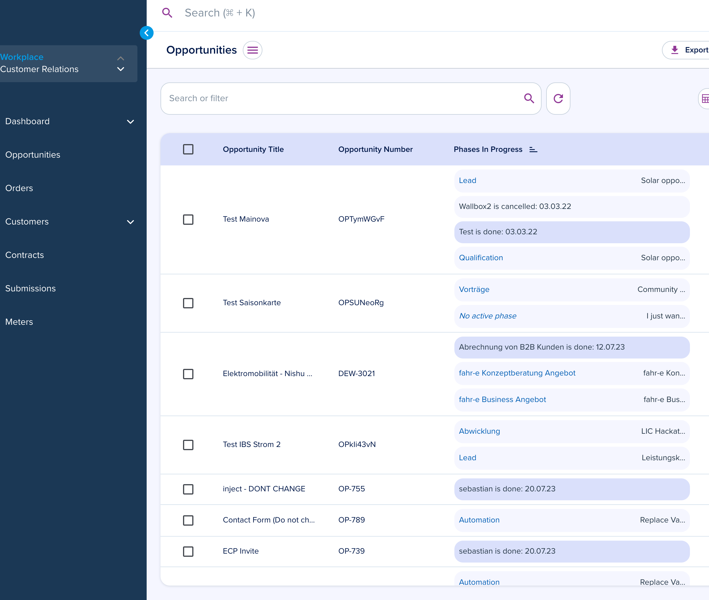
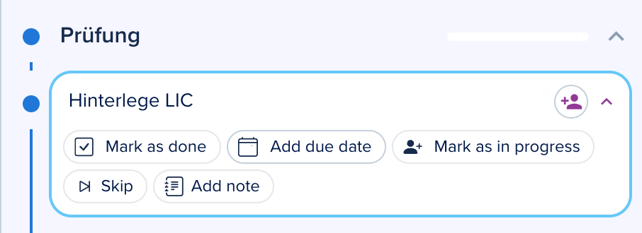
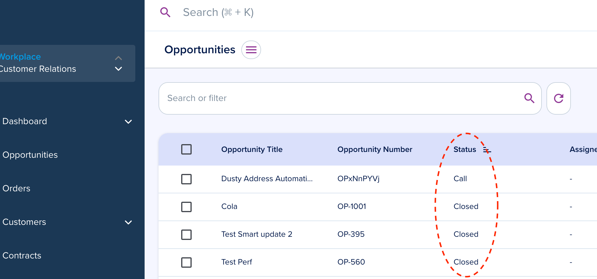

# Workflow in progress

[[API Docs](/api/workflow-execution)]
[[SDK](https://www.npmjs.com/package/@epilot/workflow-client)]

Workflows consist of two primary components, and their advancement can be interpreted in various ways depending on specific factors.

Workflows components:
- Task
- Phase

## Tasks
A task represents an individual unit of work.

## Phases
Phases are another integral part of workflows, with the distinction that phases can encompass tasks.

## Progression Tracking
The progression within a workflow is visualized through the combined use of tasks, phases, and the status field.

## Status
The status fields, used to indicate the state of the workflow and its components, are as follows:
- workflows status: `STARTED`, `CANCELLED`, `DONE`
- task status: `ASSIGNED`, `UNASSIGNED`, `IN_PROGRESS`, `SKIPPED`, `DONE`
- phase status: `OPEN`, `IN_PROGRESS`, `COMPLETED`

### Phase status logic
- `OPEN`
  - contains at least 1 `OPEN` and none `IN_PROGRESS`/`DONE`/`SKIPPED` tasks
- `IN_PROGRESS`
  - the first phase of a started workflow
  - contains at least 1 `IN_PROGRESS` task
  - contains at least 1 `DONE`/`SKIPPED` task BUT not all tasks are `DONE`/`SKIPPED` (implying work has started on the phase)
  - considering linear workflows, a phase which follows a `COMPLETED` phase/task AND contains the NEXT_OPEN_TASK
- `COMPLETED`
  - all tasks `DONE` or `SKIPPED`

> ⚠️ Statuses play a crucial role when data is presented based on them.
One approach to monitoring workflow progress is by tallying and considering phases in the IN_PROGRESS state.

---

## Current Workflow Position
Another valuable tool for monitoring workflow progression is the concept of the `current task` and `current phase`.
- `current task`

In a sequential workflow, the current task is always the first task that falls into one of the following states: `ASSIGNED`, `UNASSIGNED`, `IN_PROGRESS` when viewing the workflow from top to bottom, regardless of whether the task is at the root level or a child of a phase.

The current task is identifiable by a blue border when viewing a workflow.

- `current phase`

Similar to the `current task`, the `current phase` is represented by a phase that contains the `current task` as one of its children. In the image below, "Prüfung" is the `current phase`.

> ⚠️ The present positions of tasks and phases within the workflow are employed when updating entity attributes. Workflow configurations can enable the updating of entity attributes directly from the workflow hub, as illustrated in the image below:

